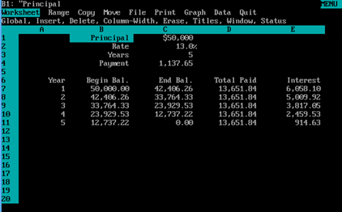

```{r include=FALSE}

library(msmbstyle)

# invalidate cache when the tufte version changes
knitr::opts_chunk$set(
  tidy = FALSE, 
  message = FALSE,
	warning = FALSE,
  cache.extra = packageVersion('msmbstyle'))

options(htmltools.dir.version = FALSE)

```

# Responsible Research is Reproducible Research

**Learning Objectives**

After completing this set of activities you should be able to

* Define three consecutive steps in data analysis/methods as 
  + Acquiring data
  + Processing data
  + Analyzing data
* Compare and contrast effects of using programs such as excel/other point & click programs compared to scripting languages for data analysis on reproducibility
* Recognize that employing tools for analysis differ in how reliable, accessible, and verifiable they are and how this limits how conducive they are for reproducible research.

You should have a `ReprodRes.Rmd` in your project directory. Use that file to work through this set of activties - you will hand in your rendered ("knitted") rmarkdown file as your homework assignment. So, first thing in the `YAML` header, change the author to your name. You will use this `Rmarkdown` file to record your answers. For this module there will not be any coding involved (no code chunks!) instead you should work a little bit on your `Rmarkdown` skills.

In your document try using some of the formatting skills:

```{marginfigure}

You have various resources at your disposal, including the `Rmarkdown` [cheatsheet](https://github.com/rstudio/cheatsheets/raw/master/rmarkdown-2.0.pdf) you received a handout for and [Chapter 27](https://r4ds.had.co.nz/r-markdown.html) in our Textbook. The easiest way to learn `Rmarkdown` is to try out the syntax and then `knit` your document to see if it turns out as you think it should!

```

* Use different level headers to structure your document
* include something in **bold** and something in *italics*.
* add numbered and unordered bullet points (maybe even try adding multiple levels if you're feeling adventurous).

For these activities we will do all the computing (thinking) with our own brains ... so let's dive straight in!

## What even are these 'Methods' you speak of?

`r msmbstyle::question_begin(label="ques:RR2-01")`

Think back on scientific papers you have read or lab reports you have written and list the main sections of the typical format you encounter.

`r msmbstyle::question_end()`


`r msmbstyle::question_begin(label="ques:RR2-02")`

Give a brief description of what the "Methods" or "Method & Materials" section of a scientific paper or report contains and assess whether or not you think this section generally meets the standard you have just laid out.

`r msmbstyle::question_end()`


`r msmbstyle::question_begin(label="ques:RR2-03")`

One framework to categorize components of the "methods" of a study is to place them into three steps that build on each other.

1. Acquire data
2. Process data
3. Analyze data

Use the example of our recent (re)analysis of the Shark Nursery study to describe what each of these steps entails.

`r msmbstyle::question_end()`


## Tools of the trade

Tiny history lesson Lotus123 is a  what launched IBM Personal Computers into offices around the world ... 



My very first PC adventures included running Lotus123 off of big floppy disks. Microsoft developed Excel and the Office package and quickly PCs where not only in offices and homes around the world. Spreadsheet applications were initially focused mainly on managing and organizing data (think HR department and payroll) but increasingly complicated calculations were possible and soon Excel snuck its way into scientific research.

Today, the tools used by scientists to analyze their data vary from highly specialized tools for very specific tasks (each with their own required data format), to large software packages like SAS and STATA Many of these tools have GUIs (graphic user interfaces) and are what is frequently referred to as "point & click" or "WYSIWYG"^[WYSISWG = What you see is what you get. Compare this to WYWIWYG = what you want is want you get.].

`r msmbstyle::question_begin(label="ques:RR2-04")`

Rely on your experience of having used programs like Excel, SAS/STATA, or other specialized programs in a statistics class or other lab courses you have taken to compare and contrast using those types of programs for data analysis to programing languages like R, Perl or Python. Discuss the benefits and drawbacks of both approaches.

`r msmbstyle::question_end()`


## Impacts of Flawed Data Analysis

### Case Study 1

`r msmbstyle::question_begin(label="ques:RR2-05")`

Pull up this [paper on the connection of CSF interleukin-6 and depression](https://www.sciencedirect.com/science/article/pii/S0889159113001414). Quickly skim the abstract and summarize the main result. Do this before untoggling the solution button for part 2 of this question.

`r msmbstyle::question_end()`


`r msmbstyle::solution_begin()`

Okay, fine - that was a little bit of a trick question; did you notice the retraction notice?

You can access a [more detailed version of the retraction here](https://www.sciencedirect.com/science/article/pii/S0889159113005424). Read the retraction notice and briefly describe why the paper needed to be retracted.

After the authors fixed their mistake they published a [corrected version of the paper](https://www.sciencedirect.com/science/article/pii/S0889159114001287). Compare the titles & abstracts of the retracted and updated papers to determine if their mistakes had a significant impact on the reported results.

`r msmbstyle::solution_end()`

`r msmbstyle::question_begin(label="ques:RR2-06")`

Give a brief summary of key lessons you have learned from the case study.

`r msmbstyle::question_end()`


### Case Study 2

Before today's class you should have completed these readings:

* Shariff et al 2016 "[What is the association between religious affiliation and children's altruism?](https://www.sciencedirect.com/science/article/pii/S0960982216306704?via%3Dihub)"
* Retraction notices of Decety et al. 2015 "[RETRACTED: The Negative Association between Religiousness and Children's Altriusm across the World](https://www.sciencedirect.com/science/article/pii/S0960982215011677)"
* Optional: [How a study based on a typo made news everywhere - and the retraction didn't](https://www.vox.com/future-perfect/2019/10/3/20895240/study-typo-religion-children-generosity-retraction).


`r msmbstyle::question_begin(label="ques:RR2-07")`

Briefly discuss why the paper needed to be retracted; as part of your discussion compare and contrast the correspondence published by Shariff et al. to the retraction notice from the original authors Consider the following (and of course add anything else you noticed/think is important).

* Why was the paper retracted?
* What is the central statement being made in the correspondence/retraction notice?
* What is the tone of the correspondence/retraction notice?
* How could this mistake have been avoided?
* How could bias of both sets of authors/previous knowledge have played into the conclusions of the paper/noticing and identifying the mistakes (consider both sets of authors)?

`r msmbstyle::question_end()`


`r msmbstyle::question_begin(label="ques:RR2-08")`

The results of the initial study were widely published. By contrast, the retraction was not; matter of fact most people "doing their own research" on the interwebs are considerably more likely to come across an article describing the initial findings and we all know from personal experience how infrequently we look up the original study being described - so chances are they might never discover that the study has been retracted.

Use this specific example to illustrate what **Brandolini's Law** (i.e. the Bullshit Asymmetry Principle) is.


`r msmbstyle::question_end()`

`r msmbstyle::question_begin(label="ques:RR2-09")`

Give a brief summary of key lessons you have learned from this case study.

`r msmbstyle::question_end()`


### Case Study 3

Before today's class you should have completed key sections from [Herndon et al. 2014 "Does high public debt consistently stifle economic growth? A critique of Reinhart & Rogoff"](https://academic.oup.com/cje/article/38/2/257/1714018?login=true):

* Section 1 (Introduction)
* Section 2 (Public impact and policy relevance)
* Introduction to section 3. (Replication) + Section Headers
* Section 4 (Conclusion)

`r msmbstyle::question_begin(label="ques:RR2-10")`

Briefly summarize the major points of criticism of the original paper.

`r msmbstyle::question_end()`


`r msmbstyle::question_begin(label="ques:RR2-11")`

Briefly discuss the tools that were used for analysis and determine how they could have contributed to the flawed analysis being published (remember, it did get through peer-review!)

`r msmbstyle::question_end()`


`r msmbstyle::question_begin(label="ques:RR2-12")`

Recall our initial classification scientific misconduct along a continuum of "Responsible - Ethical - Unethical/Misconduct" and use that to compare the flawed analysis laid out here to the issues that were uncovered in the previous two case studies. Consider factors including content, when/why mistakes were uncovered, and intent.

`r msmbstyle::question_end()`


`r msmbstyle::question_begin(label="ques:RR2-13")`

Consider the policy and decision-making implications of this (and the other two papers) and discuss if you think retracting the actual paper with mistakes in it is sufficient.

`r msmbstyle::question_end()`


`r msmbstyle::question_begin(label="ques:RR2-14")`

Propose strategies that could be used to avoid flawed analysis demonstrated in this (and the other) case studies to be published in the first place and whose role it should be to "enforce" responsible conduct.

`r msmbstyle::question_end()`


`r msmbstyle::question_begin(label="ques:RR2-15")`

Give a brief summary of key lessons you have learned from this case study.

`r msmbstyle::question_end()`

