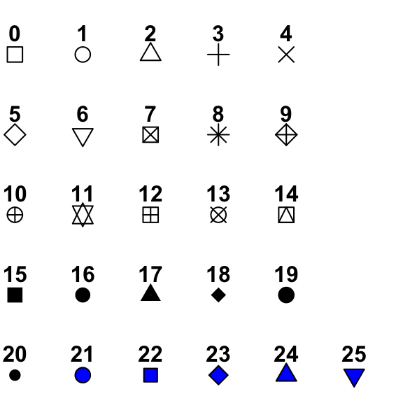

```{r include=FALSE}

library(msmbstyle)
# invalidate cache when the tufte version changes
knitr::opts_chunk$set(tidy = FALSE, 
                      cache.extra = packageVersion('msmbstyle'),
                      warning = FALSE,
                      message = FALSE)


options(htmltools.dir.version = FALSE)

source("scr/ggplot.R")

```

# Visualization


**Learning Objectives**

After completing this tutorial you should be able to

* apply the grammar of graphics implemented in `ggplot` to create plots.
* use core geometries implemented `ggplot` to produce scatter plots (`geom_point()`), line plots (`geom_line()`), bar plots (`geom_bar()`), histograms (`geom_histogram`), and box plots (`geom_boxplot()`).
* customize aesthetics of a plot (including color and axis labels).
* describe what faceting is and apply this to a plot.
* combine multiple plots in a multi-panel plot using `patchwork` and save plots to file.

You should have a `IntroVisualization.Rmd` in your project directory. Use that file to work through this set of activities - you will hand in your rendered ("knitted") Rmarkdown file as your homework assignment. In the `YAML` header, change the author to your name and make your formatting decisions such as theme, including a table of contents etc. Apply your `Rmarkdown` skills to format your "report" that you will hand in. Code chunks should have comments, add answers to questions in plain text (not as code in chunks), use headers intentionally, and of course you have options like bullet points etc. as well.

The majority of this set of activities is exploring how to use `ggplot()` to generate different types of plots. Each plot involves at least two lines of code - as we go through each step record the code presented and include a comment specifying what each line of code does. Comments can be inserted either between lines or at the end of each line.

Let's start by loading the packages we will need for this set of activities.

Before you can load all the libraries we need, you will need to install the `patchwork` package using `install.package("patchwork")`. You only need to do this once, the easiest wat to do this is to simply run that function directly in the console.

```{r}

# load libraries
library(knitr)
library(tidyverse)
library(patchwork)

# turn of sci notation
options(scipen=999)

```


## A grammar of graphics

Now that we are confident(ish) in our data wrangling the next step is learning how we can visualize our data for exploration and for communication. 

Exploratory analysis is an important component of data science as it not only gives you an overview of what information is contained in a data set, but it can also help you refine the question you are asking. Finally, once you have refined and completed an analysis, visualizations are a key component to communicate your results.

`ggplot2` is the core package of the `tidyverse` used for visualization. Similar to `tidyr` and `dplyr` having been built on the concept of a tidy data set, `ggplot2` was built on a framework which follows a layered approach to describe and/or build any type of visualization in a structure way termed the "grammar of graphics".

The grammar of graphics breaks down the components of any visualization into seven components.

* **Data** - the component of data set to visualize
* **Aesthetics** including axes, plot positions, and encodings such as size, shape, color
* **Scale** e.g normalizing values
* **Geometric objects** including points, lines, bars, ... to represent data
* **Statistics**, including confidence intervals, means, quantiles, ...
* **Facets**, i.e. subplots based on multiple dimensions
* **Coordinate system**, e.g cartesian, polar, ...

Until now you've probably thought of each plot type as it's own distinctive format (a scatter plot, a pie chart, etc) and have not considered that each plot can be broken down into these fundamental components, so at first this way of thinking of plots will likely not seem intuitive. 

But if you commit to thinking about plots in this abstract way you will quickly learn how these components fit together and realize the flexibility that thinking about plots in this way will give you to quickly generate exploratory plots, optimize your visualizations and be able to generate pretty much any plot you can think up^[You will also see that keeping your data `tidy` will allow you to customize your plots using different aesthetics and mappings to group your data.].


## Building plots

Y'all ready for this? 

Then, let's go back to our global mean temperature anomaly data set to figure out how the grammar of graphics can be applied and plot some data!

```{r}

temperature <- read_delim("data/GLB.Ts+dSST.csv", delim = ",", skip = 1) %>%
  replace(. == "***", NA) %>%
  mutate_if(is.character, as.numeric)

```

Recall how we created a line plot:

```{r}

ggplot(temperature, aes(x = Year, y = `J-D`)) +
  geom_line()

```

We can generalize this into a basic template that can be used for different kinds of plots, including scatter plots, bar plots, and box plots.

```

ggplot(data = <DATA>, mapping = aes(<MAPPINGS>)) +
  <GEOM_FUNCTION>

```

Essentiall, the minimum components needed to make a plot are 

1. A data set (`<DATA>`), this will be a `data.frame` or a `tibble`^[Remember, when we use `read_delim()` our data is automatically a object of the format `tibble` and `data.frame`; a `tibble` has some additional properties but we can use them interchangeably].
2. Based on the data, we need to define what variables we are going to plot (`<MAPPINGS>`) and how we want them to be represented, i.e. what individual data points should look like and how they are encoded.
3. We need to define the geometries, i.e. what type of plot (`<GEOM_FUNCTION`). 

Let's break down what is happening to get a better understanding of how these minimum components fit together to create individual plots.

First, we use the `ggplot()` function to define the specific `data.frame` to use to build the plot using the `data` argument (`<DATA>`)^[Remember, that when we are using arguments in the specified sequence that they are defined you do not explicitly need to call them.].

In our example that would be

```{r fig.cap="Empty canvas generated using ggplot() function."}

ggplot(data = temperature)

```

Not much happens when you execute that piece of code other than creating a blank canvas in your plot panel^[If you are using and `Rmarkdown` document and have `Chunk Output Inline` enabled it will print beneath your code chunk]. 

That is because we still need to define an aesthetic mapping using the `aes()` function (`<MAPPING>`). 

Here, we are selecting the variables that we want to plot (columns in our `data.frame`). At minimum we need to specify what columns we want to plot on the x and y axis, but we can also define variables (columns) we want to use to encode using color, shapes, size etc.

```{r fig.cap="Coordinate system plotted after specifying mapping aesthetics, specifically which variables to plot on each axis."}

ggplot(data = temperature, aes(x = Year, y = `J-D`))

```

When we execute that code you will now get an empty coordinate system... This still seems like slim pickings but patience, young grasshopper, we have not yet defined the `geom`, i.e. what type of plot ("geometries", `<GEOM_FUNCTION>`) we want to use. For example, here we want generate a line plot (`geom_line()`).

For `ggplot` we add layers using the `+` operator, which is a pipe (similar to `%>%`) which tells `R` "and now add this".

```{r fig.cap="Line plot (geom_line()) showing global mean temperature anomalies relative to 1951-1980 average."}

ggplot(data = temperature, aes(x = Year, y = `J-D`)) +
  geom_line()

```

Now, we're playing!

One of the advantages of the layered framework of `ggplot2` is that we can plot multiple layers in the same plot by adding additional `geoms`. 

For example, we can plot a scatterplot and line plot in the same plot as such:

```{r fig.cap="Line plot showing global mean temperature anomalies relative to 1951-1980 average. Individual data points added using geom_point()."}

ggplot(data = temperature, aes(x = Year, y = `J-D`)) +
  geom_line() +
  geom_point()

```

Now that you know how to generate a simple plot, let's think about how we can further modify it to improve your visualization.

For example we can change the color, fill, size, and shape for each `geom` layer^[In this example we will use the arguments for individual geom functions to change how data points are represented using colors and shapes for each layer, we can also use `aes()` to set mapping aesthetics for the entire plots.].

```{r fig.cap="Line plot showing global mean temperature anomalies relative to 1951-1980 average. Individual data points added using geom_point(), color and fill for lines and shapes have been modified."}

ggplot(data = temperature, aes(x = Year, y = `J-D`)) +
  geom_line(color = "darkblue", size = 1) +
  geom_point(shape = 21, color = "darkblue", fill = "white", size = 3)

```

Shapes for points can be specified using numbers; note how some shapes are "solid", i.e. specifying `color` will define the color of the shape. Others, like the one used in our example are filled, i.e. `color` will determine the color of the outline, and `fill` the color of the space inside. For "hollow" shapes (or e.g. X's) `color` will determine the line color.



You can specify colors either using the [color names](http://applied-r.com/r-color-tables/) defined by R or using hex codes. 

```{marginfigure}

Some exploring will also lead you to various color pallets, Wes Anderson fan? You can [style your plots](https://github.com/karthik/wesanderson) accordingly... dig the aesthetics of the old school National Park posters and images? [R community got you covered.](https://github.com/katiejolly/nationalparkcolors).

```

Previously, we also used `geom_smooth()` to add a layer with a linear regression. If you take a look at the arguments for this function using `?geom_smooth` you will see that this has additional arguments apart from the mapping aesthetics like choosing the type of regression, whether or not the confidence interval is shown etc. Let's say we want to add a red, dashed regression line without the confidence interval.

```{r fig.cap="Line plot showing global mean temperature anomalies relative to 1951-1980 average. Individual data points added using geom_point(), color and fill for lines and shapes have been modified. Trend line fitted using geom_smooth()."}

ggplot(data = temperature, aes(x = Year, y = `J-D`)) +
  geom_line(color = "darkblue", size = 1) +
  geom_point(shape = 21, color = "darkblue", fill = "white", size = 3) +
  geom_smooth(stat = "smooth", se = FALSE, color = "red", linetype = "dashed", size = 2)

```

Admittedly, this plot is starting to look a little bit ridiculous. Maybe we should think of alternative options for visualizing this data to explore some additional `ggplot` options.

Another way to visualize this data would be using a bar plot^[Can we appreciate for a second how easy it was to change how the same data is plotted? If you were using excel you would have had to insert a new plot, define what data you wanted to plot, relabel the axis, etc. Here all you had to do was change a single line of code].

```{r fig.cap="Bar plot showing global mean temperature anomalies relative to 1951-1980 average."}

ggplot(data = temperature, aes(x = Year, y = `J-D`)) +
  geom_bar(stat = "identity")

```

Notice, how this is still the exact same mapping aesthetics (time/year on the x-axis and the temperature anomaly on the y-axis) but it changes the way we see the data completely - the emphasis now is on the change of temperatures below the long-term mean and the change to those temperature differences to being positive.

Let's say we want really lean into demonstrating this drastic change in temperatures not only being above the long-term average but also steadily increasing. One way to do this is to use color. We could modify this bar plot to have all of our bars representing years with global mean temperatures below the 1951-1980 average in one color and those above in another. 

To do this, we need a column that encodes that information... that of course is not an issue for us a basically professional data wranglers! We can use a simple conditional mutate using an `ifelse()` statement to add a column (`year_type`) that indicates whether temperatures are above or below the the long-term average.

We can manipulate our `data.frame` using the `dplyr` functions we are already familiar with - we can then use the `%>%` pipe to pass the data argument to the `ggplot()` function^[When you do this, remember that you need to switch back to using the `+` operator once you are adding your geom layers.]

```{r fig.cap="Bar plot showing global mean temperature anomalies relative to 1951-1980 average. Mapping aesthetics have been specified to color code according to variable included in the data set."}

temperature %>%
  mutate(year_type = ifelse(`J-D` <=0, "colder", "hotter")) %>%
  ggplot(aes(x = Year, y = `J-D`, fill = year_type, color = year_type)) +
  geom_bar(stat = "identity")

```

Anything that we add to the `ggplot()` layer as a mapping is a universal plot setting that will apply to all subsequent layers. You can override these global settings is you specify aesthetics like color, shape or size specifically in an separate layer. For example if we do the following, we will override our color coding even though we specified it in our `ggplot()` layer.

```{r fig.cap="Bar plot showing global mean temperature anomalies relative to 1951-1980 average. Mapping aesthetics have been specified to color code according to variable included in the data set. Settings in geom_bar() override the general plot specifications."}

temperature %>%
  mutate(year_type = ifelse(`J-D` <=0, "colder", "hotter")) %>%
  ggplot(aes(x = Year, y = `J-D`, fill = year_type, color = year_type)) +
  geom_bar(stat = "identity", color = "blue", fill = "blue")

```

Let's see what else we can visualize using `ggplot`. Recall from when you explored our temperature anomaly data set, that this data set also contains information for seasons and individual months.

Let's take a look at the distribution of mean global winter temperatures (`DJF` = December, January, February) using a histogram, (`geom_histogram()`). Note that we only need to define our x-axis to plot a histogram, this is because `ggplot2` will count how many observations fall into each bin for you ... this geom is a mixture of a geometry (bar plot) and a statistical transformation (binning data points into ranges and the plotting those as bar plots).].

```{r fig.cap="Histogram displaying distribution of mean global winter temperatures."}

ggplot(temperature, aes(x = DJF)) +
  geom_histogram()

```

We can refine our plot by choosing our own binwidth and by manipulating fill and color.

```{r fig.cap="Histogram displaying distribution of mean global winter temperatures with customized bin width and coloration."}

ggplot(temperature, aes(x = SON)) +
  geom_histogram(binwidth = 0.05, color = "black", fill = "darkorange")

```

For our example we might also want to add a vertical line (`geom_vline()`) to indicate 0 (i.e. the long-term global temperature mean calculated for 1951 - 1980).

```{r fig.cap="Histogram displaying distribution of mean global winter temperatures with customized binwidth and coloration and added vertical line (red)."}


ggplot(temperature, aes(x = SON)) +
  geom_histogram(binwidth = 0.05, color = "black", fill = "darkorange") +
  geom_vline(xintercept = 0, color = "darkred", linetype = "dashed", size = 1)


```

If we want to compare multiple distributions, box plots can be more helpful than histograms. Let's say we wanted to compare the distribution of mean global temperature for each season.

How can we go about this?

Currently, our seasons are in individual columns, so our first step would be to create a tidy data set.

```{r}

tidy_season <- temperature %>%
  select(Year, DJF, MAM, JJA, SON) %>%
  pivot_longer(names_to = "season", values_to = "temperature", 2:5)

```

Now we can plot our seasons on the x-axis and the distribution of temperatures on the y-axis using `geom_boxplot()`.

```{r fig.cap="Box plot comparing global mean temperature anomalies relative to 1951-1980 average for all four seasons."}

ggplot(tidy_season, aes(x = season, y = temperature)) +
  geom_boxplot()

```

Again, you can add additional information using the mapping aesthetics to e.g. color code the boxes by season.

```{r fig.cap="Box plot comparing global mean temperature anomalies relative to 1951-1980 average for all four seasons color-coded by season."}

ggplot(tidy_season, aes(x = season, y = temperature, fill = season)) +
  geom_boxplot()

```


## Faceting plots

One of the advantages of `ggplot2` being based not only on the grammar of graphics but being designed to play extremely well with tidy data sets is being able to create faceted plots. A faceted plot involves splitting a single plot into a matrix of panels, where each panel shows a different subset of the data. This is especially helpful during exploratory analysis where you might first plot all your data points in a single graph but then want to look at whether or not individual subsets within the data set behave the same.

Let's look at an example to better understand what faceting plots looks like. For example, let's say we wanted to create individual plots of our bar plots showing our deviations of global temperatures from the 1951 - 1980 mean for each season.

How could you create individual plots with the methods you are already familiar with?

Here is how you can do it using `facet_grid()`.

Now we can plot our data and using `facet_grid()` we can specify that we want individual panels by month in separate rows.

```{r fig.cap="Change in temperature anomaly relative to long-term avarage per season (rows)", fig.height=9}

ggplot(tidy_season, aes(x = Year, y = temperature)) +
  geom_bar(stat = "identity", fill = "darkorange", color = "darkorange") +
  facet_grid(rows = vars(season))

```

You could also specify that you want the individual plots to be separated into columns.

```{r fig.cap="Change in temperature anomaly relative to long-term avarage per season (columns)"}

ggplot(tidy_season, aes(x = Year, y = temperature)) +
  geom_bar(stat = "identity", fill = "darkorange", color = "darkorange") +
  facet_grid(cols = vars(season))

```

You can also create faceted plot where subset your data by two variables and so you end up with one variable defining the rows and one the columns and you can use a simpler syntax `row-variable ~ column-variable`.

You can also use this syntax if you are only faceting by one variable as we are doing in this example by specifying the variable and leaving the other one "blank" using a `.`.

For example, to plot this faceted data set in rows, you would use the following syntax - 

```{r fig.cap="Change in temperature anomaly relative to long-term avarage per season (rows)", fig.height=9}


ggplot(tidy_season, aes(x = Year, y = temperature)) +
  geom_bar(stat = "identity", fill = "darkorange", color = "darkorange") +
  facet_grid(season ~ .)


```

And to plot this data set column-wise you would specify it like so -

```{r fig.cap="Change in temperature anomaly relative to long-term avarage per season (columns)"}


ggplot(tidy_season, aes(x = Year, y = temperature)) +
  geom_bar(stat = "identity", fill = "darkorange", color = "darkorange") +
  facet_grid(. ~ season)


```


## Customizing plots

We have already played around a little bit with the options that we have in terms of customizing plots using color, fill, shapes, and sizes. But we've barely scratched the surface.

You have probably noticed that there are some default settings like the gray background and white grid lines, font sizes of label axis, what the axis labels are, and even color schemes that are automatically used. Even using the defaults we get pretty clean plots that are visually appealing. This is super helpful during exploratory analysis because even though you playing around with the data you still have nicely formatted and easy to interpret figures.

Once you have identified the central plots that you want to use to communicate the results and conclusions of your data analysis you will want to further customize your visualization to optimize communication, this includes how you encode data using color and shape but also making sure that everything is well labeled and clear to the person who is reading your report or listening to your presentation.

One of the first things we frequently want to changes is the axis labels. `ggplot2` does handily use the column names to automatically label your axes, so you will always have a label which is great during exploratory analysis but generally you will want to customize that for your final figure. The function `labs()` can be used to specify a title, subtitle, axis labels and additional annotations (caption) below the figure.

For example we could customize our faceted figure to look like this:

```{r fig.cap="Change in temperature anomaly relative to long-term avarage per season (rows)", fig.height=9}

ggplot(tidy_season, aes(x = Year, y = temperature)) +
  geom_bar(stat = "identity", fill = "darkorange", color = "darkorange") +
  facet_grid(rows = vars(season)) +
  labs(title = "Change in global seasonal temperatures 1880 - 2020",
       subtitle = "Global mean temperatures relative to 1951 - 1980 mean",
       x = "Year", y = "Temperature [C]",
       caption = "Date source: NASA Goddard Institute for Space Studies")

```

Pretty much every component of a `ggplot` figure can be further customized using `theme()`, this includes things like font size, background and line colors, grids, legend position ... `ggplot2` odes have some pre-defined themes that you can call up that will change the layout. 

The default theme is `theme_grey()`.

```{r fig.cap="Change in temperature anomaly relative to long-term avarage per season (rows)", fig.height=9}

ggplot(tidy_season, aes(x = Year, y = temperature)) +
  geom_bar(stat = "identity", fill = "darkorange", color = "darkorange") +
  facet_grid(rows = vars(season)) +
  labs(title = "Change in global seasonal temperatures 1880 - 2020",
       subtitle = "Global mean temperatures relative to 1951 - 1980 mean",
       x = "Year", y = "Temperature [C]",
       caption = "Date source: NASA Goddard Institute for Space Studies") +
  theme_grey()

```

Here, we explicitly specified it using `theme_grey()`; if you do not specify a theme this is the theme that will be used for your plot. There are other themes that are part of the `ggplot` package that include `theme_bw()`, `theme_minimal()`, `theme_classic()` or `theme_light()`.

`r msmbstyle::question_begin(label = "ques:Vis-1")`

Re-plot the same figure using the four themese specified above.

`r msmbstyle::question_end()`


You will likely find a theme that you like but still want to make additional tweaks in that case `theme()` is your friend. 

Let's go back to our bar plot of the global temperature anomaly to look at an example of likely the three most common things you will want to adjust which is the legend position, changing font size, color, turning x-axis labels by 90 degrees.

```{r fig.cap="Change in mean global temperature relative to long-term avaerage with customized font sizes and legend positions."}

temperature %>%
  mutate(year_type = ifelse(`J-D` <=0, "colder", "hotter")) %>%
  ggplot(aes(x = Year, y = `J-D`, fill = year_type, color = year_type)) +
  geom_bar(stat = "identity") +
  labs(title = "Change in global mean temperatures 1880 - 2020",
       subtitle = "Global mean temperatures relative to 1951 - 1980 mean",
       x = "Year", y = "Temperature [C]",
       caption = "Date source: NASA Goddard Institute for Space Studies") +
  theme_classic() +
  theme(legend.position = "bottom",
        axis.text.x = element_text(size = 12, color = "black",
                                   angle = 90, hjust = 0.5, vjust = 0.5),
        axis.text.y = element_text(size = 12, color = "black",),
        axis.title = element_text(size = 14))

```

That's starting to look pretty slick.

As you start your visualization adventure the [R Cookbook](https://www.cookbook-r.com/Graphs/Colors_(ggplot2)/) is a good resource. It is written in a helpful style that starts with a concrete plotting problem and then walks you through a solution.


## Arranging plots

We've already seen that we can create multi-panel plots in a very straightforward way when we are essentially plotting the same plot for different subsets of the data.

But what if we want to generate individual plots that might fit together thematically but aren't subsets that we can facet but we still want to be able to present them together? Fear not, this too can be solved; one option is using `patchwork`, a package designed for exactly this purpose. Let's generate a few additional plots so we can try this out.

In our data folder there is a tab-delimited file with monthly mean CO2 concentrations (parts per million) from Maunua Loa. Let's read in that data set and create line plot with a regression line.

```{r fig.cap="Mean monthly atmospheric CO2 concentrations measuread at Mauna Loa Observatory from 1958 - 2021."}

carbon <- read_delim("data/CO2_monthly.txt", delim = "\t")

ggplot(carbon, aes(x = date, y = average)) +
  geom_line(color = "blue") +
  geom_smooth(color = "red") +
  labs(title = "Atmospheric CO2",
       subtitle = "monthly mean CO2 Mauna Loa CO2",
       x = "year", y = "CO2 concentration air [ppm]",
       caption = "Data: NOAA/ESRL") +
  theme_classic()

```

We also have a data set from the Global Carbon Project downloaded from the [Our World in Data repository](https://github.com/owid/co2-data) that contains atmospheric CO2 emissions. We can plot that as a simple line plot with a regression.

```{r fig.cap="Global atmospheric CO2 emissions."}

emissions <- read_delim("data/emissions.txt", delim = "\t") %>%
  filter(iso_code == "OWID_WRL")

ggplot(emissions, aes(x = year, y = co2)) +
  geom_line(color = "blue", size = 1) +
  geom_smooth(color = "red") +
  labs(title = "CO2 Emissions over time.",
       subtitle = "Global emissions atmospheric emissions by year.",
       x = "year", y = "CO2 [Gt/year]",
       caption = "Data: Global Carbon Project/Our World in Data") +
  theme_classic()

```

To be able to plot multiple plots in one using `patchwork` we need to assign our figures as objects.

```{r}

p1 <- ggplot(carbon, aes(x = date, y = average)) +
  geom_line(color = "blue") +
  geom_smooth(color = "red") +
  labs(title = "Atmospheric CO2",
       subtitle = "monthly mean CO2 Mauna Loa CO2",
       x = "year", y = "CO2 concentration air [ppm]",
       caption = "Data: NOAA/ESRL") +
  theme_classic()

p2 <- ggplot(emissions, aes(x = year, y = co2)) +
  geom_line(color = "blue", size = 1) +
  geom_smooth(color = "red") +
  labs(title = "Atmospheric CO2 Emissions",
       subtitle = "global emissions",
       x = "year", y = "CO2 [Gt/year]",
       caption = "Data: Global Carbon Project/Our World in Data") +
  theme_classic()

```

Now we can combine them side by side using a simple syntax.

```{r fig.cap="Mean monthly atmospheric CO2 concentrations measuread at Mauna Loa Observatory (left panel) and Global atmospheric CO2 emissions (right panel)."}

p1 + p2

```

Similarly, we can plot them underneath each other like so -

```{r fig.cap="Mean monthly atmospheric CO2 concentrations measuread at Mauna Loa Observatory (top panel) and Global atmospheric CO2 emissions (bottom panel).", fig.height=7}

p1 / p2

```

Oh, it gets better. Let's say we wanted to plot our global mean temperatures in the top row and our two emissions plots below.

```{r fig.cap="Comparison of change in mean global temperature (top panel), atmospheric CO2 concentrations (bottom left), and atmospheric CO2 emissions (bottom right).", fig.height=11}

p3 <- temperature %>%
  mutate(year_type = ifelse(`J-D` <=0, "colder", "hotter")) %>%
  ggplot(aes(x = Year, y = `J-D`, fill = year_type, color = year_type)) +
  geom_bar(stat = "identity") +
  labs(title = "Change in global mean temperatures 1880 - 2020",
       subtitle = "Global mean temperatures relative to 1951 - 1980 mean",
       x = "Year", y = "Temperature [C]",
       caption = "Date source: NASA Goddard Institute for Space Studies") +
  theme_classic() +
  theme(legend.position = "bottom",
        axis.text.x = element_text(size = 12, color = "black",
                                   angle = 90, hjust = 0.5, vjust = 0.5),
        axis.text.y = element_text(size = 12, color = "black",),
        axis.title = element_text(size = 14))

p3 / (p1 | p2)

```

You can create complex compositions in `patchwork` using syntax combining `+`, `|`, and `\`. To see how you can control the layout even further you can check out the [documentation for patchwork](https://patchwork.data-imaginist.com/articles/guides/layout.html).


## Exporting Plots

The last thing we still have to figure out is how to save plots. You have a few options.

The quickest and dirtiest option is to simply right click on the plot pane after plotting a figure and then save the figure using `Save image as`. This works and is easy to do but gives you very little control over the dimensions, resolution, file format etc.

For more control over the format of your figure you can use the Export tab in the Plot pane which will allow you to adjust the dimensions and the the file format.

Finally, the `ggplot2` has a function called `ggsave()` that will allow you to determine the dimensions (`width`, `height`), resolution (`dpi`), and format (`device`).

By default it will save the last plot that was plotted. If you specify the format in the file name (e.g. `*.svg`, `*.jpg`, `*.png`) it will automatically recognize the format^[Remember that we have designed our research compendium to keep raw and processed data, and results separate? Figures are considered results so you should always save them to the `results` folder.].

```{r fig.cap="Change in mean global temperature realtive to long-term average."}

temperature %>%
  mutate(year_type = ifelse(`J-D` <=0, "colder", "hotter")) %>%
  ggplot(aes(x = Year, y = `J-D`, fill = year_type, color = year_type)) +
  geom_bar(stat = "identity") +
  labs(title = "Change in global mean temperatures 1880 - 2020",
       subtitle = "Global mean temperatures relative to 1951 - 1980 mean",
       x = "Year", y = "Temperature [C]",
       caption = "Date source: NASA Goddard Institute for Space Studies") +
  theme_classic() +
  theme(legend.position = "bottom",
        axis.text.x = element_text(size = 12, color = "black",
                                   angle = 90, hjust = 0.5, vjust = 0.5),
        axis.text.y = element_text(size = 12, color = "black",),
        axis.title = element_text(size = 14))

ggsave("results/global_temp.png", dpi = 300, width = 15, height = 10)

```

Check your results folder to see if you were successful!

If you assign your plot to an object you can use the `plot` argument of the `ggsave()` function to export it. This also works for figures that consist of multiple panels combined using `patchwork`.

## More Plots!

Ready to take the training wheels off? 

Increasing global temperatures are effecting change across the different components of the climate system. There are several data sets in your `data` folder. Read in each data set as a data frame, use `View()` to take a look at what information is contained in the data set and the use your new found visualization skills to plot the data using `ggplot`.

`r msmbstyle::question_begin(label = "ques:Vis-2")`

Increasing atmospheric temperatures result in land ice melting and the ocean heat content rising. The latter leads to thermal expansion which together with the increase freshwater inflow results in rising sea levels.

The first data set is from the NOAA Laboratory for Satellite Altimetry and contains records from coastal sea level tide gauges. Start by reading in the data set

```{r}

sealevel <- read_delim("data/sealevel.txt", delim = "\t")

```

Take a quick look at the data set using `Vew()` and briefly summarize what data is contained in this data set^[Include things like the number of columns, what data is contained in each sample, what time periods are included etc. Practice deducing these types of things from the context of the data set description above and by browsing the content.]

Plot the change in means sea level over time as a line plot and color code the line(s) by method. Chose a theme and position your legend below the figure. Bonus: Figure out how to use `geom_hline()` to add a line at 0.

Comment each line of your ggplot code (you can add comments between the lines or at the end), remember to caption your figure, list your data source and and label your axis in a meaningful way.

Write a short description of your figure summarizing the key results displayed.

Here's an example of what that could look like.

```{r fig.cap="Change in mean global coastal sea level using costal sea level tide gauges (blue) and satellite data (red).", echo=FALSE}

ggplot(sealevel, aes(x = date, y = gmsl, color = method)) +
  geom_line() +
  geom_hline(yintercept = 0, color = "black", linetype = "dashed") +
  scale_color_manual(values = c("red", "darkblue")) +
  labs(title = "Change in mean global coastal sea level",
       subtitle = "Coastal sea level tide gauges and satellite data (1880 - 2021)",
       caption = "NOAA Laboratory for Satellite Altimetry",
       x = "date", y = "change in mean sea level [mm]") +
  theme_standard +
  theme(legend.position = "bottom")

```

`r msmbstyle::question_end()`


`r msmbstyle::question_begin(label = "ques:Vis-3")`

Our next data set is from the [National Snow and Ice Data Center](https://nsidc.org/data/seaice_index/archives) and contains the Arcitc (Northern Hemisphere) July sea ice extent.

```{r}

ice_arctic <- read_delim("data/arctic_ice.txt", delim = "\t")

```

Take a quick look at the data set using `Vew()` and briefly summarize what data is contained in this data set. Be specific.

Plot the change in ice extent over time as a line plot. Chose a theme. Add a linear regression and confidence interval. Bonus: Change the default colors of the regression line and the confidence interval.

Comment each line of your ggplot code (you can add comments between the lines or at the end), remember to caption your figure, list your data source and and label your axis in a meaningful way.

Write a short description of your figure summarizing the key results displayed.

`r msmbstyle::question_end()`


`r msmbstyle::question_begin(label = "ques:Vis-4")`

Let's take a look at the equivalent data set depicting sea ice extent in the Antarctic (Southern Hemisphere.)

```{r}

ice_arctic <- read_delim("data/antarctic_ice.txt", delim = "\t")

```

Take a quick look at the data set using `Vew()` and briefly summarize what data is contained in this data set. Be specific.

Plot the change in ice extent over time as a line plot. Chose a theme. Add a linear regression and confidence interval. Bonus: Change the default colors of the regression line and the confidence interval.

Comment each line of your ggplot code (you can add comments between the lines or at the end), remember to caption your figure, list your data source and and label your axis in a meaningful way.

Write a short description of your figure summarizing the key results displayed.

`r msmbstyle::question_end()`


`r msmbstyle::question_begin(label = "ques:Vis-5")`

One more data set. This one is from the NOAA Hurricane Research Division. While interpreting the observed patterns in sea level and ice extent and modeling future projections is pretty straightforward. For this coding challenge you will need to combine your data wrangling and visualization skills!

```{r}

hurricane <- read_delim("data/hurricanes.txt", delim = "\t")

```

Take a quick look at the data set using `Vew()` and briefly summarize what data is contained in this data set. Be specific^[Note, several of the columns start with 'Revised' this just has to do with the entire data set having revised (most recent) definitions applied for the metrics included. You can ignore that component.].

When thinking about hurricanes there are two metrics to consider when determining whether or not "hurricanes have gotten worse". First we can look at whether or not hurricanes have become more common by plotting the number of hurricanes for each year. Create a faceted plot with individual line plots showing the number of named storms (this would include not only hurricanes put also tropical storms), the number of hurricanes, the number of major hurricanes, and the number of hurricanes in the United States. Add a linear regression. Chose a custom theme.

You will have to reformat the data set in order to plot it in this fashion. It can be helpful to first think about what your `ggplot` code should look like to create the plot described above and then format your data set to fit those needs^[Recall that ggplot is designed not only around the grammar of graphics but also the principles of tidy data... do we currently have a tidy data set?]. 

Bonus: We've previously used `facet_grid()` to create faceted plots which requires us to specify how panels should be laid out in rows and/or columns. Figure out how to use `facet_wrap()` to just specify which variable to use to create individual panels with out them all needing to be laid out next to each other in columns or underneath each other in rows. 

```{r eval=FALSE, include=FALSE}

hurricane %>%
  select(-RevisedACE) %>%
  pivot_longer(names_to = "category", values_to = "frequency", cols = 2:5) %>%
  ggplot(aes(x = Year, y = frequency)) +
    geom_line() +
    geom_smooth(method = "lm") +
    facet_wrap(~ category)

```

The other way to evaluate whether or not "hurricanes have gotten worse" is to not look at the number of storms but to determine whether individual storms or storms as a whole have become more intense and/or destructive.

The one column you probably have not yet been able to figure out is the column containing information on the "accumulated cyclone energy"^[Now that you have this information if you have not already add it to your short data set description.].

Create a bar plot showing the ACE for each year. Chose a theme and customize the color of your bars^[You can specify color and fill for bar plots. Try setting the color and fill to the same and to different colors to see what happens when you have a bar plot with this many individual bars.] 

Bonus: Tru to figure out how to use `geom_hline()` to add a horizontal line indicating the mean ACE for the recorded time period.

```{r plot-14, eval=FALSE, include=FALSE}

ggplot(hurricane, aes(x = Year, y = RevisedACE)) +
  geom_bar(stat = "identity", color = "darkorange", fill = "darkorange") +
  geom_hline(aes(yintercept = mean(RevisedACE)))

```

For all the plots, comment each line of your ggplot code (you can add comments between the lines or at the end), remember to caption your figure, list your data source and and label your axis in a meaningful way.

Write a short description for each figure summarizing the key results displayed and argue whether or not you thing "hurricanes have gotten worse".

`r msmbstyle::question_end()`

`r msmbstyle::question_begin(label = "ques:Vis-6")`

Choose five of the plots we have generated in this channel and combine them into a single plot using `patchwork`; include at least two columns and two rows in your layout. 

Bonus: You can use `fig.height=` and `fig.width=` in the first line starting a new code to specify the dimensions of the output of a figure in the knitted document. When you initially knit your Rmarkdown file you will find that the default dimensions will not format your you multi-panel plot in a way that does not make it super legible. Manipulate these parameters and re-knit your html to display your figure in an appropriate way.

`r msmbstyle::question_end()`
