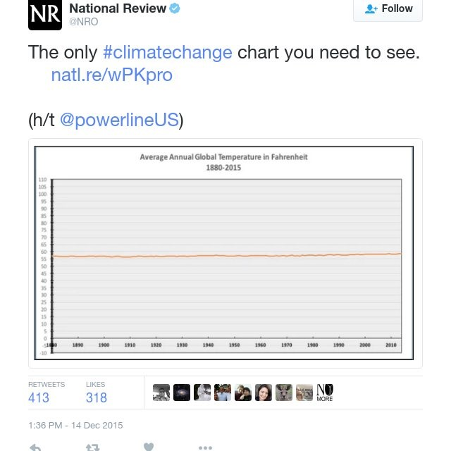
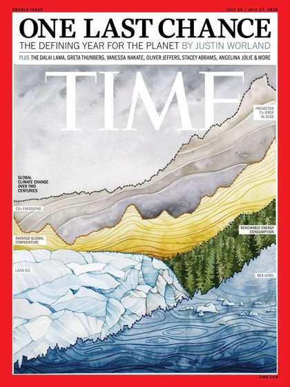
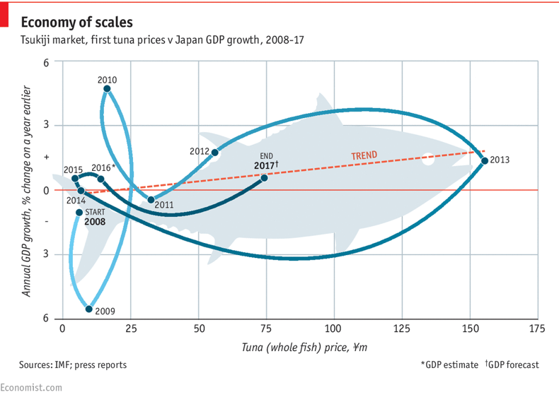
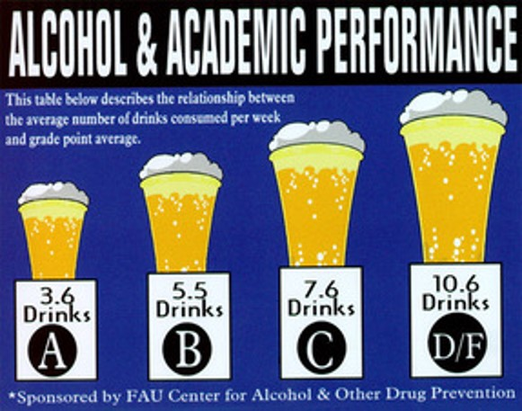

```{r include=FALSE}

library(msmbstyle)
# invalidate cache when the tufte version changes
knitr::opts_chunk$set(tidy = FALSE, 
                      cache.extra = packageVersion('msmbstyle'),
                      warning = FALSE,
                      message = FALSE)


options(htmltools.dir.version = FALSE)

source("scr/ggplot.R")

```

# Visualizations as a tool for misinformation

**Learning Objectives**

After completing this tutorial you should be able to

* describe commonly used techniques to use visualizations as a tool for misinformation
* outline a series of simple techniques to identify misinformation

(in short ... be pretty good at calling bullsh*t)

Open a new `Rmd` file using `File > New File > R Markdown` or the drop down menu of the green plus button below `File` and save it in your Visualization/Climate Change project directory.

That's right - training wheels are off ... you will need to add all of your own headers, plain text etc. We will not be coding for this set of activities so there should be no code chunks in your document! This is a chance for your to practice your `Rmarkdown` formatting skills.

Set up the `YAML` header so that you are the author and when knitted the date will reflect the date of the creation of the document. Try out a new theme and include a table of contents. Include at least one set of bullet points and one numbered list. Use bold and italics where appropriate.


## Terms and Definitions


`r tufte::margin_note("probably not [Mark Twain](https://www.york.ac.uk/depts/maths/histstat/lies.htm)")`

> *There are three kinds of lies, lies, damned lies, and statistics.*


`r tufte::margin_note("Harry G. Frankfurt")`

> *The bullshitter is neither on the side of the true or the side of the false. His eye is not on the facts at all. He does not reject the authority of the truth, as the liar does, and oppose himself to it. He pays no attention to it at all. By virtue of this, bullshit is a greater enemy of the truth than lies are.*

In his book On Bullshit, Harry G. Frankfurt distinguishes between a **liar** who knows the truth and deliberately tries to convince somebody of something that is untrue and a **bullshitter** who either does not know the truth or does not care - their focus is solely on persuading the listener. The focus of this distinction is the blatant disregard for truth and a carelessness in how data and facts are used.

`r msmbstyle::question_begin(label = "ques:misinf-1")`

Give a brief definition of misinformation and disinformation. Then compare these definitions with the framework of a liar vs a bullshitter and argue whether or not you agrees with Harry Frankfurt that "*bullshit is the greater enemy of the truth than lies are*".

`r msmbstyle::question_end()`


`r msmbstyle::question_begin(label = "ques:misinf-2")`

In 2015, the National Review posted what they claimed to be "the only climate change chart you need to see".


Briefly describe the figure and state what you think the message is that the National Review was trying to convey by posting this chart. Argue whether your would classify this as misinformation or disinformation^[Remember, when you 'argue' you should always state how/why it fulfills or illustrates a definition, statement, or set of criteria.].

`r msmbstyle::question_end()`


`r msmbstyle::question_begin(label = "ques:misinf-3")`

Climate skepticism comes in different flavors. Early misinformation campaigns were directed at outright denying that global warming is occurring and/or that increased greenhouse gas emissions are the cause, i.e. that we are observing natural climate variability and there is therefore no need for policy to regulate emissions or to change individual behavior.

Arguably, a new flavor of climate skeptics has emerged in the last years that spend less time arguing about whether or not anthropogenic climate change is happening and focus on arguing that the reaction is overblown. Bjorn Lomborg and Michael Shellenberger are very outspoken representatives for this position and focus a lot of their writing on why "climate alarmists" are not only wrong but potentially harmful.

Sharpen your bullshit detector by looking up either Lomborg or Shellenberger and sketch out their position, main arguments on why climate change is being overblown, and suggestions for solutions/strategies (or why proposed solutions like cutting emissions are wrong and we should be focusing on other strategies). As part of your descrption, figure out what their background is, i.e. what credentials do they have to position themselves as "climate experts".

Briefly discuss this brand of climate skeptics. Point for discussion could include e.g. how their brand differs from what we typically think of as climate deniers, whether you think they have some valid points/arguments, what you think makes them compelling/effective, why you think it might be easier/more difficult to refute their claims (if you disagree), would you place them in categories of misinformation, disinformation, or bullshitter, or do you think it is a valid position to hold etc.

`r msmbstyle::question_end()`


`r tufte::margin_note("Christopher Ashley Ford")`

> *As I indicated before, having something that sounds scientific to say when making assertions to laymen is not the same as being correct.*

`r msmbstyle::question_begin(label = "ques:misinf-4")`

"Science-y charts" are a commonly employed tool by climate skeptics. Briefly discuss why you think visualizations are especially compelling.

`r msmbstyle::question_end()`

`r msmbstyle::question_begin(label = "ques:misinf-5")`

We will do a deep dive into techniques used by climate deniers & skeptics, especially the use of visualizations in the next chapter. In preparation of our climate-specific discussion of misinformation and disinformation (which we've already gotten a taste for) create a list of at least five typical statements climate deniers/skeptics typically make and rank them by "level of denial". 

`r msmbstyle::question_end()`

`r msmbstyle::question_begin(label = "ques:misinf-6")`

Reflect on posts you may have seen on social media (or other outlets) where climate deniers/skeptics have made use of visualizations. Briefly, contrast major categories they fall into (scientific(looking) figures, infographics, memes, photographs, bumper stickers/embroidered pillow-style slogans, ...) in terms of how/why they are effective, which are more common than others, whether certain groups tend to use different types of visualizations, whether they more commonly are spreading misinformtion or disinformation, ... and other things that pop out to you.

`r msmbstyle::question_end()`


## A strategic approach to identifying misinformation

`r tufte::margin_note("still not Mark Twain - maybe Churchill?")`

> *A lie can travel halfway around the world while the truth is still putting on its shoes.*


`r tufte::margin_note("Thomas Francklin, Sermons on Various Subjects, 1787")`

> *Falsehood will fly, as it were, on the wings of the wind, and carry its tales to every corner of the earth; whilst truth lags behind; her steps, though sure, are slow and solemn, and she has neither vigor nor activity enough to pursue and overtake her enemy.*

One of the goals of this course is to equip you with a framework to be able to categorize and assess new information you encounter, or as Neil deGrasse Tyson puts it *"To be scientifically literate is to empower yourself to know when someone else is full of bullshit"*. The key term here is **to empower yourself**, i.e. develop a set of skills so that you can pro-actively and habitually assess information.

`r msmbstyle::question_begin(label = "ques:misinf-7")`

Think back to a time that you spotted some bullshit, briefly describe the misinformation you came across and outline the strategies you used to distinguish fact from fiction (mis from information?).

`r msmbstyle::question_end()`

Here is a non-exhaustive list of strategies that you should tuck away your tool belt for frequent use.

**Use Common Sense**

`r tufte::margin_note("definitely my Dad. so. many. times.")`

> *Remember to use your own brain.*

The used cars salesman principle is simple but powerful, when evaluating a source of information sk yourself four simple questions:

1. Who is telling me this?
2. How do they know it?
3. What are they trying to sell me?
4. What do they have to gain?

<br>

`r tufte::margin_note("Unless it's 2020...")`

**If it's to good or to bad to be true - it probably is**

This principle is a close relative of *Occam's Razor*, also known as the *Law of Parsimony*. 

`r msmbstyle::question(label = "ques:misinf-8", text = "Give a brief definition of Occam's Razor/Law of parsimony. Assess how the Law of Parsimony and the principle that claims that sound to good/bad to be true probably are can be used to identify misinformation. You may use an example if you'd like.")`

<br>

**Entertain multiple hypothesis**

`r tufte::margin_note("Sherlock Holmes")`

> *It is a capital mistake to theorize before one has data. Insensibly one begins to twist facts to suit theories,Instead of theories to suit facts..*

This principle encompasses both **confirmation bias** and the dreaded **echo chamber** - another way of stating it is to not fall in love with your hypothesis and continue to entertain independent evidence.

`r msmbstyle::question(label = "ques:misinf-9", text = "Briefly define the concepts of confirmation bias and the echo chamber. List some techniques you can use to counteract them.")`

<br>

**Garbage in/garbage out**

With ever larger and more available data sets and increasingly complex analysis it is important to not only consider the output and interpretation of an analysis and the methods used (which are becoming increasingly difficult to understand as a layperson) is only ever as good as the data set used in the first place. Consider the source of the data, sample size, how it was generated, and whether it is a legitimate comparison^[Assessing large-scale data sets and how we analyze them is as you may have noticed a central theme of this course. Consider our discussion of responsible conduct in science and the practices driving the reproducibility crisis.].

<br>

**Causation & Correlation**

There are two common logical fallacies that can be used to take a relationship of two variables to infer causation - *cum hoc ergo propter hoc* ("with this, therefore because of this", i.e. correlation implies causation) and *post hoc ergo proper hoc* ("after this, therefore because of this", i.e. because something occurred first it must be causing the later).

`r tufte::margin_note("How many more fancy latin phrases do I have up my sleeve? We shall probably never truly know... Is this an *exempli gratia* of using fancy language to obfuscate information? Possibly? Is using pretentious language and jargon also a strategy for spreading misinformation? Also difficult to tell.")`

Taking this to *ad absurdum* we have fun examples involving [chocolate and Nobel laureates](https://www.nejm.org/doi/full/10.1056/nejmon1211064) along with [storks and babies](https://web.stanford.edu/class/hrp259/2007/regression/storke.pdf). Both illustrate the fact that it is important to be careful when inferring causation, consider whether proxies are meaningful, whether there could be a common cause rather than correlation, and if there is a way to design manipulative experiments to determine causation. With increasingly large data sets it is easy to find a "signal" in a noisy data set and spin it into a story^[We have discussed this in connection of determining whether your analysis is descriptive, inferential, or causal/mechanistic.].

Want to engage in some ambiguous visualization? Go to [Spurious Correlations](https://www.tylervigen.com/spurious-correlations), create your own misleading but highly correlated relationship, download it, and post it in the `#graphicdetail` channel on slack ... as this week's chart of the week^[you get one Spurious Correlation for the semester ... use it wisely!]

<br>

**When in doubt, go to the source**

In one of their exhibits, the Pacific Science Center emphasizes four principles for a lay audience to consider when engaging with "science":

* Science is meant to move slowly
* Change is a natural part of science
* Experts have different specialties
* Not all sources are trustworthy

This is important to keep in mind when watching science unfold in real time and out in the open via social media, pre-prints (before peer-review) and in media outlets. It is important to [slow down](http://slow-science.org/) and give science an chance to breath and mature through discussion and testing.

`r tufte::margin_note("See list of Media Outlet's ranked by quality of their [science reporting](https://www.acsh.org/news/2017/03/05/infographic-best-and-worst-science-news-sites-10948); there are several similar assessments you can use as a point of orientiation as well.")`

"New study finds ... " makes for a great headline, though unfortunately occasionally both deliberately and unintentionally by the time the "new study" is translated into a press release and that press release is written up in the media misinformation or disinformation may have sneaked in. This may include

* cherry-picking
* over-generalizing (see `# In Mice` [examples](https://twitter.com/hashtag/inmice?lang=en) and an [article](https://www.statnews.com/2019/04/15/in-mice-twitter-account-hype-science-reporting/) describing the intent behind the hashtag).
* false interpretation

**Beware of misleading visualizations**

We'll go into detail on this one.


## General stratgies for unmasking manipulative visualizations

Manipulative visualization either present false data or misrepresent data to tell a specific story, i.e. they are either lying with false data or lying with truthful data. 

A good way to assess any visualization is to break it down into content, structure, and presentation^[There is some overlap between these categories.].

**Content**

The focus here is on the content itself, i.e. the data set, including how the data was generated, and what parts of the data is being presented.


`r msmbstyle::question_begin(label = "ques:misinf-10")`

Create a list of questions you can ask to identify manipulative visualizations based on content.

`r msmbstyle::question_end()`


**Structure**

Structure refers to *how* data points are encoded, i.e. what data points represent, what bin sizes are used, how axes are presented etc.^[Think about all the components of the grammar of graphics we have discussed learning how to use `ggplot`.]

`r msmbstyle::question_begin(label = "ques:misinf-11")`

Create a list of questions you can ask to identify manipulative visualizations based on structure.

`r msmbstyle::question_end()`


**Presentation**

There is some overlap between Structure and Presentation, but the focus here is more on the visualization as a whole, i.e. this includes not only "scientific-style" figures but other forms of visualization as well.

`r tufte::margin_note("Augustus Welby Northmore Pugin")`

> *It is alright to decorate construction but never construct decoration.*

The presentation for a graph can easily be used for intentional manipulation and misrepresentation of the data. 

As we have seen from examples of how visualizations are used in climate change misinformation campaigns, the choice of a scientific(ish) figure is frequently intentional - it lends gravitas to claims. This does not always mean that the visualization meets the standards for a scientific analysis.

Similarly, we have seen that photographs are powerful and can easily be used to be manipulative. Keep in mind, that just because you agree with the statement being supported by a picture that doesn't mean that picture is being used intentionally to sway you to a point.

Infographics have experience a rapid growth in popularity in the last ten years^[Here's an [infographic](https://visual.ly/community/Infographics/social-media/rise-infographic) the rise of infographics for you to refer to.]. They are a peculiar mix of data visualization, entertainment, art, and communication. They also vary in the quality of the underlying data set, frequently lack context but feature catchy fun facts and large print key "results". When done well, they effectively communicate information - unfortunately they are also frequently used for misinformation.

`r msmbstyle::question_begin(label = "ques:misinf-12")`

Here is an example of an infographic shared by the Heartland Institute^[The Heartland Institute is a conservative/libertarian public policy think tank that rejects scientific consensus on climate change and publishes a range of materials supporting climate change denial.] with the description

> This image contains 10,000 dots, each representing atmospheric gases.
> Nitrogen: 7,800 dots
> Oxygen: 2,100 dots
> Argon: 93 dots
> Natural Carbon Dioxide: 3 dots
> Human Carbon Dioxide Emissions: 1 dot
> Leftists claim 1 dot is going to destroy the Earth. Don't let them take away your freedoms with cries of doom and gloom!


Describe what the central message is you think they are trying to convey with this infographic and argue whether this falls in the category of misinformation or disinformation. Discuss whether you think this figure is compelling in it's design and what could make it effective in persuading viewers of their point of view.

`r msmbstyle::question_end()`


*Find an infographic and discuss the quality of the visualization and underlying data as one of your weekly Graphic Detail posts.*

Two types of potentially misleading figures are Ducks and Glass slippers. Frequently, they fall more into the category of Frankfurtian BS as typically the focus is on how the data is presented using specific gimmicks at the cost of carelessness towards accurately representing the data at

`r tufte::margin_note("Ducks are named after [Big_Duck](https://en.wikipedia.org/wiki/Big_Duck) a building shaped like a duck built to sell duck and duck eggs.")`

**Ducks** are figures where the topic of the figure is reflected in the design itself, e.g. the global carbon footprint being shaped like a footprint, whereas a **Glass slipper** (mis)uses a very specific format meant to visualize a very specific thing (e.g. a periodic table) in an incorrect context that detracts more from the content than adds to it (and sometimes is quite confusing!)^[If you are familiar with the original version of Cinderella, the Prince and his footman take the glass slipper to all the houses in the kingdom to find his princess. The evil stepsisters chop off their toes and heel in desperation to make it fit. Why this is not in the Disney version remains a mystery. Nevertheless, Glass slipper describes desperately trying to shoehorn data into a visualization type that doesn't quite fit.].

`r msmbstyle::question_begin(label = "ques:misinf-13")`

For each of the following images, briefly describe what the visualization depicts and argue whether you think it is a Duck or a glass slipper, briefly argue whether you think it is an effective visualization or if the presentation obscures the information being conveyed or could easily mislead the viewer.

From the cover of Time Magazine.


From The Economist


Oldie, but goldie - sponsored by the FAU Center for Alcohol & Ohter Drug Prevention



Nexthink's Periodic Table of IT Ops Tools^[For this one "no clue what they are trying to convey" is an option as an answer, but if you are able to figure it out, please do share. Definitely, answer the other parts of the question.]


`r msmbstyle::question_end()`

*Find a visualization that is a "Duck" or a "Glass slipper" and discuss the quality of the visualization and underlying data as one of your weekly Graphic Detail posts.*

`r msmbstyle::question_begin(label = "ques:misinf-14")`

Write a list of what you think are good practice for visualizing your data sets. Include at least three Do's and three Don'ts. Be ready to share in class!

`r msmbstyle::question_end()`


</br>

</br>

</br>


## Acknowledgements


A large component of the general content of this set of activities draws directly ond and is inspired by Carl Bergstrom and Jevin West’s course and book on [Calling Bullshit: The Art of Skepticism in a Data-Driven World](https://www.callingbullshit.org/index.html). Their course is online, including videos, it’s entertaining and informative. Put the book on your Christmas wish list.
