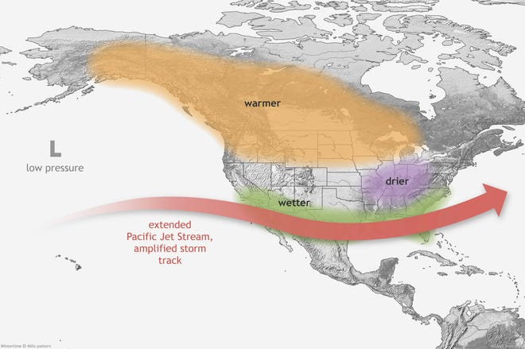

```{r include=FALSE}

library(msmbstyle)
# invalidate cache when the tufte version changes
knitr::opts_chunk$set(tidy = FALSE, 
                      cache.extra = packageVersion('msmbstyle'),
                      warning = FALSE,
                      message = FALSE,
                      error = FALSE)


options(htmltools.dir.version = FALSE)

source("scr/ggplot.R")

theme_set(theme_standard)

```

# Simulated Data for hypothesis testing II

**Learning Objectives**

After completing this tutorial you should be able to

* describe the concepts of macrosystems and teleconnections and how different ecological processes can interact at local, regional, and global scales.
* set up and run lake models to simulate lake temperatures, thermal structure, and ice cover in multiple lakes.
* formulate hypotheses about the effects of teleconnected climate scenarios on different lake modules and test them using simulations.
* describe how local characteristics modify global-scale climate forcing effects on lake temperatures and ice cover.

Before we start, download the folder `sim_lakes` from the  [07_LakeSimulations](https://drive.google.com/drive/folders/1dEt-_hHPelpNLsVww5WRATAQzXrG0oVE?usp=sharing) project folder and add it to your project folder (`07_LakeSimulations/sim_lakes`). You should also download the contents of the `data` folder and add it to your `07_LakeSimulations/data` folder for your R project.

Next, create new `Rmd` file using `File > New File > R Markdown`. Remember, to use the setup chunk to set your global settings for the document using the options you've learned about in the last few projects, including turning off messages, warnings, and errors being printed out when you knit your file. 

Remember, you should always check your `html` document after it knits to make sure that everything has converted as expected, including your figures, bullet points etc. This includes checking whether your figures look as you expect them to, or if you need to adjust the size e.g. using `fig.width` and `fig.height`.

Before we get started you should install the package `ggrepel`. Remember, the best way to do this is directly in the console - you can also use the `Install` radio button in the Pacakges tab.

Let's load our packages so we can get started.

```{r}

# load libraries
library(tidyverse)
library(janitor)
library(skimr)
library(patchwork)
library(knitr)
library(tidymodels)
library(ggrepel)

library(sp)
library(GLMr)
library(glmtools)

library(sf)
library(ggspatial)
library(rnaturalearth)
library(rnaturalearthhires)
library(rnaturalearthdata)

# turn of sci notation
options(scipen=999)

```


## Teleconnections

We have already seen how local and regional drivers can impact the thermal structure of lakes. Local impacts could include something like land cover change which alters the stream inflow/outflow of a lake impacting temperature. At a regional scale climate change can alter weather patterns, including both extreme events which disrupt regular seasonal patterns or also gradual change which raises lake temperatures overall.

Next, we are going to explore how ecosystems can be influenced on a global scale by teleconnections, i.e. meteorological, societal, and/or ecological phenomenon that link remote regions via cause and effect relationships. Simulations are especially powerful in this context, because it allows researchers to manipulate drivers independently from each other to disentangle how they impact ecosystems. By running different teleconnection scenarios, scientists are then able to better predict how ecosystems will respond to remote drivers.

In our module, we will specifically look at lake thermal structure and ice cover and determine how it is impacted by climate teleconnections to decadal events such as the El Niño/Southern Oscillation (ENSO). This is an example of a global driver. ENSO period with warmer ocean surface temperatures in the Pacific Ocean affect regular trade wind patterns. This altered atmospheric circulating impacts air temperature and precipitation patterns globally. How ENSO ends up impacting a particular lake will be further mediated by local and regional dynamics.

Our central question is:

**How do global ENSO teleconnections interact with local & regional drivers to affect lake temperatures, thermal structure, and ice cover?**

We can address this question using the General Lake Model we used to understand the effect of local & regional drivers on the thermal structure of lakes. To explore those interactions, we varies the local/regional drivers (weather/climate) and ran different scenarios (described in our `met` file) but kept the lake we were using constant, i.e. the morphology of the lake and other specific characteristics described in the `nml` file did not change.

ENSO has large-scale effects, however, the way an El Nino year plays out will vary by region, additional local effect will further modify the impacts on the thermal structure of each lake.

`r msmbstyle::question_begin(label = "ques:tele-a")`



During El Nino years there is a shift in the climate pattern of the Pacific Ocean, resulting in unusually warm surface waters in the the eastern equatorial Pacific Ocean. Use the figure above to describe regional differences in climate patterns in North America are impacted.

`r msmbstyle::question_end()`

To be able to explore our question we will need `nml` files describing lakes in different regions across North America. You should have downloaded and added the folder `sim_lakes` to your project directory. If you take a look in there, you fill find individual folders for a set of lakes, in each folder you have an `nml` file describing that lake along with a `met` file containing observed meteorological data. These are all lakes that are part of the GLEON network.

Let's take a look at where those lakes are situated.

```{r}

lakes <- read_delim("data/lake_characteristics.txt", delim = "\t") %>%
  clean_names()

kable(lakes,
      caption = "Characteristics for eight lakes in the GLEON network.")

```

Let's make a map displaying their geographic locations. We've previously used `geom_text()` to add text (labels) to maps. But those weren't exactly pretty maps. We are going to add a new tool to our toolbox for generating maps, `geom_label_repel()`. This function works especially well if you want to combine using a shape to plot a point and add a label that is placed in a way that it does not overlap with that point or other labels on the plot.

```{r fig.cap="Lake locations.", fig.width=9, fig.height=5}

world <- ne_countries(scale = "medium", returnclass = "sf")

us_states <- ne_states(country = "United States of America", returnclass = "sf")

# lat/long for map extent
x_min <- min(lakes$longitude) - 2
x_max <- max(lakes$longitude) + 2
y_min <- min(lakes$latitude) - 2
y_max <- max(lakes$latitude) + 2

# set color for fill
map_color <- "khaki3"

# create plot
ggplot() +
  geom_sf(data = world, color = "black", fill = map_color) +  # plot outline of countries
  geom_sf(data = us_states, color = "black", fill = NA) +     # plot outline of states
  coord_sf(xlim = c(x_min, x_max),
           ylim = c(y_min, y_max)) +                          # plot boundaries for map
  geom_point(data = lakes, aes(x = longitude, y = latitude),  # add sites
            size = 2) +
  geom_label_repel(data = lakes, 
                   aes(x = longitude, y = latitude, label = lake_name),
                   size = 3)

```

`r msmbstyle::question_begin(label = "ques:tele-4")`

Use the map describing changes in regional climate patterns due to El Nino and the map of the distribution of Lakes to hypothesize how you think lakes will be affected during El Nino years compared to normal years. Consider both how **lake temperatures** and **ice cover** could be impacted. Be specific - your answer should consider (among other things) which lake you would expect to display the strongest/weakest degree of warming during an El Nino year, which lakes might not be affected. Consider that we have already discovered that patterns of precipitation and wind also impact thermal structure of lakes.

`r msmbstyle::question_end()`

`r msmbstyle::question_begin(label = "ques:tele-5")`

Briefly describe how you can design an experiment to determine whether El Nino impacts the thermal structure of lakes and identify the effect of regional/local drivers modifying that global interaction. Be specific - consider what information (data sets) you need and what simulations you would run to compare.

`r msmbstyle::question_end()`

Don't worry - you won't have to run simulations for every lake - we will each look at a different lake and the compare results!


## Set up simulation

If you take a look at the `sim_lakes` folder, you should see that it contains individual folder for a series of lakes. In this example, we will use Lake Sunapee - this means that when you run the code for *your* lake, you will need to be sure to change the lake name accordingly.

First, let's create a vector with our lake name^[The advantage for doing it this way instead of directly in the individual code lines is that we only have to set it once, this makes the code a lot more reusable because we don't have to dig through the code and find all the arguments that set a file path or specify the lake name.].

```{r}

LakeName <- "Sunapee"

```

Next, we will set the file path for the `sim` folder. Each lake sim folder contains the input files needed to run `GLM`: the `nml` file which describes the lake, the `met` file describing the drivers of thermal structure, and input files describing inflow and outflow to the lake. 

```{r}

sim_folder <- "sim_lakes/Sunapee"

```

Next, we'll specify the file path for the `nml` file, read it in, and take a look at it.

```{r}

# define file path
nml_file <- file.path(sim_folder, "glm2.nml")

# read nml file
nml <- read_nml(nml_file)

# view file
print(nml)

```

One of the arguments in the `nml` file specifies the file with the information on drivers (i.e. it directs to the `met_hourly.csv`) file. Let's take a look at the meteorological input data for the duration of the simulation.

```{r fig.height=15, fig.width=8, fig.cap="Metereological data set summarizing the behavior of drivres of thermal structure for the baseline simulation."}

plot_meteo(nml_file) 

```

`r msmbstyle::question_begin(label = "ques:tele-6")`

Briefly describe the meteorological drivers over the course of the simulation. Be specific (what are ranges for each value? How do they change over the course of the year?)!

`r msmbstyle::question_end()`


## Run & analyze baseline simulation

Now that we have everything set up we can run the model.

```{r}

run_glm(sim_folder, verbose = TRUE)

```

To analyze the output, let's specify the file path for the output file that is now in our lake simulation folder (`output.nc`). Again, this will be our baseline data set based on observed meteorological data for a specific year (in our example 2013).

```{r}

baseline <- file.path(sim_folder, "output.nc")

```

Let's take a look at the variables that were output as part of our GLM simulation run.

```{r}

# pull variable names from output
var_names <- sim_vars(baseline)

# print variables in output
kable(var_names,
      caption = "Variable names and units for lake simulation.") 

```

One of the variables we are especially interested in is `hice` which describes the lake thickness on the surface of the lake.

Part of our central question is understanding how water temperatures at the lake surface and bottom (below the thermocline) be affected by El Nino teleconnections.

To estimate the bottom depth we can extract the lake depth in meters from the output.

```{r}

# extract lake depth
LakeDepth <- get_surface_height(baseline)

head(LakeDepth)

```

`r msmbstyle::question_begin(label = "ques:tele-7")`

Create a table with summary descriptive stats for the lake depth (min, max, mean, std) and describe the level of observed fluctuation over the course of the simulation.

`r msmbstyle::question_end()`

`r msmbstyle::solution_begin()`

```{r echo=FALSE}

LakeDepth %>%
  summarize(mean_depth = mean(surface_height),
            std_depth = sd(surface_height),
            min_depth = min(surface_height),
            max_depth = max(surface_height)) %>%
  kable(caption = "Descriptive statistics of lake depth for Lake Sunapee, NH",
        digits = 1)

```

`r msmbstyle::solution_end()`

We are going to want to extract the lake temperature data from our baseline simulation into a `data.frame` so we can compare it to our teleconnection scenarios down the line. We will extract it at the surface and for the bottom by setting the argument `z_out` to `0` (surface) and the minimum observed depth over the simulation (`min(LakeDepth$surface_height)`).

The function automatically names the temperatures after the depth - so you will want to rename them something sensible. You will need to pull up the original column names for your lake, and then you will need to change the column names in the `rename()` function accordingly!

```{r}

# pull temperature data
LakeTemp <- get_temp(file = baseline, reference = "surface",
                            z_out = c(0, min(LakeDepth$surface_height)))

# get column names
colnames(LakeTemp)

# rename columns 
LakeTemp <- LakeTemp %>%
  rename(Baseline_SurfaceTemp = temp_0,
         Baseline_BottomTemp = temp_33.3833669399235)

```

`r msmbstyle::question_begin(label = "ques:tele-8")`

Visualize the change of surface and bottom temperature for the baseline simulation and breifly describe your results. Remember to be specific and to start with general patterns and then highlight important/notable details. Remember to include a title and axes labels.

`r msmbstyle::question_end()`

`r msmbstyle::solution_begin()`

Hint - to plot both temperatures in the same plot, you will need to first create a tidy data set!

If you look at the figure below, you can see that you will need a column for date (x-axis), temperature (y-axis) and and column that contains simulated scenarios (this becomes the color coding for your line graphs).

Once you do that, it should be straightforward to create a plot that look something like this:

```{r echo=FALSE, fig.cap="Change in surface (blue) and bottom (green) temperature [C] for baseline scenario."}

LakeTemp %>%
  pivot_longer(names_to = "dataset", values_to = "Temperature", 2:3) %>%
  ggplot(aes(x = DateTime, y = Temperature, color = dataset)) +
  geom_line(size = 1) +
  scale_color_manual(values = c("green", "darkblue")) +
  labs(x = "date", y = "Temperature [C]")

```

`r msmbstyle::solution_end()`

Let's plot a heatmap of our lake thermal structure for the baseline scenario.

```{r}

plot_temp(file=baseline, fig_path=FALSE) 

```

`r msmbstyle::question_begin(label = "ques:tele-9")`

First, briefly explain how to interpret this heatmap (what data is code here how for the visualization?).

Then, describe your results - include how the thermal structure changes over the course of the year. Be specific, use key terms such as thermocline, stratified, isotherm, epilomnion (above the thermocline), and hypolimnion (below the thermocline).

`r msmbstyle::question_end()`

Next, we will extract the ice cover on the lake for our baseline simulation.

```{r}

LakeIce <- get_var(baseline, "hice") %>%
  rename(ice_baseline = hice)

```

`r msmbstyle::question_begin(label = "ques:tele-10")`

Visualize the change of surface ice for your lake over the course of the year and then describe your results. Remember to be specific - when is there ice? How thick is it? Include a title & label your axes!

`r msmbstyle::question_end()`

`r msmbstyle::solution_begin()`

Your plot should look something like this:

```{r echo=FALSE, fig.cap="Change in ice cover [m] for baseline simulation."}

ggplot(LakeIce, aes(x = DateTime, y = ice_baseline)) +
  geom_line(color = "darkblue", size = 1) +
  labs(x = "date", y = "ice cover [m]")

```

`r msmbstyle::solution_end()`


## Create typical El Nino year scenario

Now that we know what ice cover, surface/bottom temperature, and thermal lake structure looks like for the baseline scenario, we are going to explore whether there are teleconnections between El Nino and lake temperatures for two scenarios simlating differing El Nino conditions.

We will use observed historical climate data to determine how much warmer or cooler the local air temperature is likely to be during an El Nino year for our data set.

The data folder contains text files with historical climate data - make sure that you change the code to read in the data for your specific lake. We are going to use data starting in the year 1970^[Since the 1970s there has been a change in some of the drivers and processes of how El Nino is formed. So even though overall the effect is still due to a change in the surface temperatures in the Pacific Ocean some of the regional effects have changed.].

```{r}

annual_temp <- read_delim("data/sunapee_clim.txt") %>%
  clean_names() %>%
  filter(year >= 1970)

```

Let's use `skim()` to get a quick look at the data set:

```{r}

skim(annual_temp)

```

Let's take a look at differences in Air temperature between El Nino and La Nina years.

`r msmbstyle::question_begin(label = "ques:tele-11")`

Create a plot visualizing the Air temperature for each year and color code it according to whether it is an El Nino, La Nina, or neutral year. Briefly describe your results.

`r msmbstyle::question_end()`

`r msmbstyle::solution_begin()`

Your plot should look something like this:

```{r echo=FALSE, fig.cap="Mean annual air temperature for Lake Sunapee, NH. Individual data points are color coded according to whether years were classified as Eln Nino (green), La Nina (blue) or neutral (orange)."}

ggplot(annual_temp, aes(x = year, y = air_temp_mean_c)) +
  geom_line(color = "black", size = .5) +
  geom_point(aes(fill = type), shape = 21, color = "black", size = 3) +
  scale_fill_manual(values = c("green", "blue", "darkorange")) +
  scale_y_continuous(limits = c(5, 9)) +
  labs(x = "date", y = "mean annual temperature [C]")

```

`r msmbstyle::solution_end()`

Next, we want to determine how much warmer or colder a typical El Nino year is compared to a typical neutral year. 

`r msmbstyle::question_begin(label = "ques:tele-12")`

Outline a straightforward way you could calculate this.

`r msmbstyle::question_end()`

`r msmbstyle::solution_begin()`

The most straightforward way would be to calculate the mean annual temperature for all annual years and then calculate the mean temperature across all El Nino years. However, we do have to account for the effect of climate change and so we will need to use linear regressions to fit an equation that describe the change in annual temperature over time for neutral years, and a second linear regression to fit an equation to determine the change in El Nino years.

`r msmbstyle::solution_end()`

Let's work through how we can determine what an El Nino year should look like for Lake Sunnapee.

First, let's check what type of year 2013 is, which is the year we simulated the thermal structure as a baseline. We are going to acquire a new function for our arsenal which is `pull()`. This allows up to extract a column from a data set as a vector. In this case it is a single value before we will first filter the data set to only contain entries for the year 2013.

```{r}

annual_temp %>%
  filter(year == 2013) %>%
  pull(type)

```

We want to know what the offset is between a linear regression describing neutral and El Nino years. Let's visualize this by subsetting our data set to contain only neutral and El Nino years and adding a linear trend line.

```{r fig.cap="Linear regressions comparing the observed in air temperature [C] over time for neutral and El Nino years."}

annual_temp %>%
  filter(type %in% c("Neutral", "ElNino")) %>%
  ggplot(aes(x = year, y = air_temp_mean_c, color = type)) +
  geom_point(shape = 21, size = 3) +
  geom_smooth(method = "lm", se = FALSE) +
  labs(x = "year", y = "mean annual air temperature [C]")

```

To determine the typical offset, we will use linear regressions to calculate estimated (expected) values for 2013 if it were a typical neutral year and if it were a typical El Nino year. Then we will calculate the difference between those two estimated values as the typical offset to create our `met_hourly` input data set for a typical El Nino year - i.e we will add the expected offset to the values used in the baseline scenario to create an simulation of the Lake thermal structure if 2013 had been a typical El Nino year.

Let's start by fitting a linear regression model to the neutral years. For this we need to start by creating a subset of the data containing only neutral years.

```{r}

neutral_temp <- annual_temp %>%
  filter(type == "Neutral")

```

Now, let's create a linear regression modeling the relationship of the mean annual temperature and the year for the Lake Sunapee using the `tidymodels` framework. 

```{r}

lm_fit <- linear_reg() %>%                          # specify model
  set_engine("lm") %>%                              # define computational engine
  fit(air_temp_mean_c ~ year, data = neutral_temp)  # define variables

```

Let's identify the slope and intercept for our linear regression (i.e. the equation describing the relationship of temperature and year).

```{r}

summary(lm_fit$fit) %>% 
  tidy()

```

We are going to use the function `pull()` to create variables with our neutral slope and intercept (we are going to need these later).

```{r}

neutral_slope <- summary(lm_fit$fit) %>% 
  tidy() %>%
  filter(term == "year") %>%
  pull(estimate)

neutral_intercept <- summary(lm_fit$fit) %>% 
  tidy() %>%
  filter(term == "(Intercept)") %>%
  pull(estimate)

```

`r msmbstyle::question_begin(label = "ques:tele-13")`

Briefly describe your results. Be specific.

`r msmbstyle::question_end()`

`r msmbstyle::solution_begin()`

Remember, a good way to describe this type of relationship is "on average for every [unit of independent variable] we expect the [dependent variable] to [increase/decrease] by [slope & unit of dependent variable].)

`r msmbstyle::solution_end()`

We can use the function `augment()` to create a `data.frame` that contains the observed data (`air_temp_mean_c`) for a given year along with the value calculated using the equation for our linear regression (`.fitted`).

```{r}

lm_aug <- augment(lm_fit$fit)

head(lm_aug) %>%
  kable()

```

We are really only interested in the expected value for the year 2013. Again, we can use the function `pull()` to extract a single column from a `data.frame`, which makes it easy to create a variable with our expected mean annual temperature for a "neutral 2013".

```{r}

neutral_2013 <- lm_aug %>%
  filter(year == 2013) %>%
  pull(.fitted)

```

`r msmbstyle::question_begin(label = "ques:tele-14")`

Compare your observed and expected annual mean temperature for a neutral 2013.

`r msmbstyle::question_end()`

Now, let's fit a linear regression for an El Nino year.

```{r}

# create subset with El Nino years
elnino_temp <- annual_temp %>%
  filter(type == "ElNino")

# fit linear regression
lm_fit <- linear_reg() %>%                          # specify model
  set_engine("lm") %>%                              # define computational engine
  fit(air_temp_mean_c ~ year, data = elnino_temp)   # define variables

```

`r msmbstyle::question_begin(label = "ques:tele-15")`

Print a summary of your linear regression and briefly describe your results; compare these results to your linear regression of a neutral year.

`r msmbstyle::question_end()`

`r msmbstyle::solution_begin()`

```{r echo=FALSE}

summary(lm_fit$fit) %>% 
  tidy() %>%
  kable(caption = "linear regression of mean annual temperature for El Nino years over time in Lake Sunapee.")

```

`r msmbstyle::solution_end()`

For our neutral data, we were able to use the function `augment()` because it calculates the expected (`.fitted`) value for the dependent variable (here, temperature) for every observed value of the independent variable (here, year) in the data set. So since 2013 is a neutral year, it will calculate the neutral expectation for 2013.

Our El Nino data set does not include the year 2013. There for we need to first specify the set of years that we want to plug into the equation describing the relationship of temperature and year for El Nino years.

```{r}

# create data frame year(s) to predict
predict_year <- expand.grid(year = 2013)

# calculate expected values
pred <- predict(lm_fit, new_data = predict_year)

# extract predicted value
elnino_2013 <- pred %>%
  pull(.pred)

```

Now, we can calculate the estimated El Nino offset as the difference between the predicted neutral and typical El Nino temperatures calculated for 2013 using the linear regression equations.

```{r}

typical_offset <- elnino_2013 - neutral_2013

```

`r msmbstyle::question_begin(label = "ques:tele-16")`

Describe your result (what is the expected offset for a typical El Nino year?).

Now that you have calculated to your typical expected offset for an El Nino year compared to a neutral year, hypothesis how your typical El Nino scenario may affect lake temperatures and ice cover for your lake model. Be specific! What changes do you expect? why?

`r msmbstyle::question_end()`

We're almost there - now all we have to do is create the `met_hourly` input file for the scenario we want to simulate. In your `sim_lakes` folder create a new folder called `Sunapee_typical`^[remember to change this according to the lake you are simulating], make a copy of the the `outflow.csv`, `inflow.csv`, and `glm2.nml` files from the `Sunapee` folder^[Again, change this so you are adding a copy of the corresponding lake `nml` file to the lake you are working on.].

```{r}

# specify new sim folder
sim_folder_typical <- "sim_lakes/Sunapee_typical"

```


Now, let's create a new `met_hourly` file for our "typical El Nino year" scenario. We are going to change the air temperature by increasing it according to the offset between neutral and El Nino years we just calculated. This means we can do this completely in `R`, by reading in the baseline met data and the using `mutate` to add the offset to the Air temperature and writing it back out to file.

```{r}

# file path for original met file
baseline_met <- file.path(sim_folder, "met_hourly.csv")

# read in baseline met data
met_data <- read_delim(baseline_met, delim = ",") %>%
  mutate(AirTemp = AirTemp + typical_offset,                                # add El Nino offset
         time = as.POSIXct(strptime(time, "%Y-%m-%d %H:%M:%S", tz="EST")))  # make sure correct date/time format

# write new met data to new sim folder
write_delim(met_data, file.path(sim_folder_typical, "met_hourly_typical.csv"), delim = ",")

```

Next, we need to edit the `nml` file to make sure that it points to the correct `met` file. You can do this by either opening the `nml` file in an external text editor or, depending on your `Rstudio` version you can also clicking on the `glm2.nml` file in your `Sunapee_typical` in the `Rstudio` File tab and select `View File` which will open it in the Viewer panel.

You will need to scroll to the meteorology section^[You can also use the find function!] and change the `meteo_fl` entry to match the new file name (`met_hourly_typical.csv`)^[Make sure to save the file before closing it!].

Let's double check that we did this correctly:

```{r}

# define file path
nml_file_typical <- file.path(sim_folder_typical, "glm2.nml")

# read nml file
nml <- read_nml(nml_file_typical)

# check met file name
get_nml_value(nml, "meteo_fl")

```

If the print out in the console is not your met file for the typical El Nino scenario you just created, make the edit to the `nml` file and make sure to save the change!


## Run & analyze typical El Nino year scenario

Okay, we're all set to run our typical El Nino scenario:

```{r}

run_glm(sim_folder_typical, verbose = TRUE)

```

Before we can look at all the output, we will need to create a file path for our main output file (`output.nc`) per usual to make it easy to pull all the information we need and create visualizations.

```{r}

typical_elnino <- file.path(sim_folder_typical, "output.nc")

```

Let's pull out our temperature for the lake surface and lake bottom and add that to our existing `LakeTemp` `data.frame`. We will want to repeat the same process as above, where we pull up the automatically generated column names^[you will need to check the column names specific to your lake and change the code accordingly!] and then rename them after we join the two data sets^[Dates are notoriously difficult to deal with, frequently they might look the same to you, but under the hood there are differences at some level. The code line `mutate(DateTime = as.POSIXct(strptime(DateTime, "%Y-%m-%d %H:%M:%S", tz="EST")))` is there to make sure that both `DateTime` columns are the same class/data type and we can join the data tables].

```{r}

LakeTemp_scenario <- get_temp(file = typical_elnino, reference = "surface",
                     z_out = c(0, min(LakeDepth$surface_height))) %>%
  mutate(DateTime = as.POSIXct(strptime(DateTime, "%Y-%m-%d", tz="EST")))

colnames(LakeTemp_scenario)

LakeTemp <- LakeTemp %>%
  mutate(DateTime = as.POSIXct(strptime(DateTime, "%Y-%m-%d", tz="EST"))) %>%
  left_join(LakeTemp_scenario, by = "DateTime") %>%
  rename(TypicalElNino_SurfaceTemp = temp_0,
         TypicalElNino_BottomTemp = temp_33.3833669399235)

```

`r msmbstyle::question_begin(label = "ques:tele-17")`

Create a plot comparing the Bottom and Surface temperatures for your Baseline and Typical El Nino simulations. Color code the lines according to whether they are the baseline scenario or a typical El Nino year and create subplots for bottom and surface temperature.

Briefly describe your results - remember to be specific (have your surface and bottom temperatures changed? By how much?)!

`r msmbstyle::question_end()`

`r msmbstyle::solution_begin()`

Recall from our previous plot of just the baseline temperatures that we first had to create a tidy data set. 

If you look at the figure, you can see that you will need a column for date (x-axis), temperature (y-axis) and two additional columns for your sub-grouping of type of temperature measurement (this becomes the individual panels of bottom and surface temperature) and your simulated scenarios (this becomes the color coding for your line graphs).

If you pivot your data set as you did earlier, you end up with a column containing your scenario/data sets; if you look closely at those values you can see that they contain both the information on simulation scenario and the type of temperature measurement. What function can you use to create separate columns for the `scenario` and the `temperature_measurement`.

You plot should look similar to this - remember to add a title and label your axes!

```{r echo=FALSE, fig.cap="Comparison of surface and bottom temperatures [C] for simulated baseline scenario (blue) and typical El Nino year (orange).", fig.width=9, fig.height=5}

LakeTemp %>%
  pivot_longer(names_to = "dataset", values_to = "Temperature", 2:5) %>%
  separate(dataset, into = c("scenario", "temp_measurem"), sep = "_") %>%
  ggplot(aes(x = DateTime, y = Temperature, color = scenario)) +
  geom_line(size = 1) +
  scale_color_manual(values = c("darkblue", "darkorange")) +
  facet_grid(. ~ temp_measurem) +
  labs(x = "date", y = "temperature [C]")

```

`r msmbstyle::solution_end()`

Next, let's pull the ice thickness data for our typical El Nino scenario and add it to the existing `LakeIce` `data.frame`.

```{r}

LakeIce_scenario <- get_var(typical_elnino, "hice") %>%
  rename(ice_TypicalElNino = hice) %>%
  mutate(DateTime = as.POSIXct(strptime(DateTime, "%Y-%m-%d")))

LakeIce <- LakeIce %>%
  mutate(DateTime = as.POSIXct(strptime(DateTime, "%Y-%m-%d"))) %>%
  left_join(LakeIce_scenario)

```

`r msmbstyle::question_begin(label = "ques:tele-18")`

Create a plot comparing the ice thickness for your baseline and typical El Nino year simulation.

Briefly describe your results - remember to be specific!

`r msmbstyle::question_end()`

`r msmbstyle::solution_begin()`

You plot should look similar to this - remember to add a title and label your axes!

```{r echo=FALSE, fig.cap="Comparison of ice thickness [m] for simulated baseline scenario (blue) and typical El Nino year (orange).", fig.width=9, fig.height=5}

LakeIce %>%
  pivot_longer(names_to = "dataset", values_to = "ice_thickness", 2:3) %>%
  ggplot(aes(x = DateTime, y = ice_thickness, color = dataset)) +
  geom_line(size = 1) +
  scale_color_manual(values = c("darkblue", "darkorange")) +
  labs(x = "date", y = "ice thickness [C]")

```

`r msmbstyle::solution_end()`

Finally, let's take a look at our lake thermal structure.

```{r}

plot_temp(file = typical_elnino, fig_path = FALSE)

```


## Create an extreme El Nino year scenario

We created a typical El Nino year scenario. From comparing the annual mean temperatures in our historical climate data set, you know that there is strong variation in how much El Nino years differ from a neutral year.

Let's identify the largest observed offset that our lake has experienced since 1970. Let's take another look at our observed annual temperature data for neutral and El Nino years.

```{r fig.cap="Comparison of mean annual temperature [C] for neutral and El Nino years"}

annual_temp %>%
  filter(!type == "LaNina") %>%
  ggplot(aes(x = year, y = air_temp_mean_c, color = type)) +
  geom_smooth(method = "lm", se = FALSE) +
  geom_point(size = 3) +
  scale_color_manual(values = c("darkorange", "darkblue")) +
  labs(x = "year", y = "mean annual air temp [C]")

```

We can eyeball which of the El Nino years appears to have the largest offset from a neutral year, or since we calculated the slope and intercept of the regression line describing the relationship of temperature and time for neutral years we can calculate the offsets for all El Nino years and then identify the largest offset.

We can do this by calculating the estimated temperature for each year if it was a neutral year, and then calculating the offset.

```{r}

# identify maximum offset
max_offset <- elnino_temp %>%
  mutate(neutral_est = (neutral_slope * year) + neutral_intercept,
         offset = air_temp_mean_c - neutral_est) %>%
  summarize(max_offset = max(offset)) %>%
  pull(max_offset)

```

`r msmbstyle::question_begin(label = "ques:tele-19")`

Describe your result (what is the offset?).

Now that you have calculated to your extreme expected offset for a strong El Nino year compared to a neutral year, hypothesize how your extreme El Nino scenario may affect lake temperatures and ice cover for your lake model compared to your baseline simulation of a neutral year. Be specific! What changes do you expect? why?

`r msmbstyle::question_end()`


Now, we can use this value to generate a strong El Nino scenario repeating the steps from above.

First, create a new subfolder `sim_lakes/Sunapee_extreme`^[Remember, that you should be naming this folder according to the lake you are exploring.]. Then place a copy of the `met_hourly.csv`, `inflow.csv`, `outflow.csv`, and `glm2.nml` file in that folder.

Next, let's create our new `met` file by adding the maximum offset we identified in the observed data to the air temperature.

```{r}

# create file pat for extreme el nino simulation
sim_folder_extreme <- "sim_lakes/Sunapee_extreme"

# read in baseline met data & add offset
met_data <- read_delim(baseline_met, delim = ",") %>%
  mutate(AirTemp = AirTemp + max_offset,                                   # add max El Nino offset
         time = as.POSIXct(strptime(time, "%Y-%m-%d %H:%M:%S", tz="EST")))  # make sure correct date/time format

# write new met data to new sim folder
write_delim(met_data, file.path(sim_folder_extreme, "met_hourly_extreme.csv"), delim = ",")

```

Finally, we need to edit the `nml` file for our scenario, so it points to the correct `met` file. Open the `glm2.nml` file in the `Sunapee_extreme` folder^[Remember, this will be specific to the lake you've chosen.] and edit the `meteo_fl` option to point toward your `met` file.

Let's double check that we edited the file correctly.

```{r}

# define file path
nml_file_extreme <- file.path(sim_folder_extreme, "glm2.nml")

# read nml file
nml <- read_nml(nml_file_extreme)

# check met file name
get_nml_value(nml, "meteo_fl")

```


## Run & analyze extreme El Nino scenario

We are ready to run our simulation and create a vector pointing to the output file.

```{r}

# run simulation
run_glm(sim_folder_extreme)

# specify output file
extreme_elnino <- file.path(sim_folder_extreme, "output.nc")

```

Our next step will be to pull out our temperature for the lake surface and lake bottom and add that to our existing `LakeTemp` `data.frame` repeating the same process we used above.

```{r}

LakeTemp_scenario <- get_temp(file = extreme_elnino, reference = "surface",
                     z_out = c(0, min(LakeDepth$surface_height))) %>%
  mutate(DateTime = as.POSIXct(strptime(DateTime, "%Y-%m-%d", tz="EST")))

colnames(LakeTemp_scenario)

LakeTemp <- LakeTemp %>%
  mutate(DateTime = as.POSIXct(strptime(DateTime, "%Y-%m-%d", tz="EST"))) %>%
  left_join(LakeTemp_scenario, by = "DateTime") %>%
  dplyr::rename(ExtremeElNino_SurfaceTemp = temp_0,
         ExtremeElNino_BottomTemp = temp_33.3833669399235)

```

`r msmbstyle::question_begin(label = "ques:tele-20")`

Create a plot comparing the Bottom and Surface temperatures for your baseline and corresponding typical and strong El Nino scenario simulations. Color code the lines according to the simulated scenario and create subplots for bottom and surface temperature for easier comparison.

Post a copy of your final figure in the `#hwassignments` channel. Make sure your plot title include the lake name! You will be adding all your final figures; you should wait until you've completed all of them before doing so.

Describe your results - remember to be specific!

`r msmbstyle::question_end()`

`r msmbstyle::solution_begin()`

Your plot should look similar to this one.

We've already done this for our previous visualizations of the temperature data. Again, you will need to turn your data set into a tidy data set to be able to plot this data set. If you look at the figure, you can see that you will need a column for date (x-axis), temperature (y-axis) and two additional columns for your sub-grouping of type of temperature measurement (this becomes the individual panels of bottom and surface temperature) and your simulated scenarios (this becomes the color coding for your line graphs).

```{r echo=FALSE, fig.cap="Comparison of surface and bottom temperatures [C] for simulated baseline scenario (blue), typical El Nino year (orange), and extreme El Nino year (red).", fig.width=9, fig.height=5}

LakeTemp %>%
  pivot_longer(names_to = "dataset", values_to = "Temperature", 2:7) %>%
  separate(dataset, into = c("scenario", "temp_measurem"), sep = "_") %>%
  ggplot(aes(x = DateTime, y = Temperature, color = scenario)) +
  geom_line(size = .7) +
  scale_color_manual(values = c("darkblue", "red", "darkorange")) +
  facet_grid(. ~ temp_measurem) +
  labs(x = "date", y = "temperature [C]")

```

`r msmbstyle::solution_end()`

Next, let's pull the ice thickness data for our extreme El Nino scenario and add it to the existing `LakeIce` `data.frame`.

```{r}

LakeIce_scenario <- get_var(extreme_elnino, "hice") %>%
  rename(ice_ExtremeElNino = hice) %>%
  mutate(DateTime = as.POSIXct(strptime(DateTime, "%Y-%m-%d")))

LakeIce <- LakeIce %>%
  mutate(DateTime = as.POSIXct(strptime(DateTime, "%Y-%m-%d"))) %>%
  left_join(LakeIce_scenario)

```

`r msmbstyle::question_begin(label = "ques:tele-21")`

Create a plot comparing the ice thickness for your baseline, typical, and extreme El Nino year simulations.

`r msmbstyle::question_end()`

`r msmbstyle::solution_begin()`

You plot should look similar to this - remember to add a title and label your axes!

Again, you will need to convert your data set to a tidy data set, this time you should have a column with your date (x-axis), ice thickness (y-axis) and your scenarios/data sets (color coding for lines).

```{r echo=FALSE, fig.cap="Comparison of ice thickness [m] for simulated baseline scenario (blue), typical (orange) and extreme (red) El Nino years.", fig.width=9, fig.height=5}

LakeIce %>%
  pivot_longer(names_to = "dataset", values_to = "ice_thickness", 2:4) %>%
  ggplot(aes(x = DateTime, y = ice_thickness, color = dataset)) +
  geom_line(size = .7) +
  scale_color_manual(values = c("darkblue", "red", "darkorange")) +
  labs(x = "date", y = "ice thickness [C]")

```

`r msmbstyle::solution_end()`

Here is an example of where transforming our data can be helpful to better identify patterns. The model gives us the output of ice thickness. However, in many biological and ecological contexts the more helpful metric would be to now what the ice cover is, i.e. how many days of the year is the lake covered in ice.

We can create a new data frame (`IceCover`) that contains the number of years with ice for each of your scenarios.

```{r}

IceCover <- LakeIce %>%
  pivot_longer(names_to = "scenario", values_to = "ice_thickness", 2:4) %>%
  group_by(scenario) %>%
  summarize(ice_cover = sum(ice_thickness > 0))

```

A good way to visualize this, would be to plot the relationship of the temperature offset and ice cover duration. This means we need to add the offset to our `data.frame`. We can do this using a conditional mutate and the helpful function `case_when()`.

```{r}

IceCover <- IceCover %>%
  mutate(TempOffset = case_when(scenario == "ice_baseline" ~ 0,
                                scenario == "ice_TypicalElNino" ~ typical_offset,
                                scenario == "ice_ExtremeElNino" ~ max_offset))

```

Now it's straightforward to create plot summarizing the change in ice cover based on the expected temperature offset for a typical and strong El Nino year.

```{r}

ggplot(IceCover, aes(x = TempOffset, y = ice_cover)) +
  geom_line() +
  geom_point(aes(fill = scenario), shape = 21, size = 3) +
  scale_fill_manual(values = c("darkblue", "red", "darkorange")) +
  labs(x = "Temperature offset [C]", y = "ice cover duration [days]")

```

`r msmbstyle::question_begin(label = "ques:tele-22")`

Describe your results. Be specific!

Post a copy of your final figure in the `#hwassignments` channel. Make sure your plot title include the lake name! You will be adding all your final figures; you should wait until you've completed all of them before doing so.

`r msmbstyle::question_end()`

Finally, let's take a look at our lake thermal structure across our three scenarios. 

We've previously relied on the `glmtools::plot_temp()` function. However, down the line you might want to plot a heat plot for another data set down the line. Let's learn how to use `ggplot` to plot a heatmap.

First, we need to pull the temperature data for all depths. If we don't specify `z_out` as we have done previously to get just the surface and/or bottom temperatures the `get_temp()` function will return data for all depths.

```{r}

therm_struct <- get_temp(file = extreme_elnino, reference = "surface") %>%
  mutate(DateTime = as.POSIXct(strptime(DateTime, "%Y-%m-%d", tz="EST")))

```

To plot a heatmap we will us the function `geom_tile()`. We need a data set with a column for date which we will plot on the x-axis (this already exists as `DateTime`), a column with depth which we will plot on the y-axis, and a column with temperature (this is the one we will color code the tiles by).

This means we need to create a tidy data set. Currently, the column names for each depth are in the format `temp_depth`. We can use the function `stringr::str_sub()`^[`stringr` is a package in the `tidyverse` designed to manipulate strings.]. Your `data.frame` might have a different number of columns than our example. We can use `ncol(therm_struct)` to get the number of columns in the data set and use that to specify which columns to gather.

```{r}

therm_struct <- therm_struct %>%
  pivot_longer(names_to = "depth", values_to = "temperature", 2:ncol(therm_struct)) %>%
  mutate(depth = str_sub(depth, 6),     # remove first five characters
         depth = as.numeric(depth)) %>% # convert to numeric
  filter(!is.na(temperature))           # remove missing values.

```

Now we can plot our heatmap showing the thermal structure for our extreme El Nino year. 

We are going to flip the y-axis using `scale_y_reverse()` so that our surface temperature is at the top of the plot. We can specify the range of values using the `limits` and `breaks` options in the `scale_fill_viridis_c()` function that we are using to specify the color scale. The temperature cannot drop below 0 but your should check the maximum value for your temperature to determine the highest value for your scale^[in my case it is around 27C so I chose 30]. 

```{r fig.cap="Thermal structure of Lake Sunapee, NH for extreme El Nino event."}

ggplot(therm_struct, aes(x = DateTime, y = depth, fill = temperature)) +
  geom_tile() +
  scale_fill_viridis_c(option = "plasma", limits=c(0, 30), breaks=seq(0, 30, by = 5)) +
  scale_y_reverse() +
  labs(x = "date", y = "depth [m]")

```

`r msmbstyle::question_begin(label = "ques:tele-23")`

Use your new `ggplot` skills to create a heat plot for the thermal structure of your baseline, normal, and El Nino years for your Lake. Use `patchwork` to create a multi panel figure to make it easy to compare all three scenarios.

The extreme El Nino scenario should have the highest temperatures - use the same values for `limits` and `breaks` to make sure all of your scales are identical and it is straightforward to compare your plots.

Post a copy of your figure in the `#hwassignment` channel. Make sure your plot title includes the lake name! You will be adding all your final figures; you should wait until you've completed all of them before doing so.

Describe your results - remember to be specific!

`r msmbstyle::question_end()`

`r msmbstyle::solution_begin()`

You plot should look similar to this - remember to add a title and label your axes!

```{r echo=FALSE, fig.cap="Comparison of thermal structure for baseline (top), typical (middle), and extreme (bottom) El Nino years.", fig.width=7, fig.height=16}

# baseline scenario ----
therm_struct <- get_temp(file = baseline, reference = "surface") %>%
  mutate(DateTime = as.POSIXct(strptime(DateTime, "%Y-%m-%d", tz="EST"))) %>%
  pivot_longer(names_to = "depth", values_to = "temperature", 2:21) %>%
  mutate(depth = str_sub(depth, 6),     
         depth = as.numeric(depth)) %>% 
  filter(!is.na(temperature))           

p1 <- ggplot(therm_struct, aes(x = DateTime, y = depth, fill = temperature)) +
  geom_tile() +
  scale_fill_viridis_c(option = "plasma", limits=c(0, 30), breaks=seq(0, 30, by = 5)) +
  scale_y_reverse() +
  labs(x = "date", y = "depth [m]",
       title = "Baseline scenario (Lake Sunapee)")
  

# typical El Nino Year scenario ----
therm_struct <- get_temp(file = typical_elnino, reference = "surface") %>%
  mutate(DateTime = as.POSIXct(strptime(DateTime, "%Y-%m-%d", tz="EST"))) %>%
  pivot_longer(names_to = "depth", values_to = "temperature", 2:21) %>%
  mutate(depth = str_sub(depth, 6),     # remove first five characters
         depth = as.numeric(depth)) %>% # convert to numeric
  filter(!is.na(temperature))           # remove missing values.

p2 <- ggplot(therm_struct, aes(x = DateTime, y = depth, fill = temperature)) +
  geom_tile() +
  scale_fill_viridis_c(option = "plasma", limits=c(0, 30), breaks=seq(0, 30, by = 5)) +
  scale_y_reverse() +
  labs(x = "date", y = "depth [m]",
       title = "Typical El Nino scenario (Lake Sunapee)")

# extreme El Nino Year scenario ----
therm_struct <- get_temp(file = extreme_elnino, reference = "surface") %>%
  mutate(DateTime = as.POSIXct(strptime(DateTime, "%Y-%m-%d", tz="EST"))) %>%
  pivot_longer(names_to = "depth", values_to = "temperature", 2:21) %>%
  mutate(depth = str_sub(depth, 6),     # remove first five characters
         depth = as.numeric(depth)) %>% # convert to numeric
  filter(!is.na(temperature))           # remove missing values.

p3 <- ggplot(therm_struct, aes(x = DateTime, y = depth, fill = temperature)) +
  geom_tile() +
  scale_fill_viridis_c(option = "plasma", limits=c(0, 30), breaks=seq(0, 30, by = 5)) +
  scale_y_reverse() +
  labs(x = "date", y = "depth [m]",
       title = "Extreme scenario (Lake Sunapee)")

p1 / p2 / p3

```

`r msmbstyle::solution_end()`

`r msmbstyle::question_begin(label = "ques:tele-1")`

Your central results are comparisons of surface & bottom depth, lake ice cover duriation, and thermal structure for all three scenarios, which you have already summarized above. 

Discuss your results to interpret the effect of El Nino on the lake thermal structure of your lake and relate that to the broad topic of teleconnections and macrosystems ecology. Some questions to consider include:

* do you see evidence of teleconnections? why/why not?
* what local characteristics of your lake might be contributing to the response you observed to changes in the temperature offsets?
* does your model output support or contradict your initial hypothesis of how El Nino events will interact with local conditions affecting lake thermal structure/ice cover?
* our simulations did not include precipitation - what do you think might happen if we did include this information?
* we determined our offsets are based on historical data, how do you think El Nino effects might change in the future and what does this mean for lake responses?
* most research has focused on the effects of El Nino on air temperature/land surfaces - do you think we can use our lake data as a good proxy for land surface increase? Why? Why not?

Start your discussion with a summary of your analysis and results in the format of

> In this study, I investigated [broad question asked/hypothesis tested]. To achieve this, I [specific study location, data set(s) + analysis used]. We found that [key results: in your case you would make a specific statement about the change of surface/bottom temperature, ice cover, and lake thermal structure for your lake]. 

Now that you have completed your analysis, post this summary of key results in the `#hwassignment` channel along with your plots (comparison of surface/bottom temperature, ice cover duration, thermal structure).

`r msmbstyle::question_end()`

`r msmbstyle::question_begin(label = "ques:tele-2")`

Collectively, we analyzed a set of lakes across the continental United States. 

Compare and contrast the results for all the lakes based on the results that have been posted in the `#hwassignments` channel to discuss the overall results in the context of macrosystems ecology and specifically teleconnections. The questions for consideration of the discussion of your specific results will be helpful for your broad discussion.

`r msmbstyle::question_end()`

</br>

</br>

</br>

</br>

</br>

</br>

</br>

</br>

## Acknowledgments

These activities are based on the EDDIE Teleconnections module.^[Farrell, K.J. and C.C. Carey. 18 May 2018. Macrosystems EDDIE: Teleconnections. Macrosystems EDDIE Module 3, Version 1.]