# Overview {-}

Welcome to our lab manual for `Data Science for the Natural Environment (Fall 2021)` - it will be continuously updated throughout the semester. For the most part an electronic copy (on a laptop or tablet) is sufficient, at times you may be instructed to print a data or worksheet for lab.


## Course Format {-}

This is a lecture/lab course meeting three times a week (TR 11:10 – 12:25, W 13:30 – 15:55). Key concepts will be introduced in reading assignments, short ‘prelab’-type tutorials, or exercises that you will be expected to complete before class.

While lecture/lab time will incorporate brief refreshers and more in-depth demonstrations of some of the more complex topics, the focus will be on applying the concepts and ‘learning by doing’ by directly applying new skills to case studies and data sets from ecology, environmental science and public health


**BYOD: Bring your own device (to lab)**

You are required to bring your laptop for use during lab; a tablet will not be sufficient to participate though you are welcome to bring an additional device to have an extra screen to follow along an electronic version of the lab manual. Make sure to have a power cable and/or fully charged battery!


**Course Materials**

Readings will primarily assigned from [Wickham, H., & Grolemund, G. (2016). R for data science: import, tidy, transform, visualize, and model data. " O'Reilly Media, Inc.".](https://r4ds.had.co.nz/index.html)


<br>


## Homework assignments {-}

You will spend a significant portion of lecture/lab time working on exercises and engaging with your peers and the instructor on an individual basis to troubleshoot, clarify misunderstandings, and discuss alternative approaches to problem solve.

Most of the exercises will be completed during lab/lecture time though occasionally you will be instructed to complete an exercise outside of. Once a module is complete you will have two days to review, synthesize, clean up/complete your code and answers and turn in the knitted document (`*.html`) through `Canvas`^[For example, if we wrap up a module on a Tuesday your homework will be due Thursday at 11:59pm]. No late or incomplete homework will be accepted or receive credit.

You are encouraged to work collaboratively both during/outside of class times but everyone should be submitting their own work. If you worked closely with a certain person please make a note at the beginning of your document.


### Due Sunday, Sept. 26th {-}

Complete [Chapter 13](https://bi449fa21.netlify.app/climate-change.html) in our lab manual. Now that you have gained additional `Rmarkdown skills`, use those to format your “report” that you will hand in. Code chunks should have comments, add answers to questions in plain text (not as code in chunks), use headers intentionally, and of course you have options like bullet points etc. as well. Make sure that your `html` file has knitted as expected before you upload it; this includes headers being correctly formatted, bullet points formatted etc. If it hasn't go back to the Rmarkdown file and fix them, re-knit and then upload.

When you are in the process of learning how to write up your results (and trying to keep them separate from your interpretation/discussion) it is perfectly fine to start with a simple structure that is formulaic and more akin to bulleted declarative sentences than carefully, crafted prose. Sometimes it helps you actually write them out as bullet points.
So an answer for Q13.24 could start like this ...

* We compared rates of increase in the last 200 years for global mean temperature and atmospheric CO2 concentrations to data from the last approx. 800,000 years.
* Over the last 200 years there is a significant relationship between time and temperature. The rate of temperature increase currently is ... C per year. For past time ranges rates of increase ranged from x - x (and then you could have subpoints with the time or a table for individual time ranges + rates).
* Statement about whether rate of increase is higher (steeper) than in the past
* Statement about current CO2 rate of increase + in the past.
* Statement about whether current CO2 and temperature rate of increase show the same trend.

Separating out individual components into bullet points helps you organize what components belong together. Once you get used to organizing your thoughts you will automatically start to transition into being able to write better descriptions of your results (regardless of whether tables or figures).

Good communication starts with good organization of your thoughts, if you know what you want to say and how everything fits together chances are much higher that somebody else will be able to follow what you are trying to communicate to them.


### Due Sunday, Sept. 19th {-}

Complete [Chapter 9](hhttps://bi449fa21.netlify.app/scientific-misconduct-and-the-reproducible-crisis.html) in our lab manual, no code chunks but be sure to read the `Rmarkdown` challenge and include that in your document. Submit your knitted html file through Canvas as HW09^[I've updated the HW assignment numbers to match the chapter numbers so we've skipped a few.].

Complete [Chapter 10](https://bi449fa21.netlify.app/responsible-research-is-reproducible-research.html) in our lab manual; no code chunks but be sure to read the `Rmarkdown` challenge and include that in your document. Submit your knitted html file through Canvas as HW10

Complete [Chapter 11](https://bi449fa21.netlify.app/project-management-revisited.html) in our lab manual; no code chunks but be sure to read the `Rmarkdown` challenge and include that in your document. Submit your knitted html file through Canvas as HW10


### Due Sunday, Sept. 12th {-}

Complete [Chapter 7](https://bi449fa21.netlify.app/welcome-to-the-tidyverse.html) in our lab manual, make sure your code is properly commented and all questions have been answered. Submit your knitted html file through Canvas as HW04.

Complete [Chapter 8](https://bi449fa21.netlify.app/catch-data-analysis.html) in our lab manual. Make sure your code is properly commented and you have answered all the questions. Most of your answers can be brief when describing results and drawing conclusions but still be sure to be comprehensive. Submit your knitted html file through Canvas as HW05.


### Due Friday, Sept. 3rd {-}

Complete [Chapter 5](https://bi449fa21.netlify.app/identifying-essential-fish-habitat-shark-nurseries-on-the-texas-coast.html) in our lab manual. Remember, most of the answers to the questions can be brief, and we are skipping Q4. Write your assignment in `Rmarkdown` and then knit it and submit the html file.

Complete [Chapter 6](https://bi449fa21.netlify.app/intro-to-data-frames.html) in our lab manual. This `Rmarkdown` file contains both plain text and code chunks. It will only knit of all of your code is running correctly! Remember to give yourself sufficient time to go over anything you still have questions about or haven't figured out to make sure it will knit and submit properly. Comment your code! 


<br>

### Due Tuesday, Aug. 31th {-}

Complete Chapter 4 "Functions, Object, Vectors - oh my" in our lab manual before class; the focus is for you to feel a little more comfortable sending code from an `Rscript` (for most of the semester this will actually be an `Rmarkdown` instead but each code - chunk is a mini `Rscript`), and learning to comment your code. You should have a complete Rscript by next class, we'll talk briefly about any questions.

I will show you how to compile a report using the little notebook icon in the `Rscript` panel and submit the resulting `*.html` file through canvas.


<br>

### Due Wednesday, Aug. 25th (1pm) {-}

Introduce yourself in the  `#general` slack channel:

* Give your name, major, year
* Tell us what you are hoping to get out of this class^[If it's 'check it off my list to graduate' - that's fine, we'll try to make this class more than a check mark!].
* Let us know how much experience you have with data analysis and coding.

<!--chapter:end:index.Rmd-->

---
title: "Data Science for the Natural Environment (FA21)"
subtitle: "BI449 Data Science for the Natural Environment"
author: "Shannon J. O'Leary"
date: "2021-09-24"
knit: "bookdown::preview_chapter"
output:
  msmbstyle::msmb_html_book:
    highlight: tango
    toc: TRUE
    toc_depth: 1
    split_by: chapter
    margin_references: FALSE
    css: msmb.css
bibliography: labmanual.bib
link-citations: yes
---


# What even is data science?

**Learning Objectives**

After completing this lab you should be able to 

* define what data is and what the structural/functional relationships to information, knowledge, insight and wisdom are.
* describe what data science is and the major field/skill sets that comprise it.
* describe the individual components that comprise the data science life cycle.

<br>

## Defining "data" and "science"

Data are qualitative and quantitative observations that are measured and collected. 


<div class = 'question' id='ques:ds-1'><p class='question-begin'>&#x25BA; Question</p><div class='question-body'><p>Data fall in two distinct categories, categorical and numerical data. Briefly compare and contrast these two categories by describing the data types you would expect to find in each.</p><p class='question-end'><span class='fa fa-square-o solution-icon'></span></p></div></div>


The '**data - information - knowledge - wisdom pyramid**' gives us a framework to consider how data can be used to inform decision making and impact the world around us. Not until **data** is organized and processed thus adding context can we glean **information** from the signal. Additional meaning is transferred as we synthesize and further contextualize information resulting in **knowledge**.

These three categories look backwards - we describe the "what" and ask about the "why" to reveal patterns and relationships. At this point we start looking forward to determine what action(s) should be taken, we know seek to reveal principles and directions that can be applied.

We integrate knowledge across disciplines to gain **insight** and **wisdom** to further understanding of problems and derive actionable solutions. This culminates in the decision-making process resulting in change.


<div class = 'question' id='ques:ds-2'><p class='question-begin'>&#x25BA; Question</p><div class='question-body'><p>The science council defines science as the pursuit and application of knowledge and understanding of the natural and social world following a systematic methodology based on evidence. Compare and contrast this definition to the DIKW framework and make an argument that all science is data science.</p><p class='question-end'><span class='fa fa-square-o solution-icon'></span></p></div></div>


##  What even is data science?

Data science is a fuzzy term and no single definition exists. Most definitions emphasize that it is a interdisciplinary field and that it has arisen in response to the increasingly large data sets that are produced. 

A common way of defining data science is to describe it as being the intersection of **domain knowledge**, **statistics/mathematics**, and **computer science** - though different definitions will ascribe more importance to certain different components.

One distinction to the typical scientific process as you may have learned it to be is that a large component of data science is **hypothesis generation** through exploratory analysis rather than **hypothesis confirmation**. 

The data science process generally starts by posing an interesting question and ends with visualizing and communicating the results. The key steps to the end results are **obtaining** the data, **processing** and **exploring** the data, and **modeling** the data to understand the data set and derive conclusions.

## The data science process

### Ask an interesting question

Let's start by asking an interesting question:

> Will Sasquatch by impacted by climate change?

Specifically, climate change could result in a shift in habitat availability, i.e. should we expect a species extinction because of habitat loss or a range expansion or range shift?

To do this we need to generate a species distribution model (SDM) for the Sasquatch, a large, hairy, bipedal ape-like creature found (or is it?) throughout North America^[I suppose, technically, since we were venturing into cryptozoology here it is not a species, but rather a cryptid distribution model], i.e. first we need to understand where Sasquatch are currently distributed to then assess how that might change in the future.

### Get occurrence data 

The first thing we need for any SDM is a data set documenting species occurrence, i.e. geo-coded observations of a given species in the wild.

Four our purposes, we turn to the Bigfoot Field Researchers Organization ([BFRO](https://www.bfro.net/)), founded in 1995 as the "*only scientific research organization exploring the Bigfoot/Sasquatch mystery*". You can turn to their website for answers on important [FAQs](https://www.bfro.net/gdb/show_FAQ.asp?id=405), including 'Do Bigfoot Sasquatch bury their dead?', 'Where is the physical evidence?', 'Wasn't this all shown to be a fake?, and 'Why do you want scientists to recognize the Sasquatch as a species? Isn't it better to just leave them alone?'. Their main focus though is on compiling reports of sightings and investigating them. In other words, they have a database full of geo-coded reported sightings^[And even better, it has already been downloaded and wrangled and is accessible (with sightings through 2018) right [here](https://data.world/timothyrenner/bfro-sightings-data).].

Let's read in the data and then we can take a look at the information we can glean from this data set by looking at the column names.


```r
# read data
occurrence <- read_delim("data/bfro_reports_geocoded.txt", delim = "\t")
```


### Tidy, Transform & Explore the data

Let's start by taking a look at our data set to determine how we need to wrangle to get the information we need process it so we can generate our species distribution model.

Because we need to be able to identify the exact locations Sasquatch occur, we are going to remove any observations that do not have latitude and longitude information.


```r
occurrence <- occurrence %>%
  filter(!is.na(longitude),
         !is.na(latitude))
```

Next, let's consider is what geographic extent of the observations is by looking at the distributions on a map.


```r
# get minimum and maximum lat/longs
max.lat <- ceiling(max(occurrence$latitude))
min.lat <- floor(min(occurrence$latitude))
max.lon <- ceiling(max(occurrence$longitude))
min.lon <- floor(min(occurrence$longitude))

# create an extent object of the range of observations
geo_range <- extent(x = c(min.lon, max.lon, min.lat, max.lat))

# get base map
data(wrld_simpl)

# plot the base map
plot(wrld_simpl, 
     xlim = c(min.lon, max.lon),
     ylim = c(min.lat, max.lat),
     axes = TRUE, 
     col = "grey75")

# add individual occurrences
points(x = occurrence$longitude, 
       y = occurrence$latitude, 
       col = "darkorange", 
       pch = 20, 
       cex = 0.75)

# draw box around figure
box()
```

<div class="figure">
<p class="caption">(\#fig:unnamed-chunk-5)Map of Sasquatch sighting in the United States based on the BFRO database (1950 - 2021).</p>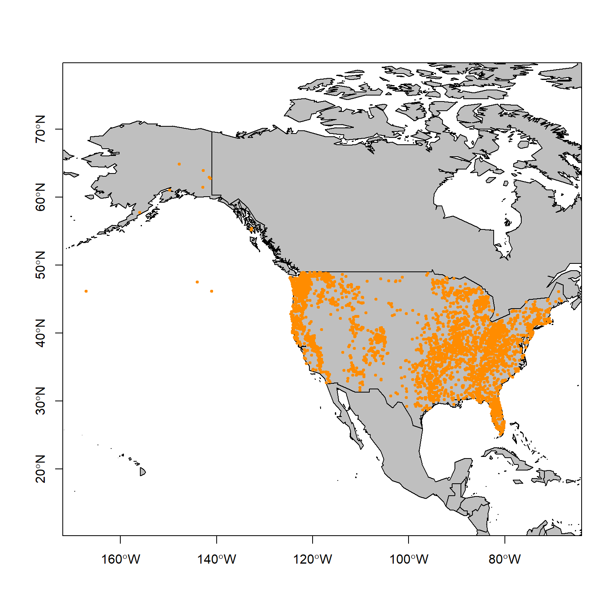</div>

Here is an example of where domain knowledge comes in - while we are tidying and exploring the data set we need to assess whether there are artifacts our outlier data points that should be removed.


<div class = 'question' id='ques:ds-3'><p class='question-begin'>&#x25BA; Question</p><div class='question-body'><p>Give a brief descriptions of the spatial distribution of the occurrence of Sasquatch in the United States. Note areas where sightings appear to be random, clustered or more dispersed, determine if you think any points should be removed.</p><p class='question-end'><span class='fa fa-square-o solution-icon'></span></p></div></div>


<div class = 'question' id='ques:ds-4'><p class='question-begin'>&#x25BA; Question</p><div class='question-body'><p>Discuss some possible explanations for the patterns you have observed to determine whether you think this data set is a reasonable representation of the ecological niche of the Sasquatch and can be used to create a species distribution model.</p><p class='question-end'><span class='fa fa-square-o solution-icon'></span></p></div></div>


<div class = "msmb-solution"><p class="solution-begin">&#x25BA; Solution<span id='sol-start-1' class="fa fa-plus-square solution-icon clickable" onclick="toggle_visibility('sol-body-1', 'sol-start-1')"></span></p><div class="solution-body" id = "sol-body-1" style="display: none;">


Good catch - those sightings in the middle of the ocean are probably errors in the geo-coding. Further, we don't know how reliable the data for Alaska is as this data set is based on opportunistic sightings^[Well, admittedly if you poke around the BFRO website you will find that people do plan expeditions.]. 

The data for for observations in the lower 48 seems much more reliable, so let's restrict our data to those observations.


```r
# load and filter data
occurrence <- read_delim("data/bfro_reports_geocoded.txt", delim = "\t") %>%
  filter(!is.na(longitude),
         !is.na(latitude),
         longitude > -130,
         latitude < 55)

# get minimum and maximum lat/longs
max.lat <- ceiling(max(occurrence$latitude))
min.lat <- floor(min(occurrence$latitude))
max.lon <- ceiling(max(occurrence$longitude))
min.lon <- floor(min(occurrence$longitude))

# create an extent object
geo_range <- extent(x = c(min.lon, max.lon, min.lat, max.lat))

# get base map
data(wrld_simpl)

# plot the base map
plot(wrld_simpl, 
     xlim = c(min.lon, max.lon),
     ylim = c(min.lat, max.lat),
     axes = TRUE, 
     col = "grey75")

# add individual occurrences
points(x = occurrence$longitude, 
       y = occurrence$latitude, 
       xlim = c(min.lon, max.lon),
       ylim = c(min.lat, max.lat),
       col = "darkorange", 
       pch = 20, 
       cex = 0.75)

# draw box around figure
box()
```

<div class="figure">
<p class="caption">(\#fig:unnamed-chunk-6)Map of Sasquatch sighting in the lower 48 states based on the BFRO database as (1950 - 2021).</p>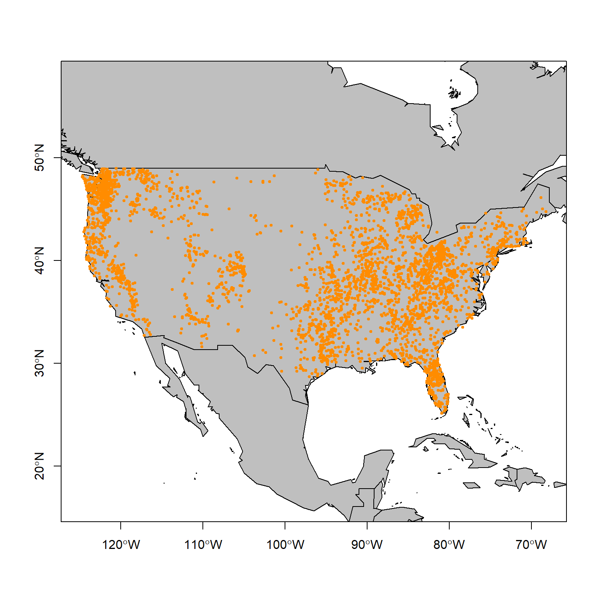</div>


<p class="solution-end"><span class="fa fa-square-o solution-icon"></span></p></div></div>


This should work - on to the next step!


### Get more data

Occurrence data along will not allow us to build a species distribution model; what we need is environmental data to go with the locations, i.e. we need a set of predictor variables. 

Combining multiple data sets is typical for data science projects, frequently the quality of a project hinges on the availability of hight quality data sets that can provide information to describe or preodict behavior if the data set you are exploring.

Climate is complex and multidimensional, though at its core climate is determined by [long-term patterns in mean and variability of temperature and precipitation](https://openoregon.pressbooks.pub/envirobiology/chapter/3-3-terrestrial-biomes/). 

We are going to use the bioclim data set from [CliMond](https://www.climond.org/BioclimRegistry.aspx#Table1). Bioclim variables are commonly used for species distribution modeling as they are based on long-term trends (as opposed to e.g. the exact conditions when the species was observed). 


<div class = 'question' id='ques:ds-5'><p class='question-begin'>&#x25BA; Question</p><div class='question-body'><p>Look up the descriptions of the [bioclim variables](https://www.climond.org/BioclimRegistry.aspx#Table1) and give a brief description of the four abiotic parameters that are included and how they are being parameterized. Argue which you think are most important to describe a species distribution/ecological niche and whether you think overall this data set will help us understand Sasquatch species distribution.</p><p class='question-end'><span class='fa fa-square-o solution-icon'></span></p></div></div>


The data set we are using includes a core set of 19 variables that describe temperature and precipitation, along with an additional 16 variables that describe solar radiation and soil moisture. This information is encoded in the raster files of the historical (contemporary) bioclim data sets at a resolution of 10' (minutes) into the data folder. The "historical" data set consists of data from 1961 - 1990 centered on 1975. 

A raster file is an image file consisting of pixels with data associated with it. In this case, our "pixels" are 10' x 10' and depending on the layer the value associated with each pixel is the value for that bioclim value at that geographic location.


```r
# get list of files
files <- list.files("data/", pattern='^CM10_1975H', full.names=TRUE )

# import and convert to raster stack
predictors <- stack(files)
```

We have now created an object that at its core consists of a list where each element is a layer (bioclim variable raster).

### Tidy, transform & explore the data (again)

Let's plot the first bioclim variable (Bio01, annual mean temperature).


```r
plot(predictors@layers[[1]])
```

<div class="figure">
<p class="caption">(\#fig:unnamed-chunk-8)Global distribution of annual mean temperature (1961 - 1990, centered on 1975).</p></div>

We see the pattern we would intuitively expect, with temperatures decreasing as you move poleward and being warmest around the poles.

Let's extract the values for each bioclim variable at our occurrence points (observations).


```r
# create df with just xy coordinates
xy <- occurrence %>%
  dplyr::select(longitude, latitude)

# crop bioclim data to geographic range
cropped_predictors <- crop(x = predictors, y = geo_range)

# extract values
presence <- raster::extract(cropped_predictors, xy)
```

Let's take a quick look at the first few rows and columns of the matrix we just created.


```r
head(presence[,1:3])
```

```
##      CM10_1975H_Bio01_V1.2 CM10_1975H_Bio02_V1.2 CM10_1975H_Bio03_V1.2
## [1,]              8.387707              15.84337             0.3534581
## [2,]             10.156170               9.49416             0.2941423
## [3,]             15.522450              13.50635             0.3474373
## [4,]             11.259700              12.40612             0.3456673
## [5,]             10.189860              11.02385             0.3073747
## [6,]              8.724987              10.20157             0.2807353
```


<div class = 'question' id='ques:ds-6'><p class='question-begin'>&#x25BA; Question</p><div class='question-body'><p>Briefly state what these values represent.</p><p class='question-end'><span class='fa fa-square-o solution-icon'></span></p></div></div>


### Create species distribution model

Our next step is to fit a bioclim model to the data set we just generated.


```r
# fit bioclim model
model.fit <- bioclim(presence)
```

The bioclim model is a classic climate-envelope-model^[You may remember reading about this in your reading assignments.]. 

Briefly, the algorithm computes the similarity of locations by comparing the value of each environmental variables being used (our bioclim data set) to a distribution of that values at all locations with known presence^[Also called the training sites; these are our occurrence points.]. The closer that value is to the median (50th percentile), the more suitable that location is assumed to be. Suitability scores are between 0 and 1, with 1 indicating a "perfect suitability".)

In general, there is no distinction between the tails of the distribution (i.e. the 90th and 10th percentile are equivalent), though in some implementations you can specify those to be treated as distinct. As a result e.g. low levels of precipitation could be limiting but high levels would not be.

Finally, we will use our suitability scores and the bioclim raster data set to generate a predictive map of the Sasquatch species distribution. This means that the algorithm will assign a suitability score to each pixel based on the model and create a new raster layer.


```r
# generate raster with predicted distribution
prediction <- dismo::predict(x = cropped_predictors, 
                             object = model.fit,
                             ext = geo_range)
```

Let's plot our species distribution map.


```r
# plot model probabilities
plot(prediction,
     xlim = c(min.lon, max.lon),
     ylim = c(min.lat, max.lat),
     axes = TRUE)

# add map
plot(wrld_simpl, add = TRUE, border = "black")

# draw box around it
box()
```

<div class="figure">
<p class="caption">(\#fig:unnamed-chunk-13)Species distribution model for Sasquatch. Color indicates the probability of encountering Sasquatch in the lower 48 states based on habitat suitability.</p>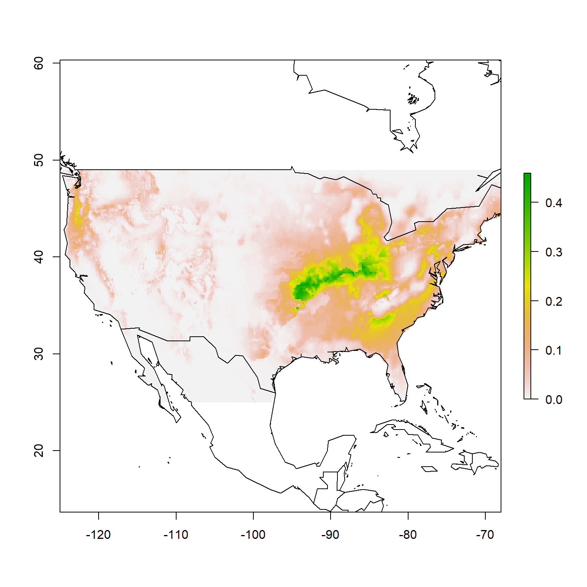</div>


<div class = 'question' id='ques:ds-7'><p class='question-begin'>&#x25BA; Question</p><div class='question-body'><p>Give a brief description of the habitat suitability map, including the maximum probabilities. Describe wether this result fits your expectations based on the distribution map of reports we looked at earlier. According to our map, if you were planning a Sasquatch research trip, where would you be headed?</p><p class='question-end'><span class='fa fa-square-o solution-icon'></span></p></div></div>


Our highest habitat suitability values (probability of occurring) seem pretty low. One reason for this is that we used presence-only data.


<div class = 'question' id='ques:ds-8'><p class='question-begin'>&#x25BA; Question</p><div class='question-body'><p>The alternative to presence-only models is to have presence-absence data. Discuss how this would improve the models. Argue why you think presence-only data sets are easier to generate.</p><p class='question-end'><span class='fa fa-square-o solution-icon'></span></p></div></div>


<div class = 'question' id='ques:ds-9'><p class='question-begin'>&#x25BA; Question</p><div class='question-body'><p>A work-around of not having absence data is to generate pseudo-absence data. This is done by generating random points within the geographic range and using those as proxies for absence data. Briefly argue the merits and limitations of such an approach.</p><p class='question-end'><span class='fa fa-square-o solution-icon'></span></p></div></div>


### Model future climate change

Projections of future climate change are heavily dependent on human activity and the resulting greenhouse gas emissions. Therefore the IPCC's Assessment Reports contain scenario families that represent projected climate conditions based on emission scenarios resulting from future technological and economic development as defined by each scenario.

Let's look at how the species distribution map might change in response to a shift in environmental parameters.

To do this we will use bioclim raster files for 2100 generated using the A1B and A2 scenarios. 

The A1 climate scenarios assume a more integrated world characterized by rapid economic growth, a global population that peaks at 9 billion (2050) and the gradually declines, rapid spread of new/efficient technologies, and a convergent world characterized by extensive worldwide social and cultural interactions. Scenario A1B further assumes a balanced emphasis on fossil and non-fossil fuels. 

By contrast, A2 scenarios assume a more divided world consisting of independently operating and self-reliant nations and regionally-oriented economic development. The population is assumed to continuously grow. Finally, this scenario is characterized by high emissions.

Let's start with the **A1 climate scenario** to create our species distribution model.


```r
# get list of files
files <- list.files("data/", pattern='^CM10_2100_A1B', full.names=TRUE )

# import and convert to raster stack
predictors_A1 <- stack(files)
```

Now let's fit our model and create predictive map.


```r
# create df with just xy coordinates
xy <- occurrence %>%
  select(longitude, latitude)

# crop bioclim data to geographic range
cropped_predictors <- crop(x = predictors_A1, y = geo_range)

# extract values
presence <- raster::extract(cropped_predictors, xy)

# fit the bioclim model
model.fit <- bioclim(presence)

# create raster layer of predicted distribution
prediction <- dismo::predict(x = cropped_predictors, 
                             object = model.fit,
                             ext = geo_range)
```

Finally, let's plot our species distribution map.


```r
# plot model probabilities
plot(prediction,
     xlim = c(min.lon, max.lon),
     ylim = c(min.lat, max.lat),
     axes = TRUE)

# add map
plot(wrld_simpl, add = TRUE, border = "black")

# draw box around it
box()
```

<div class="figure">
<p class="caption">(\#fig:unnamed-chunk-16)Predicted species distribution for Sasquatch in the lower 48 in 2100 (climate scenario A1B). Color indicates the probability of encountering Sasquatch in the lower 48 states based on habitat suitability.</p>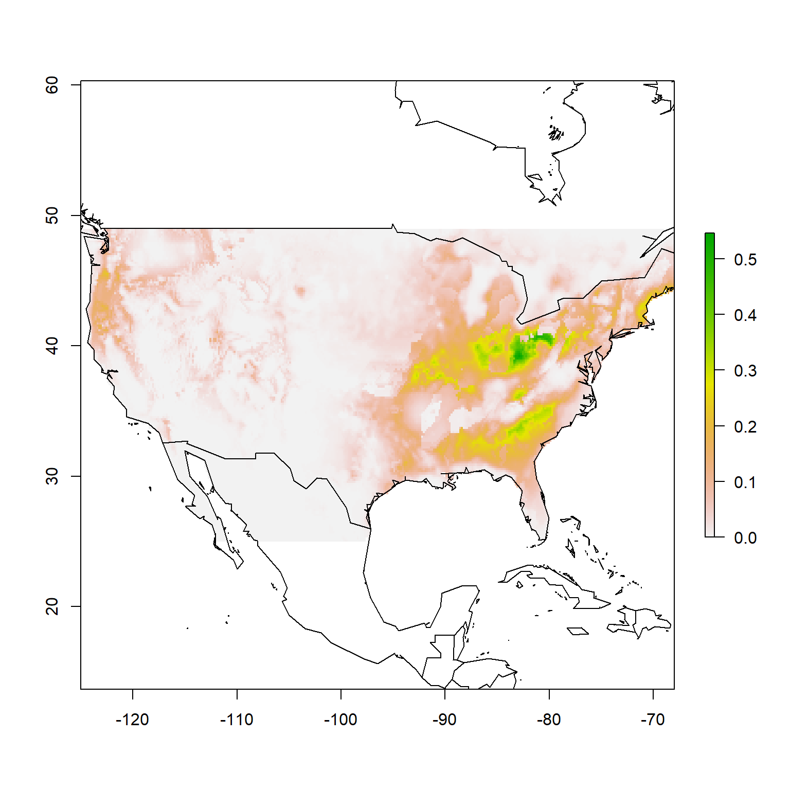</div>


<div class = 'question' id='ques:ds-10'><p class='question-begin'>&#x25BA; Question</p><div class='question-body'><p>Give a brief description of the habitat suitability map, including the maximum probabilities. Describe whether this fit your expectations based on the change in bioclim variables. Describe the shift in habitat suitability relative to our current model.</p><p class='question-end'><span class='fa fa-square-o solution-icon'></span></p></div></div>


How about our A2 climate scenario?


```r
# get list of files
files <- list.files("data/", pattern='^CM10_2100_A2', full.names=TRUE )

# import and convert to raster stack
predictors_A2 <- stack(files)

# create df with just xy coordinates
xy <- occurrence %>%
  select(longitude, latitude)

# crop bioclim data to geographic range
cropped_predictors <- crop(x = predictors_A2, y = geo_range)

# extract values
presence <- raster::extract(cropped_predictors, xy)

# fit the bioclim model
model.fit <- bioclim(presence)

# create raster layer of predicted distribution
prediction <- dismo::predict(x = cropped_predictors, 
                             object = model.fit,
                             ext = geo_range)

# plot model probabilities
plot(prediction,
     xlim = c(min.lon, max.lon),
     ylim = c(min.lat, max.lat),
     axes = TRUE)

# add map
plot(wrld_simpl, add = TRUE, border = "black")

# draw box around it
box()
```

<div class="figure">
<p class="caption">(\#fig:unnamed-chunk-17)Predicted species distribution for Sasquatch in the lower 48 in 2100 (climate scenario A2). Color indicates the probability of encountering Sasquatch in the lower 48 states based on habitat suitability.</p>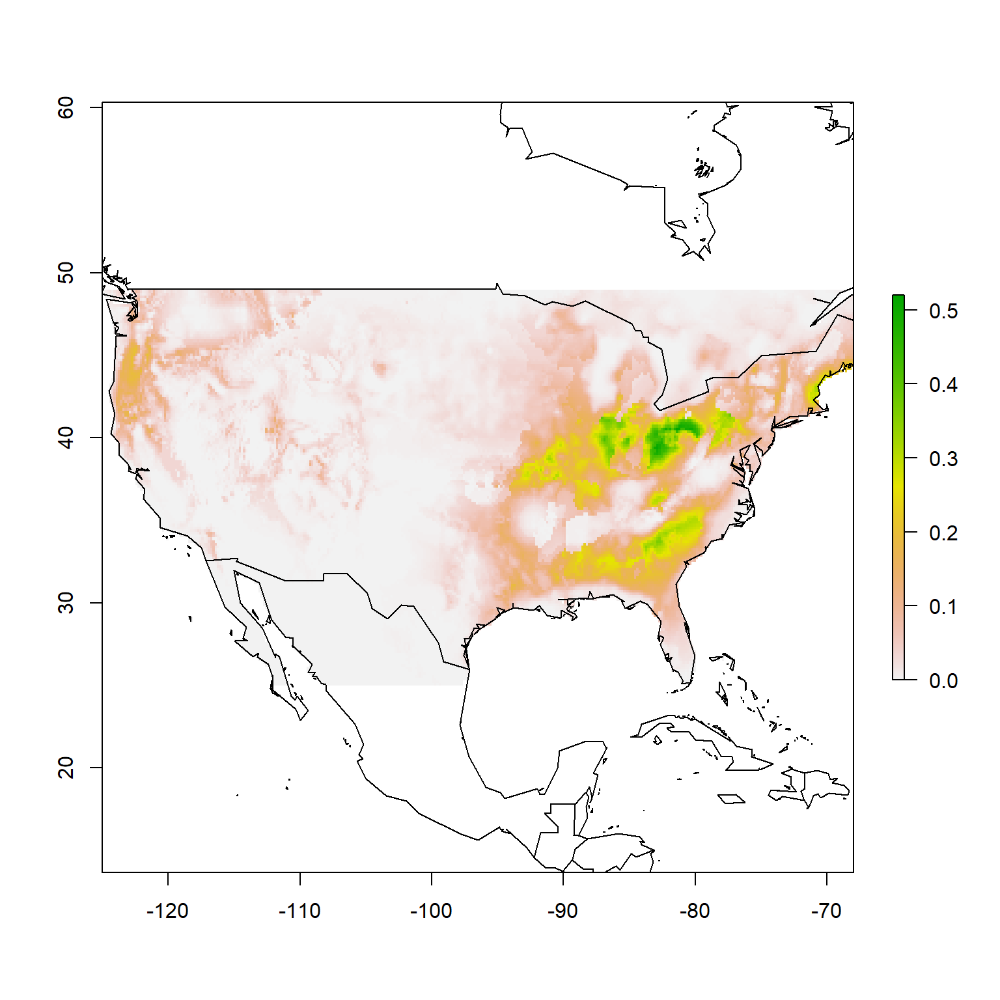</div>


<div class = 'question' id='ques:ds-11'><p class='question-begin'>&#x25BA; Question</p><div class='question-body'><p>Briefly compare this model to the previous two. Comment on whether you expected to see greater or smaller difference to the other future climate prediction based on the scenarios that they are based on.</p><p class='question-end'><span class='fa fa-square-o solution-icon'></span></p></div></div>


<div class = 'question' id='ques:ds-12'><p class='question-begin'>&#x25BA; Question</p><div class='question-body'><p>Discuss whether you think bioclim variables are good models to predict a species' respone to climate change. In your discussion consider how future bioclim data sets are generated, as well as, whether abiotic conditions along will determine range changes.</p><p class='question-end'><span class='fa fa-square-o solution-icon'></span></p></div></div>


## Visualize and Communicate your results

Printing our maps side by side for better comparison would be a good way to visualize and communicate our results. We would probably include a discussion of our our approach (we should probably validate our model too which we haven't done here) and make recommendations based on our findings.


<br>
<br>
<br>
<br>
<br>
<br>
<br>
<br>
<br>

## Acknowledgments

Since I'm not the first person to create a lab/tutorial on species distribution modeling, I drew inspiration from various educators, R and data enthusiasts to shape this tutorial, most notably:

Anna L. Carter. November 2017, posting date. Painting turtles: an introduction to species distribution modeling in R. Teaching Issues and Experiments in Ecology, Vol. 13: Practice #1 [online]. http://tiee.esa.org/vol/v13/issues/data_sets/carter/abstract.html

Wendy L. Clement, Kathleen L. Prudic, and Jeffrey C. Oliver. 16 August 2018, posting date. Exploring how climate will impact plant-insect distributions and interactions using open data and informatics. Teaching Issues and Experiments in Ecology, Vol. 14: Experiment #1 [online]. http://tiee.esa.org/vol/v14/experiments/clement/abstract.html

https://jcoliver.github.io/learn-r/011-species-distribution-models.html


<!--chapter:end:01_IntroDataSci.Rmd-->

---
title: "Data Science for the Natural Environment (FA21)"
subtitle: "BI449 Data Science for the Natural Environment"
author: "Shannon J. O'Leary"
date: "2021-09-24"
knit: "bookdown::preview_chapter"
output:
  msmbstyle::msmb_html_book:
    highlight: tango
    toc: TRUE
    toc_depth: 1
    split_by: chapter
    margin_references: FALSE
    css: msmb.css
bibliography: labmanual.bib
link-citations: yes
---


# Installing R/Rstudio


**Learning Objectives**

After completing this activity you should

* be able to download and install `R` and `Rstudio` on your laptop
* be able to install `Rtools` & `devtools` to be able to compile `R packages` from source (Windows).
* understand the main use for each of the four main panes in the `Rstudio` GUI.
* understand what a package is in `R` and how to install them.


## Install & Set up R and Rstudio on your computer

If you have already installed `R` and `Rstudio` make sure your R version is up to date. Whenever you open `Rstudio` the version will be printed in the console (bottom left pane). In addition, you can always check what version is installed by typing `sessionInfo()` into your console. You should be using version 4.0.0 or later. You do not need to uninstall old version of `R`. If you do have to update, you will need to re-install packages (see below) for R4.0.0

### Windows

**Install R**

* Download most recent version of R for Windows [here](https://cran.r-project.org/bin/windows/base/release.htm).
* Run the `.exe` file that was downloaded and follow instructions in the set-up wizard.


**Install Rtools**

* Download Rtools [here](https://cran.r-project.org/bin/windows/Rtools/rtools40-x86_64.exe).
* Run the downloaded `.exe` file that was download and follow the instructions in the set-up wizard.


**Install Rstudio**

* Go to Rstudio download (page)[http://www.rstudio.com/ide/download/desktop].
* Scroll down to select the `Rstudio` current version for Windows XP/Vista/7/8/10.
* Run the `.exe` file that was downloaded and follow instructions in the set-up wizard.


**Finish setting up Rtools**

* Open `Rstudio` to make sure you aren't getting any error messages.
* Put `Rtools` in your path by typing `writeLines('PATH="${RTOOLS40_HOME}\\usr\\bin;${PATH}"', con = "~/.Renviron")` in the console window.
* Install the `devtools` package by typing `install.packages("devtools")` in the console.


### Mac OS X

**Download & install R**

* Go to (CRAN)[http://cran.r-project.org/], select `Download R for (Mac) OS X`.
* Download the `.pkg` file for your OS X version.
* Run the downloaded file to install `R`.


**Download & install XQuartz** (needed to run some R packages)

* Download [XQuartz](https://www.xquartz.org/)
* Run the downloaded file to install


**Download & install Rstudio**

* Go to Rstudio download [page](http://www.rstudio.com/ide/download/desktop).
* Scroll down to select the `Rstudio` current version for Mac OS X.
* Run the `.exe` file that was downloaded and follow instructions in the set-up wizard.


## Get to know Rstudio

`Rstudio` is an Integrated Development Environment (IDE) that you can use to write code, navigate files, inspect objects, etc. The advantage of using an IDE is that you have access to shortcuts, visual cues, troubleshooting, navigation, and autocomplete help.


### GUI Layout

Open `Rstudio` and identify the four panes in the interface (default layout).

1. **Editor** (top left): edit scripts/other documents, code can be sent directly to the console.
2. **R console** (bottom left): Run code either by directly typing the code or sending it from the editor pane.
3. **Environment/history** (top right): Contains variables/objects as you create them & full history of functions/commands that have been run.
4. **files/plots/packages/help/viewer** (bottom right): Different tabs in this pane wil let you explore files on your computer, view plots, loaded packages, and read manual pages for various functions.

The panes can be customized (`Rstudio -> Preferences -> Pane Layout`) and you can move/re-size them using your mouse.


### Interacting with R in Rstudio

Think of `R` as a language that allows you to give your computer precise instructions (code) to follow.

* **Commands** are the instructions we are giving the computer, usually as a series of functions.
* **Executing** code or a program means you are telling the computer to run it.

There are three main ways to interact with `R` - directly using console, script files (`*.R`), or code chunks embedded in R markdown files (`*.Rmd`).

The console is where you execute code and see the results of those commands. You can type your code directly into the console and hit `Enter` to execute it. You can review those commands in the history pane (or by saving the history) but if you close the session and don't save the history to file those commands will be forgotten.

By contrast, writing your code in the script editor either as a standard script or as a code chunk in an Rmarkdown file allows you to have a reproducible workflow (future you and other collaborators will thank you).

Executing an entire script, a code chunk, or individual functions from a script will run them in the console.

* `Ctrl` + `Enter` will execute commands directly from the script editor. You can use this to run the line of code your cursor is currently in in the script editor or you can highlight a series of lines to execute.
* If you are using an Rmarkdown file you can execute an entire code chunk by pressing the green arrow in the top right corner.

If the console is ready for you to execute commands you should see a `>` prompt. If you e.g. forget a `)` you will see a `+` prompt - `R` is telling you that it is expecting further code. When this happens and you don't know what you are missing (usually it is an unmatched quotation or parenthesis), make sure your cursor is in the console and hit the `Esc` key.

*We will run through these options, but you can always check back here while you are getting used to R*.


### Customize Rstudio

There are several options to customize Rstudio including setting a theme, and other formatting preferences. You can access this using `Tools > Global Options`. I recommend using a dark theme (it's a lot easier on the eyes) and keeping the panes in the same positions as described because it will make troubleshooting a lot easier^["You should see xx in the top left" is a lot more helpful if your top left looks like my top left!].


## Installing and using packages in R

### Install a package

Think of R packages as tool kit comprising a set of functions (tools) to perform specific tasks. `R` comes with a set of packages already installed that gives you base `R` functions; you can view these and determine which have been loaded in the `Packages` tab in the bottom right pane. For other tasks we will need additional packages. ^[Most `R` packages are found in the [CRAN repository](https://cran.r-project.org/) and on [Bioconducter](https://www.bioconductor.org/), developmental packages are available on [github](https://github.com/).]

A central group of packages for data wrangling and processing form the [tidyverse](https://www.tidyverse.org/), described as "... an opinionated collection of R packages designed for data science. All packages share an underlying design philosophy, grammar, and data structures." - We are going to heavily rely on core functions from the tidyverse to wrangle, summarize, and analyze data. 

When you install packages they will be downloaded and installed onto your computer. Determine what your default path is using `.libPaths()` and change if necessary.

The easiest way to install packages is to use the `install.packages()` function. Use the `R` console to install some libraries to get us started (we will install other libraries as needed for other labs).

<label for="tufte-mn-" class="margin-toggle">&#8853;</label><input type="checkbox" id="tufte-mn-" class="margin-toggle"><span class="marginnote"><span style="display: block;">Using <code>#</code> in an R script allows you to insert comments that are ignored by R when executing your code. Use comments to document your code, future you will thank you!</span></span>


```r
# install the rmarkdown package
install.packages("rmarkdown")

# install central packages in the tidyverse
install.packages("tidyverse")

# install additional packages
install.packages("plyr", "ggthemes", "patchwork", "glue")
```

Let's check if you were able to successfully install those packages.


```r
# load library
library(tidyverse)
```

If you don't see any error messages in the console along the lines of `there is no package called ...` you are all set. If you look in the `packages` tab in the lower right panel you should also see that packages such as `dplyr` and `tidyr` (two of the central `tidyverse` packages) now have a little check box next to them.


### Updating R packages

You should generally make sure to keep your `R` packages up to date as new versions include important bugfixes and additional improvements. The easiest way to update packages is to use the `Update` button in the `Packages` tab in the bottom right panel.

**However** be aware that updating packages might break some code you have previously written. For most of what we will be doing this should not be the case. If you used `R` for a previous course, make sure to update you packages at the beginning of this course and we should be set for the semester.

<!--chapter:end:02_SetUpR.Rmd-->

---
title: "Data Science for the Natural Environment (FA21)"
subtitle: "BI449 Data Science for the Natural Environment"
author: "Shannon J. O'Leary"
date: "2021-09-24"
knit: "bookdown::preview_chapter"
output:
  msmbstyle::msmb_html_book:
    highlight: tango
    toc: TRUE
    toc_depth: 1
    split_by: chapter
    margin_references: FALSE
    css: msmb.css
bibliography: labmanual.bib
link-citations: yes
---


# Project management and Rmarkdown Basics

**Learning Objectives**

After completing this tutorial you should

* be able to set up a well structured project.
* understand what a working directory is and how to set up an R project.
* understand the value of using Rmarkdown files to document your work.
* understand the core components of the markdown format.
* be able to use basic markdown syntax to format a document (headers, bold/italics).
* be able to add a code chunk to a `.Rmd` file and add options.
* understand how to modify code chunk options to determine what is/is not rendered in the knitted document.
* know how to `knit` a document to produce an `*.html` file from an `*.Rmd`.


The goal of open science and reproducible research is to make scientific methods, data, and results more transparent, available, and reproducible. `R markdown` files are a useful tool to be able to generate reports documenting your data, methods (code used to process data), and results. Key packages allowing you to do this are `knitr` and `rmarkdown`.
^[Download the R markdown cheat sheet (here)[https://github.com/rstudio/cheatsheets/raw/master/rmarkdown-2.0.pdf].]

`R markdown` (`*.Rmd`) files will let you document your workflow, share how you processed/analyzed your data and the resulting output along with any visualizations. `.Rmd` is a text based file format that consists of standard text, code chunks, and the resulting output using a very simple syntax (henc mark*down* as opposed to mark*up* languages like `html` or `LateX` which have much more complicated syntax). When you knit your document, the code is executed and the resulting output with be included in the rendered document (common formats are `html` or `pdf`). Advantages to a workflow centered around using `R markdown` to document your work include:

* the simple syntax makes it easy to learn the basics (but some of the more advance options will let you create some sophisticated reports).
* resulting files have a simple, standardized formatting that looks professional and is easy to read and understand (code, documentation, figures all in one place).
* future you will be thankful when you don't have to remember your assumptions, individual steps, and modifications.
* easy modification to extend/refine analysis or re-run with updated data.


## Project organization 101

A key component to doing data analysis is organizing your **working directory** which will contain your data, scripts, `Rmarkdown`-files, results, figures, and other output. Keeping this well organized will help you establish a reproducible workflow, collaborate well, and share your results.


### Organizing your files and directories

For each project/lab we will set up a project directory^[We'll use this term interchangeably with working directory and research compendium] with the following set of sub-directories:

* `data`
* `results`
* `scr`


### A note on Naming things

Naming conventions for files, sub-directories etc. should conform to the following key principles^[see Jenny Bryan's [excellent summary](https://speakerdeck.com/jennybc/how-to-name-files?slide=3) of these principles]:

* **Human readable**: keep it short but self-explanatory.
* **Machine readable**: don't use special characters of spaces.
* **Sortable**: standardize components of the file names to make it possible to sort files and find what you are looking for.


### Set up your project directory using Rprojects

Create a project directory
^[Yes, a directory is essentially a folder, however when using the term directory we are considering the relationship between a folder and it's full path.]
(e.g. `IntroR`) on your computer, within that directory create sub-directories `data`, `results`, `scr`.

Now, we are going to create an `R project` within this directory.

* in the top right hand corner click on the project icon
* select `New Project` and `Create in existing directory`; follow the prompts.

This should create a new `R project` and open it (the `R project` name should be in the top right corner next to the icon).

If you look in the bottom right hand pane in the `Files` tab, the bread crumbs should lead to your project folder which has now become your `working directory`, i.e. all paths are relative to this location. ^[If you weren't working with an `R project`, you can set your working directory by naviating to your new working director and selecting `More > Set as working directory`.] If you navigate away from your `working directory` (project directory) you can quickly get back to your project directory by clicking on the project icon in the `Files` pane or by clicking the cog icon (`More`) and selecting `Go to Working Directory`.


## Create your first .Rmd file

Create a new `.Rmd` file using `File -> New File -> R Markdown` and save that file in your project directory as **Lastname_IntroR.Rmd**.

We'll break down the components of the `.Rmd` file in just a second but to give you the full experience hit the `Knit HTML` button to render an `html` document.

Cool beans, now to the knitty-gritty.


## Structure of an Rmarkdown File

An `Rmarkdown`-file consists of three components:

1. **Header**: written in `YAML` format the header contains all the information on how to render the `.Rmd` file.
2. **Markdown Sections**: written in (Rmarkdown syntax)[https://rmarkdown.rstudio.com/authoring_basics.html].
3. **Code chunks**: Chunks of `R` code. These can be run interactively (e.g. while generating your document) and will be rendered when knitting the document.


## YAML header

The header is written in (YAML syntax)[https://en.wikipedia.org/wiki/YAML], it begins and ends with `---` with four default elements that will determine how the document is knitted.

```

---
title: "title"
author: "name"
date: "Date"
output: html_document
----

```

Customize your `.Rmd`:Change the title and add your name in the author line. Changing the date to `` `r Sys.Date()` `` will automatically include the current date when you render the document. Leave the default output setting.


## Markdown sections

Your markdown sections can contain any text you want using the markdown syntax; once you render the `.Rmd` the resulting (`html`) file will appear as text.

Most of your text (without syntax) will appear as paragraph text but you can add additional syntax to format it in different ways. Check the official documentation for the [basics](https://rmarkdown.rstudio.com/authoring_basics.html).


## Code chunks

Code chunks contain your R code and start and end with three back ticks; `{r}` determines that the code chunk should be interpreted as `R` code.

```` ```{r} ````


```` ``` ````


You can add a code chunk using `Ctrl` + `Alt` + `I` or `Code -> Insert Chunk`. You can run code chunks line by line using `Ctrl` + `Enter` or you can run the entire chunk by clicking the `Run` button or the little green arrow in the top right corner of an `R` chunk.

Use `#` to comment your code, any lines following a `#` will not be run by R, you can use them to describe what your code is doing.

You can add options to each code chunk to customize how/if a chunk is executed and appears in the rendered output. These options are added to within the curly brackets. The three most common code chunk options are:

* `eval=FALSE`: results in code chunk not being evaluated or run though it will still be rendered in the knitted document.
* `echo=FALSE`: This will hide the code in the output though the generated output will still be rendered for the knitted document.
* `results=hide`: This will result in the chunk being evaluated though neither the results or the code will be rendered in the knitted document.

Multiple options can be applied to the same chunk; find additional options (here)[http://yihui.name/knitr/demo/output/].


## Render your document using knitr

`knitr` is an `R` package used to render `R markdown` files to another format (usually `html` or `pdf`). In Rstudio the most straightforward way of knitting a document is using the `Knit HTML` button. This will open a new tab in your console title R Markdown that will show the knitting process; any errors that occur with show up here along with a line number so you can determine where the error is occurring in your `.Rmd` file to troubleshoot the issue. The output will automatically be saved in your working directory.


## Some advanced options

You can add images to an `R markdown` as follows ^[make sure the path to your image is relative to your `.Rmd` file; e.g create a `images` subdirectory in your project directory.]:

```


```

You can stylize your rendered document by modifying the `YAML` header to include a table of contents like this^[the option of `toc_depth` determines how many levels are included in the table of contents, e.g. here headers at level 1 and 2 will be included]:

```
---
title: "A table of contents?!"
output:
  html_document:
    toc: true
    toc_depth: 2
---
```

If you really want to jazz things up, you can change the theme^[you can choose from various options [here](https://bootswatch.com/3/)].

```
---
title: "A snazzy theme?!"
output:
  html_document:
    theme: flatly
    toc: true
    toc_depth: 2
---
```

For being so simple, `Rmarkdown` is quite powerful - how powerful you ask? This lab manual was written in `Rmarkdown`.

<!--chapter:end:03_Rproj.Rmd-->

---
title: "Data Science for the Natural Environment (FA21)"
subtitle: "BI449 Data Science for the Natural Environment"
author: "Shannon J. O'Leary"
date: "2021-09-24"
knit: "bookdown::preview_chapter"
output:
  msmbstyle::msmb_html_book:
    highlight: tango
    toc: TRUE
    toc_depth: 1
    split_by: chapter
    margin_references: FALSE
    css: msmb.css
bibliography: labmanual.bib
link-citations: yes
---


# R: Functions, Objects, Vectors - oh my!

**Learning Objectives**

After completing this tutorial you should be able to

* name, create, and assign values to objects.
* save a series of commands/code as an `R script`.
* use comments to describe your code/scripts.
* call `functions` and modify the default options using their `arguments`.
* understand what a `vector` is and distinguish between the main data types.
* to inspect, subset, and extract their content from a `vector`. 
* understand how `data.frames` and `vectors` relate.


## R is all about `Objects`

You can think of the `R console` as a super-powerful calculator. You can get output from `R` by simply typing math directly into the console.


```r
13 + 29
```

```
## [1] 42
```

or 


```r
546 / 13
```

```
## [1] 42
```

Well that's fun - but not super helpful. 

For us to get to the good stuff we need to assign `values` to `objects`. Creating an `object` is straightforward. First, we give it a name, then we use the `assignment operator` to assign it a `value`.

The `assignment operator` (`<-`) assigns the `value` on the right of the `<-` to the `object` on the left.


```r
fork_length_mm <- 344
```

Type that into the console and execute the command using `Enter`. If you look at your `Global Environment` (top right panel) you should now see `forklength` and the `value` you assigned it.

Notice, how when you assigned a `value` to your new `object` nothing was printed in the console compared to when you were typing in math.

To print the `value` of an `object` you can type the name of the object into the console.


```r
# print value
fork_length_mm
```

```
## [1] 344
```

Now that `fork_length` is in your environment we can use it to compute instead of the `value` itself.

For example, we might need to convert our fork length from millimeters (mm) to centimeters (cm).


```r
fork_length_mm / 10 
```

```
## [1] 34.4
```

We can change the `value` of an `object` any time by assigning it a new one. Changing the `value` of one `object` does not change the `values` of other objects.


```r
fork_length_mm <- 567
```


<div class = 'question' id='ques:R-1'><p class='question-begin'>&#x25BA; Question</p><div class='question-body'><p>Create a new object with the fork length in centimeters. Then change then change the value of our fork length in millimeters object to 50. What do you think the value of fork_length_mm will be now?</p><p class='question-end'><span class='fa fa-square-o solution-icon'></span></p></div></div>


**More thoughts on naming things**^[You will soon discover that coding is 90% naming things.]

Theoretically, we can name objects anything we want - but before that gets out of hand let's think about some guidelines for naming objects.

* Make them simple, specific, and not too long (otherwise you will end up with a lot of typing to do and difficulties remembering which object is which).
* Object names cannot start with a number.
* R is case sensitive, `fork_length` is not the same as `Fork_Length`.
* Avoid using dots (`.`) in names. Typically dots are used in function names and also have special meaning (methods) in R.
* Some names are already taken by fundamental functions (e.g. `if`, `else`, `for`) and cannot be used as names for objects; in general avoid using names that have already been used by other function names.
* Rule of thumb: nouns for object names, verbs for function names.

Using a consistent style for naming your objects is part of adopting a consistent styling of your code - this will make following your code a lot easier for yourself and others. This includes things like spacing, how you name objects, and upper/lower case.


## Saving your work

So far, we have inputed all of our code directly into the `console`. If you scroll up in the `console` you will find that all the commands and results from your current R session are still in the console. Using `Ctrl + L` will clear the entire console.

Uh-oh - what if we need to go back over the code we just cleared?

Well, for one if you check the `History` tab in the top right panel you will see that all your commands have been recorded. If you highlight one of them and either click on `To Console` or hit `Enter` it will send it directly to the console.

Usually your history will be saved automatically when you close R/end an R session (unless you have changed the settings) and it will be restored when you open R again. You can use the broom icon to clear your entire history.

Uh-oh - now what do we do?

In general, you should only be typing code directly into the console for quick queries but since usually we want to be able to revisit and share our work you will want to be able to save your work in an `R script` (`*.R`) or include it in an `Rmarkdown` file (`*Rmd`) as a code chunk. For this course we will mostly be operating with `Rmarkdown` files.

You can open a new `R script` using `Ctrl + Shift + C` or using `File > New File > R Script`. This will open an R script in a new tab in the top left pane.

Save your `R script` using `Ctrl + S` or `File > Save As` - this will open a dialogue box for you to save your `R script` with the file extension `.R`.

`Ctrl` + `Enter` will execute commands directly from the script editor You can use this to run the line of code your cursor is currently in in the script editor or you can highlight a series of lines to execute. You can also run all the code in a script by clicking on the `Run` button.

Create a new `R script` to keep track of the rest of the things we will learn today.


## Using comments

You can add comments to your `R scripts` using `#`. Essentially, once you type an `#` in a line anything to the right of it will be ignored.

This is really helpful as it will allow you to comment your script, i.e. you can leave yourself and other notes and explanations as to what your code is doing. This is especially helpful if you come back to some of your code after a period of time, if you are sharing your code with others, and when you are debugging code. You will find that as you become more experienced your comments will become shorter and more concise and you might even be tempted to leave them out completely - don't!

For example you might find a comment like this more helpful at the moment:


```r
# assign value to new object total length
fork_length <- 436
```

But soon you'll find this just as helpful:


```r
# total length fish
fork_length <- 436
```


<div class = 'question' id='ques:R-2'><p class='question-begin'>&#x25BA; Question</p><div class='question-body'>


What do you expect the value of the object `total_length` to be after executing this command?


```r
FL <- 436  # total length fish
```


<p class="question-end"><span class="fa fa-square-o solution-icon"></span></p></div></div>


You can comment/uncomment multiple lines at once by highlighting the lines you want to comment (or uncomment) and hitting `Ctrl + Shift + C`. This can be useful if you are playing around with code and don't want to delete something but don't want it to be run either.


## Functions

When we installed `R packages` earlier we mentioned that they are sets of predefined `functions`. These are essentially mini-scripts that automate using specific sets of commands. So instead of having to run multiple lines of code (this can be 10s - 100s of lines code) you *call* the function instead.

Each function usually requires multiple inputs (*arguments*) and once executed return a `value` (though this is not always the case).

For example the function `round()` can be used to round a number^[This is an excellent example of naming things well!].


```r
fork_length_cm <- round(34.8821)
```

If we print the value of our object we see the following value is returned.


```r
fork_length_cm
```

```
## [1] 35
```
For this function the input (argument) is a number and the returned value is also a number. This is not always the case, arguments can be numbers, objects, file paths ...

Many functions have set of arguments that alter the way a function operates - these are called `options`. Generally, they have a default value which are used unless specified otherwise by the user.

You can determine the arguments as function by calling the function `args()`.


```r
args(round)
```

```
## function (x, digits = 0) 
## NULL
```

Or you can call up the help page using `?round` or by typing it into the search box in the `help` tab in the lower right panel.

For example, our `round()` function has an argument called `digits`, we can use this to specify the number of significant digits we want our rounded value to have.


```r
round(34.8821, digits = 2)
```

```
## [1] 34.88
```

If you provide the arguments in the exact same order as they are defined you do not have to specify them.


```r
round(34.8821, 2)
```

```
## [1] 34.88
```

And you can switch their order if you do.


```r
round(digits = 2, x = 34.8821)
```

```
## [1] 34.88
```

Good code style is to put the non-optional arguments (frequently the object, file path or value you are using) first and then specify the names of all the optional arguments you are specifying. This provides clarity and makes it easier for yourself and others to follow your code. Occasionally you might even want to use comments to further specify what each argument is doing or why you are choosing a specific option.


```r
round(34.8821,
      digits = 2)  # specify number of significant digits
```

```
## [1] 34.88
```


## Vectors (data types I)

Now that we've figured out what objects and functions are let's get to know the two data types we will be spending the most time with this semester - `vectors` and data frames (`data.frame`)^[Other data types include lists (`list`), factors (`factor`) matrices (`matrix`),  and arrays (`array`); we'll introduce those later on.].

The most simple data type in R is the (atomic) `vector` which is a linear vector of a single type. There are six main types -

* `character`: strings or words.
* `numeric` or `double`: numbers.
* `integer`: integer numbers (usually indicated as `2L` to distinguish from `numeric`).
* `logical`: `TRUE` or `FALSE` (i.e. boolean data type).
* `complex`: complex numbers with real and imaginary parts (we'll leave it at that).
* `raw`: bitstreams (we won't use those either).

You can check the data type of any object using `class()`.


```r
class(fork_length)
```

```
## [1] "numeric"
```

Currently, our `fork_length` object consists of a single value. The function `c()` (concatenate) will allow us to assign a series of values to an object.


```r
fork_length <- c(454, 234, 948, 201)

fork_length
```

```
## [1] 454 234 948 201
```


<div class = 'question' id='ques:R-3'><p class='question-begin'>&#x25BA; Question</p><div class='question-body'><p>What data type do you expect this vector to be?</p><p class='question-end'><span class='fa fa-square-o solution-icon'></span></p></div></div>


We call the same function to create a `character vector`.


```r
sharks <- c("bullshark", "blacktip", "scallopedhammerhead")

class(sharks)
```

```
## [1] "character"
```

The quotes around `"bullshark"` etc. are essential because they indicate that this is a character. If we do not use quotes, R will assume that we are trying to call an object.

```

bullshark

```

Since these objects don't exist, we will just get an error message.

You can use `c()` to combine an existing object with additional elements (assuming they are the same data type).


```r
species <- c(sharks, "gafftop")

species
```

```
## [1] "bullshark"           "blacktip"            "scallopedhammerhead" "gafftop"
```
Next to `class()` there are other helpful functions to inspect the content of a vector. For example `length()` will tell you how many elements are in a particular vector.


```r
length(fork_length)
```

```
## [1] 4
```

The function `str()` will give you an overview of the structure of any object and its elements.


```r
str(fork_length)
```

```
##  num [1:4] 454 234 948 201
```
Recall, that an atomic vector is a linear vector of *a single type* - what does that mean. Let's take a look at what happens if we create atomic vectors where we mix the data types.


```r
numeric_character <- c(1, 2, 3, "a")
numeric_logical <- c(1, 2, 3, TRUE)
character_logical <- c("a", "b", "c", TRUE)
wtf <- c(1, 2, 3, "4")
```


<div class = 'question' id='ques:R-4'><p class='question-begin'>&#x25BA; Question</p><div class='question-body'><p>Describe what happens when data types are mixed in a single atomic vector?</p><p class='question-end'><span class='fa fa-square-o solution-icon'></span></p></div></div>


We already discovered that we can combine vectors - but can we extract certain components from vectors? Indeed, there are a variety of ways that we can subset vectors.

The most simple way is using square brackets to indicate which element (or elements) we can't extract. In R, indices start at 1.^[This is not the case for all programming languages, e.g. Perl, Python, or C++ start with 0.]


```r
# extract second element
species[2]
```

```
## [1] "blacktip"
```

```r
# extract fourth and second element
species[c(4, 2)]
```

```
## [1] "gafftop"  "blacktip"
```
You can also repeat indices to create a new object with additional elements.


```r
species_longer <- species[c(2, 2, 4, 3, 4, 4, 1, 1)]

species_longer
```

```
## [1] "blacktip"            "blacktip"            "gafftop"             "scallopedhammerhead" "gafftop"            
## [6] "gafftop"             "bullshark"           "bullshark"
```

More frequently, we will want to extract certain elements based on a specific condition (conditional subsetting). 

This is done using a logical vector, here `TRUE` select the element with the same index and `FALSE` will not.


```r
fork_length <- c(454, 234, 948, 201)

# use logical vector to subset
fork_length[c(TRUE, FALSE, TRUE, FALSE)]
```

```
## [1] 454 948
```

This seems like a very impractical option but normally we would not create the logical vector by hand as we have done here, rather it will be the output of a function or logical test. For example, we might want to identify fish with a fork length > 300mm.


```r
# identify fish with fork length > threshold
fork_length > 300
```

```
## [1]  TRUE FALSE  TRUE FALSE
```
We can use this to subset our vector directly.


```r
fork_length[c(fork_length > 300)]
```

```
## [1] 454 948
```
There are a series of `boolean expressions`^[logical statements that are either true or false] we can use for subsetting vectors. Most of them you are probaly already familiar with because math.

* `>` and `<` (greater/less than)
* `=>` and `=<` (equal to or greater/less than)
* `==` (equal to) and `!=` (is not equal to)

You can combine to **boolean expressions** using `&`, (**both** conditions must be met) and `|` (at least one condition must be met).


<div class = 'question' id='ques:R-5'><p class='question-begin'>&#x25BA; Question</p><div class='question-body'>


Let's give this a whirrl.

Subset the `fork_length` vector to 

* contain only values equal to 234
* contain all values but 948
* contain all values larger than 230 but smaller than 900
* contain all values smaller than 250 or larger that 900


<p class="question-end"><span class="fa fa-square-o solution-icon"></span></p></div></div>


R is set apart from other programming languages because it was designed to analyze data^[some people will argue that it is a 'statistical language' rather than a true programming language ... don't listen to them!] it has straightfoward ways to deal with missing data (`NA` or `na` values) because those are quite common in real world data sets.

Let's create a vector with a missing value.


```r
total_length <- c(560, NA, 1021, 250)
```

Let's say we want to calculate the mean value.


```r
mean(total_length)
```

```
## [1] NA
```
Most functions will return `NA` when doing operations on objects with missing values. As such, many functions include an argument to omit missing values.


```r
mean(total_length, na.rm = TRUE)
```

```
## [1] 610.3333
```

Other functions that are helpful to deal with missing values are `is.na()`, `na.omit()`, and `complete.cases()`.


<div class = 'question' id='ques:R-6'><p class='question-begin'>&#x25BA; Question</p><div class='question-body'><p>Run each of these functions on our total_length vector and describe what they do.</p><p class='question-end'><span class='fa fa-square-o solution-icon'></span></p></div></div>

 


## Data frames (data types II)

Recall that **atomic vectors** are *linear* vectors of a simple type, essentially they are one dimensional. Frequently we will be using data frames (`data.frame`) which you can think of as consisting of several vectors of the same length where each vector becomes a column and the elements are the rows.

Let's create a new object that is a dataframe with three columns containing information on species, fork length, and total length.


```r
# combine vectors into data frame
catch <- data.frame(species, fork_length, total_length)
```

You should now see a new object in your `Global Environment` and you will now also see that there are two categories of objects `Data` and `Values`. You will see that the `data.frame` is described as having 4 obs (observations, those are your rows) of 3 variables (those are your columns). If you click on the little blue arrow it will give you additional information on each column - note that because each column is essentially a vector, each one must consist of a single data type which is also indicated.

Calling the `str()` will give you the same information.


```r
str(catch)
```

```
## 'data.frame':	4 obs. of  3 variables:
##  $ species     : chr  "bullshark" "blacktip" "scallopedhammerhead" "gafftop"
##  $ fork_length : num  454 234 948 201
##  $ total_length: num  560 NA 1021 250
```

You can further inspect the `data.frame` by clicking on the little white box on the right which will open a tab in the top left panel next to your R script. You can also always view a `data.frame` by calling the `View()` function.


```r
View(catch)
```

This can be a helpful way to explore your `data.frame`, for example, clicking on the headers will sort the data frame by that column. Usually we won't build or `data.frames` by hand, rather we will read them in from e.g. a tab-delimited text file - but more on that later.

<!--chapter:end:04_IntroR.Rmd-->

---
title: "Data Science for the Natural Environment (FA21)"
subtitle: "BI449 Data Science for the Natural Environment"
author: "Shannon J. O'Leary"
date: "2021-09-24"
knit: "bookdown::preview_chapter"
output:
  msmbstyle::msmb_html_book:
    highlight: tango
    toc: TRUE
    toc_depth: 1
    split_by: chapter
    margin_references: FALSE
    css: msmb.css
bibliography: labmanual.bib
link-citations: yes
---


# Identifying essential fish habitat: Shark Nurseries on the Texas coast

**Learning Objectives**

After completing this activity you should be able to

* define essential fish habitats and shark nurseries.
* understand how differences in methodology can affect a data set.

For each of our modules we will have a project-folder with an `Rproject`, `*.Rmd`-files, and sub-directories for data, scripts, and results as described in our `Rproject` Tutorial. You should create a directory on your Desktop or Documents folder on your laptop (name it something like `BI449`) as a home directory for all of our project folders this semester. 

Download the [SharkNurseries](https://drive.google.com/drive/folders/1FexsfMkoBfPEeAkOCd2ZQrQqVBOF4WOR?usp=sharing) project folder. Once you have downloaded it, unzip the project directory into your `BI449` directory. You can open the `Rproj` for this module either by double clicking on it which will launch `Rstudio` or by opening `Rstudio` and then using `File > Open Project` or by clicking on the `Rproject` icon in the top right of your program window and selecting `Open Project`. 

Once you have opened a project you should see the project name in the top right corner^[Pro tip: If you run into issues where an Rmarkdown won't render or file paths aren't working (especially if things were working previously) one of your first steps should be to double check that the correct `Rproj` is loaded.].

You should have a `SharkNurseriesIntro.Rmd` in your project directory. Use that file to work through this tutorial - you will hand in your rendered ("knitted") rmarkdown file as your homework assignment. So, first thing in the `YAML` header, change the author to your name. You will use this `Rmarkdown` file to record your answers. Remember to use comments to describe your code; at minimum you should have one comment per code set^[You should do this whether you are adding code yourself or using code from our manual, even if it isn't commented in the manual ... you may of course add as many comments as you need to be able to recall what you did].


## Essential fish habitat: Shark Nurseries

The [Magnuson-Stevens Act](https://www.federalregister.gov/documents/2002/01/17/02-885/magnuson-stevens-act-provisions-essential-fish-habitat-efh) (1996) defined essential fish habitat as "those waters and substrate necessary to fish for spawning, breeding, feeding or growth to maturity", i.e. they are habitats necessary for an organism to complete their life cycle. Identifying essential fish habitats is critical for management and conservation plans because it enables policy makers to prioritize certain ecosystems.

While some elasmobranchs (sharks, rays, skates) inhabit estuaries year round, many use the estuaries for specific purposes such as feeding, mating, gestation, parturition or as nurseries and only inhabit them during specific life history stages. Estuaries are heavily impacted by humans - overfishing, pollution, habitat destruction and altered flow regimes all affect the biological communities they support.

Broadly, shark nurseries are areas where young are born and/or reside in during maturation. Typically, these would areas that provide additional protection (e.g. mangroves for hiding) and plenty of food. Heupel et al. [@Heupel2007, Heupel2019] developed three criteria to defining shark nurseries as 

1. an area where sharks are commonly encountered within compared to outside of.
2. an area in which Young-of-the-year (YOY)/juveniles remain or return to for extended periods of time.
3. an area that is repeatedly used across years.


<div class = 'question' id='ques:sh-1'><p class='question-begin'>&#x25BA; Question</p><div class='question-body'><p>Consider how you could design a study to identify estuaries that are shark nurseries.</p><p class='question-end'><span class='fa fa-square-o solution-icon'></span></p></div></div>


## Identifying shark nurseries on the Texas Coast

Texas Parks and Wildlife (TPWD) defines eight major estuaries along the Texas coastline and performs regular shore-based gill net surveys for 10 week periods in April - June and September to November. Analysis of this survey has identify eight elasmobranch species [@Plumlee2018].

* Bull shark
* Bonnethead
* Cownose ray
* Blacktip shark
* Atlantic stingray
* Atlantic sharpnose shark
* Spinner shark
* Scalloped hammerhead 
* Finetooth shark
* Lemon shark

Gill nets generally exclude individuals > 2m.

More recently, a multi-year open water long-lining study targeting elasmobranchs was performed in three estuarine locations near Corpus Christi, TX that are considered putative shark nurseries. Here, the sampling period lasted from May to November [@Swift2020].


<div class = 'question' id='ques:sh-2'><p class='question-begin'>&#x25BA; Question</p><div class='question-body'><p>Discuss whether or not you would expect to get similar results from both studies and what factors could result in differences.</p><p class='question-end'><span class='fa fa-square-o solution-icon'></span></p></div></div>


<div class = "msmb-solution"><p class="solution-begin">&#x25BA; Solution<span id='sol-start-2' class="fa fa-plus-square solution-icon clickable" onclick="toggle_visibility('sol-body-2', 'sol-start-2')"></span></p><div class="solution-body" id = "sol-body-2" style="display: none;">


Here are some things to consider: 

* gear-bias (hook size, net-size)
* seasonality (peak use for many coastal elasmobranchs is May - Oct)
* spatial (land-based vs open ocean)


<p class="solution-end"><span class="fa fa-square-o solution-icon"></span></p></div></div>


This study wanted to answer four questions to further understand whether these locations should be considered shark nurseries and therefore as essential fish habitat for specific elasmobranch species.

1. How does the composition of elasmobranch communities compare across sites?
2. How does the catch-per-unit-effort (CPUE) per species and life history compare across sites?
3. What do the sex ratios look like?
4. What environmental predictors can we use to predict presence of elasmobranchs?


## Explore the data set

There should be a an excel file in the `data` folder of your project directory named `longline_catchdata.xlsx`. Go ahead and open the file in excel.


<div class = 'question' id='ques:sh-3'><p class='question-begin'>&#x25BA; Question</p><div class='question-body'><p>Take a look at the excel file and describe how you would figure out what the dimensions are (how many rows? columns?) and see if you identifying what information is contained in each column.</p><p class='question-end'><span class='fa fa-square-o solution-icon'></span></p></div></div>


<div class = "msmb-solution"><p class="solution-begin">&#x25BA; Solution<span id='sol-start-3' class="fa fa-plus-square solution-icon clickable" onclick="toggle_visibility('sol-body-3', 'sol-start-3')"></span></p><div class="solution-body" id = "sol-body-3" style="display: none;"><p>The data set contains information on the sampling site, Species name, Sex, life history stage, Pre-caudal length (PCL), fork length (FL), stretch total length (STL), Hook Size, and the set number and sampling date.</p><p class="solution-end"><span class="fa fa-square-o solution-icon"></span></p></div></div>


While some column headers were probably more easy to identify than others a good data set comes with meta data - this is data about the data. At minimum it should contain detailed information on what is contained in each column, frequently it may also contain information on how certain data was calculated/generated.

Now that we're looking at the data set we might as well take a stab at the first question.

> How does the composition of elasmobranch communities compare across sites?


<div class = 'question' id='ques:sh-4'><p class='question-begin'>&#x25BA; Question</p><div class='question-body'>


Use your excel skills to create sets of summary tables

* Total catch by site:
    + total number of individuals per elasmobranch species caught at each site (across all years).
    + relative abundance of each elasmobranch species caught per site.
* Differences in catch across sites and years:
    + total number of individuals per elasmobranch species per site and year.
    + relative abundance per of each elasmobranch species per site and year.
* Summary stats size:
    + mean size of sharks (exclude rays) by site.
    + minimum size per shark species by site.
    + maximum size per shark species by site.


<p class="question-end"><span class="fa fa-square-o solution-icon"></span></p></div></div>


<div class = 'question' id='ques:sh-5'><p class='question-begin'>&#x25BA; Question</p><div class='question-body'><p>Imagine that just as you finished creating these summary stats tables your lab mate comes in tells you that they just discovered three data sheets in a drawer that wasn't entered in with the other data. How easy would it be to update your results tables? Consider disadvantages of using Excel to analyze your data in this way.</p><p class='question-end'><span class='fa fa-square-o solution-icon'></span></p></div></div>


## Export as text file

Our next step is to learn how to use `R` to wrangle data, this can include both cleaning up your data to put it into a standard format or analysis as well as using a raw data set to generate a data sets based of off them for further analysis or summarize results.

Two of the most common file formats you are going to encounter when you access or download data sets are `*.csv` (comma-delimited files) and tab-delimited files (`*txt`); both of these are straightforward to read into `R`. You can convert your excel file into these formats by using `File > Save As` and then selecting the appropriate file formats.


<div class = 'question' id='ques:sh-6'><p class='question-begin'>&#x25BA; Question</p><div class='question-body'><p>Go ahead and save a csv and tab-delimited formatted version of our data set in your data folder. Then open those files in a text editor and describe the difference between the two formats and briefly discuss the advantages of storing large data sets in these formats over a typical excel file.</p><p class='question-end'><span class='fa fa-square-o solution-icon'></span></p></div></div>


<!--chapter:end:05_SharkNurseriesIntro.Rmd-->

---
title: "Data Science for the Natural Environment (FA21)"
subtitle: "BI449 Data Science for the Natural Environment"
author: "Shannon J. O'Leary"
date: "2021-09-24"
knit: "bookdown::preview_chapter"
output:
  msmbstyle::msmb_html_book:
    highlight: tango
    toc: TRUE
    toc_depth: 1
    split_by: chapter
    margin_references: FALSE
    css: msmb.css
    includes:
     in_header: header.html
bibliography: labmanual.bib
link-citations: yes
editor_options: 
  chunk_output_type: console
---


# Intro to data frames

**Learning Objectives**

After completing this tutorial you should be able to

* read a data from a csv or tab-delimited file into R as a `data.frame`.
* describe what a `data.frame` is.
* inspect the contents of a data frame to summarize the content.
* write a `data.frame` to file.

You should have a `DataFrames.Rmd` in your project directory. Use that file to work through this tutorial - you will hand in your rendered ("knitted") rmarkdown file as your homework assignment. So, first thing in the `YAML` header, change the author to your name. You will use this `Rmarkdown` file to record your answers. Remember to use comments to describe your code; at minimum you should have one comment per code set^[You should do this even if you are adding code yourself or if you are using code from our manual, even if it isn't commented in the manual ... you may of course add as many comments as you need to be able to recall what you did].

Let's start by loading the packages we will need for this activity.


```r
# load libraries
library(knitr)
library(tidyverse)
```


## Reading data into R

`library(tidyverse)` is actually loading a set of packages used for data science that share a common design philosophy, and "grammar". One of the packages we loaded is called `readr` which contains functions for reading in and parsing files.


<div class = 'question' id='ques:df-1'><p class='question-begin'>&#x25BA; Question</p><div class='question-body'><p>Use ?read_delim to pull up the help page for the function we will using and explore the arguments. How do you think we read in our csv file?</p><p class='question-end'><span class='fa fa-square-o solution-icon'></span></p></div></div>


<div class = "msmb-solution"><p class="solution-begin">&#x25BA; Solution<span id='sol-start-4' class="fa fa-plus-square solution-icon clickable" onclick="toggle_visibility('sol-body-4', 'sol-start-4')"></span></p><div class="solution-body" id = "sol-body-4" style="display: none;">


`read_delim` has two required arguments, the **path** (`data/longline_catchdata.csv`) which tells `R` where your file is located and the **delimiter** in this case a comma (`,`) tells `R` how columns are separated from each other.


```r
# read catch data
catch <- read_delim("data/longline_catchdata.csv", delim = ",")

catch %>%
  distinct(Species)
```

As we access data sets that are not as "clean" as the one we have hear, you will find that some of the other arguments will come in handy - but don't worry about those for now.


<p class="solution-end"><span class="fa fa-square-o solution-icon"></span></p></div></div>


Execute the code. If you look over in your environment pane you should now see the object `catch`. This is your dataframe. Click on it, you should see the command `View(catch)` in your console and a tab `catch` appear in your top left pane.


<div class = 'question' id='ques:df-2'><p class='question-begin'>&#x25BA; Question</p><div class='question-body'><p>Based on how you read in the csv file how would you read in the tab-delimited version?</p><p class='question-end'><span class='fa fa-square-o solution-icon'></span></p></div></div>


<div class = "msmb-solution"><p class="solution-begin">&#x25BA; Solution<span id='sol-start-5' class="fa fa-plus-square solution-icon clickable" onclick="toggle_visibility('sol-body-5', 'sol-start-5')"></span></p><div class="solution-body" id = "sol-body-5" style="display: none;">


We need to change delimiter - `\t` is "computer" for tab. 


```r
# read catch data
catch <- read_delim("data/longline_catchdata.txt", delim = "\t")
```

Another delimiters you might encounter are white space (`" "`) but technically it could be anything. 


<p class="solution-end"><span class="fa fa-square-o solution-icon"></span></p></div></div>


When you loaded your data set you should have seem an message along the lines of `parsed with column specification` and information on the number of columns and their data type. What this means is that `read_delim()` looks through the first 1,000 rows for each column and guesses the data type - usually this works pretty well though occasionally we will have to either specify the data types manually (`col_types` argument) or convert the data type later on.

Let's use `class()` to figure out what type of object we are dealing with.


```r
class(catch)
```

```
## [1] "spec_tbl_df" "tbl_df"      "tbl"         "data.frame"
```
You can see that this object actually has multiple classes attached to it. The last one in the list is `data.frame` which is the standard format for (rectangular) tabular data.

Recall from our tutorial on vectors that each column in a `data.frame` is an atomic vector, they must all have the same length (hence, "rectangular") and each must contain the same data type (character,s integers, ...).

The other three have the same basic properties as a `data.frame` along with some additional features. The `tbl` (pronounced tibble) was designed to be at the center of the `tidyverse` which means that when you use `readr` functions it will automatically be read in as a tibble and `data.frame`. If you do some exploring and/or troubleshooting on the web you will likely run into tibbles but for our intents of purposes we will use `data.frame`.


## Inspect your `data.frame`


<div class = 'question' id='ques:df-3'><p class='question-begin'>&#x25BA; Question</p><div class='question-body'>


There are several functions that you can use for a preliminary inspection of your data, including figuring out what dimensions it has and what information is contained in your data set.

Call the following functions on your object and describe what each function does, what information you can learn about your data set from executing them, and when these could be helpful. 

* `dim()`, `nrow()`, `ncol()`
* `str()`, `summary()`
* `head()`, `tail()`
* `colnames()`, `rownames()`
* `View()`


<p class="question-end"><span class="fa fa-square-o solution-icon"></span></p></div></div>


Similar to the way we were able to subset vectors we can do the same things with our `data.frames` using rows and columns as our "coordinates" in the format `data_frame[row_index, column_index].

So for example we can extract the first row and colum from our `catch` object as


```r
catch[1, 1]
```

```
## # A tibble: 1 x 1
##   Site       
##   <chr>      
## 1 Aransas_Bay
```


<div class = 'question' id='ques:df-4'><p class='question-begin'>&#x25BA; Question</p><div class='question-body'><p>How would you extract the 5th column from the third row?</p><p class='question-end'><span class='fa fa-square-o solution-icon'></span></p></div></div>


You can select multiple rows or columns by specifying them using a vector.


```r
catch[c(1, 20, 40), c(2, 5)]
```

```
## # A tibble: 3 x 2
##   Species         PCL
##   <chr>         <dbl>
## 1 Bagre_marinus    NA
## 2 Bagre_marinus    NA
## 3 Bagre_marinus    NA
```

You can also select a set of adjacent rows (columns) using `:` as so


```r
catch[500:505, 2:5]
```

```
## # A tibble: 6 x 4
##   Species       Sex   Observed_Stage   PCL
##   <chr>         <chr> <chr>          <dbl>
## 1 Bagre_marinus U     <NA>              NA
## 2 Bagre_marinus U     <NA>              NA
## 3 Bagre_marinus U     <NA>              NA
## 4 Bagre_marinus U     <NA>              NA
## 5 Bagre_marinus U     <NA>              NA
## 6 Bagre_marinus U     <NA>              NA
```

You can exclude indices using `-`


```r
catch[1:5, -1]
```

```
## # A tibble: 5 x 11
##   Species       Sex   Observed_Stage   PCL    FL   STL Hook_Size   Set   Day Month  Year
##   <chr>         <chr> <chr>          <dbl> <dbl> <dbl>     <dbl> <dbl> <dbl> <dbl> <dbl>
## 1 Bagre_marinus U     <NA>              NA   287   353        10     1    28     7  2015
## 2 Bagre_marinus U     <NA>              NA   425   495        10     1    28     7  2015
## 3 Bagre_marinus U     <NA>              NA   416   502        15     1    28     7  2015
## 4 Bagre_marinus U     <NA>              NA   416   507        10     1    28     7  2015
## 5 Bagre_marinus U     <NA>              NA   418   510        15     1    28     7  2015
```

You can select all columns of a given row by leaving the column index blank; for example if we want to extract the first row.


```r
catch[1, ]
```

```
## # A tibble: 1 x 12
##   Site        Species       Sex   Observed_Stage   PCL    FL   STL Hook_Size   Set   Day Month  Year
##   <chr>       <chr>         <chr> <chr>          <dbl> <dbl> <dbl>     <dbl> <dbl> <dbl> <dbl> <dbl>
## 1 Aransas_Bay Bagre_marinus U     <NA>              NA   287   353        10     1    28     7  2015
```


<div class = 'question' id='ques:df-5'><p class='question-begin'>&#x25BA; Question</p><div class='question-body'><p>How would you extract the entire 5th column?</p><p class='question-end'><span class='fa fa-square-o solution-icon'></span></p></div></div>


<div class = "msmb-solution"><p class="solution-begin">&#x25BA; Solution<span id='sol-start-6' class="fa fa-plus-square solution-icon clickable" onclick="toggle_visibility('sol-body-6', 'sol-start-6')"></span></p><div class="solution-body" id = "sol-body-6" style="display: none;">


Here are two options using indices:


```r
catch[, 1]
```

```
## # A tibble: 2,325 x 1
##    Site       
##    <chr>      
##  1 Aransas_Bay
##  2 Aransas_Bay
##  3 Aransas_Bay
##  4 Aransas_Bay
##  5 Aransas_Bay
##  6 Aransas_Bay
##  7 Aransas_Bay
##  8 Aransas_Bay
##  9 Aransas_Bay
## 10 Aransas_Bay
## # ... with 2,315 more rows
```

```r
catch[1]
```

```
## # A tibble: 2,325 x 1
##    Site       
##    <chr>      
##  1 Aransas_Bay
##  2 Aransas_Bay
##  3 Aransas_Bay
##  4 Aransas_Bay
##  5 Aransas_Bay
##  6 Aransas_Bay
##  7 Aransas_Bay
##  8 Aransas_Bay
##  9 Aransas_Bay
## 10 Aransas_Bay
## # ... with 2,315 more rows
```

Instead of using indices you can also call their column names directly - both of these options will return a `data.frame`.


```r
catch["Site"]
```

```
## # A tibble: 2,325 x 1
##    Site       
##    <chr>      
##  1 Aransas_Bay
##  2 Aransas_Bay
##  3 Aransas_Bay
##  4 Aransas_Bay
##  5 Aransas_Bay
##  6 Aransas_Bay
##  7 Aransas_Bay
##  8 Aransas_Bay
##  9 Aransas_Bay
## 10 Aransas_Bay
## # ... with 2,315 more rows
```

```r
catch[, "Site"]
```

```
## # A tibble: 2,325 x 1
##    Site       
##    <chr>      
##  1 Aransas_Bay
##  2 Aransas_Bay
##  3 Aransas_Bay
##  4 Aransas_Bay
##  5 Aransas_Bay
##  6 Aransas_Bay
##  7 Aransas_Bay
##  8 Aransas_Bay
##  9 Aransas_Bay
## 10 Aransas_Bay
## # ... with 2,315 more rows
```

You can also return them as a vector using square brackets `[[]]` or `$`.


```r
catch[["Site"]]
```

```
##    [1] "Aransas_Bay"        "Aransas_Bay"        "Aransas_Bay"        "Aransas_Bay"        "Aransas_Bay"       
##    [6] "Aransas_Bay"        "Aransas_Bay"        "Aransas_Bay"        "Aransas_Bay"        "Aransas_Bay"       
##   [11] "Aransas_Bay"        "Aransas_Bay"        "Aransas_Bay"        "Aransas_Bay"        "Aransas_Bay"       
##   [16] "Aransas_Bay"        "Aransas_Bay"        "Aransas_Bay"        "Aransas_Bay"        "Aransas_Bay"       
##   [21] "Aransas_Bay"        "Aransas_Bay"        "Aransas_Bay"        "Aransas_Bay"        "Aransas_Bay"       
##   [26] "Aransas_Bay"        "Aransas_Bay"        "Aransas_Bay"        "Aransas_Bay"        "Aransas_Bay"       
##   [31] "Aransas_Bay"        "Aransas_Bay"        "Aransas_Bay"        "Aransas_Bay"        "Aransas_Bay"       
##   [36] "Aransas_Bay"        "Aransas_Bay"        "Aransas_Bay"        "Aransas_Bay"        "Redfish_Bay"       
##   [41] "Redfish_Bay"        "Redfish_Bay"        "Redfish_Bay"        "Redfish_Bay"        "Redfish_Bay"       
##   [46] "Redfish_Bay"        "Redfish_Bay"        "Redfish_Bay"        "Redfish_Bay"        "Redfish_Bay"       
##   [51] "Redfish_Bay"        "Redfish_Bay"        "Redfish_Bay"        "Redfish_Bay"        "Redfish_Bay"       
##   [56] "Redfish_Bay"        "Redfish_Bay"        "Redfish_Bay"        "Redfish_Bay"        "Redfish_Bay"       
##   [61] "Redfish_Bay"        "Redfish_Bay"        "Redfish_Bay"        "Redfish_Bay"        "Redfish_Bay"       
##   [66] "Redfish_Bay"        "Redfish_Bay"        "Redfish_Bay"        "Redfish_Bay"        "Redfish_Bay"       
##   [71] "Redfish_Bay"        "Redfish_Bay"        "Redfish_Bay"        "Redfish_Bay"        "Redfish_Bay"       
##   [76] "Redfish_Bay"        "Redfish_Bay"        "Redfish_Bay"        "Redfish_Bay"        "Redfish_Bay"       
##   [81] "Redfish_Bay"        "Redfish_Bay"        "Redfish_Bay"        "Redfish_Bay"        "Redfish_Bay"       
##   [86] "Redfish_Bay"        "Redfish_Bay"        "Redfish_Bay"        "Redfish_Bay"        "Redfish_Bay"       
##   [91] "Redfish_Bay"        "Corpus_Christi_Bay" "Corpus_Christi_Bay" "Corpus_Christi_Bay" "Corpus_Christi_Bay"
##   [96] "Corpus_Christi_Bay" "Corpus_Christi_Bay" "Corpus_Christi_Bay" "Corpus_Christi_Bay" "Corpus_Christi_Bay"
##  [101] "Corpus_Christi_Bay" "Corpus_Christi_Bay" "Corpus_Christi_Bay" "Corpus_Christi_Bay" "Corpus_Christi_Bay"
##  [106] "Corpus_Christi_Bay" "Corpus_Christi_Bay" "Corpus_Christi_Bay" "Corpus_Christi_Bay" "Corpus_Christi_Bay"
##  [111] "Corpus_Christi_Bay" "Corpus_Christi_Bay" "Corpus_Christi_Bay" "Corpus_Christi_Bay" "Corpus_Christi_Bay"
##  [116] "Corpus_Christi_Bay" "Corpus_Christi_Bay" "Corpus_Christi_Bay" "Corpus_Christi_Bay" "Corpus_Christi_Bay"
##  [121] "Corpus_Christi_Bay" "Corpus_Christi_Bay" "Corpus_Christi_Bay" "Corpus_Christi_Bay" "Corpus_Christi_Bay"
##  [126] "Corpus_Christi_Bay" "Corpus_Christi_Bay" "Corpus_Christi_Bay" "Corpus_Christi_Bay" "Corpus_Christi_Bay"
##  [131] "Corpus_Christi_Bay" "Corpus_Christi_Bay" "Corpus_Christi_Bay" "Corpus_Christi_Bay" "Corpus_Christi_Bay"
##  [136] "Corpus_Christi_Bay" "Corpus_Christi_Bay" "Corpus_Christi_Bay" "Corpus_Christi_Bay" "Corpus_Christi_Bay"
##  [141] "Aransas_Bay"        "Aransas_Bay"        "Aransas_Bay"        "Aransas_Bay"        "Aransas_Bay"       
##  [146] "Aransas_Bay"        "Aransas_Bay"        "Aransas_Bay"        "Aransas_Bay"        "Redfish_Bay"       
##  [151] "Redfish_Bay"        "Redfish_Bay"        "Redfish_Bay"        "Redfish_Bay"        "Redfish_Bay"       
##  [156] "Redfish_Bay"        "Redfish_Bay"        "Redfish_Bay"        "Redfish_Bay"        "Redfish_Bay"       
##  [161] "Redfish_Bay"        "Redfish_Bay"        "Aransas_Bay"        "Aransas_Bay"        "Aransas_Bay"       
##  [166] "Aransas_Bay"        "Aransas_Bay"        "Aransas_Bay"        "Aransas_Bay"        "Aransas_Bay"       
##  [171] "Aransas_Bay"        "Aransas_Bay"        "Aransas_Bay"        "Aransas_Bay"        "Aransas_Bay"       
##  [176] "Aransas_Bay"        "Aransas_Bay"        "Aransas_Bay"        "Aransas_Bay"        "Aransas_Bay"       
##  [181] "Aransas_Bay"        "Aransas_Bay"        "Aransas_Bay"        "Aransas_Bay"        "Aransas_Bay"       
##  [186] "Aransas_Bay"        "Aransas_Bay"        "Aransas_Bay"        "Aransas_Bay"        "Aransas_Bay"       
##  [191] "Aransas_Bay"        "Aransas_Bay"        "Aransas_Bay"        "Aransas_Bay"        "Aransas_Bay"       
##  [196] "Aransas_Bay"        "Aransas_Bay"        "Aransas_Bay"        "Aransas_Bay"        "Aransas_Bay"       
##  [201] "Aransas_Bay"        "Aransas_Bay"        "Aransas_Bay"        "Aransas_Bay"        "Aransas_Bay"       
##  [206] "Aransas_Bay"        "Aransas_Bay"        "Aransas_Bay"        "Aransas_Bay"        "Aransas_Bay"       
##  [211] "Aransas_Bay"        "Aransas_Bay"        "Aransas_Bay"        "Aransas_Bay"        "Aransas_Bay"       
##  [216] "Aransas_Bay"        "Aransas_Bay"        "Aransas_Bay"        "Aransas_Bay"        "Aransas_Bay"       
##  [221] "Aransas_Bay"        "Aransas_Bay"        "Aransas_Bay"        "Aransas_Bay"        "Aransas_Bay"       
##  [226] "Aransas_Bay"        "Aransas_Bay"        "Aransas_Bay"        "Aransas_Bay"        "Aransas_Bay"       
##  [231] "Aransas_Bay"        "Corpus_Christi_Bay" "Corpus_Christi_Bay" "Corpus_Christi_Bay" "Corpus_Christi_Bay"
##  [236] "Corpus_Christi_Bay" "Corpus_Christi_Bay" "Corpus_Christi_Bay" "Corpus_Christi_Bay" "Corpus_Christi_Bay"
##  [241] "Corpus_Christi_Bay" "Corpus_Christi_Bay" "Corpus_Christi_Bay" "Corpus_Christi_Bay" "Corpus_Christi_Bay"
##  [246] "Corpus_Christi_Bay" "Corpus_Christi_Bay" "Corpus_Christi_Bay" "Corpus_Christi_Bay" "Corpus_Christi_Bay"
##  [251] "Corpus_Christi_Bay" "Aransas_Bay"        "Aransas_Bay"        "Aransas_Bay"        "Aransas_Bay"       
##  [256] "Aransas_Bay"        "Aransas_Bay"        "Aransas_Bay"        "Aransas_Bay"        "Aransas_Bay"       
##  [261] "Aransas_Bay"        "Aransas_Bay"        "Aransas_Bay"        "Aransas_Bay"        "Aransas_Bay"       
##  [266] "Aransas_Bay"        "Aransas_Bay"        "Aransas_Bay"        "Aransas_Bay"        "Aransas_Bay"       
##  [271] "Aransas_Bay"        "Aransas_Bay"        "Aransas_Bay"        "Aransas_Bay"        "Aransas_Bay"       
##  [276] "Aransas_Bay"        "Aransas_Bay"        "Aransas_Bay"        "Aransas_Bay"        "Aransas_Bay"       
##  [281] "Aransas_Bay"        "Aransas_Bay"        "Aransas_Bay"        "Aransas_Bay"        "Aransas_Bay"       
##  [286] "Aransas_Bay"        "Aransas_Bay"        "Aransas_Bay"        "Aransas_Bay"        "Aransas_Bay"       
##  [291] "Aransas_Bay"        "Aransas_Bay"        "Aransas_Bay"        "Aransas_Bay"        "Aransas_Bay"       
##  [296] "Aransas_Bay"        "Aransas_Bay"        "Aransas_Bay"        "Aransas_Bay"        "Aransas_Bay"       
##  [301] "Aransas_Bay"        "Aransas_Bay"        "Aransas_Bay"        "Aransas_Bay"        "Aransas_Bay"       
##  [306] "Aransas_Bay"        "Aransas_Bay"        "Aransas_Bay"        "Aransas_Bay"        "Aransas_Bay"       
##  [311] "Aransas_Bay"        "Aransas_Bay"        "Aransas_Bay"        "Aransas_Bay"        "Aransas_Bay"       
##  [316] "Aransas_Bay"        "Redfish_Bay"        "Redfish_Bay"        "Redfish_Bay"        "Redfish_Bay"       
##  [321] "Redfish_Bay"        "Redfish_Bay"        "Redfish_Bay"        "Redfish_Bay"        "Redfish_Bay"       
##  [326] "Redfish_Bay"        "Redfish_Bay"        "Redfish_Bay"        "Redfish_Bay"        "Redfish_Bay"       
##  [331] "Redfish_Bay"        "Redfish_Bay"        "Redfish_Bay"        "Redfish_Bay"        "Redfish_Bay"       
##  [336] "Redfish_Bay"        "Redfish_Bay"        "Redfish_Bay"        "Redfish_Bay"        "Redfish_Bay"       
##  [341] "Redfish_Bay"        "Redfish_Bay"        "Redfish_Bay"        "Redfish_Bay"        "Redfish_Bay"       
##  [346] "Redfish_Bay"        "Redfish_Bay"        "Redfish_Bay"        "Redfish_Bay"        "Redfish_Bay"       
##  [351] "Redfish_Bay"        "Redfish_Bay"        "Redfish_Bay"        "Redfish_Bay"        "Redfish_Bay"       
##  [356] "Redfish_Bay"        "Redfish_Bay"        "Redfish_Bay"        "Redfish_Bay"        "Redfish_Bay"       
##  [361] "Redfish_Bay"        "Redfish_Bay"        "Redfish_Bay"        "Corpus_Christi_Bay" "Corpus_Christi_Bay"
##  [366] "Corpus_Christi_Bay" "Corpus_Christi_Bay" "Corpus_Christi_Bay" "Corpus_Christi_Bay" "Corpus_Christi_Bay"
##  [371] "Corpus_Christi_Bay" "Corpus_Christi_Bay" "Corpus_Christi_Bay" "Corpus_Christi_Bay" "Corpus_Christi_Bay"
##  [376] "Corpus_Christi_Bay" "Corpus_Christi_Bay" "Corpus_Christi_Bay" "Corpus_Christi_Bay" "Corpus_Christi_Bay"
##  [381] "Corpus_Christi_Bay" "Corpus_Christi_Bay" "Corpus_Christi_Bay" "Corpus_Christi_Bay" "Corpus_Christi_Bay"
##  [386] "Corpus_Christi_Bay" "Corpus_Christi_Bay" "Corpus_Christi_Bay" "Corpus_Christi_Bay" "Corpus_Christi_Bay"
##  [391] "Corpus_Christi_Bay" "Corpus_Christi_Bay" "Corpus_Christi_Bay" "Corpus_Christi_Bay" "Corpus_Christi_Bay"
##  [396] "Corpus_Christi_Bay" "Corpus_Christi_Bay" "Corpus_Christi_Bay" "Corpus_Christi_Bay" "Corpus_Christi_Bay"
##  [401] "Corpus_Christi_Bay" "Corpus_Christi_Bay" "Corpus_Christi_Bay" "Corpus_Christi_Bay" "Corpus_Christi_Bay"
##  [406] "Corpus_Christi_Bay" "Corpus_Christi_Bay" "Corpus_Christi_Bay" "Corpus_Christi_Bay" "Corpus_Christi_Bay"
##  [411] "Corpus_Christi_Bay" "Corpus_Christi_Bay" "Corpus_Christi_Bay" "Aransas_Bay"        "Aransas_Bay"       
##  [416] "Aransas_Bay"        "Aransas_Bay"        "Aransas_Bay"        "Aransas_Bay"        "Aransas_Bay"       
##  [421] "Aransas_Bay"        "Aransas_Bay"        "Aransas_Bay"        "Aransas_Bay"        "Aransas_Bay"       
##  [426] "Aransas_Bay"        "Aransas_Bay"        "Aransas_Bay"        "Aransas_Bay"        "Aransas_Bay"       
##  [431] "Aransas_Bay"        "Aransas_Bay"        "Aransas_Bay"        "Aransas_Bay"        "Aransas_Bay"       
##  [436] "Aransas_Bay"        "Aransas_Bay"        "Aransas_Bay"        "Aransas_Bay"        "Aransas_Bay"       
##  [441] "Aransas_Bay"        "Aransas_Bay"        "Aransas_Bay"        "Aransas_Bay"        "Aransas_Bay"       
##  [446] "Aransas_Bay"        "Aransas_Bay"        "Aransas_Bay"        "Aransas_Bay"        "Aransas_Bay"       
##  [451] "Aransas_Bay"        "Aransas_Bay"        "Aransas_Bay"        "Aransas_Bay"        "Aransas_Bay"       
##  [456] "Aransas_Bay"        "Aransas_Bay"        "Aransas_Bay"        "Aransas_Bay"        "Aransas_Bay"       
##  [461] "Aransas_Bay"        "Aransas_Bay"        "Redfish_Bay"        "Redfish_Bay"        "Redfish_Bay"       
##  [466] "Redfish_Bay"        "Redfish_Bay"        "Redfish_Bay"        "Redfish_Bay"        "Redfish_Bay"       
##  [471] "Redfish_Bay"        "Redfish_Bay"        "Redfish_Bay"        "Redfish_Bay"        "Redfish_Bay"       
##  [476] "Redfish_Bay"        "Redfish_Bay"        "Redfish_Bay"        "Redfish_Bay"        "Redfish_Bay"       
##  [481] "Redfish_Bay"        "Redfish_Bay"        "Redfish_Bay"        "Redfish_Bay"        "Redfish_Bay"       
##  [486] "Redfish_Bay"        "Redfish_Bay"        "Redfish_Bay"        "Redfish_Bay"        "Redfish_Bay"       
##  [491] "Redfish_Bay"        "Redfish_Bay"        "Redfish_Bay"        "Redfish_Bay"        "Redfish_Bay"       
##  [496] "Redfish_Bay"        "Redfish_Bay"        "Redfish_Bay"        "Redfish_Bay"        "Redfish_Bay"       
##  [501] "Redfish_Bay"        "Redfish_Bay"        "Redfish_Bay"        "Redfish_Bay"        "Redfish_Bay"       
##  [506] "Redfish_Bay"        "Redfish_Bay"        "Redfish_Bay"        "Aransas_Bay"        "Aransas_Bay"       
##  [511] "Aransas_Bay"        "Aransas_Bay"        "Aransas_Bay"        "Aransas_Bay"        "Aransas_Bay"       
##  [516] "Aransas_Bay"        "Aransas_Bay"        "Aransas_Bay"        "Aransas_Bay"        "Aransas_Bay"       
##  [521] "Aransas_Bay"        "Aransas_Bay"        "Aransas_Bay"        "Aransas_Bay"        "Aransas_Bay"       
##  [526] "Aransas_Bay"        "Aransas_Bay"        "Aransas_Bay"        "Aransas_Bay"        "Aransas_Bay"       
##  [531] "Aransas_Bay"        "Aransas_Bay"        "Aransas_Bay"        "Redfish_Bay"        "Redfish_Bay"       
##  [536] "Redfish_Bay"        "Redfish_Bay"        "Redfish_Bay"        "Redfish_Bay"        "Corpus_Christi_Bay"
##  [541] "Aransas_Bay"        "Aransas_Bay"        "Aransas_Bay"        "Aransas_Bay"        "Aransas_Bay"       
##  [546] "Aransas_Bay"        "Aransas_Bay"        "Aransas_Bay"        "Aransas_Bay"        "Aransas_Bay"       
##  [551] "Corpus_Christi_Bay" "Corpus_Christi_Bay" "Corpus_Christi_Bay" "Corpus_Christi_Bay" "Corpus_Christi_Bay"
##  [556] "Corpus_Christi_Bay" "Corpus_Christi_Bay" "Corpus_Christi_Bay" "Corpus_Christi_Bay" "Corpus_Christi_Bay"
##  [561] "Corpus_Christi_Bay" "Redfish_Bay"        "Redfish_Bay"        "Redfish_Bay"        "Redfish_Bay"       
##  [566] "Redfish_Bay"        "Redfish_Bay"        "Redfish_Bay"        "Redfish_Bay"        "Redfish_Bay"       
##  [571] "Redfish_Bay"        "Redfish_Bay"        "Redfish_Bay"        "Redfish_Bay"        "Redfish_Bay"       
##  [576] "Redfish_Bay"        "Redfish_Bay"        "Redfish_Bay"        "Redfish_Bay"        "Redfish_Bay"       
##  [581] "Redfish_Bay"        "Redfish_Bay"        "Redfish_Bay"        "Redfish_Bay"        "Redfish_Bay"       
##  [586] "Corpus_Christi_Bay" "Corpus_Christi_Bay" "Corpus_Christi_Bay" "Corpus_Christi_Bay" "Corpus_Christi_Bay"
##  [591] "Corpus_Christi_Bay" "Corpus_Christi_Bay" "Corpus_Christi_Bay" "Corpus_Christi_Bay" "Corpus_Christi_Bay"
##  [596] "Corpus_Christi_Bay" "Corpus_Christi_Bay" "Corpus_Christi_Bay" "Corpus_Christi_Bay" "Corpus_Christi_Bay"
##  [601] "Corpus_Christi_Bay" "Corpus_Christi_Bay" "Corpus_Christi_Bay" "Aransas_Bay"        "Aransas_Bay"       
##  [606] "Aransas_Bay"        "Aransas_Bay"        "Aransas_Bay"        "Aransas_Bay"        "Aransas_Bay"       
##  [611] "Aransas_Bay"        "Aransas_Bay"        "Aransas_Bay"        "Aransas_Bay"        "Aransas_Bay"       
##  [616] "Aransas_Bay"        "Aransas_Bay"        "Aransas_Bay"        "Aransas_Bay"        "Aransas_Bay"       
##  [621] "Aransas_Bay"        "Aransas_Bay"        "Aransas_Bay"        "Aransas_Bay"        "Aransas_Bay"       
##  [626] "Aransas_Bay"        "Aransas_Bay"        "Aransas_Bay"        "Aransas_Bay"        "Aransas_Bay"       
##  [631] "Aransas_Bay"        "Aransas_Bay"        "Aransas_Bay"        "Aransas_Bay"        "Aransas_Bay"       
##  [636] "Aransas_Bay"        "Aransas_Bay"        "Aransas_Bay"        "Redfish_Bay"        "Redfish_Bay"       
##  [641] "Redfish_Bay"        "Redfish_Bay"        "Redfish_Bay"        "Redfish_Bay"        "Redfish_Bay"       
##  [646] "Redfish_Bay"        "Redfish_Bay"        "Redfish_Bay"        "Redfish_Bay"        "Redfish_Bay"       
##  [651] "Redfish_Bay"        "Redfish_Bay"        "Redfish_Bay"        "Redfish_Bay"        "Redfish_Bay"       
##  [656] "Redfish_Bay"        "Redfish_Bay"        "Redfish_Bay"        "Redfish_Bay"        "Redfish_Bay"       
##  [661] "Redfish_Bay"        "Redfish_Bay"        "Redfish_Bay"        "Redfish_Bay"        "Redfish_Bay"       
##  [666] "Redfish_Bay"        "Redfish_Bay"        "Redfish_Bay"        "Redfish_Bay"        "Redfish_Bay"       
##  [671] "Redfish_Bay"        "Redfish_Bay"        "Redfish_Bay"        "Redfish_Bay"        "Redfish_Bay"       
##  [676] "Redfish_Bay"        "Redfish_Bay"        "Redfish_Bay"        "Redfish_Bay"        "Redfish_Bay"       
##  [681] "Redfish_Bay"        "Redfish_Bay"        "Redfish_Bay"        "Redfish_Bay"        "Redfish_Bay"       
##  [686] "Redfish_Bay"        "Redfish_Bay"        "Redfish_Bay"        "Aransas_Bay"        "Aransas_Bay"       
##  [691] "Aransas_Bay"        "Aransas_Bay"        "Aransas_Bay"        "Aransas_Bay"        "Aransas_Bay"       
##  [696] "Aransas_Bay"        "Aransas_Bay"        "Aransas_Bay"        "Aransas_Bay"        "Aransas_Bay"       
##  [701] "Aransas_Bay"        "Aransas_Bay"        "Aransas_Bay"        "Aransas_Bay"        "Aransas_Bay"       
##  [706] "Aransas_Bay"        "Aransas_Bay"        "Aransas_Bay"        "Aransas_Bay"        "Aransas_Bay"       
##  [711] "Aransas_Bay"        "Aransas_Bay"        "Aransas_Bay"        "Aransas_Bay"        "Aransas_Bay"       
##  [716] "Aransas_Bay"        "Aransas_Bay"        "Aransas_Bay"        "Aransas_Bay"        "Aransas_Bay"       
##  [721] "Aransas_Bay"        "Aransas_Bay"        "Aransas_Bay"        "Aransas_Bay"        "Aransas_Bay"       
##  [726] "Aransas_Bay"        "Aransas_Bay"        "Aransas_Bay"        "Aransas_Bay"        "Aransas_Bay"       
##  [731] "Aransas_Bay"        "Aransas_Bay"        "Aransas_Bay"        "Aransas_Bay"        "Aransas_Bay"       
##  [736] "Aransas_Bay"        "Aransas_Bay"        "Aransas_Bay"        "Aransas_Bay"        "Aransas_Bay"       
##  [741] "Aransas_Bay"        "Aransas_Bay"        "Aransas_Bay"        "Aransas_Bay"        "Aransas_Bay"       
##  [746] "Aransas_Bay"        "Aransas_Bay"        "Aransas_Bay"        "Aransas_Bay"        "Aransas_Bay"       
##  [751] "Aransas_Bay"        "Aransas_Bay"        "Aransas_Bay"        "Corpus_Christi_Bay" "Corpus_Christi_Bay"
##  [756] "Corpus_Christi_Bay" "Corpus_Christi_Bay" "Corpus_Christi_Bay" "Corpus_Christi_Bay" "Corpus_Christi_Bay"
##  [761] "Corpus_Christi_Bay" "Corpus_Christi_Bay" "Corpus_Christi_Bay" "Corpus_Christi_Bay" "Corpus_Christi_Bay"
##  [766] "Corpus_Christi_Bay" "Corpus_Christi_Bay" "Corpus_Christi_Bay" "Corpus_Christi_Bay" "Corpus_Christi_Bay"
##  [771] "Corpus_Christi_Bay" "Corpus_Christi_Bay" "Corpus_Christi_Bay" "Corpus_Christi_Bay" "Corpus_Christi_Bay"
##  [776] "Aransas_Bay"        "Aransas_Bay"        "Aransas_Bay"        "Aransas_Bay"        "Aransas_Bay"       
##  [781] "Aransas_Bay"        "Aransas_Bay"        "Aransas_Bay"        "Aransas_Bay"        "Aransas_Bay"       
##  [786] "Aransas_Bay"        "Aransas_Bay"        "Aransas_Bay"        "Aransas_Bay"        "Aransas_Bay"       
##  [791] "Aransas_Bay"        "Aransas_Bay"        "Aransas_Bay"        "Aransas_Bay"        "Aransas_Bay"       
##  [796] "Aransas_Bay"        "Aransas_Bay"        "Aransas_Bay"        "Aransas_Bay"        "Aransas_Bay"       
##  [801] "Aransas_Bay"        "Aransas_Bay"        "Aransas_Bay"        "Aransas_Bay"        "Aransas_Bay"       
##  [806] "Aransas_Bay"        "Aransas_Bay"        "Aransas_Bay"        "Aransas_Bay"        "Redfish_Bay"       
##  [811] "Redfish_Bay"        "Redfish_Bay"        "Redfish_Bay"        "Redfish_Bay"        "Redfish_Bay"       
##  [816] "Redfish_Bay"        "Redfish_Bay"        "Redfish_Bay"        "Redfish_Bay"        "Redfish_Bay"       
##  [821] "Redfish_Bay"        "Redfish_Bay"        "Redfish_Bay"        "Redfish_Bay"        "Corpus_Christi_Bay"
##  [826] "Corpus_Christi_Bay" "Corpus_Christi_Bay" "Corpus_Christi_Bay" "Corpus_Christi_Bay" "Corpus_Christi_Bay"
##  [831] "Corpus_Christi_Bay" "Corpus_Christi_Bay" "Redfish_Bay"        "Redfish_Bay"        "Redfish_Bay"       
##  [836] "Redfish_Bay"        "Redfish_Bay"        "Redfish_Bay"        "Redfish_Bay"        "Redfish_Bay"       
##  [841] "Redfish_Bay"        "Redfish_Bay"        "Redfish_Bay"        "Redfish_Bay"        "Redfish_Bay"       
##  [846] "Redfish_Bay"        "Redfish_Bay"        "Redfish_Bay"        "Redfish_Bay"        "Redfish_Bay"       
##  [851] "Redfish_Bay"        "Redfish_Bay"        "Redfish_Bay"        "Redfish_Bay"        "Redfish_Bay"       
##  [856] "Redfish_Bay"        "Redfish_Bay"        "Redfish_Bay"        "Redfish_Bay"        "Redfish_Bay"       
##  [861] "Redfish_Bay"        "Redfish_Bay"        "Redfish_Bay"        "Redfish_Bay"        "Redfish_Bay"       
##  [866] "Redfish_Bay"        "Redfish_Bay"        "Redfish_Bay"        "Redfish_Bay"        "Redfish_Bay"       
##  [871] "Redfish_Bay"        "Redfish_Bay"        "Redfish_Bay"        "Redfish_Bay"        "Redfish_Bay"       
##  [876] "Redfish_Bay"        "Corpus_Christi_Bay" "Corpus_Christi_Bay" "Corpus_Christi_Bay" "Corpus_Christi_Bay"
##  [881] "Corpus_Christi_Bay" "Corpus_Christi_Bay" "Corpus_Christi_Bay" "Corpus_Christi_Bay" "Corpus_Christi_Bay"
##  [886] "Corpus_Christi_Bay" "Corpus_Christi_Bay" "Corpus_Christi_Bay" "Corpus_Christi_Bay" "Corpus_Christi_Bay"
##  [891] "Corpus_Christi_Bay" "Corpus_Christi_Bay" "Aransas_Bay"        "Aransas_Bay"        "Aransas_Bay"       
##  [896] "Aransas_Bay"        "Aransas_Bay"        "Aransas_Bay"        "Aransas_Bay"        "Aransas_Bay"       
##  [901] "Aransas_Bay"        "Aransas_Bay"        "Aransas_Bay"        "Aransas_Bay"        "Aransas_Bay"       
##  [906] "Aransas_Bay"        "Aransas_Bay"        "Aransas_Bay"        "Aransas_Bay"        "Aransas_Bay"       
##  [911] "Aransas_Bay"        "Aransas_Bay"        "Aransas_Bay"        "Aransas_Bay"        "Aransas_Bay"       
##  [916] "Aransas_Bay"        "Aransas_Bay"        "Aransas_Bay"        "Aransas_Bay"        "Aransas_Bay"       
##  [921] "Aransas_Bay"        "Aransas_Bay"        "Aransas_Bay"        "Aransas_Bay"        "Aransas_Bay"       
##  [926] "Aransas_Bay"        "Aransas_Bay"        "Aransas_Bay"        "Aransas_Bay"        "Aransas_Bay"       
##  [931] "Aransas_Bay"        "Aransas_Bay"        "Aransas_Bay"        "Aransas_Bay"        "Aransas_Bay"       
##  [936] "Aransas_Bay"        "Aransas_Bay"        "Aransas_Bay"        "Aransas_Bay"        "Aransas_Bay"       
##  [941] "Aransas_Bay"        "Aransas_Bay"        "Aransas_Bay"        "Aransas_Bay"        "Aransas_Bay"       
##  [946] "Aransas_Bay"        "Aransas_Bay"        "Aransas_Bay"        "Aransas_Bay"        "Aransas_Bay"       
##  [951] "Aransas_Bay"        "Aransas_Bay"        "Redfish_Bay"        "Redfish_Bay"        "Redfish_Bay"       
##  [956] "Redfish_Bay"        "Redfish_Bay"        "Redfish_Bay"        "Redfish_Bay"        "Redfish_Bay"       
##  [961] "Redfish_Bay"        "Redfish_Bay"        "Redfish_Bay"        "Redfish_Bay"        "Redfish_Bay"       
##  [966] "Redfish_Bay"        "Redfish_Bay"        "Redfish_Bay"        "Redfish_Bay"        "Redfish_Bay"       
##  [971] "Redfish_Bay"        "Redfish_Bay"        "Redfish_Bay"        "Redfish_Bay"        "Redfish_Bay"       
##  [976] "Redfish_Bay"        "Redfish_Bay"        "Corpus_Christi_Bay" "Corpus_Christi_Bay" "Corpus_Christi_Bay"
##  [981] "Corpus_Christi_Bay" "Corpus_Christi_Bay" "Corpus_Christi_Bay" "Corpus_Christi_Bay" "Corpus_Christi_Bay"
##  [986] "Corpus_Christi_Bay" "Corpus_Christi_Bay" "Corpus_Christi_Bay" "Corpus_Christi_Bay" "Corpus_Christi_Bay"
##  [991] "Corpus_Christi_Bay" "Corpus_Christi_Bay" "Corpus_Christi_Bay" "Corpus_Christi_Bay" "Corpus_Christi_Bay"
##  [996] "Aransas_Bay"        "Aransas_Bay"        "Aransas_Bay"        "Aransas_Bay"        "Aransas_Bay"       
##  [ reached getOption("max.print") -- omitted 1325 entries ]
```

```r
catch$Site
```

```
##    [1] "Aransas_Bay"        "Aransas_Bay"        "Aransas_Bay"        "Aransas_Bay"        "Aransas_Bay"       
##    [6] "Aransas_Bay"        "Aransas_Bay"        "Aransas_Bay"        "Aransas_Bay"        "Aransas_Bay"       
##   [11] "Aransas_Bay"        "Aransas_Bay"        "Aransas_Bay"        "Aransas_Bay"        "Aransas_Bay"       
##   [16] "Aransas_Bay"        "Aransas_Bay"        "Aransas_Bay"        "Aransas_Bay"        "Aransas_Bay"       
##   [21] "Aransas_Bay"        "Aransas_Bay"        "Aransas_Bay"        "Aransas_Bay"        "Aransas_Bay"       
##   [26] "Aransas_Bay"        "Aransas_Bay"        "Aransas_Bay"        "Aransas_Bay"        "Aransas_Bay"       
##   [31] "Aransas_Bay"        "Aransas_Bay"        "Aransas_Bay"        "Aransas_Bay"        "Aransas_Bay"       
##   [36] "Aransas_Bay"        "Aransas_Bay"        "Aransas_Bay"        "Aransas_Bay"        "Redfish_Bay"       
##   [41] "Redfish_Bay"        "Redfish_Bay"        "Redfish_Bay"        "Redfish_Bay"        "Redfish_Bay"       
##   [46] "Redfish_Bay"        "Redfish_Bay"        "Redfish_Bay"        "Redfish_Bay"        "Redfish_Bay"       
##   [51] "Redfish_Bay"        "Redfish_Bay"        "Redfish_Bay"        "Redfish_Bay"        "Redfish_Bay"       
##   [56] "Redfish_Bay"        "Redfish_Bay"        "Redfish_Bay"        "Redfish_Bay"        "Redfish_Bay"       
##   [61] "Redfish_Bay"        "Redfish_Bay"        "Redfish_Bay"        "Redfish_Bay"        "Redfish_Bay"       
##   [66] "Redfish_Bay"        "Redfish_Bay"        "Redfish_Bay"        "Redfish_Bay"        "Redfish_Bay"       
##   [71] "Redfish_Bay"        "Redfish_Bay"        "Redfish_Bay"        "Redfish_Bay"        "Redfish_Bay"       
##   [76] "Redfish_Bay"        "Redfish_Bay"        "Redfish_Bay"        "Redfish_Bay"        "Redfish_Bay"       
##   [81] "Redfish_Bay"        "Redfish_Bay"        "Redfish_Bay"        "Redfish_Bay"        "Redfish_Bay"       
##   [86] "Redfish_Bay"        "Redfish_Bay"        "Redfish_Bay"        "Redfish_Bay"        "Redfish_Bay"       
##   [91] "Redfish_Bay"        "Corpus_Christi_Bay" "Corpus_Christi_Bay" "Corpus_Christi_Bay" "Corpus_Christi_Bay"
##   [96] "Corpus_Christi_Bay" "Corpus_Christi_Bay" "Corpus_Christi_Bay" "Corpus_Christi_Bay" "Corpus_Christi_Bay"
##  [101] "Corpus_Christi_Bay" "Corpus_Christi_Bay" "Corpus_Christi_Bay" "Corpus_Christi_Bay" "Corpus_Christi_Bay"
##  [106] "Corpus_Christi_Bay" "Corpus_Christi_Bay" "Corpus_Christi_Bay" "Corpus_Christi_Bay" "Corpus_Christi_Bay"
##  [111] "Corpus_Christi_Bay" "Corpus_Christi_Bay" "Corpus_Christi_Bay" "Corpus_Christi_Bay" "Corpus_Christi_Bay"
##  [116] "Corpus_Christi_Bay" "Corpus_Christi_Bay" "Corpus_Christi_Bay" "Corpus_Christi_Bay" "Corpus_Christi_Bay"
##  [121] "Corpus_Christi_Bay" "Corpus_Christi_Bay" "Corpus_Christi_Bay" "Corpus_Christi_Bay" "Corpus_Christi_Bay"
##  [126] "Corpus_Christi_Bay" "Corpus_Christi_Bay" "Corpus_Christi_Bay" "Corpus_Christi_Bay" "Corpus_Christi_Bay"
##  [131] "Corpus_Christi_Bay" "Corpus_Christi_Bay" "Corpus_Christi_Bay" "Corpus_Christi_Bay" "Corpus_Christi_Bay"
##  [136] "Corpus_Christi_Bay" "Corpus_Christi_Bay" "Corpus_Christi_Bay" "Corpus_Christi_Bay" "Corpus_Christi_Bay"
##  [141] "Aransas_Bay"        "Aransas_Bay"        "Aransas_Bay"        "Aransas_Bay"        "Aransas_Bay"       
##  [146] "Aransas_Bay"        "Aransas_Bay"        "Aransas_Bay"        "Aransas_Bay"        "Redfish_Bay"       
##  [151] "Redfish_Bay"        "Redfish_Bay"        "Redfish_Bay"        "Redfish_Bay"        "Redfish_Bay"       
##  [156] "Redfish_Bay"        "Redfish_Bay"        "Redfish_Bay"        "Redfish_Bay"        "Redfish_Bay"       
##  [161] "Redfish_Bay"        "Redfish_Bay"        "Aransas_Bay"        "Aransas_Bay"        "Aransas_Bay"       
##  [166] "Aransas_Bay"        "Aransas_Bay"        "Aransas_Bay"        "Aransas_Bay"        "Aransas_Bay"       
##  [171] "Aransas_Bay"        "Aransas_Bay"        "Aransas_Bay"        "Aransas_Bay"        "Aransas_Bay"       
##  [176] "Aransas_Bay"        "Aransas_Bay"        "Aransas_Bay"        "Aransas_Bay"        "Aransas_Bay"       
##  [181] "Aransas_Bay"        "Aransas_Bay"        "Aransas_Bay"        "Aransas_Bay"        "Aransas_Bay"       
##  [186] "Aransas_Bay"        "Aransas_Bay"        "Aransas_Bay"        "Aransas_Bay"        "Aransas_Bay"       
##  [191] "Aransas_Bay"        "Aransas_Bay"        "Aransas_Bay"        "Aransas_Bay"        "Aransas_Bay"       
##  [196] "Aransas_Bay"        "Aransas_Bay"        "Aransas_Bay"        "Aransas_Bay"        "Aransas_Bay"       
##  [201] "Aransas_Bay"        "Aransas_Bay"        "Aransas_Bay"        "Aransas_Bay"        "Aransas_Bay"       
##  [206] "Aransas_Bay"        "Aransas_Bay"        "Aransas_Bay"        "Aransas_Bay"        "Aransas_Bay"       
##  [211] "Aransas_Bay"        "Aransas_Bay"        "Aransas_Bay"        "Aransas_Bay"        "Aransas_Bay"       
##  [216] "Aransas_Bay"        "Aransas_Bay"        "Aransas_Bay"        "Aransas_Bay"        "Aransas_Bay"       
##  [221] "Aransas_Bay"        "Aransas_Bay"        "Aransas_Bay"        "Aransas_Bay"        "Aransas_Bay"       
##  [226] "Aransas_Bay"        "Aransas_Bay"        "Aransas_Bay"        "Aransas_Bay"        "Aransas_Bay"       
##  [231] "Aransas_Bay"        "Corpus_Christi_Bay" "Corpus_Christi_Bay" "Corpus_Christi_Bay" "Corpus_Christi_Bay"
##  [236] "Corpus_Christi_Bay" "Corpus_Christi_Bay" "Corpus_Christi_Bay" "Corpus_Christi_Bay" "Corpus_Christi_Bay"
##  [241] "Corpus_Christi_Bay" "Corpus_Christi_Bay" "Corpus_Christi_Bay" "Corpus_Christi_Bay" "Corpus_Christi_Bay"
##  [246] "Corpus_Christi_Bay" "Corpus_Christi_Bay" "Corpus_Christi_Bay" "Corpus_Christi_Bay" "Corpus_Christi_Bay"
##  [251] "Corpus_Christi_Bay" "Aransas_Bay"        "Aransas_Bay"        "Aransas_Bay"        "Aransas_Bay"       
##  [256] "Aransas_Bay"        "Aransas_Bay"        "Aransas_Bay"        "Aransas_Bay"        "Aransas_Bay"       
##  [261] "Aransas_Bay"        "Aransas_Bay"        "Aransas_Bay"        "Aransas_Bay"        "Aransas_Bay"       
##  [266] "Aransas_Bay"        "Aransas_Bay"        "Aransas_Bay"        "Aransas_Bay"        "Aransas_Bay"       
##  [271] "Aransas_Bay"        "Aransas_Bay"        "Aransas_Bay"        "Aransas_Bay"        "Aransas_Bay"       
##  [276] "Aransas_Bay"        "Aransas_Bay"        "Aransas_Bay"        "Aransas_Bay"        "Aransas_Bay"       
##  [281] "Aransas_Bay"        "Aransas_Bay"        "Aransas_Bay"        "Aransas_Bay"        "Aransas_Bay"       
##  [286] "Aransas_Bay"        "Aransas_Bay"        "Aransas_Bay"        "Aransas_Bay"        "Aransas_Bay"       
##  [291] "Aransas_Bay"        "Aransas_Bay"        "Aransas_Bay"        "Aransas_Bay"        "Aransas_Bay"       
##  [296] "Aransas_Bay"        "Aransas_Bay"        "Aransas_Bay"        "Aransas_Bay"        "Aransas_Bay"       
##  [301] "Aransas_Bay"        "Aransas_Bay"        "Aransas_Bay"        "Aransas_Bay"        "Aransas_Bay"       
##  [306] "Aransas_Bay"        "Aransas_Bay"        "Aransas_Bay"        "Aransas_Bay"        "Aransas_Bay"       
##  [311] "Aransas_Bay"        "Aransas_Bay"        "Aransas_Bay"        "Aransas_Bay"        "Aransas_Bay"       
##  [316] "Aransas_Bay"        "Redfish_Bay"        "Redfish_Bay"        "Redfish_Bay"        "Redfish_Bay"       
##  [321] "Redfish_Bay"        "Redfish_Bay"        "Redfish_Bay"        "Redfish_Bay"        "Redfish_Bay"       
##  [326] "Redfish_Bay"        "Redfish_Bay"        "Redfish_Bay"        "Redfish_Bay"        "Redfish_Bay"       
##  [331] "Redfish_Bay"        "Redfish_Bay"        "Redfish_Bay"        "Redfish_Bay"        "Redfish_Bay"       
##  [336] "Redfish_Bay"        "Redfish_Bay"        "Redfish_Bay"        "Redfish_Bay"        "Redfish_Bay"       
##  [341] "Redfish_Bay"        "Redfish_Bay"        "Redfish_Bay"        "Redfish_Bay"        "Redfish_Bay"       
##  [346] "Redfish_Bay"        "Redfish_Bay"        "Redfish_Bay"        "Redfish_Bay"        "Redfish_Bay"       
##  [351] "Redfish_Bay"        "Redfish_Bay"        "Redfish_Bay"        "Redfish_Bay"        "Redfish_Bay"       
##  [356] "Redfish_Bay"        "Redfish_Bay"        "Redfish_Bay"        "Redfish_Bay"        "Redfish_Bay"       
##  [361] "Redfish_Bay"        "Redfish_Bay"        "Redfish_Bay"        "Corpus_Christi_Bay" "Corpus_Christi_Bay"
##  [366] "Corpus_Christi_Bay" "Corpus_Christi_Bay" "Corpus_Christi_Bay" "Corpus_Christi_Bay" "Corpus_Christi_Bay"
##  [371] "Corpus_Christi_Bay" "Corpus_Christi_Bay" "Corpus_Christi_Bay" "Corpus_Christi_Bay" "Corpus_Christi_Bay"
##  [376] "Corpus_Christi_Bay" "Corpus_Christi_Bay" "Corpus_Christi_Bay" "Corpus_Christi_Bay" "Corpus_Christi_Bay"
##  [381] "Corpus_Christi_Bay" "Corpus_Christi_Bay" "Corpus_Christi_Bay" "Corpus_Christi_Bay" "Corpus_Christi_Bay"
##  [386] "Corpus_Christi_Bay" "Corpus_Christi_Bay" "Corpus_Christi_Bay" "Corpus_Christi_Bay" "Corpus_Christi_Bay"
##  [391] "Corpus_Christi_Bay" "Corpus_Christi_Bay" "Corpus_Christi_Bay" "Corpus_Christi_Bay" "Corpus_Christi_Bay"
##  [396] "Corpus_Christi_Bay" "Corpus_Christi_Bay" "Corpus_Christi_Bay" "Corpus_Christi_Bay" "Corpus_Christi_Bay"
##  [401] "Corpus_Christi_Bay" "Corpus_Christi_Bay" "Corpus_Christi_Bay" "Corpus_Christi_Bay" "Corpus_Christi_Bay"
##  [406] "Corpus_Christi_Bay" "Corpus_Christi_Bay" "Corpus_Christi_Bay" "Corpus_Christi_Bay" "Corpus_Christi_Bay"
##  [411] "Corpus_Christi_Bay" "Corpus_Christi_Bay" "Corpus_Christi_Bay" "Aransas_Bay"        "Aransas_Bay"       
##  [416] "Aransas_Bay"        "Aransas_Bay"        "Aransas_Bay"        "Aransas_Bay"        "Aransas_Bay"       
##  [421] "Aransas_Bay"        "Aransas_Bay"        "Aransas_Bay"        "Aransas_Bay"        "Aransas_Bay"       
##  [426] "Aransas_Bay"        "Aransas_Bay"        "Aransas_Bay"        "Aransas_Bay"        "Aransas_Bay"       
##  [431] "Aransas_Bay"        "Aransas_Bay"        "Aransas_Bay"        "Aransas_Bay"        "Aransas_Bay"       
##  [436] "Aransas_Bay"        "Aransas_Bay"        "Aransas_Bay"        "Aransas_Bay"        "Aransas_Bay"       
##  [441] "Aransas_Bay"        "Aransas_Bay"        "Aransas_Bay"        "Aransas_Bay"        "Aransas_Bay"       
##  [446] "Aransas_Bay"        "Aransas_Bay"        "Aransas_Bay"        "Aransas_Bay"        "Aransas_Bay"       
##  [451] "Aransas_Bay"        "Aransas_Bay"        "Aransas_Bay"        "Aransas_Bay"        "Aransas_Bay"       
##  [456] "Aransas_Bay"        "Aransas_Bay"        "Aransas_Bay"        "Aransas_Bay"        "Aransas_Bay"       
##  [461] "Aransas_Bay"        "Aransas_Bay"        "Redfish_Bay"        "Redfish_Bay"        "Redfish_Bay"       
##  [466] "Redfish_Bay"        "Redfish_Bay"        "Redfish_Bay"        "Redfish_Bay"        "Redfish_Bay"       
##  [471] "Redfish_Bay"        "Redfish_Bay"        "Redfish_Bay"        "Redfish_Bay"        "Redfish_Bay"       
##  [476] "Redfish_Bay"        "Redfish_Bay"        "Redfish_Bay"        "Redfish_Bay"        "Redfish_Bay"       
##  [481] "Redfish_Bay"        "Redfish_Bay"        "Redfish_Bay"        "Redfish_Bay"        "Redfish_Bay"       
##  [486] "Redfish_Bay"        "Redfish_Bay"        "Redfish_Bay"        "Redfish_Bay"        "Redfish_Bay"       
##  [491] "Redfish_Bay"        "Redfish_Bay"        "Redfish_Bay"        "Redfish_Bay"        "Redfish_Bay"       
##  [496] "Redfish_Bay"        "Redfish_Bay"        "Redfish_Bay"        "Redfish_Bay"        "Redfish_Bay"       
##  [501] "Redfish_Bay"        "Redfish_Bay"        "Redfish_Bay"        "Redfish_Bay"        "Redfish_Bay"       
##  [506] "Redfish_Bay"        "Redfish_Bay"        "Redfish_Bay"        "Aransas_Bay"        "Aransas_Bay"       
##  [511] "Aransas_Bay"        "Aransas_Bay"        "Aransas_Bay"        "Aransas_Bay"        "Aransas_Bay"       
##  [516] "Aransas_Bay"        "Aransas_Bay"        "Aransas_Bay"        "Aransas_Bay"        "Aransas_Bay"       
##  [521] "Aransas_Bay"        "Aransas_Bay"        "Aransas_Bay"        "Aransas_Bay"        "Aransas_Bay"       
##  [526] "Aransas_Bay"        "Aransas_Bay"        "Aransas_Bay"        "Aransas_Bay"        "Aransas_Bay"       
##  [531] "Aransas_Bay"        "Aransas_Bay"        "Aransas_Bay"        "Redfish_Bay"        "Redfish_Bay"       
##  [536] "Redfish_Bay"        "Redfish_Bay"        "Redfish_Bay"        "Redfish_Bay"        "Corpus_Christi_Bay"
##  [541] "Aransas_Bay"        "Aransas_Bay"        "Aransas_Bay"        "Aransas_Bay"        "Aransas_Bay"       
##  [546] "Aransas_Bay"        "Aransas_Bay"        "Aransas_Bay"        "Aransas_Bay"        "Aransas_Bay"       
##  [551] "Corpus_Christi_Bay" "Corpus_Christi_Bay" "Corpus_Christi_Bay" "Corpus_Christi_Bay" "Corpus_Christi_Bay"
##  [556] "Corpus_Christi_Bay" "Corpus_Christi_Bay" "Corpus_Christi_Bay" "Corpus_Christi_Bay" "Corpus_Christi_Bay"
##  [561] "Corpus_Christi_Bay" "Redfish_Bay"        "Redfish_Bay"        "Redfish_Bay"        "Redfish_Bay"       
##  [566] "Redfish_Bay"        "Redfish_Bay"        "Redfish_Bay"        "Redfish_Bay"        "Redfish_Bay"       
##  [571] "Redfish_Bay"        "Redfish_Bay"        "Redfish_Bay"        "Redfish_Bay"        "Redfish_Bay"       
##  [576] "Redfish_Bay"        "Redfish_Bay"        "Redfish_Bay"        "Redfish_Bay"        "Redfish_Bay"       
##  [581] "Redfish_Bay"        "Redfish_Bay"        "Redfish_Bay"        "Redfish_Bay"        "Redfish_Bay"       
##  [586] "Corpus_Christi_Bay" "Corpus_Christi_Bay" "Corpus_Christi_Bay" "Corpus_Christi_Bay" "Corpus_Christi_Bay"
##  [591] "Corpus_Christi_Bay" "Corpus_Christi_Bay" "Corpus_Christi_Bay" "Corpus_Christi_Bay" "Corpus_Christi_Bay"
##  [596] "Corpus_Christi_Bay" "Corpus_Christi_Bay" "Corpus_Christi_Bay" "Corpus_Christi_Bay" "Corpus_Christi_Bay"
##  [601] "Corpus_Christi_Bay" "Corpus_Christi_Bay" "Corpus_Christi_Bay" "Aransas_Bay"        "Aransas_Bay"       
##  [606] "Aransas_Bay"        "Aransas_Bay"        "Aransas_Bay"        "Aransas_Bay"        "Aransas_Bay"       
##  [611] "Aransas_Bay"        "Aransas_Bay"        "Aransas_Bay"        "Aransas_Bay"        "Aransas_Bay"       
##  [616] "Aransas_Bay"        "Aransas_Bay"        "Aransas_Bay"        "Aransas_Bay"        "Aransas_Bay"       
##  [621] "Aransas_Bay"        "Aransas_Bay"        "Aransas_Bay"        "Aransas_Bay"        "Aransas_Bay"       
##  [626] "Aransas_Bay"        "Aransas_Bay"        "Aransas_Bay"        "Aransas_Bay"        "Aransas_Bay"       
##  [631] "Aransas_Bay"        "Aransas_Bay"        "Aransas_Bay"        "Aransas_Bay"        "Aransas_Bay"       
##  [636] "Aransas_Bay"        "Aransas_Bay"        "Aransas_Bay"        "Redfish_Bay"        "Redfish_Bay"       
##  [641] "Redfish_Bay"        "Redfish_Bay"        "Redfish_Bay"        "Redfish_Bay"        "Redfish_Bay"       
##  [646] "Redfish_Bay"        "Redfish_Bay"        "Redfish_Bay"        "Redfish_Bay"        "Redfish_Bay"       
##  [651] "Redfish_Bay"        "Redfish_Bay"        "Redfish_Bay"        "Redfish_Bay"        "Redfish_Bay"       
##  [656] "Redfish_Bay"        "Redfish_Bay"        "Redfish_Bay"        "Redfish_Bay"        "Redfish_Bay"       
##  [661] "Redfish_Bay"        "Redfish_Bay"        "Redfish_Bay"        "Redfish_Bay"        "Redfish_Bay"       
##  [666] "Redfish_Bay"        "Redfish_Bay"        "Redfish_Bay"        "Redfish_Bay"        "Redfish_Bay"       
##  [671] "Redfish_Bay"        "Redfish_Bay"        "Redfish_Bay"        "Redfish_Bay"        "Redfish_Bay"       
##  [676] "Redfish_Bay"        "Redfish_Bay"        "Redfish_Bay"        "Redfish_Bay"        "Redfish_Bay"       
##  [681] "Redfish_Bay"        "Redfish_Bay"        "Redfish_Bay"        "Redfish_Bay"        "Redfish_Bay"       
##  [686] "Redfish_Bay"        "Redfish_Bay"        "Redfish_Bay"        "Aransas_Bay"        "Aransas_Bay"       
##  [691] "Aransas_Bay"        "Aransas_Bay"        "Aransas_Bay"        "Aransas_Bay"        "Aransas_Bay"       
##  [696] "Aransas_Bay"        "Aransas_Bay"        "Aransas_Bay"        "Aransas_Bay"        "Aransas_Bay"       
##  [701] "Aransas_Bay"        "Aransas_Bay"        "Aransas_Bay"        "Aransas_Bay"        "Aransas_Bay"       
##  [706] "Aransas_Bay"        "Aransas_Bay"        "Aransas_Bay"        "Aransas_Bay"        "Aransas_Bay"       
##  [711] "Aransas_Bay"        "Aransas_Bay"        "Aransas_Bay"        "Aransas_Bay"        "Aransas_Bay"       
##  [716] "Aransas_Bay"        "Aransas_Bay"        "Aransas_Bay"        "Aransas_Bay"        "Aransas_Bay"       
##  [721] "Aransas_Bay"        "Aransas_Bay"        "Aransas_Bay"        "Aransas_Bay"        "Aransas_Bay"       
##  [726] "Aransas_Bay"        "Aransas_Bay"        "Aransas_Bay"        "Aransas_Bay"        "Aransas_Bay"       
##  [731] "Aransas_Bay"        "Aransas_Bay"        "Aransas_Bay"        "Aransas_Bay"        "Aransas_Bay"       
##  [736] "Aransas_Bay"        "Aransas_Bay"        "Aransas_Bay"        "Aransas_Bay"        "Aransas_Bay"       
##  [741] "Aransas_Bay"        "Aransas_Bay"        "Aransas_Bay"        "Aransas_Bay"        "Aransas_Bay"       
##  [746] "Aransas_Bay"        "Aransas_Bay"        "Aransas_Bay"        "Aransas_Bay"        "Aransas_Bay"       
##  [751] "Aransas_Bay"        "Aransas_Bay"        "Aransas_Bay"        "Corpus_Christi_Bay" "Corpus_Christi_Bay"
##  [756] "Corpus_Christi_Bay" "Corpus_Christi_Bay" "Corpus_Christi_Bay" "Corpus_Christi_Bay" "Corpus_Christi_Bay"
##  [761] "Corpus_Christi_Bay" "Corpus_Christi_Bay" "Corpus_Christi_Bay" "Corpus_Christi_Bay" "Corpus_Christi_Bay"
##  [766] "Corpus_Christi_Bay" "Corpus_Christi_Bay" "Corpus_Christi_Bay" "Corpus_Christi_Bay" "Corpus_Christi_Bay"
##  [771] "Corpus_Christi_Bay" "Corpus_Christi_Bay" "Corpus_Christi_Bay" "Corpus_Christi_Bay" "Corpus_Christi_Bay"
##  [776] "Aransas_Bay"        "Aransas_Bay"        "Aransas_Bay"        "Aransas_Bay"        "Aransas_Bay"       
##  [781] "Aransas_Bay"        "Aransas_Bay"        "Aransas_Bay"        "Aransas_Bay"        "Aransas_Bay"       
##  [786] "Aransas_Bay"        "Aransas_Bay"        "Aransas_Bay"        "Aransas_Bay"        "Aransas_Bay"       
##  [791] "Aransas_Bay"        "Aransas_Bay"        "Aransas_Bay"        "Aransas_Bay"        "Aransas_Bay"       
##  [796] "Aransas_Bay"        "Aransas_Bay"        "Aransas_Bay"        "Aransas_Bay"        "Aransas_Bay"       
##  [801] "Aransas_Bay"        "Aransas_Bay"        "Aransas_Bay"        "Aransas_Bay"        "Aransas_Bay"       
##  [806] "Aransas_Bay"        "Aransas_Bay"        "Aransas_Bay"        "Aransas_Bay"        "Redfish_Bay"       
##  [811] "Redfish_Bay"        "Redfish_Bay"        "Redfish_Bay"        "Redfish_Bay"        "Redfish_Bay"       
##  [816] "Redfish_Bay"        "Redfish_Bay"        "Redfish_Bay"        "Redfish_Bay"        "Redfish_Bay"       
##  [821] "Redfish_Bay"        "Redfish_Bay"        "Redfish_Bay"        "Redfish_Bay"        "Corpus_Christi_Bay"
##  [826] "Corpus_Christi_Bay" "Corpus_Christi_Bay" "Corpus_Christi_Bay" "Corpus_Christi_Bay" "Corpus_Christi_Bay"
##  [831] "Corpus_Christi_Bay" "Corpus_Christi_Bay" "Redfish_Bay"        "Redfish_Bay"        "Redfish_Bay"       
##  [836] "Redfish_Bay"        "Redfish_Bay"        "Redfish_Bay"        "Redfish_Bay"        "Redfish_Bay"       
##  [841] "Redfish_Bay"        "Redfish_Bay"        "Redfish_Bay"        "Redfish_Bay"        "Redfish_Bay"       
##  [846] "Redfish_Bay"        "Redfish_Bay"        "Redfish_Bay"        "Redfish_Bay"        "Redfish_Bay"       
##  [851] "Redfish_Bay"        "Redfish_Bay"        "Redfish_Bay"        "Redfish_Bay"        "Redfish_Bay"       
##  [856] "Redfish_Bay"        "Redfish_Bay"        "Redfish_Bay"        "Redfish_Bay"        "Redfish_Bay"       
##  [861] "Redfish_Bay"        "Redfish_Bay"        "Redfish_Bay"        "Redfish_Bay"        "Redfish_Bay"       
##  [866] "Redfish_Bay"        "Redfish_Bay"        "Redfish_Bay"        "Redfish_Bay"        "Redfish_Bay"       
##  [871] "Redfish_Bay"        "Redfish_Bay"        "Redfish_Bay"        "Redfish_Bay"        "Redfish_Bay"       
##  [876] "Redfish_Bay"        "Corpus_Christi_Bay" "Corpus_Christi_Bay" "Corpus_Christi_Bay" "Corpus_Christi_Bay"
##  [881] "Corpus_Christi_Bay" "Corpus_Christi_Bay" "Corpus_Christi_Bay" "Corpus_Christi_Bay" "Corpus_Christi_Bay"
##  [886] "Corpus_Christi_Bay" "Corpus_Christi_Bay" "Corpus_Christi_Bay" "Corpus_Christi_Bay" "Corpus_Christi_Bay"
##  [891] "Corpus_Christi_Bay" "Corpus_Christi_Bay" "Aransas_Bay"        "Aransas_Bay"        "Aransas_Bay"       
##  [896] "Aransas_Bay"        "Aransas_Bay"        "Aransas_Bay"        "Aransas_Bay"        "Aransas_Bay"       
##  [901] "Aransas_Bay"        "Aransas_Bay"        "Aransas_Bay"        "Aransas_Bay"        "Aransas_Bay"       
##  [906] "Aransas_Bay"        "Aransas_Bay"        "Aransas_Bay"        "Aransas_Bay"        "Aransas_Bay"       
##  [911] "Aransas_Bay"        "Aransas_Bay"        "Aransas_Bay"        "Aransas_Bay"        "Aransas_Bay"       
##  [916] "Aransas_Bay"        "Aransas_Bay"        "Aransas_Bay"        "Aransas_Bay"        "Aransas_Bay"       
##  [921] "Aransas_Bay"        "Aransas_Bay"        "Aransas_Bay"        "Aransas_Bay"        "Aransas_Bay"       
##  [926] "Aransas_Bay"        "Aransas_Bay"        "Aransas_Bay"        "Aransas_Bay"        "Aransas_Bay"       
##  [931] "Aransas_Bay"        "Aransas_Bay"        "Aransas_Bay"        "Aransas_Bay"        "Aransas_Bay"       
##  [936] "Aransas_Bay"        "Aransas_Bay"        "Aransas_Bay"        "Aransas_Bay"        "Aransas_Bay"       
##  [941] "Aransas_Bay"        "Aransas_Bay"        "Aransas_Bay"        "Aransas_Bay"        "Aransas_Bay"       
##  [946] "Aransas_Bay"        "Aransas_Bay"        "Aransas_Bay"        "Aransas_Bay"        "Aransas_Bay"       
##  [951] "Aransas_Bay"        "Aransas_Bay"        "Redfish_Bay"        "Redfish_Bay"        "Redfish_Bay"       
##  [956] "Redfish_Bay"        "Redfish_Bay"        "Redfish_Bay"        "Redfish_Bay"        "Redfish_Bay"       
##  [961] "Redfish_Bay"        "Redfish_Bay"        "Redfish_Bay"        "Redfish_Bay"        "Redfish_Bay"       
##  [966] "Redfish_Bay"        "Redfish_Bay"        "Redfish_Bay"        "Redfish_Bay"        "Redfish_Bay"       
##  [971] "Redfish_Bay"        "Redfish_Bay"        "Redfish_Bay"        "Redfish_Bay"        "Redfish_Bay"       
##  [976] "Redfish_Bay"        "Redfish_Bay"        "Corpus_Christi_Bay" "Corpus_Christi_Bay" "Corpus_Christi_Bay"
##  [981] "Corpus_Christi_Bay" "Corpus_Christi_Bay" "Corpus_Christi_Bay" "Corpus_Christi_Bay" "Corpus_Christi_Bay"
##  [986] "Corpus_Christi_Bay" "Corpus_Christi_Bay" "Corpus_Christi_Bay" "Corpus_Christi_Bay" "Corpus_Christi_Bay"
##  [991] "Corpus_Christi_Bay" "Corpus_Christi_Bay" "Corpus_Christi_Bay" "Corpus_Christi_Bay" "Corpus_Christi_Bay"
##  [996] "Aransas_Bay"        "Aransas_Bay"        "Aransas_Bay"        "Aransas_Bay"        "Aransas_Bay"       
##  [ reached getOption("max.print") -- omitted 1325 entries ]
```


<p class="solution-end"><span class="fa fa-square-o solution-icon"></span></p></div></div>


Using indices might seem a little bit clunky, e.g. you have to know which column and row is which by position but it has its practical applications and is computationally very fast. For most of our data wrangling we will be using functions from the tidyverse packages `dplyr` and `tidyr` which work a little bit more intuitively.


## Write `data.frame` to file

Frequently, we will process raw data sets and then need to write intermediate or final results to file, for example to share them with collaborators. Here, the `readr` packages comes in handy. 


<div class = 'question' id='ques:df-6'><p class='question-begin'>&#x25BA; Question</p><div class='question-body'><p>Create a subset of our data set consisting of the first 100 rows and containing information on the species, Sex and forklength. Then use the help page for the function write_delim() to figure out how to write out a tab-delimited file.</p><p class='question-end'><span class='fa fa-square-o solution-icon'></span></p></div></div>


<!--chapter:end:06_DataFrames.Rmd-->

---
title: "Data Science for the Natural Environment (FA21)"
subtitle: "BI449 Data Science for the Natural Environment"
author: "Shannon J. O'Leary"
date: "2021-09-24"
knit: "bookdown::preview_chapter"
output:
  msmbstyle::msmb_html_book:
    highlight: tango
    toc: TRUE
    toc_depth: 1
    split_by: chapter
    margin_references: FALSE
    css: msmb.css
    includes:
     in_header: header.html
bibliography: labmanual.bib
link-citations: yes
---


# Welcome to the tidyverse

**Learning Objectives**

After completing this tutorial you should

* be able to read a tab-delimited file into R.
* use `filter()` and `select()` to include/exclude rows and columns from a data frame.
* use `distinct()` to select only unique/distinct rows from a data frame.
* use `separate()` and `unite()` to separate content from a column across multiple columns and vice versa.
* use `mutate()` to add new columns.
* use `group_by()` to group rows.
* use `summarize()` to calculate summary statistics.

You should have a `DataWrangling.Rmd` in your project directory. Use that file to work through this tutorial - you will hand in your rendered ("knitted") rmarkdown file as your homework assignment. So, first thing in the `YAML` header, change the author to your name. You will use this `Rmarkdown` file to record your answers. Remember to use comments to describe your code; at minimum you should have one comment per code set^[You should do this even if you are adding code yourself or if you are using code from our manual, even if it isn't commented in the manual ... you may of course add as many comments as you need to be able to recall what you did].

As always, let's start by loading our packages needed for this analysis.


```r
# load libraries (make sure you have installed them first)
library(knitr)
library(tidyverse)
```

## Data Wrangling

Now that we have a data frame to play with, let's explore some data wrangling options using `dplyr`. The `d` stands for `data` and the `plyr` stands for `plyers` - this package is designed to manipulate data frames^[This is also known as `data wrangling`, manipulating is not a negative thing in this case it means you can clean up and format the data in appropriate way to fit the questions you are asking and allow to to display the information in a helpful way; you will also see this described as data transformation.]. We are going to focus on the central actions (`verbs`) that will allow you to manipulate the data frame.

We will compare using excel vs R (or another coding language) down the line but here are some of the main advantages to using code -

* You aren't manipulating the raw data set - if you make a mistake or accidentally overwrite something you haven't made any permanent damage.
* You can manipulate data sets too large to easily handle in Excel.
* If you update your data set or have a second identically formatted data set you just have to re-run the code.

Be sure to record all the steps (code chunks) in your Rmarkdown - both the examples given here and the applications you will be asked to make. You can copy and paste, but you will find that writing out the code will help you get more used to syntax, how autocomplete etc. works. Make use of the fact that you can add headers, text etc. + code chunks. Be sure to comment your code. 

These are central concepts that you will use and reuse throughout the semester so you will likely want to refer back to this document. A good way to create a "cheatsheet" would be to for example for each function write a short description of what it does in general (refer to this manual) before each code chunk, then make your comment in the code specific to your example. Similarly use normal text to refer to the question numbers in this manual as you work through the problem sets.


## Selecting and organizing columns

Let's start by loading our data set.


```r
# read catch data
catch <- read_delim("data/longline_catchdata.txt", delim = "\t")
```


<label for="tufte-mn-" class="margin-toggle">&#8853;</label><input type="checkbox" id="tufte-mn-" class="margin-toggle"><span class="marginnote"><span style="display: block;">We will make heavy use of the magrittr pipe <code>%&gt;%</code> this allows you to link commands together; think of it as “and now do this”.</span>
<span style="display: block;">Because we are mostly interested in what the individual functions (verbs) do we will not always assign a new object, but just having it print to the console/below the code chunk we will be able to immediately assess the affect. By piping our function to <code>head()</code> it will print just the first 6 lines.</span></span>

The function `select()` is used to select a subset of columns from a data set.

For example, you can select just the Site and Species columns.


```r
catch %>%
  select(Site, Species) %>%
  head()
```

```
## # A tibble: 6 x 2
##   Site        Species      
##   <chr>       <chr>        
## 1 Aransas_Bay Bagre_marinus
## 2 Aransas_Bay Bagre_marinus
## 3 Aransas_Bay Bagre_marinus
## 4 Aransas_Bay Bagre_marinus
## 5 Aransas_Bay Bagre_marinus
## 6 Aransas_Bay Bagre_marinus
```


<div class = 'question' id='ques:tidy-1'><p class='question-begin'>&#x25BA; Question</p><div class='question-body'><p>How would you select just Day, Month, and Year columns?</p><p class='question-end'><span class='fa fa-square-o solution-icon'></span></p></div></div>


You PCL column doesn't contain any information (all `NA`s) - you can also eliminate individual columns by name.


```r
catch %>%
  select(-PCL)
```

```
## # A tibble: 2,325 x 11
##    Site        Species       Sex   Observed_Stage    FL   STL Hook_Size   Set   Day Month  Year
##    <chr>       <chr>         <chr> <chr>          <dbl> <dbl>     <dbl> <dbl> <dbl> <dbl> <dbl>
##  1 Aransas_Bay Bagre_marinus U     <NA>             287   353        10     1    28     7  2015
##  2 Aransas_Bay Bagre_marinus U     <NA>             425   495        10     1    28     7  2015
##  3 Aransas_Bay Bagre_marinus U     <NA>             416   502        15     1    28     7  2015
##  4 Aransas_Bay Bagre_marinus U     <NA>             416   507        10     1    28     7  2015
##  5 Aransas_Bay Bagre_marinus U     <NA>             418   510        15     1    28     7  2015
##  6 Aransas_Bay Bagre_marinus U     <NA>             434   515        10     1    28     7  2015
##  7 Aransas_Bay Bagre_marinus U     <NA>             427   520        15     1    28     7  2015
##  8 Aransas_Bay Bagre_marinus U     <NA>             446   532        10     1    28     7  2015
##  9 Aransas_Bay Bagre_marinus U     <NA>             465   538        10     1    28     7  2015
## 10 Aransas_Bay Bagre_marinus U     <NA>             450   539        10     1    28     7  2015
## # ... with 2,315 more rows
```


<div class = 'question' id='ques:tidy-2'><p class='question-begin'>&#x25BA; Question</p><div class='question-body'><p>How would you eliminate hook size from the data set?</p><p class='question-end'><span class='fa fa-square-o solution-icon'></span></p></div></div>


You can also eliminate multiple columns by name, for example you would remove Day, Month and Year like this:


```r
catch %>%
  select(-Day, -Month, -Year)
```

```
## # A tibble: 2,325 x 9
##    Site        Species       Sex   Observed_Stage   PCL    FL   STL Hook_Size   Set
##    <chr>       <chr>         <chr> <chr>          <dbl> <dbl> <dbl>     <dbl> <dbl>
##  1 Aransas_Bay Bagre_marinus U     <NA>              NA   287   353        10     1
##  2 Aransas_Bay Bagre_marinus U     <NA>              NA   425   495        10     1
##  3 Aransas_Bay Bagre_marinus U     <NA>              NA   416   502        15     1
##  4 Aransas_Bay Bagre_marinus U     <NA>              NA   416   507        10     1
##  5 Aransas_Bay Bagre_marinus U     <NA>              NA   418   510        15     1
##  6 Aransas_Bay Bagre_marinus U     <NA>              NA   434   515        10     1
##  7 Aransas_Bay Bagre_marinus U     <NA>              NA   427   520        15     1
##  8 Aransas_Bay Bagre_marinus U     <NA>              NA   446   532        10     1
##  9 Aransas_Bay Bagre_marinus U     <NA>              NA   465   538        10     1
## 10 Aransas_Bay Bagre_marinus U     <NA>              NA   450   539        10     1
## # ... with 2,315 more rows
```

If you want to re-arrange columns in your data frame, you would also use `select()`.


```r
catch %>%
  select(FL, Sex, Day)
```

```
## # A tibble: 2,325 x 3
##       FL Sex     Day
##    <dbl> <chr> <dbl>
##  1   287 U        28
##  2   425 U        28
##  3   416 U        28
##  4   416 U        28
##  5   418 U        28
##  6   434 U        28
##  7   427 U        28
##  8   446 U        28
##  9   465 U        28
## 10   450 U        28
## # ... with 2,315 more rows
```

If you wanted to move a set of columns to the front, but not have to type in all the other column names you can use `everything()`.


```r
catch %>%
  select(Day, Month, Year, everything())
```

```
## # A tibble: 2,325 x 12
##      Day Month  Year Site        Species       Sex   Observed_Stage   PCL    FL   STL Hook_Size   Set
##    <dbl> <dbl> <dbl> <chr>       <chr>         <chr> <chr>          <dbl> <dbl> <dbl>     <dbl> <dbl>
##  1    28     7  2015 Aransas_Bay Bagre_marinus U     <NA>              NA   287   353        10     1
##  2    28     7  2015 Aransas_Bay Bagre_marinus U     <NA>              NA   425   495        10     1
##  3    28     7  2015 Aransas_Bay Bagre_marinus U     <NA>              NA   416   502        15     1
##  4    28     7  2015 Aransas_Bay Bagre_marinus U     <NA>              NA   416   507        10     1
##  5    28     7  2015 Aransas_Bay Bagre_marinus U     <NA>              NA   418   510        15     1
##  6    28     7  2015 Aransas_Bay Bagre_marinus U     <NA>              NA   434   515        10     1
##  7    28     7  2015 Aransas_Bay Bagre_marinus U     <NA>              NA   427   520        15     1
##  8    28     7  2015 Aransas_Bay Bagre_marinus U     <NA>              NA   446   532        10     1
##  9    28     7  2015 Aransas_Bay Bagre_marinus U     <NA>              NA   465   538        10     1
## 10    28     7  2015 Aransas_Bay Bagre_marinus U     <NA>              NA   450   539        10     1
## # ... with 2,315 more rows
```

There you go. Simple as that.

## Separate & uniting columns

Occasionally you will find that you want to combine the contents of two columns into a single column (e.g. first name, last name) or at other times you may want to separate the contents of a column over multiple columns (e.g. dates). 

For example, you may have noticed that the Species is entered as `genus_species` - what if you wanted to have two separate columns with that information? The function `separate()` is a function that will split the contents from one column across two or more columns. 

To do this you need to specify the new column names (`into = c("column1", "column2")`), and what pattern should be used to determine where the content should be split (`sep = "pattern"`).


```r
catch %>%
  separate(Species, into = c("species", "genus"), sep = "_", remove = FALSE)
```

```
## # A tibble: 2,325 x 14
##    Site        Species       species genus   Sex   Observed_Stage   PCL    FL   STL Hook_Size   Set   Day Month  Year
##    <chr>       <chr>         <chr>   <chr>   <chr> <chr>          <dbl> <dbl> <dbl>     <dbl> <dbl> <dbl> <dbl> <dbl>
##  1 Aransas_Bay Bagre_marinus Bagre   marinus U     <NA>              NA   287   353        10     1    28     7  2015
##  2 Aransas_Bay Bagre_marinus Bagre   marinus U     <NA>              NA   425   495        10     1    28     7  2015
##  3 Aransas_Bay Bagre_marinus Bagre   marinus U     <NA>              NA   416   502        15     1    28     7  2015
##  4 Aransas_Bay Bagre_marinus Bagre   marinus U     <NA>              NA   416   507        10     1    28     7  2015
##  5 Aransas_Bay Bagre_marinus Bagre   marinus U     <NA>              NA   418   510        15     1    28     7  2015
##  6 Aransas_Bay Bagre_marinus Bagre   marinus U     <NA>              NA   434   515        10     1    28     7  2015
##  7 Aransas_Bay Bagre_marinus Bagre   marinus U     <NA>              NA   427   520        15     1    28     7  2015
##  8 Aransas_Bay Bagre_marinus Bagre   marinus U     <NA>              NA   446   532        10     1    28     7  2015
##  9 Aransas_Bay Bagre_marinus Bagre   marinus U     <NA>              NA   465   538        10     1    28     7  2015
## 10 Aransas_Bay Bagre_marinus Bagre   marinus U     <NA>              NA   450   539        10     1    28     7  2015
## # ... with 2,315 more rows
```


<div class = 'question' id='ques:tidy-3'><p class='question-begin'>&#x25BA; Question</p><div class='question-body'>


In some cases, there might not be a distinct pattern that you can use to identify where to split the column content. In this case it may be more helpful to use the position (e.g. "split at "third character from the left") Look up the `separate()` function in the help and determine how you could split the Year column so you get two new columns by splitting off the last two digits (i.e. 2021 would be 20 and 21). Then eliminate the column containing the first two digits.


<p class="question-end"><span class="fa fa-square-o solution-icon"></span></p></div></div>


To do the opposite action you would use `unite()`. For example, if we wanted to create a column called date that had the day, month, and year of each sampling trip separated by an `_`.


```r
catch %>%
  unite(Date, Day, Month, Year, sep = "_", remove = FALSE)
```

```
## # A tibble: 2,325 x 13
##    Site        Species       Sex   Observed_Stage   PCL    FL   STL Hook_Size   Set Date        Day Month  Year
##    <chr>       <chr>         <chr> <chr>          <dbl> <dbl> <dbl>     <dbl> <dbl> <chr>     <dbl> <dbl> <dbl>
##  1 Aransas_Bay Bagre_marinus U     <NA>              NA   287   353        10     1 28_7_2015    28     7  2015
##  2 Aransas_Bay Bagre_marinus U     <NA>              NA   425   495        10     1 28_7_2015    28     7  2015
##  3 Aransas_Bay Bagre_marinus U     <NA>              NA   416   502        15     1 28_7_2015    28     7  2015
##  4 Aransas_Bay Bagre_marinus U     <NA>              NA   416   507        10     1 28_7_2015    28     7  2015
##  5 Aransas_Bay Bagre_marinus U     <NA>              NA   418   510        15     1 28_7_2015    28     7  2015
##  6 Aransas_Bay Bagre_marinus U     <NA>              NA   434   515        10     1 28_7_2015    28     7  2015
##  7 Aransas_Bay Bagre_marinus U     <NA>              NA   427   520        15     1 28_7_2015    28     7  2015
##  8 Aransas_Bay Bagre_marinus U     <NA>              NA   446   532        10     1 28_7_2015    28     7  2015
##  9 Aransas_Bay Bagre_marinus U     <NA>              NA   465   538        10     1 28_7_2015    28     7  2015
## 10 Aransas_Bay Bagre_marinus U     <NA>              NA   450   539        10     1 28_7_2015    28     7  2015
## # ... with 2,315 more rows
```


<div class = 'question' id='ques:tidy-4'><p class='question-begin'>&#x25BA; Question</p><div class='question-body'>


Create a data set with the following columns in this sequence

* Set_ID (combining day, month, year, and set)
* Genus
* Species
* FL
* STL


<p class="question-end"><span class="fa fa-square-o solution-icon"></span></p></div></div>


## Filtering (subsetting) rows

Until you want to visualize a table how the rows are arranged is not really important. However, when generating reports for example you might want values to be listed in a specific way. This can be done using the function `arrange()`.

For example, if we wanted to arrange our dataframe based on the `Observed_Stage` column we could do the following:


```r
catch %>%
  arrange(Observed_Stage)
```

```
## # A tibble: 2,325 x 12
##    Site               Species                 Sex   Observed_Stage   PCL    FL   STL Hook_Size   Set   Day Month  Year
##    <chr>              <chr>                   <chr> <chr>          <dbl> <dbl> <dbl>     <dbl> <dbl> <dbl> <dbl> <dbl>
##  1 Redfish_Bay        Sphyrna_tiburo          M     MAT              622   668   850        10     1     8     9  2015
##  2 Redfish_Bay        Sphyrna_tiburo          M     MAT              656   710   869        10     1     8     9  2015
##  3 Redfish_Bay        Sphyrna_tiburo          F     MAT              708   770   979        15     2     8     9  2015
##  4 Corpus_Christi_Bay Sphyrna_tiburo          M     MAT              695   757   954        10     2    12     9  2016
##  5 Corpus_Christi_Bay Sphyrna_tiburo          F     MAT              760   861  1090        10     2    12     9  2016
##  6 Corpus_Christi_Bay Sphyrna_tiburo          M     MAT              621   689   856        10     2    27     9  2016
##  7 Redfish_Bay        Sphyrna_tiburo          F     MAT              781   853  1020        10     4    29     9  2016
##  8 Redfish_Bay        Sphyrna_tiburo          M     MAT              721   783   980        10     3    11     8  2017
##  9 Redfish_Bay        Carcharhinus_brevipinna U     UND               NA    NA    NA        15     2    16     6  2016
## 10 Corpus_Christi_Bay Sphyrna_tiburo          U     UND               NA    NA    NA        10     1    27     9  2016
## # ... with 2,315 more rows
```


<div class = 'question' id='ques:tidy-8'><p class='question-begin'>&#x25BA; Question</p><div class='question-body'><p>How would sort your table by Sex?</p><p class='question-end'><span class='fa fa-square-o solution-icon'></span></p></div></div>


Characters are sorted alphabetically, numeric columns from smallest to largest value. If you want to order your values from largest to smallest, you can specify that using `desc()`


```r
catch %>%
  arrange(desc(FL))
```

```
## # A tibble: 2,325 x 12
##    Site               Species                 Sex   Observed_Stage   PCL    FL   STL Hook_Size   Set   Day Month  Year
##    <chr>              <chr>                   <chr> <chr>          <dbl> <dbl> <dbl>     <dbl> <dbl> <dbl> <dbl> <dbl>
##  1 Aransas_Bay        Carcharhinus_leucas     F     <NA>            1042  1140  1410        15     1    25     5  2016
##  2 Redfish_Bay        Carcharhinus_brevipinna F     <NA>             812   900  1090        15     1    16     6  2016
##  3 Redfish_Bay        Carcharhinus_brevipinna M     <NA>             792   882  1092        15     2    16     6  2016
##  4 Corpus_Christi_Bay Sphyrna_tiburo          F     MAT              760   861  1090        10     2    12     9  2016
##  5 Redfish_Bay        Sphyrna_tiburo          F     MAT              781   853  1020        10     4    29     9  2016
##  6 Corpus_Christi_Bay Sciaenops_ocellatus     U     <NA>              NA   841   950        10     3    25     9  2018
##  7 Redfish_Bay        Carcharhinus_leucas     M     <NA>             740   840  1010        15     3    29     9  2016
##  8 Redfish_Bay        Carcharhinus_brevipinna M     <NA>             740   820  1020        10     4     1     8  2016
##  9 Aransas_Bay        Carcharhinus_leucas     M     <NA>             720   812   912        15     4    22     9  2016
## 10 Redfish_Bay        Sphyrna_tiburo          M     MAT              721   783   980        10     3    11     8  2017
## # ... with 2,315 more rows
```

The function `filter()` is used to subset a data frame by row. 

We do this using `regular expressions` and the `boolean operators` we previously encounter to describe the content of sets of rows.

For example, we might a `data.frame` with only Gafftop sail catfish (*Bagre marinus*).


```r
catch %>%
  filter(Species == "Bagre_marinus")
```

```
## # A tibble: 1,511 x 12
##    Site        Species       Sex   Observed_Stage   PCL    FL   STL Hook_Size   Set   Day Month  Year
##    <chr>       <chr>         <chr> <chr>          <dbl> <dbl> <dbl>     <dbl> <dbl> <dbl> <dbl> <dbl>
##  1 Aransas_Bay Bagre_marinus U     <NA>              NA   287   353        10     1    28     7  2015
##  2 Aransas_Bay Bagre_marinus U     <NA>              NA   425   495        10     1    28     7  2015
##  3 Aransas_Bay Bagre_marinus U     <NA>              NA   416   502        15     1    28     7  2015
##  4 Aransas_Bay Bagre_marinus U     <NA>              NA   416   507        10     1    28     7  2015
##  5 Aransas_Bay Bagre_marinus U     <NA>              NA   418   510        15     1    28     7  2015
##  6 Aransas_Bay Bagre_marinus U     <NA>              NA   434   515        10     1    28     7  2015
##  7 Aransas_Bay Bagre_marinus U     <NA>              NA   427   520        15     1    28     7  2015
##  8 Aransas_Bay Bagre_marinus U     <NA>              NA   446   532        10     1    28     7  2015
##  9 Aransas_Bay Bagre_marinus U     <NA>              NA   465   538        10     1    28     7  2015
## 10 Aransas_Bay Bagre_marinus U     <NA>              NA   450   539        10     1    28     7  2015
## # ... with 1,501 more rows
```


<div class = 'question' id='ques:tidy-9'><p class='question-begin'>&#x25BA; Question</p><div class='question-body'><p>How would you select only rows containing Scalloped Hammerheads (*Sphyrna lewini*)?</p><p class='question-end'><span class='fa fa-square-o solution-icon'></span></p></div></div>

^[Note: you need to use `==` (not `=` if you are looking for an exact match).]

If want all rows but Gafftop sailfish you can use a `!` to say "not that".


```r
catch %>%
  filter(!Species == "Bagre_marinus")
```

```
## # A tibble: 814 x 12
##    Site               Species                    Sex   Observed_Stage   PCL    FL   STL Hook_Size   Set   Day Month  Year
##    <chr>              <chr>                      <chr> <chr>          <dbl> <dbl> <dbl>     <dbl> <dbl> <dbl> <dbl> <dbl>
##  1 Redfish_Bay        Rhizoprionodon_terraenovae M     <NA>             351   378   433        15     1    29     7  2015
##  2 Redfish_Bay        Sphyrna_tiburo             F     <NA>             470   430   600        10     3    29     7  2015
##  3 Redfish_Bay        Hypanus_americanus         F     <NA>              NA    NA   670        15     3    29     7  2015
##  4 Redfish_Bay        Hypanus_sabina             F     <NA>              NA    NA   340        10     3    29     7  2015
##  5 Redfish_Bay        Hypanus_americanus         M     <NA>              NA    NA   810        10     4    29     7  2015
##  6 Corpus_Christi_Bay Carcharhinus_leucas        F     <NA>             609   670   820        15     1    30     7  2015
##  7 Corpus_Christi_Bay Sphyrna_tiburo             M     <NA>             495   485   615        10     2    24     8  2015
##  8 Corpus_Christi_Bay Sphyrna_tiburo             F     <NA>             550   370   720        10     2    24     8  2015
##  9 Corpus_Christi_Bay Sphyrna_tiburo             M     <NA>             470   505   645        10     3    24     8  2015
## 10 Corpus_Christi_Bay Sphyrna_tiburo             F     <NA>             540   565   720        10     3    24     8  2015
## # ... with 804 more rows
```


<div class = 'question' id='ques:tidy-10'><p class='question-begin'>&#x25BA; Question</p><div class='question-body'><p>How would you create a dataframe without Scalloped Hammerheads (*Sphyrna lewini*) entries?</p><p class='question-end'><span class='fa fa-square-o solution-icon'></span></p></div></div>


Sometimes you might want to select rows that match one of a set of values^[Recall, the function `c()` (concatenate) creates a vector].


```r
catch %>%
  filter(Species %in% c("Sciades_felis", "Bagre_marinus", "Synodus_foetens"))
```

```
## # A tibble: 2,166 x 12
##    Site        Species       Sex   Observed_Stage   PCL    FL   STL Hook_Size   Set   Day Month  Year
##    <chr>       <chr>         <chr> <chr>          <dbl> <dbl> <dbl>     <dbl> <dbl> <dbl> <dbl> <dbl>
##  1 Aransas_Bay Bagre_marinus U     <NA>              NA   287   353        10     1    28     7  2015
##  2 Aransas_Bay Bagre_marinus U     <NA>              NA   425   495        10     1    28     7  2015
##  3 Aransas_Bay Bagre_marinus U     <NA>              NA   416   502        15     1    28     7  2015
##  4 Aransas_Bay Bagre_marinus U     <NA>              NA   416   507        10     1    28     7  2015
##  5 Aransas_Bay Bagre_marinus U     <NA>              NA   418   510        15     1    28     7  2015
##  6 Aransas_Bay Bagre_marinus U     <NA>              NA   434   515        10     1    28     7  2015
##  7 Aransas_Bay Bagre_marinus U     <NA>              NA   427   520        15     1    28     7  2015
##  8 Aransas_Bay Bagre_marinus U     <NA>              NA   446   532        10     1    28     7  2015
##  9 Aransas_Bay Bagre_marinus U     <NA>              NA   465   538        10     1    28     7  2015
## 10 Aransas_Bay Bagre_marinus U     <NA>              NA   450   539        10     1    28     7  2015
## # ... with 2,156 more rows
```

Again, if you wanted everything but rows containing those values you would preface it with a `!`.


```r
catch %>%
  filter(!Species %in% c("Sciades_felis", "Bagre_marinus", "Synodus_foetens"))
```

```
## # A tibble: 159 x 12
##    Site               Species                    Sex   Observed_Stage   PCL    FL   STL Hook_Size   Set   Day Month  Year
##    <chr>              <chr>                      <chr> <chr>          <dbl> <dbl> <dbl>     <dbl> <dbl> <dbl> <dbl> <dbl>
##  1 Redfish_Bay        Rhizoprionodon_terraenovae M     <NA>             351   378   433        15     1    29     7  2015
##  2 Redfish_Bay        Sphyrna_tiburo             F     <NA>             470   430   600        10     3    29     7  2015
##  3 Redfish_Bay        Hypanus_americanus         F     <NA>              NA    NA   670        15     3    29     7  2015
##  4 Redfish_Bay        Hypanus_sabina             F     <NA>              NA    NA   340        10     3    29     7  2015
##  5 Redfish_Bay        Hypanus_americanus         M     <NA>              NA    NA   810        10     4    29     7  2015
##  6 Corpus_Christi_Bay Carcharhinus_leucas        F     <NA>             609   670   820        15     1    30     7  2015
##  7 Corpus_Christi_Bay Sphyrna_tiburo             M     <NA>             495   485   615        10     2    24     8  2015
##  8 Corpus_Christi_Bay Sphyrna_tiburo             F     <NA>             550   370   720        10     2    24     8  2015
##  9 Corpus_Christi_Bay Sphyrna_tiburo             M     <NA>             470   505   645        10     3    24     8  2015
## 10 Corpus_Christi_Bay Sphyrna_tiburo             F     <NA>             540   565   720        10     3    24     8  2015
## # ... with 149 more rows
```


<div class = 'question' id='ques:tidy-11'><p class='question-begin'>&#x25BA; Question</p><div class='question-body'><p>How would you subset a data frame to contain only entries for different species in the genus Carcharhinus aka the sharky-sharks? There are four species in the data set - Carcharhinus_leucas, Carcharhinus_brevipinna, Carcharhinus_limbatus, Carcharhinus_porosus.</p><p class='question-end'><span class='fa fa-square-o solution-icon'></span></p></div></div>


For numbers you likely aren't just searching for exact matches, you also want to be able to set threshold values and select everything above or below. For example, you can select all rows with values greater than a certain value using `>`.


```r
catch %>%
  filter(FL > 440)
```

```
## # A tibble: 907 x 12
##    Site        Species       Sex   Observed_Stage   PCL    FL   STL Hook_Size   Set   Day Month  Year
##    <chr>       <chr>         <chr> <chr>          <dbl> <dbl> <dbl>     <dbl> <dbl> <dbl> <dbl> <dbl>
##  1 Aransas_Bay Bagre_marinus U     <NA>              NA   446   532        10     1    28     7  2015
##  2 Aransas_Bay Bagre_marinus U     <NA>              NA   465   538        10     1    28     7  2015
##  3 Aransas_Bay Bagre_marinus U     <NA>              NA   450   539        10     1    28     7  2015
##  4 Aransas_Bay Bagre_marinus U     <NA>              NA   496   565        10     1    28     7  2015
##  5 Aransas_Bay Bagre_marinus U     <NA>              NA   476   569        10     1    28     7  2015
##  6 Aransas_Bay Bagre_marinus U     <NA>              NA   495   570        10     1    28     7  2015
##  7 Aransas_Bay Bagre_marinus U     <NA>              NA   490   575        10     1    28     7  2015
##  8 Aransas_Bay Bagre_marinus U     <NA>              NA   486   581        10     1    28     7  2015
##  9 Aransas_Bay Bagre_marinus U     <NA>              NA   503   589        10     1    28     7  2015
## 10 Aransas_Bay Bagre_marinus U     <NA>              NA   489   590        10     1    28     7  2015
## # ... with 897 more rows
```


<div class = 'question' id='ques:tidy-12'><p class='question-begin'>&#x25BA; Question</p><div class='question-body'><p>Create a data frame containing only entries with a forklength < 300.</p><p class='question-end'><span class='fa fa-square-o solution-icon'></span></p></div></div>


You can also combine expressions - for example to select only scalloped hammerheads that are also smaller that 300 cm you would use


```r
catch %>%
  filter(Species == "Sphyrna_lewini" & FL < 300)
```

```
## # A tibble: 1 x 12
##   Site               Species        Sex   Observed_Stage   PCL    FL   STL Hook_Size   Set   Day Month  Year
##   <chr>              <chr>          <chr> <chr>          <dbl> <dbl> <dbl>     <dbl> <dbl> <dbl> <dbl> <dbl>
## 1 Corpus_Christi_Bay Sphyrna_lewini F     <NA>             192   210   280        15     3     6     7  2017
```


<div class = 'question' id='ques:tidy-13'><p class='question-begin'>&#x25BA; Question</p><div class='question-body'><p>How would you subset a data frame to contain only entries for different species in the genus Carcharhinus that have a forklength larger than 500 cm?</p><p class='question-end'><span class='fa fa-square-o solution-icon'></span></p></div></div>


Instead of entries having to fulfill two (or more) requirements, you might have a situation where you only want to retain rows that fulfill one or another argument. For example, if you wanted all entries that are either gafftops or a fork length smaller than 300 cm you could use the following code^[When you are combining arguments you use `&` to say "it must fulfill this **AND** this" or `|` (called the pipe) to say "it must fulfill this **OR** that.]:


```r
catch %>%
  filter(Species == "Sphyrna_lewini" | FL < 300)
```

```
## # A tibble: 409 x 12
##    Site               Species       Sex   Observed_Stage   PCL    FL   STL Hook_Size   Set   Day Month  Year
##    <chr>              <chr>         <chr> <chr>          <dbl> <dbl> <dbl>     <dbl> <dbl> <dbl> <dbl> <dbl>
##  1 Aransas_Bay        Bagre_marinus U     <NA>              NA   287   353        10     1    28     7  2015
##  2 Aransas_Bay        Bagre_marinus U     <NA>              NA   285   314        10     2    28     7  2015
##  3 Corpus_Christi_Bay Bagre_marinus U     <NA>              NA   299   348        10     1    30     7  2015
##  4 Corpus_Christi_Bay Bagre_marinus U     <NA>              NA   297   367        10     2    30     7  2015
##  5 Corpus_Christi_Bay Bagre_marinus U     <NA>              NA   298   362        10     3    30     7  2015
##  6 Corpus_Christi_Bay Bagre_marinus U     <NA>              NA   290   350        10     2    24     8  2015
##  7 Redfish_Bay        Bagre_marinus U     <NA>              NA   254   284        10     4     8     9  2015
##  8 Aransas_Bay        Bagre_marinus U     <NA>              NA    50   574        10     1    25     5  2016
##  9 Aransas_Bay        Bagre_marinus U     <NA>              NA   280   340         3     3    25     5  2016
## 10 Redfish_Bay        Bagre_marinus U     <NA>              NA   294   353        10     4    16     6  2016
## # ... with 399 more rows
```


<div class = 'question' id='ques:tidy-14'><p class='question-begin'>&#x25BA; Question</p><div class='question-body'><p>How would you select fish that have a forklength either smaller than 200 cm or larger than 300cm?</p><p class='question-end'><span class='fa fa-square-o solution-icon'></span></p></div></div>


The tidyverse has a central concept call "split-apply-combine", which means that occasionally we want to group entries in a dataframe (split), do some sort of manipulation (apply), but end up with a single data frame (combine).


<label for="tufte-mn-" class="margin-toggle">&#8853;</label><input type="checkbox" id="tufte-mn-" class="margin-toggle"><span class="marginnote"><span style="display: block;">The function <code>max()</code> can be used to get the maximum value for a vector of numbers. In this case, the vector we are looking at is the <code>FL</code> column of the <code>catch</code> dataframe.</span></span>

For example, we might want to retain the entry with the longest fork length for each species. To do this we can use the `group_by()` function, then the `filter()` function.


```r
catch %>%
  group_by(Species) %>%
  filter(FL == max(FL)) %>%
  ungroup()
```

```
## # A tibble: 7 x 12
##   Site               Species                    Sex   Observed_Stage   PCL    FL   STL Hook_Size   Set   Day Month  Year
##   <chr>              <chr>                      <chr> <chr>          <dbl> <dbl> <dbl>     <dbl> <dbl> <dbl> <dbl> <dbl>
## 1 Aransas_Bay        Rhizoprionodon_terraenovae F     <NA>             580   637   790        10     2    25     8  2015
## 2 Aransas_Bay        Carcharhinus_leucas        F     <NA>            1042  1140  1410        15     1    25     5  2016
## 3 Aransas_Bay        Carcharhinus_limbatus      F     <NA>             690   757   940        10     2    22     6  2017
## 4 Corpus_Christi_Bay Sphyrna_lewini             F     <NA>             520   578   770        10     1    21     8  2017
## 5 Corpus_Christi_Bay Carcharhinus_porosus       U     <NA>             335   415   475        10     1     3     7  2018
## 6 Corpus_Christi_Bay Sciaenops_ocellatus        U     <NA>              NA   841   950        10     3    25     9  2018
## 7 Corpus_Christi_Bay Synodus_foetens            U     <NA>              NA   173   185        10     3    30     6  2016
```

This is also an example of how we can use the pipe (`%>%`) to string a bunch of commands, in this example we are saying "take the object catch, and then group rows by Species and then for each group retain only the maximum forklength value for that group and then ungroup them again."


<div class = 'question' id='ques:tidy-15'><p class='question-begin'>&#x25BA; Question</p><div class='question-body'><p>How would you group rows by Species and then retain the individual caught on the largest hook size for each species?</p><p class='question-end'><span class='fa fa-square-o solution-icon'></span></p></div></div>


By doing that, you retained only one observation per species. That is actually a common process you might need to perform during exploratory analysis and can be achieved in a straightforward way using the function `distinct()`. For example, if we wanted to know all the years that had been sampled in we could use 


```r
catch %>%
  distinct(Year)
```

```
## # A tibble: 4 x 1
##    Year
##   <dbl>
## 1  2015
## 2  2016
## 3  2017
## 4  2018
```
Notice how that dropped all the other columns. You can switch that off usiing `.keep_all = FALSE`.


<div class = 'question' id='ques:tidy-16'><p class='question-begin'>&#x25BA; Question</p><div class='question-body'><p>How would you produce a table with only one representative per species?</p><p class='question-end'><span class='fa fa-square-o solution-icon'></span></p></div></div>


You can also combine columns. For example if we wanted to determine the individual sets of the data set we could use 


```r
catch %>%
  distinct(Day, Month, Year, Set)
```

```
## # A tibble: 197 x 4
##      Set   Day Month  Year
##    <dbl> <dbl> <dbl> <dbl>
##  1     1    28     7  2015
##  2     2    28     7  2015
##  3     3    28     7  2015
##  4     4    28     7  2015
##  5     1    29     7  2015
##  6     2    29     7  2015
##  7     4    29     7  2015
##  8     1    30     7  2015
##  9     2    30     7  2015
## 10     3    30     7  2015
## # ... with 187 more rows
```


<div class = 'question' id='ques:tidy-17'><p class='question-begin'>&#x25BA; Question</p><div class='question-body'><p>How would you produce a table showing all the species caught per station using distinct(), presented as arranged alphabetically by Site and Species within Site?</p><p class='question-end'><span class='fa fa-square-o solution-icon'></span></p></div></div>


## Adding new variables

Turns out selecting columns and filtering based on content in rows is pretty straightforward. But frequently when we are processing our raw data sets we end up wanting to compute additional metrics or use the existing raw data to create new categories.

The function `mutate()` can be used to create new columns - frequently based on columns already existing in the data frame. This is a very powerful function with endless possibilities, but we are going to stick to some of the basics for now^[Rest assured if your answer is "Oh, could I ..." the answer is "Yes".].

Let's say you wanted create a column that contained the difference between the fork length and the stretch total length:


```r
catch %>%
  mutate(difference = STL - FL)
```

```
## # A tibble: 2,325 x 13
##    Site        Species       Sex   Observed_Stage   PCL    FL   STL Hook_Size   Set   Day Month  Year difference
##    <chr>       <chr>         <chr> <chr>          <dbl> <dbl> <dbl>     <dbl> <dbl> <dbl> <dbl> <dbl>      <dbl>
##  1 Aransas_Bay Bagre_marinus U     <NA>              NA   287   353        10     1    28     7  2015         66
##  2 Aransas_Bay Bagre_marinus U     <NA>              NA   425   495        10     1    28     7  2015         70
##  3 Aransas_Bay Bagre_marinus U     <NA>              NA   416   502        15     1    28     7  2015         86
##  4 Aransas_Bay Bagre_marinus U     <NA>              NA   416   507        10     1    28     7  2015         91
##  5 Aransas_Bay Bagre_marinus U     <NA>              NA   418   510        15     1    28     7  2015         92
##  6 Aransas_Bay Bagre_marinus U     <NA>              NA   434   515        10     1    28     7  2015         81
##  7 Aransas_Bay Bagre_marinus U     <NA>              NA   427   520        15     1    28     7  2015         93
##  8 Aransas_Bay Bagre_marinus U     <NA>              NA   446   532        10     1    28     7  2015         86
##  9 Aransas_Bay Bagre_marinus U     <NA>              NA   465   538        10     1    28     7  2015         73
## 10 Aransas_Bay Bagre_marinus U     <NA>              NA   450   539        10     1    28     7  2015         89
## # ... with 2,315 more rows
```

You should now have a column called `difference` at the end of the data frame^[Instead of `-` you can of course use `+` to add , `*` to multiple, and `/` to divide values when creating a new column.].


<div class = 'question' id='ques:tidy-18'><p class='question-begin'>&#x25BA; Question</p><div class='question-body'><p>How would you create a new column called ratio, that is the ratio of the fork to stretch total length?</p><p class='question-end'><span class='fa fa-square-o solution-icon'></span></p></div></div>


You can also create a column that contains a logical value (`TRUE`/`FALSE`). For example we might need a column that indicates if the Sex is unknown.


```r
catch %>%
  mutate(unknown_sex = Sex == "U")
```

```
## # A tibble: 2,325 x 13
##    Site        Species       Sex   Observed_Stage   PCL    FL   STL Hook_Size   Set   Day Month  Year unknown_sex
##    <chr>       <chr>         <chr> <chr>          <dbl> <dbl> <dbl>     <dbl> <dbl> <dbl> <dbl> <dbl> <lgl>      
##  1 Aransas_Bay Bagre_marinus U     <NA>              NA   287   353        10     1    28     7  2015 TRUE       
##  2 Aransas_Bay Bagre_marinus U     <NA>              NA   425   495        10     1    28     7  2015 TRUE       
##  3 Aransas_Bay Bagre_marinus U     <NA>              NA   416   502        15     1    28     7  2015 TRUE       
##  4 Aransas_Bay Bagre_marinus U     <NA>              NA   416   507        10     1    28     7  2015 TRUE       
##  5 Aransas_Bay Bagre_marinus U     <NA>              NA   418   510        15     1    28     7  2015 TRUE       
##  6 Aransas_Bay Bagre_marinus U     <NA>              NA   434   515        10     1    28     7  2015 TRUE       
##  7 Aransas_Bay Bagre_marinus U     <NA>              NA   427   520        15     1    28     7  2015 TRUE       
##  8 Aransas_Bay Bagre_marinus U     <NA>              NA   446   532        10     1    28     7  2015 TRUE       
##  9 Aransas_Bay Bagre_marinus U     <NA>              NA   465   538        10     1    28     7  2015 TRUE       
## 10 Aransas_Bay Bagre_marinus U     <NA>              NA   450   539        10     1    28     7  2015 TRUE       
## # ... with 2,315 more rows
```

You should know have a column called `unknown_sex` where if the animal that was caught was not sexed contains the value `TRUE`, if it was identified as male or female it would say `FALSE`.


<div class = 'question' id='ques:tidy-19'><p class='question-begin'>&#x25BA; Question</p><div class='question-body'><p>How would you create a new column called post_2017 that is TRUE if fish were caught after 2017?</p><p class='question-end'><span class='fa fa-square-o solution-icon'></span></p></div></div>


<label for="tufte-mn-" class="margin-toggle">&#8853;</label><input type="checkbox" id="tufte-mn-" class="margin-toggle"><span class="marginnote"><span style="display: block;">Note: For that last one, a “conditional mutate” using an <code>ifelse</code> statement (if this then do that, else do that) could have come in handy. Another option is <code>case_when()</code> which allows you to create multiple sets of conditions as opposed to <code>ifelse</code> which sets up a <code>TRUE</code>/<code>FALSE</code> dichotomy (file this information away for “maybe useful later”).</span></span>

Many problems in data science require you to split your data set into subsets according to some grouping variable, apply a function, and then combine the results. `dplyr` is designed to make this straightforward; you have already sen an example of this while you were learning about `filter()`. Similarly, you can combine `mutate()` with `group_by()`.

<label for="tufte-mn-" class="margin-toggle">&#8853;</label><input type="checkbox" id="tufte-mn-" class="margin-toggle"><span class="marginnote"><span style="display: block;">The function <code>mean()</code> will calculate the mean value of a vector of numbers, the argument <code>na.rm=TRUE</code> tells the function to ignore any <code>NA</code>-values in the data set.</span></span>

For example, let's say you wanted to create a column that is the difference between the fork length of an individual and the mean fork length of *that species*.


```r
catch %>%
  group_by(Species) %>%
  mutate(diff_mean = FL-mean(FL, na.rm = TRUE))
```

```
## # A tibble: 2,325 x 13
## # Groups:   Species [14]
##    Site        Species       Sex   Observed_Stage   PCL    FL   STL Hook_Size   Set   Day Month  Year diff_mean
##    <chr>       <chr>         <chr> <chr>          <dbl> <dbl> <dbl>     <dbl> <dbl> <dbl> <dbl> <dbl>     <dbl>
##  1 Aransas_Bay Bagre_marinus U     <NA>              NA   287   353        10     1    28     7  2015  -146.   
##  2 Aransas_Bay Bagre_marinus U     <NA>              NA   425   495        10     1    28     7  2015    -8.35 
##  3 Aransas_Bay Bagre_marinus U     <NA>              NA   416   502        15     1    28     7  2015   -17.4  
##  4 Aransas_Bay Bagre_marinus U     <NA>              NA   416   507        10     1    28     7  2015   -17.4  
##  5 Aransas_Bay Bagre_marinus U     <NA>              NA   418   510        15     1    28     7  2015   -15.4  
##  6 Aransas_Bay Bagre_marinus U     <NA>              NA   434   515        10     1    28     7  2015     0.646
##  7 Aransas_Bay Bagre_marinus U     <NA>              NA   427   520        15     1    28     7  2015    -6.35 
##  8 Aransas_Bay Bagre_marinus U     <NA>              NA   446   532        10     1    28     7  2015    12.6  
##  9 Aransas_Bay Bagre_marinus U     <NA>              NA   465   538        10     1    28     7  2015    31.6  
## 10 Aransas_Bay Bagre_marinus U     <NA>              NA   450   539        10     1    28     7  2015    16.6  
## # ... with 2,315 more rows
```


<div class = 'question' id='ques:tidy-20'><p class='question-begin'>&#x25BA; Question</p><div class='question-body'><p>How would you create a new column called that contains the difference between the fork length of an individual and the mean fork length of that species for each month?</p><p class='question-end'><span class='fa fa-square-o solution-icon'></span></p></div></div>


## Create new `data.frame` based on another

Not infrequently we are more interested in summary stats of a data set rather than all the raw data - `Tidyverse` got you covered with the function `summarize()`.

For example, we might want to calculate the mean and standard deviation of the measured fork length.


```r
catch %>%
  summarize(mean_FL = mean(FL, na.rm = TRUE),
            sd_FL = sd(FL, na.rm = TRUE))
```

```
## # A tibble: 1 x 2
##   mean_FL sd_FL
##     <dbl> <dbl>
## 1    406.  103.
```


<div class = 'question' id='ques:tidy-21'><p class='question-begin'>&#x25BA; Question</p><div class='question-body'><p>How could you use summarize to get the maximum forklength?</p><p class='question-end'><span class='fa fa-square-o solution-icon'></span></p></div></div>

^[Hint: Remember earlier we used the function max() to get a maximum value.]

That's cool but really we could have also just used 


```r
mean(catch$FL, na.rm = TRUE)
```

```
## [1] 405.9179
```
to get that information.

`summarize` becomes especially powerful once we leverage `group_by()` to start calculating summary stats for entries grouped by a grouping variable.

For example we can calculate summary stats by species:


```
## # A tibble: 14 x 6
##    Species                    mean_FL median_FL max_FL min_FL sd_FL
##    <chr>                        <dbl>     <dbl>  <dbl>  <dbl> <dbl>
##  1 Bagre_marinus                 433.      445     575     45  65.4
##  2 Carcharhinus_brevipinna       644.      648     900    489  69.2
##  3 Carcharhinus_leucas           769       702    1140    624 167. 
##  4 Carcharhinus_limbatus         613.      579     757    538 101. 
##  5 Carcharhinus_porosus          415       415     415    415  NA  
##  6 Hypanus_americanus            NaN        NA    -Inf    Inf  NA  
##  7 Hypanus_sabina                NaN        NA    -Inf    Inf  NA  
##  8 Rhinoptera_bonasus            NaN        NA    -Inf    Inf  NA  
##  9 Rhizoprionodon_terraenovae    412       396     637    306  73.6
## 10 Sciades_felis                 299.      297     480    102  41.9
## 11 Sciaenops_ocellatus           793       793     841    745  67.9
## 12 Sphyrna_lewini                471.      548.    578    210 174. 
## 13 Sphyrna_tiburo                622.      605     861    370 114. 
## 14 Synodus_foetens               173       173     173    173  NA
```


<div class = 'question' id='ques:tidy-22'><p class='question-begin'>&#x25BA; Question</p><div class='question-body'><p>If you look closely you should see that you are getting a few NA, NaN, -Inf, and Inf values - any guesses why? You might want to pull up the catch data frame in the view panel to see what is going on with those species.</p><p class='question-end'><span class='fa fa-square-o solution-icon'></span></p></div></div>


<div class = 'question' id='ques:tidy-23'><p class='question-begin'>&#x25BA; Question</p><div class='question-body'><p>How could you use summarize calculate a range of summary stats for the stretch total length for individuals grouped by sex?</p><p class='question-end'><span class='fa fa-square-o solution-icon'></span></p></div></div>


So far, we have been manipulating our data frame using code and printing it directly to the console (and our rmarkdown). This can be useful for example to generate tables for reports but frequently we want to create a new object that has been manipulated according to our code and then we will further process, visualize, or analyze that dataframe down the line.


```r
summary <- catch %>%
  group_by(Species) %>%
  summarize(mean_FL = mean(FL, na.rm = TRUE),
           median_FL = median(FL, na.rm = TRUE),
           max_FL = max(FL, na.rm = TRUE),
           min_FL = min(FL, na.rm = TRUE),
           sd_FL = sd(FL, na.rm = TRUE)) %>%
  ungroup()
```

When you execute this code, you'll notice that the code (and probably a warning) is printed to the console but there is no output. Instead, if you look at the environment in the top right corner you should now see a new object called `summary`. Per usual, you can pull that up in the Editor/View pane (top left) using either `View(summary)` in the console or by clicking on the object in the environment.

You will be presenting results in reports over the course of the semester, when you `knit` an `Rmarkdown` file you will get tables formatted in a standard way according to defaults in the resulting `html` file. If you want finer control over the output, you can use the `kable()` function. This will allow you to further format the table, for example, you may specify the number of digits printed using the argument `digits = ` and add a caption using `caption = "caption"`.


```r
kable(
  summary,
  digits = 1,
  caption = "Summary statistics of forklength for each species."
)
```


Table: (\#tab:unnamed-chunk-105)Summary statistics of forklength for each species.

|Species                    | mean_FL| median_FL| max_FL| min_FL| sd_FL|
|:--------------------------|-------:|---------:|------:|------:|-----:|
|Bagre_marinus              |   433.4|     445.0|    575|     45|  65.4|
|Carcharhinus_brevipinna    |   643.7|     648.0|    900|    489|  69.2|
|Carcharhinus_leucas        |   769.0|     702.0|   1140|    624| 167.3|
|Carcharhinus_limbatus      |   613.2|     579.0|    757|    538| 101.0|
|Carcharhinus_porosus       |   415.0|     415.0|    415|    415|    NA|
|Hypanus_americanus         |     NaN|        NA|   -Inf|    Inf|    NA|
|Hypanus_sabina             |     NaN|        NA|   -Inf|    Inf|    NA|
|Rhinoptera_bonasus         |     NaN|        NA|   -Inf|    Inf|    NA|
|Rhizoprionodon_terraenovae |   412.0|     396.0|    637|    306|  73.6|
|Sciades_felis              |   298.9|     297.0|    480|    102|  41.9|
|Sciaenops_ocellatus        |   793.0|     793.0|    841|    745|  67.9|
|Sphyrna_lewini             |   470.8|     547.5|    578|    210| 174.4|
|Sphyrna_tiburo             |   621.5|     605.0|    861|    370| 114.4|
|Synodus_foetens            |   173.0|     173.0|    173|    173|    NA|


## Combining verbs

We've already combined most of our `dplyr` verbs with `group_by()`. When you are wrangling data you will find that making use of the pipe (`%>%`) to combine `select()`, `filter()`, `mutate()`, and `summarize()` as a series of commands will be necessary to get your data set in the correct format and further process it.


<div class = 'question' id='ques:tidy-24'><p class='question-begin'>&#x25BA; Question</p><div class='question-body'>


Copy this code into your `Rmarkdown` file and execute the code chunk. Then describe what each line is doing to manipulate the data frame.


```r
catch %>%
  select(-PCL, -Hook_Size) %>%
  separate(Species, into = c("genus", "species"), remove = TRUE) %>%
  unite(Date, Day, Month, Year) %>%
  filter(genus == "Carcharhinus" & Sex %in% c("F", "M")) %>%
  group_by(Site, genus, species, Sex) %>%
  filter(FL == max(FL)) %>%
  arrange(species)
```

```
## # A tibble: 11 x 9
## # Groups:   Site, genus, species, Sex [11]
##    Site               genus        species    Sex   Observed_Stage    FL   STL   Set Date      
##    <chr>              <chr>        <chr>      <chr> <chr>          <dbl> <dbl> <dbl> <chr>     
##  1 Aransas_Bay        Carcharhinus brevipinna M     <NA>             640   792     3 22_9_2015 
##  2 Redfish_Bay        Carcharhinus brevipinna F     <NA>             900  1090     1 16_6_2016 
##  3 Redfish_Bay        Carcharhinus brevipinna M     <NA>             882  1092     2 16_6_2016 
##  4 Corpus_Christi_Bay Carcharhinus brevipinna M     <NA>             699   860     1 25_10_2017
##  5 Corpus_Christi_Bay Carcharhinus brevipinna F     <NA>             704   880     4 2_10_2018 
##  6 Aransas_Bay        Carcharhinus leucas     F     <NA>            1140  1410     1 25_5_2016 
##  7 Corpus_Christi_Bay Carcharhinus leucas     F     YOY              694   854     2 10_6_2016 
##  8 Aransas_Bay        Carcharhinus leucas     M     <NA>             812   912     4 22_9_2016 
##  9 Redfish_Bay        Carcharhinus leucas     M     <NA>             840  1010     3 29_9_2016 
## 10 Aransas_Bay        Carcharhinus limbatus   F     <NA>             757   940     2 22_6_2017 
## 11 Corpus_Christi_Bay Carcharhinus limbatus   M     <NA>             610   770     2 30_8_2018
```


<p class="question-end"><span class="fa fa-square-o solution-icon"></span></p></div></div>


<div class = 'question' id='ques:tidy-25'><p class='question-begin'>&#x25BA; Question</p><div class='question-body'>


Generate the code that will manipulate the data frame as follows^[some bullet points may require more than one line of code; you do not have to perform the steps in the sequence presented, play around a little bit to see how to code this more efficiently]:

Challenge 1:

* order columns so Day, Month, Year, Set are at the beginning.
* retain all male individuals in the genus Carcharhinus.
* get rid of columns containing information on observed stage, precaudal length, and hook size

Challenge 2:

* create a new variable called Set_ID consisting of Day, Month, Year, and Set number.
* determine the number of individuals per species per set^[There is a function called `n()` that allows us to count rows fulfilling a specific condition].

Challenge 3:

* remove all gafftops
* calculate mean forklength for each species by sex and month of the year.

format each data frame in a separate code chunk.


<p class="question-end"><span class="fa fa-square-o solution-icon"></span></p></div></div>


## Producing tidy data sets

The last set up functions that we need to get comfortable with allow us to create tidy data sets. 


<div class = 'question' id='ques:tidy-26'><p class='question-begin'>&#x25BA; Question</p><div class='question-body'><p>List the three characteristics of a tidy data set. Explain why a tidy data set is sometimes also describe as a long data set.</p><p class='question-end'><span class='fa fa-square-o solution-icon'></span></p></div></div>


<div class = 'question' id='ques:tidy-27'><p class='question-begin'>&#x25BA; Question</p><div class='question-body'><p>Take a look at our data set and argue whether or not it is a tidy data set. The easiest way to do this is to determine if it fullfills all the characteristics.</p><p class='question-end'><span class='fa fa-square-o solution-icon'></span></p></div></div>


Let's quickly reformat our catch data as follows


```r
catch_length <- catch %>%
  unite(SetID, Year, Month, Day, Set, sep = "_") %>%
  select(SetID, Site, Species, Sex, PCL, FL, STL)

head(catch_length)
```

```
## # A tibble: 6 x 7
##   SetID       Site        Species       Sex     PCL    FL   STL
##   <chr>       <chr>       <chr>         <chr> <dbl> <dbl> <dbl>
## 1 2015_7_28_1 Aransas_Bay Bagre_marinus U        NA   287   353
## 2 2015_7_28_1 Aransas_Bay Bagre_marinus U        NA   425   495
## 3 2015_7_28_1 Aransas_Bay Bagre_marinus U        NA   416   502
## 4 2015_7_28_1 Aransas_Bay Bagre_marinus U        NA   416   507
## 5 2015_7_28_1 Aransas_Bay Bagre_marinus U        NA   418   510
## 6 2015_7_28_1 Aransas_Bay Bagre_marinus U        NA   434   515
```

We can turn this into a tidy data set using `pivot_longer()`. To do that we have to identify columns that will be used as the key (`cols = `) and then name the column that will hold those values (`names_to()`) and the column that will hold the value (`values_to()`).

So in this case `Measurement` would be the key. This column will let us know whether an observation (row) is pre-caudal length, fork length, or stretch total length.

We will designate another column `Length` to hold the values for each measurement.

We can identify the columns that need to be gathered either by name or since we have re-arranged our dataframe so they are the last columns but column number.


```r
tidy_length <- catch_length %>%
  pivot_longer(names_to = "Measurement", values_to = "Length", cols = 5:7)
```


<div class = 'question' id='ques:tidy-28'><p class='question-begin'>&#x25BA; Question</p><div class='question-body'><p>Briefly outline advantages to using tidy data sets.</p><p class='question-end'><span class='fa fa-square-o solution-icon'></span></p></div></div>


With this data set it would be straightforward for us to e.g. calculate mean values for each length measurement by species.


```r
tidy_length %>%
  group_by(Species, Measurement) %>%
  summarize(mean = mean(Length, na.rm = TRUE))
```

```
## # A tibble: 42 x 3
## # Groups:   Species [14]
##    Species                 Measurement  mean
##    <chr>                   <chr>       <dbl>
##  1 Bagre_marinus           FL           433.
##  2 Bagre_marinus           PCL          NaN 
##  3 Bagre_marinus           STL          517.
##  4 Carcharhinus_brevipinna FL           644.
##  5 Carcharhinus_brevipinna PCL          583.
##  6 Carcharhinus_brevipinna STL          804.
##  7 Carcharhinus_leucas     FL           769 
##  8 Carcharhinus_leucas     PCL          691.
##  9 Carcharhinus_leucas     STL          936.
## 10 Carcharhinus_limbatus   FL           613.
## # ... with 32 more rows
```

Despite all the advantages of tidy data sets you can see from the table above that frequently when we are presenting results in a table it may be advantageous in terms of layout to have a non-tidy format. 

This can be done using `pivot_wider()` which essentially works like `pivot_longer()` but in reverse. You designate which column is the key (`names_from = `), i.e. these will become the column names in the new table.

Then you need to identify which column in your current data frame contains the values that should be filled out/spread into the columns that will be generated from your key (`values_from =`).

Since we don't have values for precaudal length, we probably want to use `filter()` to remove those rows first.

<label for="tufte-mn-" class="margin-toggle">&#8853;</label><input type="checkbox" id="tufte-mn-" class="margin-toggle"><span class="marginnote"><span style="display: block;">More notes on naming things … recall, that we said that filenames should not contain spaces or special characters? We set similar rules for naming objects. Well, column names is a similar conundrum. Including spaces or species characters as a column name creates problems when we are using functions like <code>select()</code> to subset by column name or <code>mutate()</code> to create new columns based on exisiting columns. Similarly, if the column name is a number you will have problems. If you do have unconvential column names you can rename them using <code>rename()</code> or you can use backticks and either side of the name to indicate that it is a column name.</span></span>


```r
tidy_length %>%
  filter(!Measurement == "PCL") %>%
  group_by(Species, Measurement) %>%
  summarize(mean = mean(Length, na.rm = TRUE)) %>%
  pivot_wider(names_from = "Measurement", values_from = "mean")
```

```
## # A tibble: 14 x 3
## # Groups:   Species [14]
##    Species                       FL   STL
##    <chr>                      <dbl> <dbl>
##  1 Bagre_marinus               433.  517.
##  2 Carcharhinus_brevipinna     644.  804.
##  3 Carcharhinus_leucas         769   936.
##  4 Carcharhinus_limbatus       613.  776.
##  5 Carcharhinus_porosus        415   475 
##  6 Hypanus_americanus          NaN   954.
##  7 Hypanus_sabina              NaN   349.
##  8 Rhinoptera_bonasus          NaN   819 
##  9 Rhizoprionodon_terraenovae  412   510.
## 10 Sciades_felis               299.  343.
## 11 Sciaenops_ocellatus         793   932.
## 12 Sphyrna_lewini              471.  628 
## 13 Sphyrna_tiburo              622.  792.
## 14 Synodus_foetens             173   185
```


<div class = 'question' id='ques:tidy-29'><p class='question-begin'>&#x25BA; Question</p><div class='question-body'><p>Calculate the number of individuals per species caught per month in 2018 and present that data in a wide formate to make it easy to compare the number of species (species) per month (columns). As a bonus create an additional column with total catch of that species for 2018.</p><p class='question-end'><span class='fa fa-square-o solution-icon'></span></p></div></div>


<!--chapter:end:07_DataWrangling.Rmd-->

---
title: "Data Science for the Natural Environment (FA21)"
subtitle: "BI449 Data Science for the Natural Environment"
author: "Shannon J. O'Leary"
date: "2021-09-24"
knit: "bookdown::preview_chapter"
output:
  msmbstyle::msmb_html_book:
    highlight: tango
    toc: TRUE
    toc_depth: 1
    split_by: chapter
    margin_references: FALSE
    css: msmb.css
bibliography: labmanual.bib
link-citations: yes
editor_options: 
  chunk_output_type: console
---


# Catch data analysis

**Learning Objectives**

After completing this activity you should be able to

* understand the differences between absolute abundance, relative abundance, and catch per unit effort (CPUE) and how to use them appropriately.
* `bind_rows()`
* `left_join()`
* understand what a "conditional mutate" is.

Now that you've got your basic data wrangling skills down, let's see what we can learn from the long-lining survey data. Remember, the overarching goal of the study was to answer these questions:

1. How does the composition of elasmobranch communities compare across sites?
2. How does the catch-per-unit-effort (CPUE) per species and life history compare across sites?
3. What do the sex ratios look like?
4. What environmental predictors can we use to predict presence of elasmobranchs?

We are going to stick to the first two questions to practice our data wrangling skills (and possibly pick up a few new ones ...)

You should have a `NurseryAnalysis.Rmd` in your project directory. Use that file to work through this tutorial - you will hand in your rendered ("knitted") rmarkdown file as your homework assignment. So, first thing in the `YAML` header, change the author to your name. You will use this `Rmarkdown` file to record your answers. Remember to use comments to describe your code; at minimum you should have one comment per code set^[You should do this even if you are adding code yourself or if you are using code from our manual, even if it isn't commented in the manual ... you may of course add as many comments as you need to be able to recall what you did].

As always, let's start by loading our packages needed for this analysis.

We are missing one package that we will need to install the first time, it contains a specialized function that we will need down the line.


```r
# install packages
# install.packages("FSA")
```

Now let's load our packages.


```r
# load libraries
library(knitr)
library(tidyverse)
library(FSA)
```


## Composition of elasmobranch communities compare across sites

Let's start by reading in the data set we will use for this analysis.


```r
elasmos <- read_delim("data/longline_elasmobranchs.txt", delim = "\t")
```


<div class = 'question' id='ques:shn-1'><p class='question-begin'>&#x25BA; Question</p><div class='question-body'><p>Produce a table that contains the number of times a species was caught at each site and overall during the long-lining survey and give a brief description of the pattern(s) you see. Briefly, compare the list of species that were caught to the species identified in the longterm TWPD gill net monitoring program.</p><p class='question-end'><span class='fa fa-square-o solution-icon'></span></p></div></div>


Your table should look something like this. ^[Pro tip: you can use `replace(is.na(.), 0)` to replace `NA` values in all columns with a `0`.]


Table: (\#tab:unnamed-chunk-116)Number of individuals per caught per site and overall across all sites and years.

|Species                    | Aransas_Bay| Corpus_Christi_Bay| Redfish_Bay| Total|
|:--------------------------|-----------:|------------------:|-----------:|-----:|
|Carcharhinus_brevipinna    |          12|                 46|          12|    70|
|Carcharhinus_leucas        |           3|                  4|           1|     8|
|Carcharhinus_limbatus      |           1|                  1|           0|     2|
|Carcharhinus_porosus       |           0|                  1|           0|     1|
|Hypanus_americanus         |           3|                  1|           7|    11|
|Hypanus_sabina             |           9|                  2|           0|    11|
|Rhinoptera_bonasus         |           0|                  0|           1|     1|
|Rhizoprionodon_terraenovae |           1|                  5|           8|    14|
|Sphyrna_lewini             |           0|                  4|           0|     4|
|Sphyrna_tiburo             |           1|                 18|          16|    35|

We are not only interested in which species we can observe at each site, we also want to know what at what life stages different species are using the estuaries. Typically, we can classify sharks as young-of-the-year (YOY), juveniles (JUV), or mature (MAT). There are ways to observe this in the field, for example YOY can be identified using their umbilical scar and in male sharks whether or not the claspers are calcified is an indication of maturity. 


<div class = 'question' id='ques:shn-2'><p class='question-begin'>&#x25BA; Question</p><div class='question-body'><p>Determine how many individuals have information on their life history stage.</p><p class='question-end'><span class='fa fa-square-o solution-icon'></span></p></div></div>


Another way to determine the life history stage is to used previously information on length-at-maturity and how quickly YOY grow during their first year of life. This information is species-specific and has been determined for various species using life-history studies that rely on data sets that contain information on size, level of maturity and age^[Sharks can be aged using their vertebrae similar to how we can use growth rings on trees to age them.].


<div class = 'question' id='ques:missed'><p class='question-begin'>&#x25BA; Question</p><div class='question-body'>


For example, Carlson and Baremore 2005 [@Carlson2005] determined the following length/history stage relationships for spinner sharks (*C. brevipinna*)

* YOY
  + females < 844mm
  + males < 812mm
* Juveniles
  + females 844 - 1360mm
  + males 812 - 1380mm
* mature (adults)
  + females > 1360 mm
  + males > 1380 mm


While Neer et al. 2005 published these details for bull sharks (*C. leucas*)

* YOY
  + females < 700mm
  + males < 700mm
* Juveniles
  + females 700 - 2250mm
  + males 700 - 2100mm
* mature (adults)
  + females > 2250mm
  + males > 2100mm
  
First, conceptually describe how you could add this information to your data sheet in excel as a new column called `Estimated_Stage`.

Now, let's consider how we could use our data wrangling skills to add a new column `Estimated_Stage` that contains life history stage based on length estimates. Let's first work this out for the two species above to keep it simple. 

When confronted with a more complex problems like this it can be helpful to first walk through the individual steps necessary^[Some people find it helpful to write things out in 'pseudo-code' first and then work out what the code needs to look like for the specific language they are working in].

Briefly describe what you think our approach should look like - even if you don't know the functions you need to achieve this.


<p class="question-end"><span class="fa fa-square-o solution-icon"></span></p></div></div>


<div class = "msmb-solution"><p class="solution-begin">&#x25BA; Solution<span id='sol-start-7' class="fa fa-plus-square solution-icon clickable" onclick="toggle_visibility('sol-body-7', 'sol-start-7')"></span></p><div class="solution-body" id = "sol-body-7" style="display: none;">


There are two approaches we can take.

The first one would involve sub-setting your `data.frame` using `filter()` to contain only individuals that fulfill the conditions of specific length ranges that fit the ranges above for each life history stage and the add a new column with the correctly assigned life history stage^[Remember, you can use `&` and `|` to combine two conditions].


```r
# C. brevipinna, Carlson & Baremore 2005

C.brevipinna_YOY <- filter(elasmos, Species=="Carcharhinus_brevipinna" & Sex=="M" & FL<=812 | Species=="Carcharhinus_brevipinna" & Sex=="F" & FL<=844 | Species=="Carcharhinus_brevipinna" & Sex=="U" & FL<=844) %>%
  mutate(Estimated_Stage="YOY")

C.brevipinna_JUV <- filter(elasmos, Species=="Carcharhinus_brevipinna" & Sex=="M" & FL>812 & FL<=1380 | Species=="Carcharhinus_brevipinna" & Sex=="F" & FL>844 & FL<=1360 | Species=="Carcharhinus_brevipinna" & Sex=="U" & FL>844 & FL<=1360) %>%
  mutate(Estimated_Stage="JUV")

C.brevipinna_MAT <- filter(elasmos, Species=="Carcharhinus_brevipinna" & Sex=="M" & FL>1380 | Species=="Carcharhinus_brevipinna" & Sex=="F" & FL>1360 | Species=="Carcharhinus_brevipinna" & Sex=="U" & FL>1360) %>%
  mutate(Estimated_Stage="MAT")


# C. leucas, Neer et al. 2005

C.leucas_YOY <- filter(elasmos, Species=="Carcharhinus_leucas" & FL<=700) %>%
  mutate(Estimated_Stage="YOY")

C.leucas_JUV <- filter(elasmos, Species=="Carcharhinus_leucas" & Sex=="M" & FL>700 & FL<=2100 | Species=="Carcharhinus_leucas" & Sex=="F" & FL>700 & FL<=2250 | Species=="Carcharhinus_leucas" & Sex=="U" & FL>700 & FL<=2250) %>%
  mutate(Estimated_Stage="JUV")

C.leucas_MAT <- filter(elasmos, Species=="Carcharhinus_leucas" & Sex=="M" & FL>2100 | Species=="Carcharhinus_leucas" & Sex=="F" & FL>2250 | Species=="Carcharhinus_leucas" & Sex=="U" & FL>2250) %>%
  mutate(Estimated_Stage="MAT")
```

Now you have a bunch of individual `data.frames` that we need to put back together into a single `data.frame`. We can do this using `bind_rows()` which will combine `data.frames` that have the same set of columns.


```r
elasmos_stage <- bind_rows(C.brevipinna_YOY, C.brevipinna_JUV, C.brevipinna_MAT,
                           C.leucas_YOY, C.leucas_JUV, C.leucas_MAT)
```

This fits into our general scheme of "split-apply-combine" except that we actually created multiple objects during our "split" stage. Is there a way to do this without creating individual objects?

Indeed, our second option circumvents having to first create subsets of the initial `data.frame` using something called a "conditional mutate".


```r
elasmos_stage <- elasmos %>%
  filter(Species %in% c("Carcharhinus_leucas", "Carcharhinus_brevipinna")) %>%
  mutate(Estimated_Stage = case_when(Species == "Carcharhinus_brevipinna" & Sex=="M" & FL<=812 |
                                       Species == "Carcharhinus_brevipinna" & Sex=="F" & FL<=844 |
                                       Species == "Carcharhinus_brevipinna" & Sex=="U" & FL<=844 ~ "YOY",
         Species=="Carcharhinus_brevipinna" & Sex=="M" & FL>812 & FL<=1380 |
           Species=="Carcharhinus_brevipinna" & Sex=="F" & FL>844 & FL<=1360 |
           Species=="Carcharhinus_brevipinna" & Sex=="U" & FL>844 & FL<=1360 ~ "JUV",
         Species=="Carcharhinus_brevipinna" & Sex=="M" & FL>1380 |
           Species=="Carcharhinus_brevipinna" & Sex=="F" & FL>1360 |
           Species=="Carcharhinus_brevipinna" & Sex=="U" & FL>1360 ~ "MAT",
         Species=="Carcharhinus_leucas" & FL<=700 ~ "YOY",
         Species=="Carcharhinus_leucas" & Sex=="M" & FL>700 & FL<=2100 | 
           Species=="Carcharhinus_leucas" & Sex=="F" & FL>700 & FL<=2250 | 
           Species=="Carcharhinus_leucas" & Sex=="U" & FL>700 & FL<=2250 ~ "JUV",
         Species=="Carcharhinus_leucas" & Sex=="M" & FL>2100 | 
           Species=="Carcharhinus_leucas" & Sex=="F" & FL>2250 | 
           Species=="Carcharhinus_leucas" & Sex=="U" & FL>2250 ~ "MAT"))
```

This is of course a fairly complicated conditional mutate as we are generally combining multiple conditions per category. In this case we could also leave out the `|` and instead add a `~ STAGE` to each line depending on our coding preferences.


<p class="solution-end"><span class="fa fa-square-o solution-icon"></span></p></div></div>


Normally, we would have to extend our code to estimate life history stage for all of our sampled individuals but I have done this for you and you can load that file from your `data` folder.


```r
elasmos <- read_delim("data/elasmos_complete.txt", delim = "\t")
```


<div class = 'question' id='ques:shn-3'><p class='question-begin'>&#x25BA; Question</p><div class='question-body'><p>Use this data set to create a table with the number of individuals per life history stage caught at each site.</p><p class='question-end'><span class='fa fa-square-o solution-icon'></span></p></div></div>


Table: (\#tab:unnamed-chunk-121)Number of individuals per species caught at each site by life history stage.

|Species                    |Site               | Total| YOY| JUV| MAT| UND|
|:--------------------------|:------------------|-----:|---:|---:|---:|---:|
|Carcharhinus_brevipinna    |Aransas_Bay        |    12|  11|   0|   0|   1|
|Carcharhinus_brevipinna    |Corpus_Christi_Bay |    46|  45|   0|   0|   1|
|Carcharhinus_brevipinna    |Redfish_Bay        |    12|   8|   3|   0|   1|
|Carcharhinus_leucas        |Aransas_Bay        |     3|   0|   3|   0|   0|
|Carcharhinus_leucas        |Corpus_Christi_Bay |     4|   4|   0|   0|   0|
|Carcharhinus_leucas        |Redfish_Bay        |     1|   0|   1|   0|   0|
|Carcharhinus_limbatus      |Aransas_Bay        |     1|   0|   1|   0|   0|
|Carcharhinus_limbatus      |Corpus_Christi_Bay |     1|   1|   0|   0|   0|
|Carcharhinus_porosus       |Corpus_Christi_Bay |     1|   0|   1|   0|   0|
|Hypanus_americanus         |Aransas_Bay        |     3|   0|   0|   3|   0|
|Hypanus_americanus         |Corpus_Christi_Bay |     1|   0|   0|   1|   0|
|Hypanus_americanus         |Redfish_Bay        |     7|   0|   3|   4|   0|
|Hypanus_sabina             |Aransas_Bay        |     9|   0|   0|   9|   0|
|Hypanus_sabina             |Corpus_Christi_Bay |     2|   0|   0|   2|   0|
|Rhinoptera_bonasus         |Redfish_Bay        |     1|   0|   0|   1|   0|
|Rhizoprionodon_terraenovae |Aransas_Bay        |     1|   1|   0|   0|   0|
|Rhizoprionodon_terraenovae |Corpus_Christi_Bay |     5|   5|   0|   0|   0|
|Rhizoprionodon_terraenovae |Redfish_Bay        |     8|   8|   0|   0|   0|
|Sphyrna_lewini             |Corpus_Christi_Bay |     4|   1|   3|   0|   0|
|Sphyrna_tiburo             |Aransas_Bay        |     1|   0|   1|   0|   0|
|Sphyrna_tiburo             |Corpus_Christi_Bay |    18|   0|  14|   3|   1|
|Sphyrna_tiburo             |Redfish_Bay        |    16|   1|   9|   6|   0|


<div class = 'question' id='ques:shn-4'><p class='question-begin'>&#x25BA; Question</p><div class='question-body'><p>Briefly describe your results to compare total catch across sites accounting for differences in life history stage.</p><p class='question-end'><span class='fa fa-square-o solution-icon'></span></p></div></div>


<div class = 'question' id='ques:shnn-4'><p class='question-begin'>&#x25BA; Question</p><div class='question-body'><p>Subset your data to contain only YOY and generate a table to investigate whether they were caught across all years sampling occured. Summarize your results in 2-3 sentences.</p><p class='question-end'><span class='fa fa-square-o solution-icon'></span></p></div></div>


|Site               |Species                    | 2015| 2016| 2017| 2018|
|:------------------|:--------------------------|----:|----:|----:|----:|
|Aransas_Bay        |Carcharhinus_brevipinna    |    7|    0|    3|    1|
|Aransas_Bay        |Rhizoprionodon_terraenovae |    0|    0|    1|    0|
|Corpus_Christi_Bay |Carcharhinus_brevipinna    |    0|    6|   16|   23|
|Corpus_Christi_Bay |Carcharhinus_leucas        |    1|    3|    0|    0|
|Corpus_Christi_Bay |Carcharhinus_limbatus      |    0|    1|    0|    0|
|Corpus_Christi_Bay |Rhizoprionodon_terraenovae |    0|    3|    1|    1|
|Corpus_Christi_Bay |Sphyrna_lewini             |    0|    0|    1|    0|
|Redfish_Bay        |Carcharhinus_brevipinna    |    1|    0|    3|    4|
|Redfish_Bay        |Rhizoprionodon_terraenovae |    4|    4|    0|    0|
|Redfish_Bay        |Sphyrna_tiburo             |    1|    0|    0|    0|


## Comparison of CPUE per species across sites


<div class = 'question' id='ques:shn-5'><p class='question-begin'>&#x25BA; Question</p><div class='question-body'><p>Consider disadvantages of using absolute counts of occurence to compare composition across sites. What measure could you use instead of total catch to fix this issue?</p><p class='question-end'><span class='fa fa-square-o solution-icon'></span></p></div></div>


Catch-per-unit-effort (CPUE) is a indirect measure of abundance. Essentially, it is a way to measure relative abundance and be able to account for differences in sampling effort - the key is defining how you will measure "effort".


<div class = 'question' id='ques:shn-6'><p class='question-begin'>&#x25BA; Question</p><div class='question-body'><p>Briefly discuss what measures we could use to determine effort.</p><p class='question-end'><span class='fa fa-square-o solution-icon'></span></p></div></div>


We are going to calculate effort as "hook hours". To do this we need to know how many hooks were on the line per set^[A set means that baited hooks on leaders (individual lines) where attached to the main line and that main line was then "set" in the water for a given period of time before pulling it back in and determining which fish were caught on hooks.] and how long the entire line was in the water per set (this is called soak time), then we can easily calculate hook hours of each set as the number of hooks multiplied by the soak time. And then we can divide the number of e.g. sharks caught on a set ("catch) by hook hours ("effort") to calculate CPUE.

Your `data` folder contains as tab-delimited file with set meta-data. This includes information that describes the set itself including date of the set, site, soak time, and location and also parameters describing the conditions of the set such as temperature, salinity, depth, and dissolved oxygen.

Let's read in the data set.


```r
set_meta <- read_delim("data/set_data.txt", delim = "\t")
```


<div class = 'question' id='ques:shn-7'><p class='question-begin'>&#x25BA; Question</p><div class='question-body'><p>Take a quick look at the data set to determine what columns are included and what information we can learn about each individual set. How can you amend the data set to include hook hours?</p><p class='question-end'><span class='fa fa-square-o solution-icon'></span></p></div></div>


<div class = "msmb-solution"><p class="solution-begin">&#x25BA; Solution<span id='sol-start-8' class="fa fa-plus-square solution-icon clickable" onclick="toggle_visibility('sol-body-8', 'sol-start-8')"></span></p><div class="solution-body" id = "sol-body-8" style="display: none;">


Correct, a simple `mutate()` will do the trick.


```r
set_meta <- set_meta %>%
  mutate(Hook_Hours = Hooks * Soak_Time)
```


<p class="solution-end"><span class="fa fa-square-o solution-icon"></span></p></div></div>


Next we need to count the number of sharks caught per set.


<div class = 'question' id='ques:shn-8'><p class='question-begin'>&#x25BA; Question</p><div class='question-body'><p>If we look at our elasmo data.frame you will notice that we have a column called Set but that number indicates the nth set of a give sample day. How can you add a column called Set_ID that consists of the date and the set number?</p><p class='question-end'><span class='fa fa-square-o solution-icon'></span></p></div></div>


<div class = "msmb-solution"><p class="solution-begin">&#x25BA; Solution<span id='sol-start-9' class="fa fa-plus-square solution-icon clickable" onclick="toggle_visibility('sol-body-9', 'sol-start-9')"></span></p><div class="solution-body" id = "sol-body-9" style="display: none;">


```r
elasmos <- elasmos %>%
  unite(Set_ID, Year, Month, Day, Set, sep = "_", remove = FALSE) %>%
  arrange(Set_ID)
```


<p class="solution-end"><span class="fa fa-square-o solution-icon"></span></p></div></div>


<div class = 'question' id='ques:shn-9'><p class='question-begin'>&#x25BA; Question</p><div class='question-body'><p>Now create a new object called elasmos_set that contains the number of sharks caught per set.</p><p class='question-end'><span class='fa fa-square-o solution-icon'></span></p></div></div>


<div class = "msmb-solution"><p class="solution-begin">&#x25BA; Solution<span id='sol-start-10' class="fa fa-plus-square solution-icon clickable" onclick="toggle_visibility('sol-body-10', 'sol-start-10')"></span></p><div class="solution-body" id = "sol-body-10" style="display: none;">


```r
elasmos_set <- elasmos %>%
  count(Set_ID)
```


<p class="solution-end"><span class="fa fa-square-o solution-icon"></span></p></div></div>


Now we have two `data.frame`s one contains the information on how many sharks were caught per set and a second one that contains information about the set, including hook hours. This means that our next step will need to be to combine these two data sets.


<div class = 'question' id='ques:shn-10'><p class='question-begin'>&#x25BA; Question</p><div class='question-body'>


Earlier we learned about `bind_rows()` which allows us to combine two `data.frame`s that contain identical columns, i.e. row-wise. There is an equivalent function called `bind_columns()` which allows us to combine `data.frame`s column-wise. 

Consider what the problem would be in using `bind_columns()` to combine these two data sets.


<p class="question-end"><span class="fa fa-square-o solution-icon"></span></p></div></div>


Having multiple tables containing data pertaining to the same question is referred to as **relational data** - we are interested in how the contents of a pair of table related to each other, not just the individual data sets. Combining two tables is called a **join**. In this case the type of join we want to execute is called a **mutating join** which means we can add new variables from one `data.frame` (`set_meta`) to matching observations in another (`elasmos_set`).

In order to do that we need to have one column (the **key**) that way the function can match observations in one `data.frame` by that **key** and then copy the matching observations in the columns from the second `data.frame` across. 

When performing a **join**, new columns are added to the right. We will use the function `full_join()` which means that all the rows from the left and right `data.frame` will be retained - when we used `count()` that excluded sets where no sharks were caught, by using a `full_join()` we can add those back in.

We currently do not have a matching column between the two data sets, so our first step will be to add a new column called `Set_ID` to our `set_meta` `data.frame`, then we can use `full_join()` to join the two tables. The argument `by` can be used to specify the column to use as the key. For our example here we have a column with the same name - in general, the function is "smart" enough to identify shared columns and so you do not necessarily have to specify it^[You can pull up the help page using `?full_join` to learn how to join tables that have multiple columns in common or that might have a column in common though it is named differently between the two tables.]. 


```r
# add set id column
set_meta <- set_meta %>%
  unite(Set_ID, Year, Month, Day, Set, sep = "_", remove = FALSE)

# join data sets
elasmos_set <- elasmos_set %>%
  full_join(set_meta) %>%
  replace_na(list(n = 0))
```

Note the notation `elasmo_set <- full_join(elasmos_set, set_meta, by = "Set_ID")` will produce the same result.

Now we can calculate CPUE for sharks per site.


```r
elasmos_set <- elasmos_set %>%
  mutate(CPUE = n/Hook_Hours)
```

And from that we can easily calculate mean and standard deviation CPUE of catching sharks by site.


Table: (\#tab:unnamed-chunk-129)mean +/- sd CPUE

|Site               | mean_CPUE|  std_CPUE|
|:------------------|---------:|---------:|
|Aransas_Bay        | 0.0048954| 0.0089735|
|Corpus_Christi_Bay | 0.0135243| 0.0185803|
|Redfish_Bay        | 0.0069282| 0.0114742|

We are going to perform a Kruskal-Wallis rank sum test to determine if there is significant heterogeneity among sites^[You are probably more familiar with the framework of using an ANOVA to test for significant heterogeneity and pairwise t-tests to test for equality of means of a set of values. KW is similar but is a non-parametric approach and does not make assumptions about the distribution of values.].


```r
# KW to test for significant heterogeneity
kruskal.test(CPUE ~ Site, data = elasmos_set)
```

```
## 
## 	Kruskal-Wallis rank sum test
## 
## data:  CPUE by Site
## Kruskal-Wallis chi-squared = 12.325, df = 2, p-value = 0.002106
```

And we will follow that using a Dunn's test for pairwise comparisons.


```r
# post-hoc Dunn test
dunnTest(CPUE ~ Site, data = elasmos_set, method = "bh")
```

```
##                         Comparison          Z      P.unadj       P.adj
## 1 Aransas_Bay - Corpus_Christi_Bay -3.3553910 0.0007925288 0.002377586
## 2        Aransas_Bay - Redfish_Bay -0.7980727 0.4248282807 0.424828281
## 3 Corpus_Christi_Bay - Redfish_Bay  2.5669868 0.0102586520 0.015387978
```


<div class = 'question' id='ques:shn-11'><p class='question-begin'>&#x25BA; Question</p><div class='question-body'><p>Briefly describe your results and discuss what this result could mean for our overarching question of identifying shark nurseries.</p><p class='question-end'><span class='fa fa-square-o solution-icon'></span></p></div></div>


Of course, we are interested how CPUE compares across species and sites.


<div class = 'question' id='ques:shn-12'><p class='question-begin'>&#x25BA; Question</p><div class='question-body'><p>Choose one species and calculate the CPUE per set. For convenience convert CPUE to effort per 1000 hook hours and then calculate the mean CPUE per 1000 hooks per site for that species.</p><p class='question-end'><span class='fa fa-square-o solution-icon'></span></p></div></div>


<div class = "msmb-solution"><p class="solution-begin">&#x25BA; Solution<span id='sol-start-11' class="fa fa-plus-square solution-icon clickable" onclick="toggle_visibility('sol-body-11', 'sol-start-11')"></span></p><div class="solution-body" id = "sol-body-11" style="display: none;">


This is what that could look like for a single species.


Table: (\#tab:unnamed-chunk-132)Catch per unit effort (1000 hook hours) for each site.

| Aransas_Bay| Corpus_Christi_Bay| Redfish_Bay|
|-----------:|------------------:|-----------:|
|        1.91|               7.88|        1.76|

We actually want to have this information for all species, rather than create individual `data.frame`s for each species and then combine those using `bind_rows()`, I will show you a more efficient way of coding this using a `for loop`^[There are a few other ways of during this but for now let's just stick to the fact that this is an efficient way to get results.].


```r
# create empty list
species_CPUE <- list()

# calculate hook hours for each species per site
for(species in unique(elasmos$Species)){
  
  species_CPUE[[species]] <- elasmos %>%
    filter(Species == species) %>%
    count(Set_ID) %>%
    full_join(set_meta) %>%
    replace_na(list(n = 0)) %>%
    mutate(CPUE = n/Hook_Hours,
           CPUE_1000 = CPUE * 1000)

}

# combine data frames in list into single 
CPUE <- bind_rows(species_CPUE, .id = "Species")
```

Similarly, we would want to run KW tests to determine if there are significant differences among sites. 


```r
# create empty dataframe for results
results <- setNames(data.frame(matrix(ncol = 2, nrow = 0)), 
                    c("Species", "pvalue")) %>%
  mutate(Species = as.character(Species),
         pvalue = as.numeric(pvalue))

for(species in unique(CPUE$Species)){
  
  # filter CPUE per species
  tmp <- CPUE %>%
    filter(Species == species)
  
  # KW to test for significant heterogeneity
  KW <- kruskal.test(CPUE ~ Site, data = tmp)
  
  # extract p-value
  df <- data.frame("Species" = species,
                   "pvalue" = as.numeric(KW$p.value))
  
  results <- bind_rows(results, df)

}
```

Let's calculate mean CPUE per species and site, turn that into a wide table for easier comparison and add the p-values.


```r
CPUE_sign <- CPUE %>%
    group_by(Species, Site) %>%
    summarize(mean_CPUE = mean(CPUE_1000)) %>%
    pivot_wider(names_from = Site, values_from = mean_CPUE) %>%
    left_join(results) %>%
    arrange(Species)
```


Table: (\#tab:unnamed-chunk-136)Catch per unit effort (per 1000 hook hours) for each species by site.

|Species                    | Aransas_Bay| Corpus_Christi_Bay| Redfish_Bay| pvalue|
|:--------------------------|-----------:|------------------:|-----------:|------:|
|Carcharhinus_brevipinna    |        1.91|               7.88|        1.76|   0.00|
|Carcharhinus_leucas        |        0.49|               0.52|        0.14|   0.54|
|Carcharhinus_limbatus      |        0.14|               0.18|        0.00|   0.60|
|Carcharhinus_porosus       |        0.00|               0.15|        0.00|   0.37|
|Hypanus_americanus         |        0.49|               0.14|        1.08|   0.25|
|Hypanus_sabina             |        1.50|               0.29|        0.00|   0.00|
|Rhinoptera_bonasus         |        0.00|               0.00|        0.16|   0.37|
|Rhizoprionodon_terraenovae |        0.14|               0.90|        1.29|   0.22|
|Sphyrna_lewini             |        0.00|               0.50|        0.00|   0.02|
|Sphyrna_tiburo             |        0.22|               2.96|        2.49|   0.00|


<p class="solution-end"><span class="fa fa-square-o solution-icon"></span></p></div></div>


<div class = 'question' id='ques:shn-13'><p class='question-begin'>&#x25BA; Question</p><div class='question-body'><p>Briefly describe the results comparing CPUE per species and site and relate that to our overarching question of identifying shark nurseries; you may need to run additional pairwise tests (Dunn's test) to determine significant differences.</p><p class='question-end'><span class='fa fa-square-o solution-icon'></span></p></div></div>


## Comparison of CPUE for different life history stages

Of course, we are not only interested in which species were caught at each site, we also want to know what life history stages those individuals were at when they were caught.

We will use a similar strategy as above to create a data frame with CPUE per site, species, and life history stage and produce a table comparing the means.


|Species                    |Stage | Aransas_Bay| Corpus_Christi_Bay| Redfish_Bay|
|:--------------------------|:-----|-----------:|------------------:|-----------:|
|Carcharhinus_brevipinna    |JUV   |   0.0000000|          0.0000000|   0.4586420|
|Carcharhinus_brevipinna    |YOY   |   1.7476655|          7.7282636|   1.1510114|
|Carcharhinus_leucas        |JUV   |   0.4939594|          0.0000000|   0.1356852|
|Carcharhinus_leucas        |YOY   |   0.0000000|          0.5208624|   0.0000000|
|Carcharhinus_limbatus      |JUV   |   0.1443001|          0.0000000|   0.0000000|
|Carcharhinus_limbatus      |YOY   |   0.0000000|          0.1793918|   0.0000000|
|Carcharhinus_porosus       |JUV   |   0.0000000|          0.1480200|   0.0000000|
|Hypanus_americanus         |JUV   |   0.0000000|          0.0000000|   0.4745280|
|Hypanus_americanus         |MAT   |   0.4872420|          0.1444389|   0.6094608|
|Hypanus_sabina             |MAT   |   1.4967373|          0.2940254|   0.0000000|
|Rhinoptera_bonasus         |MAT   |   0.0000000|          0.0000000|   0.1613554|
|Rhizoprionodon_terraenovae |YOY   |   0.1443001|          0.8969751|   1.2883663|
|Sphyrna_lewini             |JUV   |   0.0000000|          0.3768403|   0.0000000|
|Sphyrna_lewini             |YOY   |   0.0000000|          0.1210164|   0.0000000|
|Sphyrna_tiburo             |JUV   |   0.2217289|          2.3097804|   1.4763250|
|Sphyrna_tiburo             |MAT   |   0.0000000|          0.4454553|   0.8716483|
|Sphyrna_tiburo             |YOY   |   0.0000000|          0.0000000|   0.1468072|


<div class = 'question' id='ques:shn-14'><p class='question-begin'>&#x25BA; Question</p><div class='question-body'><p>Briefly describe the results comparing CPUE per life history stage and site and relate that to our overarching question of identifying shark nurseries; these results are all statistically significant.</p><p class='question-end'><span class='fa fa-square-o solution-icon'></span></p></div></div>


<!--chapter:end:08_SharkNurseriesAnalysis.Rmd-->

---
title: "Data Science for the Natural Environment (FA21)"
subtitle: "BI449 Data Science for the Natural Environment"
author: "Shannon J. O'Leary"
date: "2021-09-24"
knit: "bookdown::preview_chapter"
output:
  msmbstyle::msmb_html_book:
    highlight: tango
    toc: TRUE
    toc_depth: 1
    split_by: chapter
    margin_references: TRUE
    css: msmb.css
bibliography: labmanual.bib
link-citations: yes
editor_options: 
  chunk_output_type: console
---


# Scientific misconduct and the reproducible crisis

**Learning Objectives**

After completing this set of activities you should be able to

* Define what scientific misconduct is and describe common unethical practices that may or may not fall into that strict definition.
* Define what the ‘reproducibility crisis’ is, common practices that are contributing, and understand how some fields/methodologies are more susceptible.
* Distinguish between different definitions for reproducibility and replicability, and explain how they contribute to the confidence in scientific results being “correct” by the scientific community and public.


After all that data wrangling and learning new functions and data science concepts we are going to take a step back and think a little bit about our workflow and what standards we should set for ourselves and others in terms of how we generatate and analyze data and who we communicate results.

Go ahead and download the [Project Folder](https://drive.google.com/drive/folders/1DJRrb_S-iRGzEoaGzIqMukAeWp9o1mj3?usp=sharing) for this Module. Once you have downloaded it, unzip the project directory into your `BI449` directory. You can open the `Rproj` for this module either by double clicking on it which will launch `Rstudio` or by opening `Rstudio` and then using `File > Open Project` or by clicking on the `Rproject` icon in the top right of your program window and selecting `Open Project`. 

Once you have opened a project you should see the project name in the top right corner^[Pro tip: If you run into issues where an Rmarkdown won't render or file paths aren't working (especially if things were working previously) one of your first steps should be to double check that the correct `Rproj` is loaded.].

You should have a `ReprodCrisis.Rmd` in your project directory. Use that file to work through this tutorial - you will hand in your rendered ("knitted") rmarkdown file as your homework assignment. So, first thing in the `YAML` header, change the author to your name. You will use this `Rmarkdown` file to record your answers. For this module there will not be any coding involved (no code chunks!) instead you should work a little bit on your `Rmarkdown` skills.

In your document try using some of the formatting skills:

<label for="tufte-mn-" class="margin-toggle">&#8853;</label><input type="checkbox" id="tufte-mn-" class="margin-toggle"><span class="marginnote"><span style="display: block;">You have various resources at your disposal, including the <code>Rmarkdown</code> <a href="https://github.com/rstudio/cheatsheets/raw/master/rmarkdown-2.0.pdf">cheatsheet</a> you received a handout for and <a href="https://r4ds.had.co.nz/r-markdown.html">Chapter 27</a> in our Textbook. The easiest way to learn <code>Rmarkdown</code> is to try out the syntax and then <code>knit</code> your document to see if it turns out as you think it should!</span></span>

* Use different level headers to structure your document
* include something in **bold** and something in *italics*.
* add numbered and unordered bullet points (maybe even try adding multiple levels if you're feeling adventerous).

For these activities we will do all the computing (thinking) with our own brains ... so let's dive straight in!


## Frabrication, falsification, and plagiarism (oh my!)


<div class = 'question' id='ques:RR1-01'><p class='question-begin'>&#x25BA; Question</p><div class='question-body'>


The National Science Foundation defines **scientific misconduct** in the categories of **fabrication**, **falsification**, and **plagiarism**. Give a brief definition of each term.


<p class="question-end"><span class="fa fa-square-o solution-icon"></span></p></div></div>


<div class = 'question' id='ques:RR1-02'><p class='question-begin'>&#x25BA; Question</p><div class='question-body'>


Take the set of descriptions that describe hypothetical^[hypothetical because not referring to a specific case study but these are very realistic scenarios of daily decision making during research.] scenarios of decision making during data generation and analysis. Classify each as either scientific misconduct according to NSF's definition or not.

Identify scenarios that you are not sure of which category they fall into and be ready to discuss with the class.


<p class="question-end"><span class="fa fa-square-o solution-icon"></span></p></div></div>


<div class = 'question' id='ques:RR1-03'><p class='question-begin'>&#x25BA; Question</p><div class='question-body'>


Take your scenarios and rank them along a continuum of ethical to unethical. 

Consider these aspects to establish your ranking:

* are some unethical practices worse than others?
* which scenarios do you think are more common than others?
* do you think some are easy to get away with?
* how easy do you think it is to detect if something like this has taken place?
* whose responsibility is it to ensure unethical conduct does not take place during the research process?


<p class="question-end"><span class="fa fa-square-o solution-icon"></span></p></div></div>


<div class = 'question' id='ques:RR1-04'><p class='question-begin'>&#x25BA; Question</p><div class='question-body'>


After discussion with the class identify at least five major categories of misconduct and unethical behavior and give an example for each. Briefly discuss why for some categories identifying misconduct and unethical conduct is more clear cut while for others it can be difficult to draw a definitive line.


<p class="question-end"><span class="fa fa-square-o solution-icon"></span></p></div></div>


## P-hacking and data dredging


<div class = 'question' id='ques:RR1-05'><p class='question-begin'>&#x25BA; Question</p><div class='question-body'>


Imagine you are a social scientist interested in how political parties impact the US economy. 

First, develop a hypothesis of whether Democrats or Republicans being in office positively or negatively impacts the US economy. 

Now, use real data going back to 1948 to investigate. To publish your data you would need a statistically significant result. Fortunately you can [hack your way to scientific glory using fivethirtyeight's interactive tool](https://projects.fivethirtyeight.com/p-hacking/). Describe how you were able to confirm your hypothesis by manipulating which group of politicians to include, how you measured economic performance and other options.

Finally, formulate a second opposing theory and see if you can generate a statistically significant result for that^[Pro Tip: Find a p-hacking buddy and test alternate hypotheses and then swap your results!].


<p class="question-end"><span class="fa fa-square-o solution-icon"></span></p></div></div>


Congratulations, you just became a successful p-hacker. The practices of **p-hacking** and **data dredging** have become increasing common in the era of big data.


<div class = 'question' id='ques:RR1-06'><p class='question-begin'>&#x25BA; Question</p><div class='question-body'>


Briefly describe what the practices of **p-hacking** and **data-dredging** entail.


<p class="question-end"><span class="fa fa-square-o solution-icon"></span></p></div></div>


<div class = 'question' id='ques:RR1-07'><p class='question-begin'>&#x25BA; Question</p><div class='question-body'>


Briefly describe what the **reproducibility crisis** is and argue which fields of science you would expect to be more/less heavily impacted and how the increasing availability of large data sets and deployment of complex methods of analysis (including machine learning) have contributed.


<p class="question-end"><span class="fa fa-square-o solution-icon"></span></p></div></div>


## You keep using that word, but ...


<div class = 'question' id='ques:RR1-08'><p class='question-begin'>&#x25BA; Question</p><div class='question-body'>


**Replicability** and **reproducibility** of studies both generally refer to the practice of validating the results obtained by duplicating them. However, exact definitions of the terms  vary among fields of research. Briefly, argue how you would rank different levels of confidence in the results of a study based on whether it was been repeated with the same results using (combinations of) the same or different teams, the same or different experimental set-ups, and/or the same or different data set.


<p class="question-end"><span class="fa fa-square-o solution-icon"></span></p></div></div>


<div class = 'question' id='ques:RR1-09'><p class='question-begin'>&#x25BA; Question</p><div class='question-body'>


The National Science Foundation (NSF) defines "replicability" as "the ability of a researcher to duplicate the results ofa prior study if the same procedures rae followed but new data are collected". 

Goodman et al [-@Goodman2016] propose a framework that defines three categories based on the goals as related to transparency & compete reporting of methods, producing new evidence and drawing the same conclusion. Briefly compare and contrast the categories of **methods reproducibility**, **results reproducibility**, and **inferential reproducibility**.


<p class="question-end"><span class="fa fa-square-o solution-icon"></span></p></div></div>


<div class = 'question' id='ques:RR1-10'><p class='question-begin'>&#x25BA; Question</p><div class='question-body'>


Briefly discuss how (lack of) reproducibility can undermine confidence in the scientific process from the general public and/or allow special interest groups to manipulate information to intentionally sow distrust.


<p class="question-end"><span class="fa fa-square-o solution-icon"></span></p></div></div>


<!--chapter:end:09_ReprodCrisis.Rmd-->

---
title: "Data Science for the Natural Environment (FA21)"
subtitle: "BI449 Data Science for the Natural Environment"
author: "Shannon J. O'Leary"
date: "2021-09-24"
knit: "bookdown::preview_chapter"
output:
  msmbstyle::msmb_html_book:
    highlight: tango
    toc: TRUE
    toc_depth: 1
    split_by: chapter
    margin_references: TRUE
    css: msmb.css
bibliography: labmanual.bib
link-citations: yes
editor_options: 
  chunk_output_type: console
---


# Responsible Research is Reproducible Research

**Learning Objectives**

After completing this set of activities you should be able to

* Define three consecutive steps in data analysis/methods as 
  + Acquiring data
  + Processing data
  + Analyzing data
* Compare and contrast effects of using programs such as excel/other point & click programs compared to scripting languages for data analysis on reproducibility
* Recognize that employing tools for analysis differ in how reliable, accessible, and verifiable they are and how this limits how conducive they are for reproducible research.

You should have a `ReprodRes.Rmd` in your project directory. Use that file to work through this set of activties - you will hand in your rendered ("knitted") rmarkdown file as your homework assignment. So, first thing in the `YAML` header, change the author to your name. You will use this `Rmarkdown` file to record your answers. For this module there will not be any coding involved (no code chunks!) instead you should work a little bit on your `Rmarkdown` skills.

In your document try using some of the formatting skills:

<label for="tufte-mn-" class="margin-toggle">&#8853;</label><input type="checkbox" id="tufte-mn-" class="margin-toggle"><span class="marginnote"><span style="display: block;">You have various resources at your disposal, including the <code>Rmarkdown</code> <a href="https://github.com/rstudio/cheatsheets/raw/master/rmarkdown-2.0.pdf">cheatsheet</a> you received a handout for and <a href="https://r4ds.had.co.nz/r-markdown.html">Chapter 27</a> in our Textbook. The easiest way to learn <code>Rmarkdown</code> is to try out the syntax and then <code>knit</code> your document to see if it turns out as you think it should!</span></span>

* Use different level headers to structure your document
* include something in **bold** and something in *italics*.
* add numbered and unordered bullet points (maybe even try adding multiple levels if you're feeling adventurous).

For these activities we will do all the computing (thinking) with our own brains ... so let's dive straight in!

## What even are these 'Methods' you speak of?


<div class = 'question' id='ques:RR2-01'><p class='question-begin'>&#x25BA; Question</p><div class='question-body'>


Think back on scientific papers you have read or lab reports you have written and list the main sections of the typical format you encounter.


<p class="question-end"><span class="fa fa-square-o solution-icon"></span></p></div></div>


<div class = 'question' id='ques:RR2-02'><p class='question-begin'>&#x25BA; Question</p><div class='question-body'>


Give a brief description of what the "Methods" or "Method & Materials" section of a scientific paper or report contains and assess whether or not you think this section generally meets the standard you have just laid out.


<p class="question-end"><span class="fa fa-square-o solution-icon"></span></p></div></div>


<div class = 'question' id='ques:RR2-03'><p class='question-begin'>&#x25BA; Question</p><div class='question-body'>


One framework to categorize components of the "methods" of a study is to place them into three steps that build on each other.

1. Acquire data
2. Process data
3. Analyze data

Use the example of our recent (re)analysis of the Shark Nursery study to describe what each of these steps entails.


<p class="question-end"><span class="fa fa-square-o solution-icon"></span></p></div></div>


## Tools of the trade

Tiny history lesson Lotus123 is a  what launched IBM Personal Computers into offices around the world ... 


My very first PC adventures included running Lotus123 off of big floppy disks. Microsoft developed Excel and the Office package and quickly PCs where not only in offices and homes around the world. Spreadsheet applications were initially focused mainly on managing and organizing data (think HR department and payroll) but increasingly complicated calculations were possible and soon Excel snuck its way into scientific research.

Today, the tools used by scientists to analyze their data vary from highly specialized tools for very specific tasks (each with their own required data format), to large software packages like SAS and STATA Many of these tools have GUIs (graphic user interfaces) and are what is frequently referred to as "point & click" or "WYSIWYG"^[WYSISWG = What you see is what you get. Compare this to WYWIWYG = what you want is want you get.].


<div class = 'question' id='ques:RR2-04'><p class='question-begin'>&#x25BA; Question</p><div class='question-body'>


Rely on your experience of having used programs like Excel, SAS/STATA, or other specialized programs in a statistics class or other lab courses you have taken to compare and contrast using those types of programs for data analysis to programing languages like R, Perl or Python. Discuss the benefits and drawbacks of both approaches.


<p class="question-end"><span class="fa fa-square-o solution-icon"></span></p></div></div>


## Impacts of Flawed Data Analysis

### Case Study 1


<div class = 'question' id='ques:RR2-05'><p class='question-begin'>&#x25BA; Question</p><div class='question-body'>


Pull up this [paper on the connection of CSF interleukin-6 and depression](https://www.sciencedirect.com/science/article/pii/S0889159113001414). Quickly skim the abstract and summarize the main result. Do this before untoggling the solution button for part 2 of this question.


<p class="question-end"><span class="fa fa-square-o solution-icon"></span></p></div></div>


<div class = "msmb-solution"><p class="solution-begin">&#x25BA; Solution<span id='sol-start-12' class="fa fa-plus-square solution-icon clickable" onclick="toggle_visibility('sol-body-12', 'sol-start-12')"></span></p><div class="solution-body" id = "sol-body-12" style="display: none;">


Okay, fine - that was a little bit of a trick question; did you notice the retraction notice?

You can access a [more detailed version of the retraction here](https://www.sciencedirect.com/science/article/pii/S0889159113005424). Read the retraction notice and briefly describe why the paper needed to be retracted.

After the authors fixed their mistake they published a [corrected version of the paper](https://www.sciencedirect.com/science/article/pii/S0889159114001287). Compare the titles & abstracts of the retracted and updated papers to determine if their mistakes had a significant impact on the reported results.


<p class="solution-end"><span class="fa fa-square-o solution-icon"></span></p></div></div>


<div class = 'question' id='ques:RR2-06'><p class='question-begin'>&#x25BA; Question</p><div class='question-body'>


Give a brief summary of key lessons you have learned from the case study.


<p class="question-end"><span class="fa fa-square-o solution-icon"></span></p></div></div>


### Case Study 2

Before today's class you should have completed these readings:

* Shariff et al 2016 "[What is the association between religious affiliation and children's altruism?](https://www.sciencedirect.com/science/article/pii/S0960982216306704?via%3Dihub)"
* Retraction notices of Decety et al. 2015 "[RETRACTED: The Negative Association between Religiousness and Children's Altriusm across the World](https://www.sciencedirect.com/science/article/pii/S0960982215011677)"
* Optional: [How a study based on a typo made news everywhere - and the retraction didn't](https://www.vox.com/future-perfect/2019/10/3/20895240/study-typo-religion-children-generosity-retraction).


<div class = 'question' id='ques:RR2-07'><p class='question-begin'>&#x25BA; Question</p><div class='question-body'>


Briefly discuss why the paper needed to be retracted; as part of your discussion compare and contrast the correspondence published by Shariff et al. to the retraction notice from the original authors Consider the following (and of course add anything else you noticed/think is important).

* Why was the paper retracted?
* What is the central statement being made in the correspondence/retraction notice?
* What is the tone of the correspondence/retraction notice?
* How could this mistake have been avoided?
* How could bias of both sets of authors/previous knowledge have played into the conclusions of the paper/noticing and identifying the mistakes (consider both sets of authors)?


<p class="question-end"><span class="fa fa-square-o solution-icon"></span></p></div></div>


<div class = 'question' id='ques:RR2-08'><p class='question-begin'>&#x25BA; Question</p><div class='question-body'>


The results of the initial study were widely published. By contrast, the retraction was not; matter of fact most people "doing their own research" on the interwebs are considerably more likely to come across an article describing the initial findings and we all know from personal experience how infrequently we look up the original study being described - so chances are they might never discover that the study has been retracted.

Use this specific example to illustrate what **Brandolini's Law** (i.e. the Bullshit Asymmetry Principle) is.


<p class="question-end"><span class="fa fa-square-o solution-icon"></span></p></div></div>


<div class = 'question' id='ques:RR2-09'><p class='question-begin'>&#x25BA; Question</p><div class='question-body'>


Give a brief summary of key lessons you have learned from this case study.


<p class="question-end"><span class="fa fa-square-o solution-icon"></span></p></div></div>


### Case Study 3

Before today's class you should have completed key sections from [Herndon et al. 2014 "Does high public debt consistently stifle economic growth? A critique of Reinhart & Rogoff"](https://academic.oup.com/cje/article/38/2/257/1714018?login=true):

* Section 1 (Introduction)
* Section 2 (Public impact and policy relevance)
* Introduction to section 3. (Replication) + Section Headers
* Section 4 (Conclusion)


<div class = 'question' id='ques:RR2-10'><p class='question-begin'>&#x25BA; Question</p><div class='question-body'>


Briefly summarize the major points of criticism of the original paper.


<p class="question-end"><span class="fa fa-square-o solution-icon"></span></p></div></div>


<div class = 'question' id='ques:RR2-11'><p class='question-begin'>&#x25BA; Question</p><div class='question-body'>


Briefly discuss the tools that were used for analysis and determine how they could have contributed to the flawed analysis being published (remember, it did get through peer-review!)


<p class="question-end"><span class="fa fa-square-o solution-icon"></span></p></div></div>


<div class = 'question' id='ques:RR2-12'><p class='question-begin'>&#x25BA; Question</p><div class='question-body'>


Recall our initial classification scientific misconduct along a continuum of "Responsible - Ethical - Unethical/Misconduct" and use that to compare the flawed analysis laid out here to the issues that were uncovered in the previous two case studies. Consider factors including content, when/why mistakes were uncovered, and intent.


<p class="question-end"><span class="fa fa-square-o solution-icon"></span></p></div></div>


<div class = 'question' id='ques:RR2-13'><p class='question-begin'>&#x25BA; Question</p><div class='question-body'>


Consider the policy and decision-making implications of this (and the other two papers) and discuss if you think retracting the actual paper with mistakes in it is sufficient.


<p class="question-end"><span class="fa fa-square-o solution-icon"></span></p></div></div>


<div class = 'question' id='ques:RR2-14'><p class='question-begin'>&#x25BA; Question</p><div class='question-body'>


Propose strategies that could be used to avoid flawed analysis demonstrated in this (and the other) case studies to be published in the first place and whose role it should be to "enforce" responsible conduct.


<p class="question-end"><span class="fa fa-square-o solution-icon"></span></p></div></div>


<div class = 'question' id='ques:RR2-15'><p class='question-begin'>&#x25BA; Question</p><div class='question-body'>


Give a brief summary of key lessons you have learned from this case study.


<p class="question-end"><span class="fa fa-square-o solution-icon"></span></p></div></div>


<!--chapter:end:10_ReprodRes.Rmd-->

---
title: "Data Science for the Natural Environment (FA21)"
subtitle: "BI449 Data Science for the Natural Environment"
author: "Shannon J. O'Leary"
date: "2021-09-24"
knit: "bookdown::preview_chapter"
output:
  msmbstyle::msmb_html_book:
    highlight: tango
    toc: TRUE
    toc_depth: 1
    split_by: chapter
    margin_references: TRUE
    css: msmb.css
bibliography: labmanual.bib
link-citations: yes
editor_options: 
  chunk_output_type: console
---


# Project Management Revisited

**Learning Objectives**

After completing this set of activities you should be able to

* Describe the benefits of a workflow that is organized, reproducible, and shareable
* Identify essential components of a reproducible research compendium
  + all raw data
  + metadata describing data/sources
  + code to extract, transform/load data, generate visualizations, and run analysis/fit models


You should have a `ResearchComp.Rmd` in your project directory. Use that file to work through this set of activties - you will hand in your rendered ("knitted") rmarkdown file as your homework assignment. So, first thing in the `YAML` header, change the author to your name. You will use this `Rmarkdown` file to record your answers. For this module there will not be any coding involved (no code chunks!) instead you should work a little bit on your `Rmarkdown` skills.

In your document try using some of the formatting skills:

<label for="tufte-mn-" class="margin-toggle">&#8853;</label><input type="checkbox" id="tufte-mn-" class="margin-toggle"><span class="marginnote"><span style="display: block;">You have various resources at your disposal, including the <code>Rmarkdown</code> <a href="https://github.com/rstudio/cheatsheets/raw/master/rmarkdown-2.0.pdf">cheatsheet</a> you received a handout for and <a href="https://r4ds.had.co.nz/r-markdown.html">Chapter 27</a> in our Textbook. The easiest way to learn <code>Rmarkdown</code> is to try out the syntax and then <code>knit</code> your document to see if it turns out as you think it should!</span></span>

* Use different level headers to structure your document
* include something in **bold** and something in *italics*.
* add numbered and unordered bullet points (maybe even try adding multiple levels if you're feeling adventurous).

For these activities we will do all the computing (thinking) with our own brains ... so let's dive straight in!

## An organized, reproducible and shareable workflow

In [Chapter 3](https://bi449fa21.netlify.app/project-management-and-rmarkdown-basics.html) of our labmanual you were introduced to Project management and Rmarkdown Basics. We said that the goal of open science and reproducible research is to make scientific methods, data, and results more transparent, available and reproducible. In that section, you were introduced to `Rprojects` and `Rmarkdown` and the structure of our Project Folders for this semester with the reasoning that this structure would allow you to establish a reproducible workflow that is organized, reproducible, and shareable.


<div class = 'question' id='ques:RR3-01'><p class='question-begin'>&#x25BA; Question</p><div class='question-body'>


Briefly discuss the advantages of designing a workflow that fulfills the three-fold goal of being organized, reproducible, and shareable.


<p class="question-end"><span class="fa fa-square-o solution-icon"></span></p></div></div>


## Research Compendium


<div class = 'question' id='ques:RR3-02'><p class='question-begin'>&#x25BA; Question</p><div class='question-body'>


Briefly define what a research compendium is including central components/principles to be effective, then assess whether our project folder fulfills these criteria.


<p class="question-end"><span class="fa fa-square-o solution-icon"></span></p></div></div>


<div class = 'question' id='ques:RR3-03'><p class='question-begin'>&#x25BA; Question</p><div class='question-body'>


Check out the [Research Compendium](https://github.com/dgs108/TX_EFH) for the Shark Nursery study that we reproduced in our last module and determine if it fulfills the criteria we have set for a "good" research compendium.


<p class="question-end"><span class="fa fa-square-o solution-icon"></span></p></div></div>


<!--chapter:end:11_ResearchComp.Rmd-->

---
title: "Data Science for the Natural Environment (FA21)"
subtitle: "BI449 Data Science for the Natural Environment"
author: "Shannon J. O'Leary"
date: "2021-09-24"
knit: "bookdown::preview_chapter"
output:
  msmbstyle::msmb_html_book:
    highlight: tango
    toc: TRUE
    toc_depth: 1
    split_by: chapter
    margin_references: TRUE
    css: msmb.css
bibliography: labmanual.bib
link-citations: yes
editor_options: 
  chunk_output_type: console
---


# Data Wrangling & Tidy data Revisited

**Learning Objectives**

After completing this set of activities you should be able to

* confidently distinguish between tidy and non-tidy data sets
* confidently use `pivot_longer()` and `pivot_wider()` to convert between tidy (long) and non-tidy (wide) data frames


Download the files I have dropped in the `#hwassignments` channel on slack and put them in your `data` folder (`.../02_ReproducibleResearch/data/`).

Then use `File > New File > R Script` or `Ctrl + Shift + N` to open an `R script` to document the code you are about to write as you practice some of your data wrangling and tidying skills ^[Remember, `R scripts` are "all code" compared to `Rmarkdown` files that are a combination of plan text and code chunks.]. 

Save your `R script` as `tidy.R` and at the top of your script start by loading the tidyverse packages.


```r
library(tidyverse)
```

As always - Comment your code!


## Round 1

The `tidyverse` set of R packages includes a few data sets we can use to play around with and sharpen our skills.

A typical messy/non-tidy data set is formatted for presentation as opposed to analysis. This means that we frequently find variables both in rows and in columns, and some of our columns headers are actually values not variable names.

Load a data set into your environment which contains information on income and religious affiliation for the US and take a look at the contents using `head()` and `View()`


```r
df <- relig_income

head(relig_income)
```

```
## # A tibble: 6 x 11
##   religion           `<$10k` `$10-20k` `$20-30k` `$30-40k` `$40-50k` `$50-75k` `$75-100k` `$100-150k` `>150k` `Don't know/refused`
##   <chr>                <dbl>     <dbl>     <dbl>     <dbl>     <dbl>     <dbl>      <dbl>       <dbl>   <dbl>                <dbl>
## 1 Agnostic                27        34        60        81        76       137        122         109      84                   96
## 2 Atheist                 12        27        37        52        35        70         73          59      74                   76
## 3 Buddhist                27        21        30        34        33        58         62          39      53                   54
## 4 Catholic               418       617       732       670       638      1116        949         792     633                 1489
## 5 Don’t know/refused      15        14        15        11        10        35         21          17      18                  116
## 6 Evangelical Prot       575       869      1064       982       881      1486        949         723     414                 1529
```

Remember, a tidy data set has three interrelated rules

1. Every variable has its own column.
2. Every observation has its own row
3. Every value has its own cell.

To tidy a data set you first want to take a look at your data and determine what the observations, variables, and values are. One of the most typical issues we find are that some of the column names are actually values, we might also have some columns that are redundant, or columns that contain more than one value.


<div class = 'question' id='ques:t1'><p class='question-begin'>&#x25BA; Question</p><div class='question-body'>


Use `View(df)` to take a closer the data set. Is it a tidy data set? Can you identify redundant columns? Are there columns that are likely values instead of variables? What variables can you identify that are already correctly formatted as columns?


<p class="question-end"><span class="fa fa-square-o solution-icon"></span></p></div></div>


<div class = "msmb-solution"><p class="solution-begin">&#x25BA; Solution<span id='sol-start-13' class="fa fa-plus-square solution-icon clickable" onclick="toggle_visibility('sol-body-13', 'sol-start-13')"></span></p><div class="solution-body" id = "sol-body-13" style="display: none;">


* variables: 
  + `religion` is definitely a variable
* all other column names appear to be values indicating income
* values in the cells apart from the religion column are frequency of observing a combination of religion and income.


<p class="solution-end"><span class="fa fa-square-o solution-icon"></span></p></div></div>


<div class = 'question' id='ques:t2'><p class='question-begin'>&#x25BA; Question</p><div class='question-body'>


What should our tidy data set look like conceptually (what variables should be included). What function can you use to make this a tidy data set?


<p class="question-end"><span class="fa fa-square-o solution-icon"></span></p></div></div>


<div class = "msmb-solution"><p class="solution-begin">&#x25BA; Solution<span id='sol-start-14' class="fa fa-plus-square solution-icon clickable" onclick="toggle_visibility('sol-body-14', 'sol-start-14')"></span></p><div class="solution-body" id = "sol-body-14" style="display: none;">


```r
tidy <- df %>%
  pivot_longer(names_to = "income", values_to = "frequency", 2:11)

head(tidy)
```

```
## # A tibble: 6 x 3
##   religion income  frequency
##   <chr>    <chr>       <dbl>
## 1 Agnostic <$10k          27
## 2 Agnostic $10-20k        34
## 3 Agnostic $20-30k        60
## 4 Agnostic $30-40k        81
## 5 Agnostic $40-50k        76
## 6 Agnostic $50-75k       137
```


<p class="solution-end"><span class="fa fa-square-o solution-icon"></span></p></div></div>


## Round 2

Load a new data frame - this one contains information on the data a song first entered the billboard top 100 and then tracks the rank for each successive week. 

This format is convenient for data entry - but is it tidy?


```r
df <- billboard

head(df)
```

```
## # A tibble: 6 x 79
##   artist  track  date.entered   wk1   wk2   wk3   wk4   wk5   wk6   wk7   wk8   wk9  wk10  wk11  wk12  wk13  wk14  wk15  wk16  wk17
##   <chr>   <chr>  <date>       <dbl> <dbl> <dbl> <dbl> <dbl> <dbl> <dbl> <dbl> <dbl> <dbl> <dbl> <dbl> <dbl> <dbl> <dbl> <dbl> <dbl>
## 1 2 Pac   Baby ~ 2000-02-26      87    82    72    77    87    94    99    NA    NA    NA    NA    NA    NA    NA    NA    NA    NA
## 2 2Ge+her The H~ 2000-09-02      91    87    92    NA    NA    NA    NA    NA    NA    NA    NA    NA    NA    NA    NA    NA    NA
## 3 3 Door~ Krypt~ 2000-04-08      81    70    68    67    66    57    54    53    51    51    51    51    47    44    38    28    22
## 4 3 Door~ Loser  2000-10-21      76    76    72    69    67    65    55    59    62    61    61    59    61    66    72    76    75
## 5 504 Bo~ Wobbl~ 2000-04-15      57    34    25    17    17    31    36    49    53    57    64    70    75    76    78    85    92
## 6 98^0    Give ~ 2000-08-19      51    39    34    26    26    19     2     2     3     6     7    22    29    36    47    67    66
## # ... with 59 more variables: wk18 <dbl>, wk19 <dbl>, wk20 <dbl>, wk21 <dbl>, wk22 <dbl>, wk23 <dbl>, wk24 <dbl>, wk25 <dbl>,
## #   wk26 <dbl>, wk27 <dbl>, wk28 <dbl>, wk29 <dbl>, wk30 <dbl>, wk31 <dbl>, wk32 <dbl>, wk33 <dbl>, wk34 <dbl>, wk35 <dbl>,
## #   wk36 <dbl>, wk37 <dbl>, wk38 <dbl>, wk39 <dbl>, wk40 <dbl>, wk41 <dbl>, wk42 <dbl>, wk43 <dbl>, wk44 <dbl>, wk45 <dbl>,
## #   wk46 <dbl>, wk47 <dbl>, wk48 <dbl>, wk49 <dbl>, wk50 <dbl>, wk51 <dbl>, wk52 <dbl>, wk53 <dbl>, wk54 <dbl>, wk55 <dbl>,
## #   wk56 <dbl>, wk57 <dbl>, wk58 <dbl>, wk59 <dbl>, wk60 <dbl>, wk61 <dbl>, wk62 <dbl>, wk63 <dbl>, wk64 <dbl>, wk65 <dbl>,
## #   wk66 <lgl>, wk67 <lgl>, wk68 <lgl>, wk69 <lgl>, wk70 <lgl>, wk71 <lgl>, wk72 <lgl>, wk73 <lgl>, wk74 <lgl>, wk75 <lgl>,
## #   wk76 <lgl>
```


<div class = 'question' id='ques:t3'><p class='question-begin'>&#x25BA; Question</p><div class='question-body'>


Use `View(df)` to take a closer the data set. Is it a tidy data set? Can you identify redundant columns? Are there columns that are likely values instead of variables? What variables can you identify that are already correctly formatted as columns?


<p class="question-end"><span class="fa fa-square-o solution-icon"></span></p></div></div>


<div class = "msmb-solution"><p class="solution-begin">&#x25BA; Solution<span id='sol-start-15' class="fa fa-plus-square solution-icon clickable" onclick="toggle_visibility('sol-body-15', 'sol-start-15')"></span></p><div class="solution-body" id = "sol-body-15" style="display: none;">


* variables: 
  + `artist`, `track`, and `date.entered` are definitely variables
* all other column names appear to be values indicating the week
* values in the cells of columns named `wkxx` are ranks.


<p class="solution-end"><span class="fa fa-square-o solution-icon"></span></p></div></div>


<div class = 'question' id='ques:t4'><p class='question-begin'>&#x25BA; Question</p><div class='question-body'>


What should our tidy data set look like conceptually (what variables should be included). What function can you use to make this a tidy data set?


<p class="question-end"><span class="fa fa-square-o solution-icon"></span></p></div></div>


<div class = "msmb-solution"><p class="solution-begin">&#x25BA; Solution<span id='sol-start-16' class="fa fa-plus-square solution-icon clickable" onclick="toggle_visibility('sol-body-16', 'sol-start-16')"></span></p><div class="solution-body" id = "sol-body-16" style="display: none;">


Previously, we used column position to gather, we can also use column names. We can also use the argument `values_drop_na = TRUE` to drop missing values. In this example, not all songs stay in the billboard for all 76 weeks that are tracked, once we pivot to a tidy (long) format that will result in a lot of observations (rows) that are `NA`. By enabling the `values_drop_na` option it saves us a step of having to use `filter()` to get rid of those unnecessary rows.


```r
tidy <- df %>%
  pivot_longer(names_to = "week", values_to = "rank", wk1:wk76, values_drop_na = FALSE)

head(tidy)
```

```
## # A tibble: 6 x 5
##   artist track                   date.entered week   rank
##   <chr>  <chr>                   <date>       <chr> <dbl>
## 1 2 Pac  Baby Don't Cry (Keep... 2000-02-26   wk1      87
## 2 2 Pac  Baby Don't Cry (Keep... 2000-02-26   wk2      82
## 3 2 Pac  Baby Don't Cry (Keep... 2000-02-26   wk3      72
## 4 2 Pac  Baby Don't Cry (Keep... 2000-02-26   wk4      77
## 5 2 Pac  Baby Don't Cry (Keep... 2000-02-26   wk5      87
## 6 2 Pac  Baby Don't Cry (Keep... 2000-02-26   wk6      94
```


<p class="solution-end"><span class="fa fa-square-o solution-icon"></span></p></div></div>


<div class = 'question' id='ques:t5'><p class='question-begin'>&#x25BA; Question</p><div class='question-body'>


How could you sort the data set by

* artist, track, week?
* date, rank?


<p class="question-end"><span class="fa fa-square-o solution-icon"></span></p></div></div>


<div class = "msmb-solution"><p class="solution-begin">&#x25BA; Solution<span id='sol-start-17' class="fa fa-plus-square solution-icon clickable" onclick="toggle_visibility('sol-body-17', 'sol-start-17')"></span></p><div class="solution-body" id = "sol-body-17" style="display: none;">


Previously we used column position to gather, we can also use column names to indicate which columns are being gathered into a key-value pair. 

Helpful argument of `pivot_longer()` that we haven't explored yet is `values_drop_na = TRUE` to drop missing values. In this example, not all songs stay in the billboard for all 76 weeks that are tracked, once we pivot to a tidy (long) format that will result in a lot of observations (rows) that are `NA`. By enabling the `values_drop_na` option it saves us a step of having to use `filter()` to get rid of those unnecessary rows.


```r
tidy %>%
  arrange(artist, track, week) %>%
  head()
```

```
## # A tibble: 6 x 5
##   artist track                   date.entered week   rank
##   <chr>  <chr>                   <date>       <chr> <dbl>
## 1 2 Pac  Baby Don't Cry (Keep... 2000-02-26   wk1      87
## 2 2 Pac  Baby Don't Cry (Keep... 2000-02-26   wk10     NA
## 3 2 Pac  Baby Don't Cry (Keep... 2000-02-26   wk11     NA
## 4 2 Pac  Baby Don't Cry (Keep... 2000-02-26   wk12     NA
## 5 2 Pac  Baby Don't Cry (Keep... 2000-02-26   wk13     NA
## 6 2 Pac  Baby Don't Cry (Keep... 2000-02-26   wk14     NA
```

```r
tidy %>%
  arrange(date.entered, rank)
```

```
## # A tibble: 24,092 x 5
##    artist   track  date.entered week   rank
##    <chr>    <chr>  <date>       <chr> <dbl>
##  1 Lonestar Amazed 1999-06-05   wk40      1
##  2 Lonestar Amazed 1999-06-05   wk41      1
##  3 Lonestar Amazed 1999-06-05   wk42      2
##  4 Lonestar Amazed 1999-06-05   wk39      3
##  5 Lonestar Amazed 1999-06-05   wk43      3
##  6 Lonestar Amazed 1999-06-05   wk44      4
##  7 Lonestar Amazed 1999-06-05   wk45      4
##  8 Lonestar Amazed 1999-06-05   wk46      5
##  9 Lonestar Amazed 1999-06-05   wk47      6
## 10 Lonestar Amazed 1999-06-05   wk48      8
## # ... with 24,082 more rows
```


<p class="solution-end"><span class="fa fa-square-o solution-icon"></span></p></div></div>


## Round 3

You can load the `who` data set which contains tuberculosis (TB) cases by year, country, age, sex, and method diagnosed from the [2014 WHO Report](http://www.who.int/tb/country/data/download/en/).

Start by loading the data set into your environment and taking a quick look at the information contained.


```r
# load data set
df <- who

head(who)
```

```
## # A tibble: 6 x 60
##   country     iso2  iso3   year new_sp_m014 new_sp_m1524 new_sp_m2534 new_sp_m3544 new_sp_m4554 new_sp_m5564 new_sp_m65 new_sp_f014
##   <chr>       <chr> <chr> <int>       <int>        <int>        <int>        <int>        <int>        <int>      <int>       <int>
## 1 Afghanistan AF    AFG    1980          NA           NA           NA           NA           NA           NA         NA          NA
## 2 Afghanistan AF    AFG    1981          NA           NA           NA           NA           NA           NA         NA          NA
## 3 Afghanistan AF    AFG    1982          NA           NA           NA           NA           NA           NA         NA          NA
## 4 Afghanistan AF    AFG    1983          NA           NA           NA           NA           NA           NA         NA          NA
## 5 Afghanistan AF    AFG    1984          NA           NA           NA           NA           NA           NA         NA          NA
## 6 Afghanistan AF    AFG    1985          NA           NA           NA           NA           NA           NA         NA          NA
## # ... with 48 more variables: new_sp_f1524 <int>, new_sp_f2534 <int>, new_sp_f3544 <int>, new_sp_f4554 <int>, new_sp_f5564 <int>,
## #   new_sp_f65 <int>, new_sn_m014 <int>, new_sn_m1524 <int>, new_sn_m2534 <int>, new_sn_m3544 <int>, new_sn_m4554 <int>,
## #   new_sn_m5564 <int>, new_sn_m65 <int>, new_sn_f014 <int>, new_sn_f1524 <int>, new_sn_f2534 <int>, new_sn_f3544 <int>,
## #   new_sn_f4554 <int>, new_sn_f5564 <int>, new_sn_f65 <int>, new_ep_m014 <int>, new_ep_m1524 <int>, new_ep_m2534 <int>,
## #   new_ep_m3544 <int>, new_ep_m4554 <int>, new_ep_m5564 <int>, new_ep_m65 <int>, new_ep_f014 <int>, new_ep_f1524 <int>,
## #   new_ep_f2534 <int>, new_ep_f3544 <int>, new_ep_f4554 <int>, new_ep_f5564 <int>, new_ep_f65 <int>, newrel_m014 <int>,
## #   newrel_m1524 <int>, newrel_m2534 <int>, newrel_m3544 <int>, newrel_m4554 <int>, newrel_m5564 <int>, newrel_m65 <int>, ...
```

Is this a tidy data set?

Nope - this is a typical, real-life messy data set... so, let's tidy it up.


<div class = 'question' id='ques:t6'><p class='question-begin'>&#x25BA; Question</p><div class='question-body'>


Use `View(df)` to take a closer the data set. Can you identify redundant columns? Are there columns that are likely values instead of variables? What variables can you identify that are already columns.


<p class="question-end"><span class="fa fa-square-o solution-icon"></span></p></div></div>


<div class = "msmb-solution"><p class="solution-begin">&#x25BA; Solution<span id='sol-start-18' class="fa fa-plus-square solution-icon clickable" onclick="toggle_visibility('sol-body-18', 'sol-start-18')"></span></p><div class="solution-body" id = "sol-body-18" style="display: none;">


* variables: 
  + `year` is definitely a variable
  + `country`, `iso2`, and `iso3` all specify country in different ways 
* all others appear to be values.


<p class="solution-end"><span class="fa fa-square-o solution-icon"></span></p></div></div>


Our first step should be to gather all the columns that appear to be values^[whenever you're not entirely sure what the variable is, a good name for that column is `key`.], we know from the description of the data set that our values that are recorded in the data set are case numbers so let's call our column containing the values currently in those columns `cases`. You've also noticed that there are a lot of `NA` values so we will drop those when we pivot the table.


```r
tidy <- df %>%
  pivot_longer(names_to = "key", values_to = "cases", cols = 5:60, values_drop_na = TRUE)

head(tidy)
```

```
## # A tibble: 6 x 6
##   country     iso2  iso3   year key          cases
##   <chr>       <chr> <chr> <int> <chr>        <int>
## 1 Afghanistan AF    AFG    1997 new_sp_m014      0
## 2 Afghanistan AF    AFG    1997 new_sp_m1524    10
## 3 Afghanistan AF    AFG    1997 new_sp_m2534     6
## 4 Afghanistan AF    AFG    1997 new_sp_m3544     3
## 5 Afghanistan AF    AFG    1997 new_sp_m4554     5
## 6 Afghanistan AF    AFG    1997 new_sp_m5564     2
```

Note the difference in dimensions between `df` and `tidy`.

Okay, so what gives with those values in the format of `new_ep_f014` etc?

If you where to go to the documentation (meta-data) for this data set you would find that each of these codes for several pieces of information.

* first three letters indicates whether these are old or new TB cases (all of ours are new).
* the next two letters describe the type of TB (e.g. `rel` is relapse).
* sixth letter is the sex of TB patient.
* remaining numbers are the age group (e.g. 014 is 0 - 14)


<div class = 'question' id='ques:t7'><p class='question-begin'>&#x25BA; Question</p><div class='question-body'>


If the definition of a tidy data set is that each column is a single variable, what should our next step be? What function would you use to achieve this?


<p class="question-end"><span class="fa fa-square-o solution-icon"></span></p></div></div>


<div class = "msmb-solution"><p class="solution-begin">&#x25BA; Solution<span id='sol-start-19' class="fa fa-plus-square solution-icon clickable" onclick="toggle_visibility('sol-body-19', 'sol-start-19')"></span></p><div class="solution-body" id = "sol-body-19" style="display: none;">


Correct, we must separate this column into multiple columns using `separate()` ^[There is an unhelpful formatting issue where instead of `new_rel` (easy to separate, and other entries have this format with the underscore) the entries are `newrel` so we will add a line of code using a function from the `stringr` package to fix that first.]

Because the values are not consistently separated using an `_`, we  have to use a two step process where we first create new column called `sexagegrp` and the separate that into `sex` and `agegrp` using positional information.


```r
tidy <- tidy %>%
  mutate(key = str_replace(key, "newrel", "new_rel")) %>%
  separate(key, into = c("new", "type", "sexage"), sep = "_") %>%
  separate(sexage, into = c("sex", "age"), sep = 1)
  
head(tidy)
```

```
## # A tibble: 6 x 9
##   country     iso2  iso3   year new   type  sex   age   cases
##   <chr>       <chr> <chr> <int> <chr> <chr> <chr> <chr> <int>
## 1 Afghanistan AF    AFG    1997 new   sp    m     014       0
## 2 Afghanistan AF    AFG    1997 new   sp    m     1524     10
## 3 Afghanistan AF    AFG    1997 new   sp    m     2534      6
## 4 Afghanistan AF    AFG    1997 new   sp    m     3544      3
## 5 Afghanistan AF    AFG    1997 new   sp    m     4554      5
## 6 Afghanistan AF    AFG    1997 new   sp    m     5564      2
```


<p class="solution-end"><span class="fa fa-square-o solution-icon"></span></p></div></div>


<div class = 'question' id='ques:t8'><p class='question-begin'>&#x25BA; Question</p><div class='question-body'>


Now we should consider whether there are unnecessary columns we can drop. Can you identify columns that are redundant or don't carry necessary information? What function can we use to drop them?


<p class="question-end"><span class="fa fa-square-o solution-icon"></span></p></div></div>


<div class = "msmb-solution"><p class="solution-begin">&#x25BA; Solution<span id='sol-start-20' class="fa fa-plus-square solution-icon clickable" onclick="toggle_visibility('sol-body-20', 'sol-start-20')"></span></p><div class="solution-body" id = "sol-body-20" style="display: none;">


Exactly, `select()` can be used to remove columns, we don't need the column `new` since that is identical for all observations and we don't need three columns describing country information.


```r
tidy <- tidy %>%
  select(-new, -iso2, -iso3)

head(tidy)
```

```
## # A tibble: 6 x 6
##   country      year type  sex   age   cases
##   <chr>       <int> <chr> <chr> <chr> <int>
## 1 Afghanistan  1997 sp    m     014       0
## 2 Afghanistan  1997 sp    m     1524     10
## 3 Afghanistan  1997 sp    m     2534      6
## 4 Afghanistan  1997 sp    m     3544      3
## 5 Afghanistan  1997 sp    m     4554      5
## 6 Afghanistan  1997 sp    m     5564      2
```


<p class="solution-end"><span class="fa fa-square-o solution-icon"></span></p></div></div>


<div class = 'question' id='ques:t9'><p class='question-begin'>&#x25BA; Question</p><div class='question-body'>


Create a new data frame that contains TB cases for the United States the year 2000 for women. 


<p class="question-end"><span class="fa fa-square-o solution-icon"></span></p></div></div>


<div class = "msmb-solution"><p class="solution-begin">&#x25BA; Solution<span id='sol-start-21' class="fa fa-plus-square solution-icon clickable" onclick="toggle_visibility('sol-body-21', 'sol-start-21')"></span></p><div class="solution-body" id = "sol-body-21" style="display: none;">


```r
tidy %>%
  filter(country == "United States of America" & year >= 1990 & year <= 2000 & sex == "f") %>%
  head()
```

```
## # A tibble: 6 x 6
##   country                   year type  sex   age   cases
##   <chr>                    <int> <chr> <chr> <chr> <int>
## 1 United States of America  1995 sp    f     014      26
## 2 United States of America  1995 sp    f     1524    280
## 3 United States of America  1995 sp    f     2534    579
## 4 United States of America  1995 sp    f     3544    499
## 5 United States of America  1995 sp    f     4554    285
## 6 United States of America  1995 sp    f     5564    202
```


<p class="solution-end"><span class="fa fa-square-o solution-icon"></span></p></div></div>


<div class = 'question' id='ques:t10'><p class='question-begin'>&#x25BA; Question</p><div class='question-body'>


Create a table for easier comparison of cases across age groups by year. What would that table need to look like? What function(s) will you use.


<p class="question-end"><span class="fa fa-square-o solution-icon"></span></p></div></div>


<div class = "msmb-solution"><p class="solution-begin">&#x25BA; Solution<span id='sol-start-22' class="fa fa-plus-square solution-icon clickable" onclick="toggle_visibility('sol-body-22', 'sol-start-22')"></span></p><div class="solution-body" id = "sol-body-22" style="display: none;">


We pivot!


```r
tidy %>%
  filter(country == "United States of America" & year >= 1990 & year <= 2000 & sex == "f") %>%
  pivot_wider(names_from = "age", values_from = cases)
```

```
## # A tibble: 6 x 11
##   country                   year type  sex   `014` `1524` `2534` `3544` `4554` `5564`  `65`
##   <chr>                    <int> <chr> <chr> <int>  <int>  <int>  <int>  <int>  <int> <int>
## 1 United States of America  1995 sp    f        26    280    579    499    285    202   591
## 2 United States of America  1996 sp    f        21    289    487    478    279    217   541
## 3 United States of America  1997 sp    f        28    269    449    447    254    201   514
## 4 United States of America  1998 sp    f        15    269    425    424    267    179   492
## 5 United States of America  1999 sp    f        16    232    391    394    245    244   444
## 6 United States of America  2000 sp    f        14    246    376    349    253    152   396
```


<p class="solution-end"><span class="fa fa-square-o solution-icon"></span></p></div></div>


<!--chapter:end:12_TidyData.Rmd-->

---
title: "Data Science for the Natural Environment (FA21)"
subtitle: "BI449 Data Science for the Natural Environment"
author: "Shannon J. O'Leary"
date: "2021-09-24"
knit: "bookdown::preview_chapter"
output:
  msmbstyle::msmb_html_book:
    highlight: tango
    toc: TRUE
    toc_depth: 1
    split_by: chapter
    margin_references: FALSE
    css: msmb.css
bibliography: labmanual.bib
link-citations: yes
---


# Climate Change

**Learning Objectives**

After completing this tutorial you should be able to

* analyze earth's global temperatures to determine if they are increasing
* analyze CO<sub>2</sub> data to determine if atmospheric levels are increasing
* compare rates of increase of CO<sub>2</sub> and global temperature
* compare current trends of with rates of change during pre-historic periods using ice core data
* interpret results to understand current climate change

Download the [03_ClimateChange](https://drive.google.com/drive/folders/100Zbhu8l_euEA9lyKWXtcfMhhQpn8vWb?usp=sharing) project folder. Once you have downloaded it, unzip the project directory into your `BI449` directory. You can open the `Rproj` for this module either by double clicking on it which will launch `Rstudio` or by opening `Rstudio` and then using `File > Open Project` or by clicking on the `Rproject` icon in the top right of your program window and selecting `Open Project`. 

Once you have opened a project you should see the project name in the top right corner^[Pro tip: If you run into issues where an Rmarkdown won't render or file paths aren't working (especially if things were working previously) one of your first steps should be to double check that the correct `Rproj` is loaded.].

You should have a `ClimChange.Rmd` in your project directory. Use that file to work through this set of activities - you will hand in your rendered ("knitted") rmarkdown file as your homework assignment.  

You will use this `Rmarkdown` file to record your answers. So, per usual, first thing in the `YAML` header, change the author to your name. Remember to use comments to describe your code; at minimum you should have one comment per code set^[You should do this even if you are adding code yourself or if you are using code from our manual, even if it isn't commented in the manual ... you may of course add as many comments as you need to be able to recall what you did]. Now that you have gained additional `Rmarkdown` skills use those to format your "report" that you will hand in. Code chunks should have comments, add answers to questions in plain text (not as code in chunks), use headers intentionally, and of course you have options like bullet points etc. as well.

Global change biology/ecology is an emerging field of research that is focused how changes in temperature and precipitation resulting from anthropogenic climate change will in turn alter the distribution, abundance, behavior, and physiology of on individual species, populations, communities, and ecosystems. In recent years, modeling has become increasingly sophisticated. Additionally, long-term and large-scale data sets are becoming increasingly available. This allows us to not only investigate impacts that can be observed now but also predict how different scenarios of global change will impact the biosphere. Typical lines of investigation include range shifts and invasions, how communities can be altered and the formation of new ones, impacts of urbanization, wildfires, and other natural catastrophes, loss of biodiversity, and changes in phenology along with understanding mechanisms of species/ecosystem resilience, and the interplay of biosphere, atmosphere, and hydrosphere. Many problems have both a temporal and spatial aspect making them especially complex and difficult to model. 

During this unit we will start by taking a look at past and present rates of change of global temperature and CO<sub>2</sub> concentrations. Then we will take a look at some additional data sets to sharpen our visualization skills. 

Let's start by loading the packages we will need for this tutorial.


```r
# load libraries
library(knitr)             # kable() to make pretty tables
library(tidyverse)         # includes readr, tidyr, and dplyr to wrangle data & ggplot to plot
library(plotly)            # makes interactive plots possible
library(patchwork)

# turn of sci notation
options(scipen=999)
```


## Investigating Climate Change

Climate regimes are defined by patterns of temperature and precipitation. Global temperature is a function of how much energy the earth receives and stores which in turn is influenced by three major factors:

1. The amount of energy received from the sun.
2. Reflection of energy by earth's surface.
3. Atmospheric composition (greenhouse gas effect).

The most recent [IPCC Asessement](https://www.ipcc.ch/assessment-report/ar6/) has made two very clear statements regarding climate change:

1. Climate change “unequivocally” caused by humans.
2. The impact of anthropogenic climate change is “unprecedented”.

Based on their assessment of studies having looked at global warming and climate change to date, the global mean warming is estimated at 1.1°C compared to the pre-industrial record. Additionally, under every emission scenario and average warming of 1.5 °C is likely to be reached in in next 20 years. Finally, some effects such as melting glaciers, ice sheets and the permafrost have been deemed irreversible.

Current climate change is concerning not (only) because of absolute warmth of the earth but due to rate at which it is occurring. What this means is that over the history of our planet there have been times at which temperatures have been higher but what is "unprecedented" is the **rate** of increase and impact that is having on our planet^[We will look at examples of that impact using various case studies.]

The reason why the IPCC describes current climate change as **anthropogenic** is that increasing levels of atmospheric CO2 are driving the rapid increase in temperatures. Earth absorbs incoming solar radiation at its surface and emits long-wave radiation to maintain the energy balance at the surface. Only as small portion of that emitted radiation goes directly into space, most of it is absorbed by greenhouse gases (e.g. CO2) in the atmosphere. For the atmosphere to maintain its energy balance it emits radiation to space and back to earth. With increasing concentrations of GHG, the atmosphere absorbs and re-emits increasingly more energy. This creates an imbalance at earth's surface and as a response earth continues to emit more energy to re-balance the budget and as a result global temperatures increase.

<br>


<br>

Before we get started let's consider what data sets we need to investigate whether rates of temperature increase are indeed "unprecedented", to identify patterns of atmospheric CO2 concentrations consistent with anthropogenically driven climate change, and what we would expect our results to look like if the IPCC assessment is indeed correct in their claims.

* what variables/measurements do we need?
* what comparisons do we need to be able to make to determine if the rate of temperature increase is unprecedented?
* what would patterns consistent with anthropogenically driven climate change look like?

We also need to consider limitations of our approach. In this case, we will need to consider whether our approach is investigating a causal or mechanistic effect in and of itself or if we are uncovering evidence consistent with a known mechanism/process.


## Current rates of air temperature change

Let's start by taking a look at changes in global mean air temperatures.


<div class = 'question' id='ques:cch-1'><p class='question-begin'>&#x25BA; Question</p><div class='question-body'>


Sketch out what the patterns of air temperature over time would look like if the (A) earth is warming, (B) cooling, (C) not changing at all and discuss with your class mates. Determine what variables you would plot on the x-axis, y-axis and what the slope would look like.

You do not need to include the sketches but practice describing figures with a 1-2 sentence description of what each scenario would look like.


<p class="question-end"><span class="fa fa-square-o solution-icon"></span></p></div></div>


The air temperature data we will be using is compiled by the Goddard Institute for Space Studies (NASA) and can be accessed in [on their webpage](https://data.giss.nasa.gov/gistemp/.) which also describes how their data set was compiled and processed. Scroll down the page 
to the section `Tables of Global and Hemispheric Monthly Means and Zonal Annual Means` and download the [`CSV`](https://data.giss.nasa.gov/gistemp/tabledata_v4/GLB.Ts+dSST.csv) version of the `Global-mean monthly seasonal, and annual means`.


<div class = 'question' id='ques:cch-2'><p class='question-begin'>&#x25BA; Question</p><div class='question-body'><p>This data is presented as temperature anomalies, i.e. as deviations from the corresponding 1951 - 1980 mean. Explain what this means and argue why this is a good way to present this data.</p><p class='question-end'><span class='fa fa-square-o solution-icon'></span></p></div></div>


After you have downloaded the data set place it in your `data` folder in your project directory and read it into your `Global Environment`.


<div class = 'question' id='ques:cch-3'><p class='question-begin'>&#x25BA; Question</p><div class='question-body'><p>This is a csv formatted file, how can we read it into R?</p><p class='question-end'><span class='fa fa-square-o solution-icon'></span></p></div></div>


<div class = "msmb-solution"><p class="solution-begin">&#x25BA; Solution<span id='sol-start-23' class="fa fa-plus-square solution-icon clickable" onclick="toggle_visibility('sol-body-23', 'sol-start-23')"></span></p><div class="solution-body" id = "sol-body-23" style="display: none;">


Correct! You need to use the `delim` argument. Let's try to read in the file.


```r
# read csv file
temperature <- read_delim("data/GLB.Ts+dSST.csv", delim = ",")
```


<p class="solution-end"><span class="fa fa-square-o solution-icon"></span></p></div></div>


Before we move on, let's check our `temperature` object in the `Global Environment` to see if the file read in okay - spoiler alert, it did not^[You should create a habit of always checking that your data has read in as expected, immediately determining that something is wrong and correcting it will minimize issues with troubleshooting down the line.].

**Troubleshooting Skills**: Your file didn't read in correctly. Let's figure out why. 


<div class = 'question' id='ques:cch-4'><p class='question-begin'>&#x25BA; Question</p><div class='question-body'><p>What ideas do you have for us to track down the issue? Document the process you used to identify and fix the issue using short bullet points for future reference.</p><p class='question-end'><span class='fa fa-square-o solution-icon'></span></p></div></div>


<div class = "msmb-solution"><p class="solution-begin">&#x25BA; Solution<span id='sol-start-24' class="fa fa-plus-square solution-icon clickable" onclick="toggle_visibility('sol-body-24', 'sol-start-24')"></span></p><div class="solution-body" id = "sol-body-24" style="display: none;">


A good starting point is to open the file in a text editor to see if we missed anything. Sure enough there seems to be an additional line at the beginning which is probably causing the issue. One way to fix this is to simply delete the extra line ... but if we want to have a reproducible workflow we want to avoid manually editing our data sets. 

Instead use `?read_delim` to pull up the help file for the function. You should find an argument called `skip` which will let us tell the function how many extra lines there are at the beginning of the file.


```r
# read csv file
temperature <- read_delim("data/GLB.Ts+dSST.csv", delim = ",", skip = 1)

head(temperature)
```

```
## # A tibble: 6 x 19
##    Year   Jan   Feb   Mar   Apr   May Jun   Jul   Aug   Sep   Oct   Nov   Dec   `J-D` `D-N` DJF     MAM JJA   SON  
##   <dbl> <dbl> <dbl> <dbl> <dbl> <dbl> <chr> <chr> <chr> <chr> <chr> <chr> <chr> <chr> <chr> <chr> <dbl> <chr> <chr>
## 1  1880 -0.17 -0.23 -0.08 -0.15 -0.08 -.20  -.17  -.09  -.13  -.22  -.20  -.16  -.16  ***   ***   -0.1  -.15  -.19 
## 2  1881 -0.18 -0.13  0.04  0.06  0.07 -.17  .01   -.02  -.14  -.20  -.17  -.06  -.07  -.08  -.16   0.06 -.06  -.17 
## 3  1882  0.18  0.15  0.05 -0.15 -0.13 -.22  -.15  -.06  -.13  -.23  -.15  -.35  -.10  -.07  .09   -0.08 -.14  -.17 
## 4  1883 -0.28 -0.36 -0.11 -0.17 -0.16 -.07  -.05  -.13  -.20  -.10  -.22  -.10  -.16  -.18  -.33  -0.15 -.08  -.17 
## 5  1884 -0.12 -0.06 -0.35 -0.4  -0.33 -.35  -.31  -.26  -.26  -.24  -.33  -.30  -.28  -.26  -.10  -0.36 -.31  -.28 
## 6  1885 -0.58 -0.33 -0.26 -0.41 -0.45 -.43  -.33  -.31  -.28  -.23  -.23  -.10  -.33  -.34  -.40  -0.37 -.36  -.25
```

That seems to have done the trick.


<p class="solution-end"><span class="fa fa-square-o solution-icon"></span></p></div></div>


Let's take a slightly more detailed look at our data set to make sure there aren't any additional changes we need to make, for example we need to determine if there are `NA` values and if they are properly formatted and we need to make sure all the columns are `numeric`.


<div class = 'question' id='ques:cch-5'><p class='question-begin'>&#x25BA; Question</p><div class='question-body'><p>Take a look at your data frame, make sure that you know what information each column contains, identify if anything is out of order, and figure out how to clean up any issues.</p><p class='question-end'><span class='fa fa-square-o solution-icon'></span></p></div></div>


<div class = "msmb-solution"><p class="solution-begin">&#x25BA; Solution<span id='sol-start-25' class="fa fa-plus-square solution-icon clickable" onclick="toggle_visibility('sol-body-25', 'sol-start-25')"></span></p><div class="solution-body" id = "sol-body-25" style="display: none;">


`NA` values have been specified as `***`, which has caused some columns to be formatted as `character` instead of `numeric`. We can use `replace()` to search every column (we specify this using `.` instead of a specific column name) and `mutate_if()` which tells R to check every column and if it is a character data type (`is.character`) to convert it to numeric (`as.numeric`).


```r
temperature <- temperature %>%
  replace(. == "***", NA) %>%
  mutate_if(is.character, as.numeric)
```


<p class="solution-end"><span class="fa fa-square-o solution-icon"></span></p></div></div>


<div class = 'question' id='ques:cch-6'><p class='question-begin'>&#x25BA; Question</p><div class='question-body'><p>Now that we are all set, let's create a plot with the yearly mean global temperature anomaly across time. Conceptually, what parameters do we need to plot on the x and y-axis to accomplish this?</p><p class='question-end'><span class='fa fa-square-o solution-icon'></span></p></div></div>


<div class = "msmb-solution"><p class="solution-begin">&#x25BA; Solution<span id='sol-start-26' class="fa fa-plus-square solution-icon clickable" onclick="toggle_visibility('sol-body-26', 'sol-start-26')"></span></p><div class="solution-body" id = "sol-body-26" style="display: none;">


We are going to use `ggplot2` which is part of the `tidyverse` to plot our figure. This will introduce you to some of the standard syntax ^[Fear not, we will work through the details of the framework on which `ggplot2` relies later on].


```r
ggplot(temperature, aes(x = Year, y = `J-D`)) +
  geom_line(color = "blue", size = 1) +
  geom_smooth(color = "red", size = 1.5, se = FALSE) +
  labs(x = "year", y = "temperature anomaly [C]",
       title = "Annual mean global surface temperature relative to 1951-1980 average."
       caption = "source: NASA Goddard Institute for Space Studies")
```


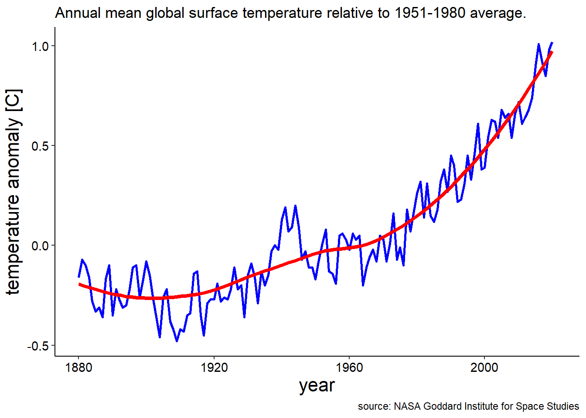


<p class="solution-end"><span class="fa fa-square-o solution-icon"></span></p></div></div>


<div class = 'question' id='ques:cch-7'><p class='question-begin'>&#x25BA; Question</p><div class='question-body'><p>Describe & interpret the figure: Describe the change in the deviation of global temperature to the 1950-1980 mean. Include and explanation of what it means for values to be negative or positive.</p><p class='question-end'><span class='fa fa-square-o solution-icon'></span></p></div></div>


This figure gives us a qualitative view of changing global temperatures. To quantitatively assess the rate of change, we can fit a linear regression as `y = mx + b`. With `m` as the slope and `b` as the intercept to determine the rate of change. 

For this example you would define the rate of change as the change in temperature divided by the change in time for a certain time period. A more general definition would be that you are calculating the **slope** of the line you have fit through the data as the change-in-y divided by the change-in-x^[If you compare the two figures you should see that fitting a linear regression is an oversimplification but it will allow us to make a quantitative comparison].


```r
ggplot(temperature, aes(x = Year, y = as.numeric(`J-D`))) +
  geom_line(color = "blue", size = 1) +
  geom_smooth(method = "lm", color = "red", size = 1, se = FALSE) +
  labs(x = "year", y = "temperature anomaly [C]",
       title = "Annual mean global surface temperature relative to 1951-1980 average.",
       caption = "source: NASA Goddard Institute for Space Studies")
```

<div class="figure">
<p class="caption">(\#fig:unnamed-chunk-165)Linear regression (red) for change in annual mean global surface anomaly from 1880-2021 (blue). Temperature anomaly measured relative to 1951-1980.</p></div>

We can fit the linear regression using the function `lm()`.


```r
# fit linear regression
score_model <- lm(`J-D` ~ Year, data = temperature)

# view summary of results
summary(score_model)
```

```
## 
## Call:
## lm(formula = `J-D` ~ Year, data = temperature)
## 
## Residuals:
##      Min       1Q   Median       3Q      Max 
## -0.35614 -0.13672 -0.03851  0.11861  0.46043 
## 
## Coefficients:
##                Estimate  Std. Error t value            Pr(>|t|)    
## (Intercept) -14.7033876   0.7207115  -20.40 <0.0000000000000002 ***
## Year          0.0075659   0.0003695   20.48 <0.0000000000000002 ***
## ---
## Signif. codes:  0 '***' 0.001 '**' 0.01 '*' 0.05 '.' 0.1 ' ' 1
## 
## Residual standard error: 0.1786 on 139 degrees of freedom
##   (1 observation deleted due to missingness)
## Multiple R-squared:  0.751,	Adjusted R-squared:  0.7492 
## F-statistic: 419.2 on 1 and 139 DF,  p-value: < 0.00000000000000022
```


<div class = 'question' id='ques:cch-8'><p class='question-begin'>&#x25BA; Question</p><div class='question-body'>


We are interested in the equation of the regression line, how well the data fits the line, and whether or not the regression is significant. We can use the output of the linear regression to determine that. The estimate columns shows the values for the intercept `b` and the slope `m` for the variable (in this case year).

Determine what the equation for our linear regression looks like and use this to determine the rate of change, including what the units would be.


<p class="question-end"><span class="fa fa-square-o solution-icon"></span></p></div></div>


<div class = 'question' id='ques:cch-9'><p class='question-begin'>&#x25BA; Question</p><div class='question-body'>


The adjusted R2 value describes the proportion of variance of the dependent value explained by the independent variable. In our figure what is the dependent and the independent value? How well does the data fit our regression? 


<p class="question-end"><span class="fa fa-square-o solution-icon"></span></p></div></div>


<div class = 'question' id='ques:cch-10'><p class='question-begin'>&#x25BA; Question</p><div class='question-body'>


The column `PR(>|t|)` is the probability of the coefficient for the variable. Is our regression significant?


<p class="question-end"><span class="fa fa-square-o solution-icon"></span></p></div></div>


<div class = 'question' id='ques:cch-11'><p class='question-begin'>&#x25BA; Question</p><div class='question-body'><p>Interpret the results of your analysis to determine whether you have evidence of a warming earth.</p><p class='question-end'><span class='fa fa-square-o solution-icon'></span></p></div></div>


<div class = 'question' id='ques:cch-12'><p class='question-begin'>&#x25BA; Question</p><div class='question-body'>


Now you! 

1. Identify the time period where you observe the steepest rate of increase.
2. Create a subset of the data set to contain only that time frame. 
3. Plot you subset of data with a linear regression. 
4. Perform a statistical analysis to determine the rate of change.
5. Summarize your results and compare them to your results above.


<p class="question-end"><span class="fa fa-square-o solution-icon"></span></p></div></div>


## Rate of change of atmospheric CO<sub>2</sub>

Next, let's determine the rate of change of atmospheric CO<sub>2</sub>. 

Dr. Charles David Keeling (1928 - 2005) began collecting atmospheric CO<sub>2</sub> concentration data at the Mauna Observatory (Hawaii); this data set comprises the longest measurement of atmospheric CO<sub>2</sub> concentrations^[Longest measurement using instruments - we will see later that we can use proxy data to indirectly measure CO<sub>2</sub> levels for much longer time periods]. This data set has been fundamental to our understand the role of human activities such as fossil fuel burning in driving climate change.


<div class = 'question' id='ques:cch-13'><p class='question-begin'>&#x25BA; Question</p><div class='question-body'><p>Briefly argue why Hawaii is a good location for this.</p><p class='question-end'><span class='fa fa-square-o solution-icon'></span></p></div></div>


We can access the data set directly from the [Global Monitoring Laboratory](https://gml.noaa.gov/ccgg/trends/). Select the `Data` tab, then download the `csv` data set `Mauna Loa CO2 annual mean data`.

Once you have downloaded the data set, make sure to move it to the `data` folder of your project directory, then read it into `Rstudio`.


```r
CO2 <- read_delim("data/co2_annmean_mlo.csv", delim = ",", skip = 55)

head(CO2)
```

```
## # A tibble: 6 x 3
##    year  mean   unc
##   <dbl> <dbl> <dbl>
## 1  1959  316.  0.12
## 2  1960  317.  0.12
## 3  1961  318.  0.12
## 4  1962  318.  0.12
## 5  1963  319.  0.12
## 6  1964  320.  0.12
```


<div class = 'question' id='ques:cch-14'><p class='question-begin'>&#x25BA; Question</p><div class='question-body'><p>Explore your data set to determine if it is correctly formatted and briefly describe what information it contains - bullet points are fine.</p><p class='question-end'><span class='fa fa-square-o solution-icon'></span></p></div></div>


<div class = 'question' id='ques:cch-15'><p class='question-begin'>&#x25BA; Question</p><div class='question-body'><p>Plot the change in CO2 over time and use a linear regression to determine the rate of change in atmospheric CO2 over the entire data set based on your analysis. Argue how confident you are in these results.</p><p class='question-end'><span class='fa fa-square-o solution-icon'></span></p></div></div>


<div class = 'question' id='ques:cch-16'><p class='question-begin'>&#x25BA; Question</p><div class='question-body'><p>Compare your results of rates of change of average global temperature and atmospheric CO2 and describe the phenomenon that can be used to explain this.</p><p class='question-end'><span class='fa fa-square-o solution-icon'></span></p></div></div>


<div class="figure">
<p class="caption">(\#fig:unnamed-chunk-168)Comparison of increase in mean global temperature anomaly relative to 1951-1980 (left) and increase in mean atmospheric CO2 concenttrations (right panel) measured a Mauna Loa Observatory. Regression lines indicating temporal trend included in red.</p></div>


## Comparison of current and pre-historic rates of change 

The most recent IPCC assessment has labeled the increase in temperatures driving contemporary climate change as "unprecedented". However, temperatures have changed in earth's past, and temperatures have even been higher than what we are experiencing now. What is unprecedented is the rate at which this is occurring. 

Shall we investigate?

To do this we will need to look at past climate change. The two data sets we just took a look at are measurements of temperature and CO<sub>2</sub> using instrumentation, i.e. we have directly measured values for the parameters we are interested in at different points in time. Dr. Keeling was one of the first scientists to consider the importance of long-term monitoring sites. The rapid changes taking place in our environment have created a push to generate long-term data sets with a focus on making the accessible. We will take a look at some of these data sets later in this semester and you will likely use at least one of them for your own data science project.

However, we frequently have questions that might extend beyond data sets like the two we used above.

How can we access data from before we had instrumentation? One way to do this we have to use so-called [proxy data sets](https://www.ncdc.noaa.gov/news/what-are-proxy-data).


<div class = 'question' id='ques:cch-17'><p class='question-begin'>&#x25BA; Question</p><div class='question-body'><p>In general, a proxy is an intermidary or subsistute, i.e. it is a parameter that can be used to represent the value of something in a calculation. Paleoclimatologist use preserved physical characteristics of the environment to stand in for direct measurements using instruments, typical examples would be ice cores, tree rings, ocean sediments, or fossil pollen. Briefly discuss the pros and cons of proxy data compared to direct measurements using specialized intruments.</p><p class='question-end'><span class='fa fa-square-o solution-icon'></span></p></div></div>


For a deep dive on proxy data sets and climate archives, you can check out [a detailed interactive brief on proxy data](https://interactive.carbonbrief.org/how-proxy-data-reveals-climate-of-earths-distant-past/).

For our current assessment we are going to explore proxy data derived from ice cores which next to ocean sediments give us some of the longest records of past climate conditions. 

Hundreds of ice cores extracted from polar ice have proven valuable to understanding changes in atmospheric chemistry over pre-historic time. Here, we can make use of the fact that as the ice is formed, air bubbles are trapped. Because these air bubbles have remained frozen, they still have the same composition of gases as at the time they were trapped. The depth of an ice core is correlated to time, deeper ice is older. In other words, ice cores form an archive of atmospheric conditions over time. We can directly measure CO<sub>2</sub> from the air bubbles trapped in the ice and we can measure isotopic ratios of oxygen in the water molecules of the core to derive temperature.

Vostok Ice core data set has been constructed using ice cores from the Vostock research station in the Antarctica and can be access through the [Carbon Dioxide Information Analysis Center](https://data.ess-dive.lbl.gov/portals/CDIAC).

Let's start by taking a look at the temperature data. Use the code below to download the data and read it into R as a data frame^[We are using a slightly different method from before which allows us to directly download the data into our data folder. We are also using `read_table2()` from the `readr` package due to the fact that our text file is formatted using neither white space nor tabs.].


```r
# define url
url <- "http://cdiac.ess-dive.lbl.gov/ftp/trends/temp/vostok/vostok.1999.temp.dat"

# download file
download.file(url, "data/vostok_temp.txt")

# load dataset
vostok_temp <- read_table2("data/vostok_temp.txt",
                     skip = 60,
                     col_names = c("depth", "age_ice", "deuterium", "temperature"))
```


<div class = 'question' id='ques:cch-18'><p class='question-begin'>&#x25BA; Question</p><div class='question-body'><p>Take a look at the data set and briefly describe what data is contained in the data set (you may want to take a peak at the original text file to get a better understanding).</p><p class='question-end'><span class='fa fa-square-o solution-icon'></span></p></div></div>


Now we can create a plot of the temperature data over time. The age is recorded as years before present. For better visualization we will convert this to "thousand years ago" by dividing that number by 1,000.


```r
ggplot(vostok_temp, aes(x = age_ice/1000, y = temperature)) +
  geom_line(color = "blue", size = 1) +
  labs(x = "thousand years before present", y = "Temperature variation [C]",
       title = "Temperature variation during glacial/interglacial periods",
       caption = "Data: Carbon Dioxide Information Analysis Center (CDIAC)")
```


<div class="figure">
<p class="caption">(\#fig:unnamed-chunk-171)Temperature variation during glacial/interglacial periods derived from air bubbles in Vostock ice cores.</p></div>


<div class = 'question' id='ques:cch-19'><p class='question-begin'>&#x25BA; Question</p><div class='question-body'>


Before we move at looking at rates of change, we first need to determine how to properly read this plot. Consider the following:

* What does it mean that time (on the x-axis) is represented as "thousand years ago" or "time before present"? How does this differ from the other time series we have plotted today?
* Temperature is being measured by proxy by looking at differences in isotope ratios; the data file lists this information as "Temperature variation". What does 0C mean on this plot?
* Consider how long glacial and interglacial periods typically last - are we currently in a glacial or interglacial period?
* In what parts of the figure is temperature increasing/decreasing (consider slope)?


<p class="question-end"><span class="fa fa-square-o solution-icon"></span></p></div></div>


<div class = 'question' id='ques:cch-20'><p class='question-begin'>&#x25BA; Question</p><div class='question-body'>


Now add a trend line to our ice core temperature data and run a linear regression model. Argue whether or not you think this trend line is a good representation of long-term temperature change.


<p class="question-end"><span class="fa fa-square-o solution-icon"></span></p></div></div>


<div class = "msmb-solution"><p class="solution-begin">&#x25BA; Solution<span id='sol-start-27' class="fa fa-plus-square solution-icon clickable" onclick="toggle_visibility('sol-body-27', 'sol-start-27')"></span></p><div class="solution-body" id = "sol-body-27" style="display: none;">


Plot temperature data derived from vostok ice cores.


```r
ggplot(vostok_temp, aes(x = age_ice/1000, y = temperature)) +
  geom_line(color = "blue", size = 1) +
  geom_smooth(method = "lm", color = "red", se = FALSE) +
  labs(x = "thousand years before present", y = "Temperature variation [C]",
       title = "Temperature derived from Vostok ice core, Antarctica.",
       caption = "Data: Carbon Dioxide Information Analysis Center (CDIAC)")
```

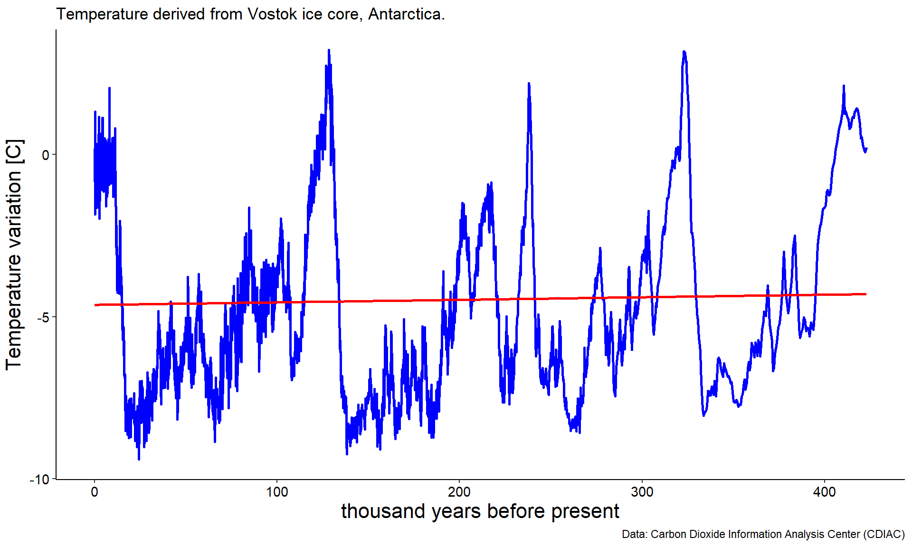

And fit linear regression.


```r
# fit linear regression
score_model <- lm(temperature ~ age_ice, data = vostok_temp)

# view summary of results
summary(score_model)
```

```
## 
## Call:
## lm(formula = temperature ~ age_ice, data = vostok_temp)
## 
## Residuals:
##     Min      1Q  Median      3Q     Max 
## -4.7781 -2.3667 -0.5821  1.9830  7.7603 
## 
## Coefficients:
##                  Estimate    Std. Error t value            Pr(>|t|)    
## (Intercept) -4.6310127856  0.0846233780 -54.725 <0.0000000000000002 ***
## age_ice      0.0000007850  0.0000004987   1.574               0.116    
## ---
## Signif. codes:  0 '***' 0.001 '**' 0.01 '*' 0.05 '.' 0.1 ' ' 1
## 
## Residual standard error: 2.896 on 3309 degrees of freedom
## Multiple R-squared:  0.0007483,	Adjusted R-squared:  0.0004463 
## F-statistic: 2.478 on 1 and 3309 DF,  p-value: 0.1155
```

*Remember, when you "argue" an answer you need to state your conclusion and then support that statement.*


<p class="solution-end"><span class="fa fa-square-o solution-icon"></span></p></div></div>


In order to determine if the currently observed rate of change is "unprecedented" or not, let's identify past time periods with the fastest rate of change and calculate them.

To do this I will show you a little trick to plot an interactive figure.


```r
p1 <- ggplot(vostok_temp, aes(x = age_ice/1000, y = temperature)) +
  geom_line(color = "blue", size = .75) +
  labs(x = "thousand years before present", y = "Temperature variation [C]",
       caption = "Data: Carbon Dioxide Information Analysis Center (CDIAC)")

ggplotly(p1)
```

```{=html}
<div id="htmlwidget-86766e5cfd9412728ec4" style="width:672px;height:576px;" class="plotly html-widget"></div>
<script type="application/json" data-for="htmlwidget-86766e5cfd9412728ec4">{"x":{"data":[{"x":[0,0.017,0.035,0.053,0.072,0.091,0.11,0.129,0.149,0.17,0.19,0.211,0.234,0.258,0.281,0.304,0.327,0.351,0.375,0.397,0.42,0.444,0.469,0.495,0.523,0.552,0.581,0.609,0.637,0.665,0.695,0.726,0.757,0.788,0.817,0.848,0.881,0.912,0.944,0.976,1.009,1.042,1.074,1.107,1.142,1.176,1.211,1.247,1.285,1.321,1.356,1.39,1.426,1.461,1.497,1.535,1.573,1.612,1.652,1.692,1.732,1.772,1.812,1.853,1.893,1.931,1.97,2.009,2.049,2.089,2.129,2.171,2.212,2.253,2.291,2.331,2.374,2.418,2.46,2.501,2.542,2.585,2.628,2.67,2.713,2.76,2.805,2.847,2.889,2.934,2.98,3.026,3.07,3.114,3.158,3.201,3.245,3.289,3.334,3.379,3.422,3.466,3.511,3.558,3.603,3.646,3.689,3.732,3.778,3.824,3.87,3.915,3.962,4.009,4.057,4.104,4.153,4.202,4.25,4.295,4.339,4.381,4.423,4.466,4.509,4.552,4.596,4.642,4.69,4.739,4.786,4.831,4.88,4.929,4.977,5.025,5.072,5.118,5.165,5.212,5.259,5.305,5.351,5.397,5.442,5.488,5.534,5.581,5.627,5.674,5.721,5.769,5.816,5.863,5.909,5.955,6.004,6.052,6.099,6.145,6.193,6.241,6.287,6.334,6.385,6.436,6.486,6.534,6.583,6.631,6.677,6.724,6.773,6.823,6.874,6.924,6.973,7.023,7.074,7.124,7.172,7.22,7.267,7.315,7.364,7.413,7.462,7.509,7.555,7.602,7.649,7.697,7.745,7.794,7.844,7.894,7.944,7.994,8.043,8.091,8.135,8.178,8.226,8.276,8.325,8.374,8.422,8.471,8.52,8.569,8.619,8.668,8.716,8.763,8.811,8.861,8.91,8.96,9.009,9.058,9.107,9.156,9.204,9.252,9.298,9.346,9.396,9.445,9.494,9.542,9.589,9.635,9.682,9.732,9.782,9.831,9.881,9.929,9.978,10.027,10.075,10.124,10.172,10.218,10.265,10.315,10.366,10.415,10.465,10.515,10.564,10.614,10.665,10.715,10.764,10.812,10.861,10.91,10.957,11.005,11.053,11.1,11.146,11.191,11.237,11.286,11.334,11.383,11.434,11.485,11.537,11.59,11.642,11.695,11.749,11.805,11.861,11.918,11.973,12.029,12.087,12.144,12.202,12.261,12.323,12.385,12.446,12.507,12.569,12.632,12.694,12.755,12.815,12.874,12.934,12.994,13.055,13.116,13.177,13.237,13.296,13.355,13.414,13.476,13.539,13.6,13.659,13.718,13.774,13.828,13.883,13.938,13.992,14.048,14.105,14.163,14.221,14.281,14.342,14.404,14.466,14.526,14.589,14.651,14.713,14.775,14.839,14.904,14.968,15.032,15.099,15.167,15.234,15.3,15.366,15.432,15.501,15.57,15.639,15.708,15.777,15.845,15.915,15.987,16.057,16.128,16.201,16.275,16.35,16.426,16.502,16.577,16.653,16.729,16.808,16.889,16.974,17.058,17.139,17.219,17.298,17.379,17.462,17.544,17.625,17.706,17.787,17.868,17.949,18.031,18.116,18.201,18.283,18.365,18.446,18.53,18.615,18.701,18.787,18.87,18.95,19.032,19.116,19.199,19.282,19.362,19.443,19.525,19.61,19.696,19.782,19.868,19.953,20.035,20.116,20.197,20.278,20.361,20.444,20.528,20.611,20.694,20.777,20.859,20.943,21.026,21.11,21.192,21.275,21.358,21.442,21.525,21.605,21.686,21.769,21.854,21.939,22.023,22.108,22.196,22.284,22.371,22.457,22.543,22.629,22.716,22.803,22.888,22.972,23.057,23.145,23.234,23.324,23.412,23.497,23.581,23.668,23.755,23.843,23.931,24.017,24.102,24.186,24.272,24.363,24.453,24.537,24.619,24.7,24.781,24.86,24.941,25.024,25.109,25.193,25.277,25.36,25.445,25.531,25.615,25.697,25.776,25.855,25.936,26.017,26.099,26.18,26.261,26.342,26.425,26.51,26.595,26.681,26.766,26.849,26.933,27.019,27.11,27.202,27.293,27.382,27.47,27.555,27.641,27.73,27.819,27.907,27.993,28.079,28.163,28.247,28.331,28.42,28.51,28.597,28.683,28.766,28.848,28.927,29.006,29.085,29.166,29.249,29.332,29.418,29.505,29.594,29.682,29.771,29.861,29.949,30.036,30.12,30.201,30.283,30.368,30.453,30.538,30.622,30.705,30.788,30.871,30.957,31.043,31.13,31.216,31.302,31.387,31.473,31.56,31.648,31.733,31.815,31.896,31.976,32.056,32.137,32.219,32.3,32.38,32.463,32.546,32.626,32.705,32.787,32.871,32.955,33.039,33.124,33.209,33.293,33.376,33.459,33.544,33.628,33.711,33.793,33.877,33.96,34.041,34.121,34.202,34.281,34.36,34.438,34.515,34.592,34.669,34.744,34.818,34.889,34.96,35.033,35.108,35.185,35.261,35.336,35.409,35.482,35.556,35.631,35.705,35.78,35.855,35.93,36.007,36.086,36.166,36.248,36.331,36.416,36.502,36.585,36.666,36.748,36.827,36.905,36.985,37.066,37.148,37.23,37.313,37.396,37.479,37.558,37.637,37.718,37.799,37.88,37.959,38.039,38.12,38.201,38.284,38.367,38.451,38.535,38.619,38.702,38.783,38.865,38.946,39.027,39.107,39.185,39.263,39.341,39.42,39.499,39.579,39.657,39.735,39.812,39.889,39.971,40.054,40.138,40.223,40.305,40.386,40.468,40.551,40.632,40.714,40.796,40.875,40.952,41.031,41.112,41.191,41.268,41.342,41.415,41.489,41.564,41.638,41.71,41.782,41.855,41.927,42.001,42.077,42.152,42.225,42.298,42.374,42.451,42.527,42.603,42.679,42.758,42.837,42.916,42.994,43.073,43.15,43.226,43.304,43.385,43.464,43.54,43.619,43.702,43.785,43.868,43.952,44.036,44.12,44.206,44.292,44.377,44.463,44.551,44.634,44.715,44.8,44.887,44.972,45.055,45.139,45.225,45.315,45.407,45.497,45.587,45.677,45.762,45.846,45.932,46.018,46.104,46.193,46.281,46.37,46.457,46.543,46.628,46.713,46.797,46.881,46.966,47.05,47.133,47.214,47.295,47.378,47.462,47.546,47.631,47.716,47.798,47.881,47.966,48.05,48.134,48.218,48.3,48.381,48.461,48.541,48.622,48.704,48.787,48.87,48.953,49.034,49.113,49.193,49.272,49.35,49.43,49.51,49.591,49.672,49.75,49.828,49.907,49.985,50.061,50.138,50.217,50.295,50.374,50.452,50.531,50.61,50.688,50.766,50.847,50.928,51.009,51.086,51.159,51.23,51.306,51.384,51.465,51.549,51.633,51.715,51.794,51.874,51.955,52.034,52.114,52.195,52.275,52.352,52.43,52.511,52.594,52.679,52.763,52.846,52.931,53.019,53.107,53.193,53.275,53.355,53.436,53.52,53.606,53.692,53.775,53.858,53.942,54.026,54.111,54.198,54.286,54.372,54.457,54.544,54.629,54.713,54.797,54.881,54.967,55.052,55.136,55.218,55.297,55.377,55.457,55.536,55.615,55.694,55.775,55.855,55.933,56.009,56.087,56.163,56.239,56.317,56.394,56.471,56.548,56.624,56.698,56.774,56.85,56.922,56.993,57.065,57.139,57.215,57.289,57.362,57.436,57.513,57.59,57.669,57.75,57.828,57.905,57.981,58.057,58.133,58.211,58.286,58.36,58.436,58.514,58.594,58.676,58.759,58.842,58.925,59.008,59.093,59.178,59.262,59.345,59.428,59.511,59.593,59.674,59.755,59.836,59.921,60.007,60.093,60.177,60.262,60.348,60.433,60.519,60.605,60.692,60.779,60.869,60.961,61.052,61.141,61.229,61.317,61.406,61.496,61.586,61.677,61.765,61.852,61.941,62.031,62.121,62.213,62.307,62.401,62.497,62.594,62.689,62.783,62.877,62.97,63.064,63.157,63.249,63.338,63.424,63.512,63.6,63.688,63.776,63.865,63.954,64.043,64.134,64.228,64.322,64.416,64.51,64.605,64.698,64.793,64.89,64.987,65.085,65.182,65.278,65.371,65.464,65.559,65.655,65.756,65.855,65.949,66.045,66.144,66.243,66.338,66.429,66.52,66.613,66.708,66.803,66.898,66.992,67.085,67.178,67.272,67.367,67.462,67.557,67.653,67.75,67.848,67.945,68.041,68.136,68.233,68.33,68.424,68.52,68.617,68.715,68.811,68.902,68.987,69.071,69.155,69.238,69.324,69.413,69.506,69.599,69.691,69.78,69.869,69.959,70.054,70.149,70.243,70.334,70.425,70.515,70.6,70.683,70.766,70.848,70.931,71.013,71.096,71.18,71.264,71.347,71.427,71.506,71.584,71.664,71.743,71.822,71.905,71.989,72.07,72.152,72.235,72.318,72.403,72.489,72.578,72.666,72.753,72.84,72.922,73.003,73.087,73.172,73.258,73.347,73.44,73.533,73.62,73.706,73.795,73.885,73.973,74.06,74.15,74.238,74.322,74.405,74.484,74.565,74.651,74.738,74.821,74.903,74.985,75.066,75.147,75.229,75.308,75.388,75.468,75.547,75.625,75.701,75.776,75.85,75.928,76.007,76.084,76.162,76.239,76.313,76.388,76.465,76.543,76.622,76.7,76.777,76.854,76.933,77.014,77.094,77.175,77.259,77.345,77.433,77.521,77.606,77.687,77.769,77.853,77.938,78.025,78.113,78.2,78.277,78.353,78.437,78.522,78.606,78.69,78.772,78.854,78.937,79.02,79.098,79.174,79.251,79.327,79.402,79.478,79.557,79.636,79.714,79.791,79.87,79.947,80.02,80.093,80.173,80.257,80.341,80.422,80.498,80.572,80.645,80.719,80.794,80.869,80.943,81.019,81.096,81.17,81.24,81.309,81.381,81.453,81.523,81.592,81.662,81.732,81.802,81.872,81.942,82.012,82.08,82.148,82.213,82.28,82.352,82.427,82.5,82.573,82.647,82.721,82.792,82.86,82.925,82.99,83.055,83.121,83.19,83.261,83.331,83.401,83.47,83.538,83.608,83.679,83.747,83.814,83.881,83.952,84.025,84.097,84.168,84.238,84.308,84.378,84.448,84.515,84.576,84.638,84.703,84.77,84.838,84.905,84.971,85.036,85.1,85.164,85.229,85.296,85.361,85.425,85.489,85.551,85.615,85.68,85.746,85.814,85.881,85.949,86.016,86.083,86.15,86.218,86.286,86.355,86.423,86.492,86.562,86.635,86.707,86.777,86.848,86.919,86.989,87.06,87.132,87.203,87.274,87.342,87.41,87.482,87.554,87.624,87.695,87.766,87.837,87.907,87.978,88.049,88.122,88.196,88.271,88.345,88.42,88.495,88.57,88.644,88.719,88.793,88.866,88.938,89.008,89.077,89.148,89.221,89.296,89.373,89.45,89.523,89.597,89.672,89.748,89.825,89.9,89.973,90.048,90.128,90.209,90.286,90.362,90.44,90.517,90.594,90.668,90.74,90.812,90.885,90.959,91.033,91.107,91.182,91.258,91.336,91.411,91.48,91.547,91.615,91.685,91.753,91.823,91.896,91.968,92.04,92.114,92.187,92.259,92.329,92.398,92.47,92.542,92.617,92.69,92.759,92.827,92.897,92.967,93.037,93.107,93.18,93.254,93.325,93.397,93.468,93.54,93.615,93.69,93.761,93.829,93.895,93.961,94.026,94.093,94.164,94.238,94.311,94.382,94.45,94.517,94.585,94.655,94.725,94.795,94.864,94.932,95,95.07,95.141,95.214,95.284,95.351,95.418,95.487,95.556,95.624,95.693,95.761,95.828,95.895,95.964,96.033,96.103,96.17,96.237,96.304,96.372,96.441,96.511,96.582,96.652,96.722,96.791,96.861,96.933,97.004,97.075,97.148,97.222,97.294,97.365,97.439,97.514,97.588,97.659,97.727,97.794,97.864,97.936,98.01,98.085,98.157,98.228,98.3,98.371,98.439,98.505,98.572,98.64,98.712,98.783,98.855,98.925,98.994,99.063,99.134,99.205,99.275,99.345,99.414,99.484,99.553,99.622,99.691,99.76,99.828,99.894,99.961,100.028,100.095,100.163,100.232,100.301,100.367,100.432,100.498,100.565,100.633,100.7,100.768,100.835,100.902,100.969,101.036,101.102,101.168,101.234,101.299,101.363,101.427,101.49,101.554,101.618,101.681,101.743,101.806,101.868,101.93,101.991,102.052,102.114,102.177,102.241,102.304,102.366,102.427,102.489,102.553,102.618,102.684,102.749,102.812,102.876,102.942,103.008,103.073,103.137,103.205,103.273,103.341,103.41,103.481,103.553,103.625,103.697,103.769,103.841,103.912,103.984,104.054,104.125,104.195,104.266,104.337,104.409,104.48,104.552,104.623,104.695,104.766,104.837,104.908,104.982,105.055,105.128,105.2,105.271,105.342,105.413,105.485,105.559,105.631,105.702,105.772,105.842,105.911,105.98,106.048,106.114,106.179,106.248,106.319,106.391,106.463,106.535,106.606,106.678,106.752,106.828,106.902,106.976,107.048,107.121,107.194,107.27,107.349,107.431,107.515,107.599,107.683,107.767,107.852,107.938,108.025,108.111,108.198,108.283,108.369,108.454,108.538,108.622,108.706,108.789,108.872,108.954,109.037,109.121,109.206,109.292,109.378,109.461,109.543,109.625,109.707,109.79,109.872,109.952,110.031,110.11,110.189,110.269,110.348,110.427,110.507,110.586,110.666,110.746,110.829,110.913,110.996,111.078,111.159,111.239,111.319,111.399,111.48,111.56,111.64,111.721,111.805,111.889,111.973,112.055,112.137,112.219,112.301,112.383,112.465,112.547,112.628,112.708,112.79,112.872,112.954,113.036,113.116,113.195,113.272,113.348,113.425,113.501,113.578,113.656,113.736,113.815,113.891,113.966,114.041,114.115,114.189,114.264,114.338,114.411,114.486,114.562,114.639,114.715,114.79,114.863,114.935,115.006,115.077,115.15,115.222,115.289,115.355,115.42,115.486,115.551,115.617,115.683,115.749,115.816,115.886,115.956,116.025,116.093,116.161,116.228,116.296,116.363,116.43,116.497,116.563,116.63,116.697,116.762,116.827,116.891,116.954,117.016,117.077,117.139,117.202,117.264,117.326,117.388,117.451,117.514,117.575,117.635,117.697,117.759,117.822,117.886,117.949,118.012,118.074,118.135,118.194,118.254,118.314,118.376,118.438,118.499,118.559,118.618,118.676,118.735,118.796,118.859,118.921,118.981,119.042,119.101,119.16,119.221,119.283,119.345,119.406,119.467,119.528,119.589,119.65,119.71,119.77,119.831,119.894,119.955,120.016,120.076,120.138,120.199,120.259,120.319,120.379,120.439,120.498,120.555,120.612,120.669,120.726,120.783,120.841,120.9,120.959,121.018,121.079,121.139,121.199,121.256,121.314,121.373,121.432,121.492,121.551,121.61,121.669,121.727,121.784,121.84,121.896,121.951,122.006,122.064,122.122,122.178,122.234,122.29,122.345,122.402,122.458,122.515,122.571,122.627,122.684,122.742,122.801,122.861,122.919,122.977,123.036,123.095,123.154,123.211,123.268,123.322,123.377,123.432,123.489,123.545,123.602,123.658,123.715,123.77,123.825,123.88,123.936,123.991,124.046,124.1,124.154,124.209,124.265,124.32,124.376,124.432,124.488,124.544,124.599,124.654,124.71,124.765,124.821,124.877,124.935,124.993,125.05,125.107,125.162,125.217,125.271,125.325,125.38,125.435,125.49,125.544,125.598,125.653,125.708,125.765,125.821,125.877,125.933,125.989,126.046,126.103,126.16,126.217,126.272,126.327,126.381,126.436,126.491,126.545,126.598,126.65,126.7,126.749,126.799,126.851,126.904,126.955,127.006,127.057,127.108,127.159,127.21,127.26,127.31,127.36,127.41,127.46,127.51,127.56,127.61,127.66,127.71,127.76,127.81,127.86,127.91,127.961,128.012,128.062,128.112,128.161,128.21,128.259,128.309,128.357,128.405,128.453,128.501,128.549,128.599,128.65,128.702,128.753,128.804,128.854,128.906,128.958,129.011,129.065,129.119,129.172,129.224,129.274,129.324,129.374,129.428,129.486,129.545,129.6,129.653,129.705,129.757,129.809,129.863,129.916,129.971,130.026,130.079,130.131,130.185,130.241,130.297,130.353,130.41,130.467,130.525,130.582,130.641,130.699,130.759,130.819,130.88,130.942,131.004,131.066,131.128,131.19,131.25,131.311,131.374,131.439,131.506,131.574,131.641,131.707,131.773,131.84,131.908,131.978,132.048,132.12,132.192,132.264,132.335,132.406,132.477,132.548,132.619,132.691,132.763,132.836,132.911,132.987,133.065,133.142,133.219,133.296,133.374,133.452,133.528,133.603,133.679,133.759,133.841,133.923,134.005,134.091,134.178,134.266,134.356,134.447,134.538,134.628,134.719,134.815,134.912,135.009,135.107,135.207,135.308,135.408,135.507,135.604,135.702,135.802,135.903,136.003,136.103,136.206,136.309,136.411,136.512,136.614,136.715,136.819,136.923,137.026,137.13,137.235,137.341,137.446,137.549,137.651,137.754,137.858,137.966,138.078,138.193,138.308,138.42,138.532,138.644,138.756,138.868,138.978,139.087,139.197,139.308,139.418,139.53,139.643,139.756,139.868,139.979,140.093,140.207,140.319,140.43,140.542,140.655,140.766,140.876,140.986,141.1,141.212,141.323,141.434,141.547,141.661,141.773,141.885,141.997,142.108,142.218,142.329,142.44,142.551,142.665,142.779,142.893,143.006,143.117,143.227,143.338,143.45,143.562,143.675,143.79,143.905,144.016,144.126,144.237,144.346,144.453,144.562,144.671,144.782,144.894,145.006,145.116,145.226,145.337,145.449,145.563,145.678,145.792,145.905,146.019,146.131,146.242,146.352,146.461,146.57,146.681,146.792,146.903,147.014,147.124,147.236,147.347,147.459,147.572,147.684,147.796,147.91,148.025,148.141,148.253,148.362,148.471,148.581,148.691,148.802,148.913,149.022,149.132,149.241,149.351,149.46,149.569,149.679,149.789,149.899,150.008,150.116,150.224,150.333,150.44,150.545,150.653,150.762,150.868,150.972,151.076,151.181,151.287,151.393,151.502,151.611,151.721,151.832,151.945,152.058,152.171,152.283,152.398,152.513,152.628,152.74,152.852,152.963,153.076,153.188,153.301,153.412,153.523,153.637,153.753,153.868,153.981,154.094,154.207,154.322,154.438,154.551,154.664,154.783,154.907,155.029,155.151,155.271,155.388,155.506,155.625,155.743,155.861,155.983,156.105,156.225,156.349,156.473,156.593,156.714,156.835,156.957,157.08,157.202,157.324,157.444,157.56,157.677,157.793,157.909,158.026,158.14,158.25,158.359,158.469,158.584,158.702,158.815,158.925,159.033,159.139,159.24,159.34,159.444,159.548,159.651,159.757,159.865,159.971,160.076,160.184,160.293,160.403,160.514,160.626,160.74,160.851,160.963,161.077,161.192,161.308,161.427,161.545,161.661,161.776,161.89,162.005,162.117,162.227,162.336,162.44,162.543,162.649,162.759,162.867,162.976,163.089,163.204,163.318,163.432,163.546,163.66,163.777,163.896,164.016,164.136,164.258,164.385,164.512,164.642,164.769,164.894,165.021,165.148,165.274,165.399,165.522,165.646,165.774,165.903,166.029,166.155,166.284,166.411,166.537,166.662,166.785,166.909,167.035,167.164,167.29,167.414,167.539,167.664,167.79,167.915,168.039,168.159,168.276,168.391,168.506,168.623,168.739,168.857,168.974,169.088,169.201,169.314,169.425,169.531,169.638,169.75,169.866,169.983,170.101,170.221,170.34,170.455,170.568,170.683,170.803,170.922,171.04,171.165,171.289,171.405,171.519,171.638,171.76,171.88,172.004,172.132,172.262,172.393,172.522,172.647,172.774,172.9,173.027,173.153,173.275,173.397,173.519,173.642,173.761,173.875,173.988,174.105,174.226,174.344,174.459,174.573,174.688,174.804,174.92,175.034,175.15,175.266,175.386,175.509,175.63,175.746,175.866,175.991,176.117,176.244,176.373,176.501,176.63,176.759,176.887,177.015,177.142,177.268,177.393,177.517,177.644,177.773,177.9,178.026,178.153,178.283,178.417,178.554,178.691,178.83,178.965,179.093,179.217,179.342,179.468,179.59,179.706,179.82,179.939,180.06,180.182,180.304,180.426,180.546,180.663,180.78,180.895,181.011,181.132,181.259,181.382,181.502,181.626,181.753,181.881,182.011,182.146,182.284,182.421,182.556,182.694,182.83,182.965,183.102,183.243,183.386,183.525,183.664,183.807,183.948,184.088,184.229,184.367,184.501,184.641,184.787,184.928,185.069,185.212,185.354,185.494,185.64,185.788,185.931,186.071,186.213,186.356,186.499,186.642,186.784,186.927,187.067,187.204,187.343,187.486,187.63,187.77,187.907,188.042,188.181,188.324,188.467,188.609,188.752,188.892,189.03,189.165,189.297,189.431,189.568,189.702,189.832,189.961,190.092,190.222,190.348,190.469,190.587,190.705,190.822,190.934,191.043,191.156,191.276,191.398,191.522,191.647,191.771,191.895,192.018,192.138,192.258,192.382,192.509,192.638,192.768,192.895,193.022,193.152,193.285,193.421,193.556,193.687,193.816,193.946,194.075,194.201,194.324,194.444,194.565,194.687,194.806,194.926,195.051,195.175,195.298,195.42,195.546,195.676,195.808,195.94,196.071,196.202,196.332,196.463,196.593,196.722,196.846,196.965,197.086,197.211,197.338,197.462,197.587,197.711,197.833,197.954,198.075,198.192,198.309,198.426,198.542,198.656,198.768,198.881,198.992,199.104,199.22,199.337,199.452,199.567,199.682,199.793,199.904,200.015,200.124,200.236,200.345,200.451,200.558,200.666,200.776,200.887,200.998,201.109,201.216,201.319,201.423,201.529,201.635,201.742,201.849,201.957,202.065,202.169,202.275,202.386,202.496,202.607,202.717,202.826,202.936,203.046,203.155,203.262,203.37,203.481,203.592,203.704,203.818,203.933,204.049,204.164,204.278,204.394,204.512,204.629,204.743,204.857,204.973,205.092,205.214,205.336,205.458,205.582,205.708,205.836,205.965,206.097,206.232,206.366,206.496,206.627,206.759,206.89,207.019,207.149,207.278,207.409,207.54,207.671,207.803,207.933,208.061,208.191,208.319,208.445,208.571,208.696,208.821,208.946,209.072,209.195,209.315,209.436,209.56,209.686,209.812,209.938,210.062,210.182,210.3,210.418,210.538,210.659,210.777,210.893,211.009,211.127,211.246,211.366,211.485,211.603,211.721,211.842,211.96,212.075,212.19,212.305,212.422,212.538,212.653,212.766,212.881,212.996,213.109,213.223,213.338,213.453,213.567,213.684,213.799,213.911,214.024,214.138,214.251,214.364,214.478,214.592,214.706,214.819,214.932,215.047,215.161,215.274,215.386,215.497,215.608,215.723,215.839,215.955,216.075,216.197,216.319,216.439,216.56,216.678,216.792,216.904,217.018,217.131,217.244,217.356,217.47,217.584,217.699,217.817,217.939,218.06,218.181,218.303,218.426,218.551,218.681,218.814,218.946,219.076,219.207,219.339,219.472,219.605,219.738,219.878,220.023,220.167,220.312,220.461,220.613,220.761,220.907,221.058,221.21,221.363,221.52,221.684,221.85,222.015,222.182,222.355,222.535,222.711,222.885,223.062,223.24,223.42,223.605,223.792,223.979,224.164,224.351,224.536,224.716,224.888,225.058,225.229,225.399,225.562,225.726,225.9,226.072,226.238,226.408,226.582,226.758,226.939,227.128,227.321,227.512,227.699,227.883,228.064,228.241,228.416,228.596,228.783,228.974,229.165,229.354,229.541,229.726,229.909,230.088,230.264,230.44,230.618,230.794,230.972,231.146,231.315,231.482,231.649,231.815,231.979,232.14,232.299,232.458,232.617,232.774,232.93,233.083,233.236,233.39,233.542,233.691,233.836,233.979,234.122,234.268,234.411,234.552,234.694,234.837,234.984,235.129,235.271,235.411,235.552,235.694,235.836,235.977,236.114,236.25,236.385,236.518,236.652,236.785,236.916,237.043,237.166,237.288,237.41,237.529,237.643,237.755,237.866,237.975,238.084,238.194,238.306,238.419,238.532,238.647,238.764,238.883,239.003,239.125,239.248,239.375,239.506,239.642,239.784,239.931,240.08,240.231,240.387,240.548,240.711,240.877,241.048,241.224,241.406,241.596,241.792,241.991,242.187,242.382,242.576,242.77,242.959,243.144,243.33,243.519,243.714,243.916,244.124,244.337,244.551,244.767,244.983,245.196,245.407,245.618,245.834,246.053,246.269,246.485,246.7,246.917,247.135,247.351,247.566,247.785,248.007,248.229,248.453,248.68,248.907,249.128,249.345,249.56,249.772,249.984,250.199,250.413,250.618,250.818,251.021,251.231,251.448,251.666,251.883,252.102,252.329,252.553,252.769,252.986,253.213,253.442,253.67,253.896,254.121,254.345,254.56,254.767,254.972,255.183,255.399,255.62,255.844,256.068,256.294,256.525,256.759,256.994,257.234,257.479,257.726,257.975,258.224,258.471,258.723,258.978,259.235,259.492,259.75,260.009,260.272,260.536,260.801,261.069,261.336,261.602,261.865,262.131,262.399,262.665,262.933,263.201,263.466,263.732,264.004,264.273,264.533,264.792,265.055,265.321,265.595,265.865,266.123,266.38,266.643,266.905,267.167,267.431,267.692,267.946,268.194,268.435,268.677,268.926,269.178,269.429,269.678,269.926,270.169,270.409,270.648,270.883,271.114,271.347,271.584,271.822,272.053,272.276,272.5,272.724,272.946,273.166,273.385,273.605,273.827,274.048,274.263,274.477,274.692,274.909,275.127,275.344,275.559,275.772,275.983,276.195,276.409,276.622,276.83,277.036,277.246,277.46,277.68,277.903,278.13,278.361,278.593,278.825,279.057,279.292,279.533,279.781,280.038,280.303,280.564,280.817,281.071,281.332,281.602,281.875,282.143,282.405,282.661,282.91,283.16,283.417,283.677,283.941,284.218,284.508,284.804,285.102,285.398,285.686,285.968,286.248,286.525,286.802,287.079,287.351,287.617,287.879,288.145,288.418,288.698,288.986,289.271,289.549,289.823,290.1,290.382,290.66,290.929,291.193,291.455,291.721,291.986,292.242,292.49,292.732,292.976,293.232,293.502,293.779,294.06,294.348,294.637,294.919,295.198,295.474,295.749,296.02,296.289,296.562,296.84,297.116,297.393,297.669,297.943,298.215,298.485,298.749,299.012,299.275,299.533,299.788,300.039,300.293,300.547,300.799,301.052,301.305,301.56,301.813,302.061,302.32,302.583,302.834,303.077,303.316,303.558,303.81,304.068,304.333,304.606,304.886,305.171,305.463,305.764,306.073,306.386,306.698,307.005,307.309,307.608,307.908,308.206,308.5,308.789,309.077,309.365,309.651,309.934,310.215,310.493,310.766,311.035,311.302,311.568,311.832,312.099,312.367,312.634,312.899,313.159,313.418,313.674,313.928,314.183,314.438,314.692,314.943,315.194,315.443,315.689,315.934,316.179,316.424,316.666,316.91,317.155,317.401,317.649,317.897,318.141,318.385,318.628,318.872,319.118,319.364,319.608,319.853,320.102,320.354,320.607,320.856,321.095,321.329,321.559,321.783,322,322.214,322.426,322.638,322.847,323.057,323.269,323.482,323.695,323.911,324.129,324.349,324.574,324.804,325.039,325.278,325.527,325.789,326.061,326.342,326.639,326.952,327.273,327.597,327.924,328.258,328.602,328.955,329.318,329.694,330.081,330.476,330.883,331.3,331.725,332.164,332.624,333.106,333.602,334.101,334.6,335.1,335.595,336.081,336.567,337.055,337.544,338.033,338.521,339.015,339.505,339.993,340.49,340.984,341.462,341.93,342.401,342.879,343.364,343.853,344.348,344.839,345.327,345.821,346.319,346.823,347.33,347.841,348.357,348.877,349.404,349.945,350.493,351.044,351.596,352.15,352.71,353.273,353.838,354.4,354.958,355.512,356.06,356.612,357.167,357.712,358.247,358.786,359.327,359.855,360.376,360.904,361.44,361.973,362.503,363.042,363.58,364.114,364.659,365.208,365.743,366.267,366.784,367.297,367.816,368.329,368.829,369.331,369.858,370.403,370.96,371.545,372.149,372.746,373.331,373.909,374.478,375.042,375.604,376.155,376.69,377.204,377.702,378.21,378.743,379.297,379.864,380.435,380.997,381.551,382.095,382.622,383.134,383.641,384.159,384.71,385.288,385.894,386.528,387.167,387.804,388.435,389.061,389.7,390.349,390.999,391.658,392.317,392.972,393.636,394.297,394.935,395.543,396.126,396.694,397.253,397.808,398.361,398.909,399.455,400.003,400.553,401.097,401.636,402.179,402.728,403.276,403.815,404.346,404.874,405.401,405.923,406.441,406.957,407.469,407.977,408.485,408.992,409.496,409.995,410.483,410.979,411.492,412.009,412.533,413.062,413.601,414.147,414.692,415.235,415.781,416.327,416.872,417.419,417.969,418.526,419.095,419.682,420.281,420.888,421.507,422.135,422.766],"y":[0,0,0,0,0,0,0,0,-0.81,0.02,0.36,-0.95,-1.84,-1.09,-0.75,-0.22,-0.48,-0.75,0.23,1.33,0.35,0.18,-0.08,-1.08,-1.39,-1.61,-0.9,-0.6,-0.02,-0.18,-1.23,-1.54,-0.85,-0.1,-0.17,-0.78,-0.78,-0.17,-0.25,-0.28,-0.81,-0.05,0.27,-0.83,-0.65,-0.27,-0.65,-1.48,-1.64,-0.4,0.33,-0.05,-0.13,-0.03,-0.46,-1,-0.96,-1.33,-1.51,-0.88,-1.06,-1.21,-1.24,-0.96,-0.53,0.15,-0.28,-0.45,-0.38,-0.53,-0.61,-0.95,-0.73,0.12,1.16,-0.98,-1.44,-0.73,-0.63,0.3,-0.27,-1.36,-0.17,-0.02,-1.19,-1.97,-0.61,0.58,-0.38,-1.34,-1.41,-0.73,-0.25,-0.53,-0.08,0.15,-0.43,-0.61,-0.3,-0.13,0.22,0.17,-0.91,-0.9,0.3,0.65,0.58,0.03,-0.63,-0.46,0,-0.23,-0.66,-0.73,-0.75,-0.91,-1.09,-1,-0.53,0.55,1.13,1.13,1.13,1.13,1.13,0.88,0.2,-0.33,-0.88,-0.58,0.25,0,-1.14,-0.66,-0.36,-0.66,0.13,0.18,-0.38,-0.22,0.28,0.1,0.08,0.5,0.5,0.2,0.02,0.08,0.03,-0.06,-0.15,-0.25,-0.22,0.15,0.45,-0.13,-0.73,-0.21,0.32,-0.17,-0.33,0.09,0.28,-0.55,-1.59,-1.09,-0.31,-0.62,-0.65,0.37,0.37,-0.36,-0.84,-1.28,-1.14,-0.58,-0.59,-1.05,-1.2,-0.63,0.02,-0.04,-0.11,-0.29,-0.81,-0.58,0.02,-0.03,0.48,-0.02,0.02,-0.04,-0.72,-0.57,-0.9,-0.93,-0.69,-0.54,-0.64,0.3,2.06,0.59,-0.87,-0.78,-0.55,-0.21,-0.26,-0.52,-0.65,-0.68,-0.73,-0.56,0.34,0.13,-0.81,-0.53,-0.54,-0.88,-0.48,-0.41,-0.6,-0.51,-0.13,0.26,0.03,-0.39,-0.82,-0.7,-0.16,-0.16,0.43,0.51,-0.46,-0.8,-0.85,-0.74,-0.36,-0.37,-0.65,-0.28,-0.47,-0.58,0.31,0.52,-0.18,-1.3,-0.97,-0.43,-0.76,-0.77,-0.79,-0.9,-0.96,-0.7,-0.26,-0.44,-0.62,-0.15,-0.12,-0.23,0.02,0.09,0.74,0.81,-0.18,-0.48,-0.27,-0.73,-1.22,-1.29,-1.57,-1.59,-1.61,-1.83,-2.2,-2.37,-2.85,-2.55,-2.19,-2.84,-3.09,-2.77,-2.9,-3.88,-4.18,-3.96,-3.61,-3.76,-4.25,-4.25,-3.91,-3.57,-3.24,-3.4,-3.5,-3.67,-3.85,-3.75,-3.72,-3.45,-3.17,-3.17,-3.67,-4.28,-4.02,-3.57,-3.27,-2.91,-2.19,-2.04,-2.24,-2.06,-2.32,-2.57,-2.83,-3.08,-3.34,-3.6,-3.85,-4.11,-3.64,-3.82,-4.34,-3.98,-3.92,-4.14,-4.52,-4.68,-4.44,-4.66,-5.32,-5.4,-5,-4.81,-4.74,-5.15,-5.71,-5.6,-5.44,-5.57,-5.29,-5.35,-6.19,-5.99,-5.75,-6.08,-6.34,-6.74,-6.88,-6.88,-6.74,-6.77,-6.97,-7.16,-7.49,-8.33,-8.51,-8.04,-7.6,-7.53,-7.45,-8.09,-8.27,-7.68,-7.78,-7.84,-7.82,-7.72,-7.75,-8.19,-8.63,-8.16,-7.89,-7.74,-7.97,-8.5,-8.43,-8.73,-8.46,-7.58,-7.63,-8.11,-8.26,-8.03,-7.81,-7.54,-7.7,-8.15,-8.45,-8.71,-8.52,-8.61,-7.99,-7.62,-7.84,-7.52,-7.82,-8.11,-8.08,-8.03,-8.04,-7.96,-7.87,-7.94,-8.12,-8.1,-7.93,-7.91,-7.91,-8,-8.09,-7.73,-7.36,-7.66,-8.24,-8.33,-8.12,-8.15,-8.41,-8.82,-8.82,-8.45,-8.3,-8.37,-8.45,-8.52,-8.59,-7.97,-7.92,-8.5,-8.8,-8.89,-9.01,-8.54,-7.76,-8.2,-8.63,-8.63,-8.63,-8.44,-8.26,-8.03,-7.87,-8.68,-9.39,-8.46,-7.53,-7.51,-7.5,-7.25,-7,-7.57,-8.14,-7.98,-7.83,-7.68,-7.89,-8.27,-8.13,-7.7,-7.05,-6.98,-7.26,-7.29,-7.47,-7.48,-7.16,-7.24,-7.55,-7.82,-8.05,-8.09,-8.09,-7.74,-7.56,-7.9,-8.64,-9.02,-9.02,-8.82,-8.62,-8.14,-7.84,-8.28,-8.66,-8.52,-8.27,-8.09,-7.9,-7.69,-7.49,-8.16,-8.82,-8.47,-8.12,-7.77,-7.42,-7.07,-6.71,-6.71,-6.98,-7.25,-7.52,-7.79,-8.05,-8.35,-8.37,-8.33,-8.58,-8.43,-8.3,-7.95,-7.14,-7.02,-7.62,-7.83,-7.75,-7.64,-7.52,-7.41,-7.3,-7.63,-7.95,-8,-8.05,-7.85,-7.65,-7.77,-8.03,-8.2,-7.93,-7.4,-7.14,-6.77,-6.74,-6.79,-7.09,-7.27,-6.61,-7.07,-7.49,-6.99,-6.62,-6.71,-7.47,-7.47,-7.29,-7.59,-7.6,-7.6,-7.34,-7.07,-7.44,-7.54,-7.31,-7.12,-7.17,-7.36,-7.17,-6.53,-6.88,-6.76,-6.25,-6.59,-6.08,-6.01,-6.15,-5.87,-5.7,-5.14,-4.82,-5.05,-5.52,-5.98,-5.9,-5.82,-5.39,-5.24,-5.37,-5.55,-5.65,-5.41,-5.62,-5.72,-5.77,-6.22,-6.4,-6.7,-7.03,-7.22,-7.7,-7.3,-6.67,-6.97,-6.65,-6.02,-6.32,-6.62,-6.76,-6.9,-6.9,-6.97,-7.2,-6.8,-5.97,-6.38,-6.88,-6.6,-6.45,-6.3,-6.43,-6.66,-6.8,-6.96,-7.09,-7.18,-7.18,-6.94,-6.73,-6.69,-6.64,-6.6,-6.56,-6.21,-5.93,-5.93,-6.16,-6.24,-6.24,-6.13,-6.13,-5.91,-5.48,-6.24,-6.96,-6.91,-7.21,-7.07,-6.31,-6.51,-6.91,-6.71,-6.56,-6.67,-6.46,-5.74,-5.74,-6.37,-6.59,-5.89,-5.19,-5.11,-5.02,-5.09,-5.48,-4.8,-4.53,-5.08,-4.81,-4.68,-5.27,-5.69,-4.99,-4.65,-5.3,-5.7,-5.4,-5.49,-5.43,-5.69,-6.13,-5.95,-5.88,-5.93,-5.8,-5.53,-5.5,-6.04,-6.45,-5.42,-5.47,-6.68,-6.6,-6.48,-6.94,-6.88,-6.72,-6.99,-7.27,-6.94,-6.97,-7.51,-7.13,-6.15,-6.55,-7.44,-7.04,-6.68,-6.72,-6.69,-7.4,-8.16,-7.91,-7.64,-7.94,-7.38,-6.55,-6.93,-7.01,-7.02,-7.39,-7.38,-7.47,-7.51,-7.15,-6.78,-6.9,-6.91,-6.48,-6.71,-6.92,-6.67,-6.29,-5.92,-6.17,-6.73,-6.55,-6.78,-6.99,-6.36,-6.28,-6.74,-6.85,-6.46,-6.65,-6.49,-6.02,-6.05,-5.8,-5.83,-6.26,-6.36,-6.48,-6.39,-6.24,-5.76,-5.77,-5.89,-5.51,-5.51,-5.89,-5.97,-6.07,-5.78,-5.3,-5.58,-5.6,-5.18,-5.03,-5.45,-5.7,-5.37,-5.54,-5.54,-5.65,-5.57,-5.19,-5.72,-6.07,-5.89,-5.74,-4.91,-3.77,-4.34,-5.38,-5.6,-6.21,-6.6,-6.43,-5.47,-5.59,-6.02,-5.56,-5.56,-5.81,-5.84,-5.55,-5.03,-5.6,-6.13,-6.23,-6.71,-6.15,-6.1,-6.93,-7.18,-7.07,-6.36,-5.65,-5.55,-6.05,-6.65,-6.65,-6.55,-6.04,-6.22,-6.49,-6.14,-6.6,-7.06,-6.96,-6.4,-6.53,-6.8,-6.17,-6.35,-6.29,-6.36,-6.71,-6.31,-6.16,-5.58,-5.34,-5.65,-5.42,-5.21,-5.43,-5.54,-5.81,-5.23,-4.8,-5.09,-4.95,-4.71,-4.92,-5.11,-4.76,-5.09,-5.1,-4.35,-4.42,-4.88,-4.47,-3.71,-3.68,-4.18,-4.54,-4.73,-4.01,-4.05,-4.85,-4.85,-4.86,-5.78,-5.51,-4.65,-4.98,-4.65,-4.62,-4.9,-4.96,-4.27,-4.22,-4.93,-5.21,-5.66,-5.86,-6.06,-5.93,-5.85,-6.04,-6.41,-6.31,-5.86,-5.85,-6.03,-5.86,-5.53,-5.53,-5.53,-5.81,-6.49,-6.53,-6.15,-6.11,-6.2,-6.45,-6.3,-6.28,-6.53,-6.58,-6.61,-7.31,-7.48,-6.98,-6.81,-6.53,-6.88,-6.86,-7,-7.26,-6.86,-6.5,-6.6,-7,-7.1,-7.05,-7.44,-7.72,-7.64,-8.09,-8.02,-7.67,-7.54,-7.51,-7.51,-7.51,-7.51,-7.11,-6.43,-6.26,-6.84,-6.66,-6.41,-6.83,-6.82,-6.79,-6.94,-7.27,-7.7,-7.55,-7.4,-7.91,-7.43,-7.49,-7.97,-7.92,-8.17,-7.98,-7.95,-7.76,-7.25,-7.49,-7.71,-8.15,-8.85,-7.75,-7.4,-8.21,-8.31,-8.06,-7.33,-6.88,-7.07,-7.73,-7.76,-7.54,-7.73,-7.44,-7.22,-7.47,-7.63,-7.52,-7.8,-7.71,-7.86,-8.15,-8.04,-7.89,-7.55,-7.8,-8.27,-7.65,-7.45,-8.01,-7.94,-8.2,-7.59,-6.36,-5.81,-6.12,-5.62,-5.75,-6.69,-6.92,-7.54,-7.33,-6.97,-6.55,-6.75,-7.31,-7.84,-7.72,-7.05,-7.08,-7.26,-6.52,-5.67,-5.67,-5.67,-5.66,-5.66,-5.7,-5.75,-5.93,-5.99,-5.44,-5.15,-4.6,-5.3,-5.2,-4.81,-5.36,-6.13,-5.55,-5.38,-5.69,-5.81,-5.82,-6.28,-6.53,-6.89,-6.39,-6.64,-5.97,-5.29,-5.77,-6,-6.31,-6.44,-7.1,-7.81,-6.96,-6.1,-6.61,-7.12,-6.85,-6.45,-6.56,-7.17,-6.31,-5.91,-5.62,-4.74,-6.03,-6.92,-5.87,-5.85,-5.68,-5.61,-5.41,-5.72,-5.42,-5.12,-5.32,-5.41,-5.13,-4.66,-4.53,-4.39,-4.35,-5.41,-5,-4.83,-5.23,-4.37,-4.05,-4.8,-5.08,-5.16,-5.22,-4.92,-4.67,-5.09,-5.5,-5.47,-5.42,-5.9,-6.33,-6.71,-7.14,-6.59,-5.81,-5.76,-5.81,-6.45,-6.52,-6.62,-7.28,-6.06,-3.82,-5.71,-6.79,-6.12,-6.32,-6.06,-5.78,-5.87,-6.24,-5.91,-4.8,-4.8,-5,-4.76,-4.33,-5.43,-5.5,-5.23,-4.93,-5.28,-5.41,-4.95,-3.66,-4.87,-6.38,-6.11,-6.39,-5.41,-4.45,-4.25,-4.4,-4.75,-4.75,-4.5,-4.67,-4.93,-5.2,-4.04,-3.29,-3.87,-4.45,-3.89,-3.33,-3.79,-3.79,-3.81,-3.74,-3.73,-3.83,-3.48,-3.56,-3.01,-2.54,-3.65,-4.85,-4.59,-4.31,-4.53,-4.75,-4.27,-3.78,-3.1,-2.42,-2.98,-2.58,-3.46,-3.92,-3.94,-3.94,-3.7,-3.62,-3.27,-4.39,-3.71,-3.23,-3.2,-3.54,-4.32,-4.64,-4.27,-3.91,-3.91,-3.92,-4.01,-3.76,-2.53,-1.64,-2.65,-3.03,-3.43,-3.49,-3.29,-2.92,-2.64,-2.48,-2.92,-3.12,-3.23,-2.69,-2.64,-2.47,-2.34,-2.71,-3,-3.53,-3.42,-3.53,-3.51,-3.38,-3.38,-3.38,-3.63,-3.76,-3.64,-3.78,-3.91,-4.34,-4.87,-3.99,-4.35,-4.14,-4.12,-4.17,-4.4,-4.49,-4.39,-3.86,-3.46,-4.15,-4.83,-4.35,-3.8,-4.55,-4.28,-4.13,-4.21,-4.43,-4.43,-4.79,-5.13,-5.12,-5.12,-5.11,-5.1,-5.07,-5.03,-5.07,-4.93,-4.86,-4.09,-4.1,-4.11,-4.65,-4.91,-5.34,-5.76,-5.23,-4.69,-5.1,-5.43,-5.42,-5.41,-5.06,-4.69,-5.61,-6.68,-5.94,-5.34,-5.58,-5.73,-5.77,-5.18,-5.11,-4.16,-5,-4.79,-5.02,-4.99,-5.19,-5.21,-5.72,-5.81,-4.73,-3.53,-3.61,-4.05,-4.12,-3.85,-4.61,-4.85,-4.59,-4.83,-5.1,-4.71,-4.54,-3.99,-4.12,-4.94,-4.77,-5.45,-4.58,-3.32,-4.28,-4.46,-4.06,-4.14,-4.62,-5.15,-4.7,-4.48,-4.69,-4.44,-4.92,-5.61,-4.68,-4.27,-3.45,-3.27,-3.45,-3.25,-3.88,-4.97,-4.97,-4.84,-4.12,-3.66,-3.51,-4.15,-4.35,-4.45,-4.05,-3.87,-3.8,-3.96,-4.39,-4.77,-4.9,-3.64,-3.39,-3.89,-4,-4,-4,-3.85,-3.7,-3.7,-3.7,-4,-4.3,-3.95,-3.5,-3.5,-3.8,-3.87,-4.23,-4.35,-4.28,-4.35,-3.88,-4.2,-4.51,-4.51,-4.51,-4.42,-5.24,-4.9,-4.35,-4.57,-5.46,-4.98,-4.88,-4.12,-3.36,-4.1,-4.24,-4.82,-5.38,-4.87,-4.38,-4.51,-4.84,-3.93,-3.5,-3.51,-3.51,-4.12,-4.75,-4.39,-4.56,-4,-3.8,-4.17,-4.58,-4.35,-4.12,-4.07,-4.03,-4.01,-3.95,-3.92,-4.08,-3.89,-3.49,-3.49,-3.49,-3.45,-3.65,-3.83,-4.08,-3.59,-3.11,-3.11,-3.39,-3.68,-3.68,-3.61,-3.53,-3.42,-3.64,-3.52,-3.41,-3.29,-3.18,-3.18,-2.99,-2.77,-2.67,-2.58,-2.96,-2.81,-2.27,-2.37,-2.49,-2.36,-2.23,-2.1,-1.97,-2.42,-2.86,-2.63,-2.42,-2.26,-2.11,-2.48,-2.85,-3.08,-3.32,-2.82,-2.33,-2.93,-3.55,-3.09,-2.61,-3.19,-3.78,-3.67,-3.55,-4.04,-4.52,-4.46,-4.41,-4.41,-4.5,-4.45,-4.3,-4.24,-4.16,-4.11,-4.05,-4.22,-4.4,-4.37,-4.32,-4.33,-4.33,-4.25,-4.17,-4.17,-4.52,-4.85,-4.66,-4.48,-4.28,-4.1,-4.2,-4.29,-4.51,-4.71,-4.33,-3.93,-3.93,-3.92,-3.82,-3.71,-3.21,-2.71,-3.37,-4.02,-4.25,-4.48,-4.26,-4.04,-4.32,-4.6,-4.84,-5.07,-4.73,-4.4,-4.4,-4.4,-4.88,-5.36,-5.92,-6.48,-6.48,-6.48,-6.48,-6.67,-6.85,-6.9,-6.95,-6.95,-6.83,-6.71,-6.71,-6.64,-6.57,-6.43,-6.28,-6.28,-6.28,-6.27,-6.27,-6.53,-6.81,-6.81,-6.44,-6.09,-6.09,-6.09,-6.2,-6.3,-5.88,-5.47,-5.53,-5.58,-5.58,-5.58,-5.58,-5.57,-5.57,-5.57,-5.57,-6,-6.42,-6.25,-6.08,-5.88,-5.68,-5.68,-5.68,-5.68,-5.68,-5.68,-5.68,-6.02,-6.37,-6.37,-6.16,-5.94,-5.94,-5.94,-5.94,-5.94,-5.93,-5.82,-5.7,-5.67,-5.86,-6.06,-5.93,-5.8,-5.4,-4.98,-4.98,-4.86,-4.85,-4.89,-4.94,-5.27,-5.62,-5.1,-4.57,-4.57,-4.45,-4.33,-4.36,-4.39,-4.31,-4.24,-4.59,-4.95,-4.78,-4.6,-4.33,-4.06,-3.75,-3.45,-3.89,-4.32,-3.41,-2.48,-2.47,-2.47,-2.47,-2.47,-2.47,-2.56,-2.64,-3.11,-3.57,-3.34,-3.08,-2.97,-2.86,-2.88,-2.83,-2.76,-2.71,-2.67,-2.67,-2.67,-2.53,-2.41,-2.11,-1.83,-1.62,-1.44,-1.44,-1.63,-1.83,-1.59,-1.36,-1.67,-2,-1.5,-0.98,-1.26,-1.54,-1.67,-1.85,-1.88,-1.78,-1.66,-1.31,-0.94,-0.93,-0.93,-1.19,-1.46,-1.45,-1.12,-0.8,-0.57,-0.31,-1.04,-1.77,-1.47,-1.16,-1.16,-0.84,-0.51,-0.95,-1.4,-1.4,-1.33,-1.27,-1.07,-1.09,-1.31,-1,-0.68,-1.07,-1.47,-1.47,-1.16,-0.86,-1.08,-1.29,-1.09,-0.87,-0.86,-0.86,-0.63,-0.41,-0.14,0.13,0.02,-0.1,-0.24,-0.49,-0.59,-0.58,-0.75,-0.93,-0.92,-0.47,0,-0.32,-0.65,-0.64,-0.62,-0.6,-0.6,-0.32,-0.03,-0.03,0.28,0.58,0.59,0.11,-0.37,-0.01,0.32,0.41,0.5,0.32,0.13,0.13,0.27,0.39,0.18,-0.05,-0.39,-0.75,-0.3,-0.09,-0.32,-0.41,-0.51,-0.24,0.05,0.54,1.02,0.63,0.22,0.27,0.34,0.25,0.16,0.44,0.71,0.72,0.62,0.51,0.4,1.07,1.24,0.59,0.6,0.6,0.5,0.4,0.5,0.58,0.62,0.65,0.62,0.6,0.6,0.65,0.27,-0.14,0.04,0.24,0.47,0.69,0.95,1.22,0.92,0.61,0.82,1.02,1.07,1.11,0.76,0.43,0.45,0.53,0.61,0.55,0.47,0.38,0.28,0.17,0.53,1.03,1,0.97,0.93,0.9,1.26,1.61,1.93,2.5,2.74,2.07,1.41,1.73,2.07,2.06,2.05,2.04,2.13,2.22,2.33,2.44,2.44,2.46,2.37,2.29,2.4,2.52,2.37,2.22,2.43,2.58,2.49,2.16,2.06,2.26,2.49,2.72,2.7,2.68,2.5,2.78,3.23,3.16,3.08,3.06,2.71,2.37,2.11,1.87,2.16,2.45,2.2,1.96,1.7,1.44,1.42,1.39,1.83,2.25,2.52,2.78,2.2,0.67,-0.31,0.56,1.42,1.78,2.16,1.95,1.73,1.6,1.31,1.14,1.47,1.81,1.79,1.24,0.68,0.88,0.84,0.59,0.57,0.53,0.4,0.24,0.14,-0.13,-0.31,-0.43,-0.54,-0.56,-0.58,-0.79,-0.42,0.16,-0.49,-1.14,-1.54,-1.94,-1.73,-1.51,-1.48,-1.45,-1.87,-2.28,-2.23,-2.48,-2.78,-2.78,-2.6,-2.42,-2.44,-2.52,-2.57,-2.58,-2.58,-2.76,-3.16,-3.36,-3.61,-3.84,-3.69,-3.54,-3.73,-3.93,-3.58,-3.23,-3.23,-3.81,-4.41,-4.46,-4.47,-4.89,-5.28,-5.4,-5.74,-5.93,-6.09,-5.76,-5.74,-6.39,-6.97,-6.9,-6.88,-7.18,-7.26,-7.48,-7.3,-6.83,-6.91,-7.13,-7.33,-7.31,-7.14,-7.51,-7.81,-7.44,-7.39,-7.54,-7.29,-7.51,-7.94,-7.62,-7.5,-7.82,-7.93,-7.98,-7.72,-7.45,-7.47,-7.55,-7.88,-8.51,-8.89,-9.24,-8.94,-8.59,-8.72,-8.67,-8.67,-8.59,-8.3,-8.3,-8.53,-8.4,-8.4,-8.7,-8.86,-8.66,-8.43,-8.64,-8.99,-8.82,-8.34,-8.44,-8.67,-8.6,-8.38,-8.11,-8.59,-8.75,-8.38,-8.31,-8.54,-8.7,-8.58,-8.51,-8.39,-8.54,-8.21,-8.12,-8.36,-8.25,-8.49,-8.73,-8.68,-8.58,-8.41,-8.09,-8.17,-8.31,-8.34,-8.34,-8.65,-8.87,-8.36,-7.95,-8.18,-8.13,-7.71,-7.79,-7.85,-7.93,-8.21,-8.32,-8.19,-7.9,-8,-8.13,-8.31,-8.62,-8.49,-8.34,-8.45,-8.31,-8,-7.99,-7.86,-7.71,-7.82,-7.98,-8.02,-8,-7.88,-7.95,-8.02,-8.02,-8.15,-8.05,-7.97,-8.25,-8.32,-8.47,-8.45,-7.67,-7.52,-7.7,-7.64,-7.84,-7.84,-7.72,-7.62,-7.54,-7.67,-7.52,-7.46,-7.66,-7.64,-7.61,-7.57,-7.34,-7.33,-7.54,-7.34,-6.93,-6.96,-7.43,-7.41,-6.75,-6.61,-6.86,-6.91,-6.91,-7.22,-7.42,-7.38,-7.4,-7.82,-7.89,-7.89,-7.69,-7.77,-8.15,-8.08,-7.86,-7.64,-7.49,-7.67,-7.64,-7.78,-7.68,-7.23,-7.61,-8.06,-8.1,-7.74,-7.62,-7.72,-7.64,-8.14,-7.86,-7.37,-7.85,-9,-8.8,-8.53,-8.84,-8.06,-8.08,-8.21,-8.4,-7.89,-8.37,-8.87,-8.28,-8.5,-9.08,-8.54,-8.17,-8.52,-8.49,-8.55,-8.58,-8.5,-8.59,-7.84,-7.69,-7.91,-7.67,-7.75,-7.93,-6.97,-6.93,-6.63,-7.13,-8.05,-7.62,-7.07,-6.62,-6.72,-5.89,-5.27,-5.63,-6.58,-5.36,-6.27,-6.37,-6.54,-5.94,-6.25,-6.76,-6.67,-6.78,-6.79,-7.4,-6.85,-7.07,-6.79,-7.48,-7.34,-7.52,-7.97,-7.41,-7.38,-7.03,-7.25,-7.18,-6.6,-6.6,-6.22,-5.46,-5.59,-6.6,-6.42,-6.14,-6.52,-7.25,-7.03,-7.05,-7,-6.81,-7.23,-7.39,-7.66,-7.76,-7.58,-8.26,-8.46,-8.57,-8.77,-8.11,-8.29,-8.44,-8.3,-8.31,-7.82,-7.98,-8.17,-8.57,-8.53,-7.97,-8.44,-8.39,-8.12,-8.34,-7.65,-7.9,-7.82,-8.45,-8.25,-7.99,-7.76,-7.96,-7.96,-8.05,-7.89,-7.56,-7.13,-6.65,-6.62,-6.9,-6.71,-6.94,-7.05,-6.59,-6.33,-6.33,-6.29,-5.81,-5.08,-5.83,-6.47,-6.87,-6.61,-7.01,-7.3,-6.71,-6.23,-6.05,-6.85,-7.25,-6.61,-7.01,-7.97,-7,-6.16,-6.27,-7.41,-6.88,-7.08,-7.65,-8.05,-8.15,-8.14,-7.53,-7.56,-7.64,-7.51,-7.72,-7.31,-6.89,-7.11,-6.96,-7.13,-6.3,-5.74,-5.91,-6.86,-6.74,-6.18,-6.02,-5.95,-6.09,-6.27,-5.92,-6.02,-6.14,-6.16,-6.84,-7.25,-6.09,-6.04,-7,-7.22,-7.23,-7.56,-7.33,-7.5,-7.58,-7.54,-7.19,-7.49,-7.08,-7.06,-6.88,-6.92,-7.4,-7.44,-6.94,-7.07,-7.25,-7.64,-8.19,-8.15,-8.28,-8.35,-7.5,-6.77,-6.65,-7,-6.83,-6.08,-5.3,-5.49,-6.39,-6.34,-6.35,-6.28,-6.44,-5.71,-5.64,-5.64,-5.32,-5.73,-6.64,-6.92,-5.8,-6.2,-6.77,-6.71,-6.95,-7.3,-7.87,-8,-7.52,-7.66,-8.08,-7.29,-7.7,-7.77,-8.58,-8.11,-7.64,-8.17,-8.2,-8.08,-7.79,-8.1,-7.37,-7.1,-8.72,-8.21,-7.75,-8.1,-8.23,-7.75,-7.94,-8.72,-8.49,-7.64,-7.9,-7.98,-7.95,-8.14,-7.68,-8.09,-7.94,-7.36,-7.27,-7.75,-8.14,-7.78,-7.42,-7.01,-7.03,-7.87,-7.84,-7.63,-7.92,-7.51,-7.46,-7.1,-6.64,-6.48,-7.08,-7.02,-6.63,-6.02,-6.27,-6.49,-6,-5.61,-4.84,-4.79,-4.72,-4.51,-3.6,-3.68,-4.63,-5.18,-5.35,-5.51,-5.55,-5.36,-5.46,-4.97,-4.83,-5.02,-5.51,-5.85,-6.01,-5.97,-5.35,-5.84,-6.21,-6.28,-6.78,-6.25,-5.68,-5.89,-5.88,-5.63,-5.19,-4.8,-4.53,-4.96,-4.79,-4.23,-5.07,-5.22,-4.9,-4.81,-4.92,-5.48,-5.88,-5.95,-5.78,-5.73,-5.59,-5.72,-5.72,-5.45,-5.37,-4.49,-4.04,-4.86,-5.17,-4.97,-4.79,-4.87,-4.83,-4.3,-4.48,-4.07,-3.85,-3.8,-3.81,-3.68,-3.2,-3.29,-3.08,-2.96,-3.37,-3.84,-3.62,-3.4,-3.63,-3.17,-2.8,-2.95,-2.68,-2.78,-3.07,-2.23,-2.02,-2.42,-2.48,-2.82,-2.84,-2.78,-2.59,-1.9,-1.49,-1.96,-2.11,-1.99,-2.26,-2.08,-2.34,-2.02,-1.53,-2.4,-2.59,-2.51,-2.54,-2.35,-2.29,-2.49,-2.38,-1.98,-1.9,-2.34,-2.56,-2.43,-2.73,-2.92,-3.03,-3.1,-2.71,-2.84,-3.25,-3.17,-2.94,-2.56,-2.78,-3.17,-3.55,-3.69,-3.68,-3.63,-3.95,-4.25,-4.35,-4.45,-4.95,-5.05,-4.67,-4.39,-4.62,-4.65,-4.27,-4.37,-4.29,-4.31,-4.49,-4.37,-4.47,-4.51,-4.11,-4.02,-4.35,-3.7,-3.81,-3.68,-3.59,-3.6,-3.55,-3.7,-3.06,-2.88,-3.17,-3.55,-3.73,-3.48,-3.58,-3.07,-2.51,-2.64,-2.67,-2.91,-2.79,-2.33,-2.14,-2.21,-2.64,-2.67,-2.56,-2.53,-2.28,-2.61,-2.8,-2,-2.03,-1.81,-2.17,-2.07,-2.03,-1.65,-1.63,-2.07,-1.65,-1.5,-1.96,-1.76,-1.67,-1.82,-2.06,-1.45,-1.35,-1.58,-1.5,-1.4,-1.41,-1.61,-1.58,-1.36,-1.29,-1.39,-1.67,-1.4,-1.24,-1.02,-0.91,-1.22,-1.74,-1.45,-1.79,-2.28,-2.39,-2.11,-2.14,-2.1,-1.39,-1.05,-0.97,-1.23,-1.07,-0.86,-1.02,-1.13,-1.2,-1.18,-2.18,-2.04,-1.85,-1.97,-2.08,-2.2,-2.62,-3.23,-3.2,-2.94,-2.9,-2.98,-3.17,-3.35,-2.84,-3.42,-4.37,-4.31,-4.23,-4.43,-4.99,-4.84,-4.35,-4.49,-5.03,-4.89,-4.95,-5.78,-6.19,-6.02,-6.06,-6.21,-7.07,-7.29,-6.49,-6.78,-7.02,-6.89,-7.3,-7.63,-7.6,-7.55,-7.36,-7.64,-7.19,-6.66,-5.89,-6.22,-6.2,-5.88,-4.99,-5.96,-6.59,-5.72,-5.58,-6.17,-6.33,-6.53,-7.04,-7.7,-7.62,-7.19,-7.12,-6.81,-6.5,-6.01,-6.19,-6.81,-7.33,-7.34,-7.19,-7.01,-6.89,-6.71,-6.34,-6.15,-5.85,-6.17,-5.94,-5.96,-6.09,-5.37,-5.15,-5.07,-4.98,-4.93,-4.54,-4.38,-4.21,-4.29,-4.16,-3.91,-3.8,-3.44,-3.66,-3.71,-3.26,-2.87,-2.59,-2.33,-2.78,-2.66,-2.22,-2.22,-2.25,-2.65,-2.77,-2.44,-1.93,-1.92,-2.24,-2.13,-2.11,-1.89,-1.45,-1.4,-1.11,-1.17,-1.15,-0.94,-0.6,0.1,0.16,0.48,0.36,1.03,1.73,1.74,1.99,2.2,2.09,1.9,1.75,1.66,1.55,1.3,1.12,0.99,0.69,0.56,0.46,-0.18,-0.54,-1.29,-1.76,-2.22,-2.12,-2.59,-3.09,-3.43,-3.55,-3.85,-4.17,-4.82,-5.23,-5.8,-6.21,-6.1,-5.86,-5.8,-5.74,-5.65,-5.02,-4.93,-5.18,-5.46,-5.93,-6.38,-6.82,-6.94,-7.02,-7.07,-6.97,-6.72,-6.58,-6.71,-7.19,-7.07,-6.86,-6.83,-6.78,-7.07,-6.92,-6.6,-6.78,-7.13,-7.13,-7.1,-7.36,-7.41,-7.24,-6.76,-6.51,-6.48,-6.11,-6.39,-6.52,-6.17,-5.31,-5.29,-5.72,-6.34,-6.48,-6.5,-6.25,-6.79,-7.16,-6.49,-6.01,-6.55,-7.13,-6.93,-6.88,-6.63,-6.75,-6.45,-5.6,-5.14,-5.41,-5.77,-6.16,-6.39,-6.43,-6.36,-6.69,-6.95,-6.93,-7.13,-7.42,-7.58,-7.7,-7.85,-7.5,-7.67,-8.01,-7.98,-8.09,-8.05,-7.99,-8.3,-8.31,-8.26,-8.52,-8.43,-8.43,-8.19,-8.16,-8.42,-8.3,-8.21,-8.42,-8.13,-8.08,-8.3,-8.53,-7.93,-7.52,-7.86,-7.85,-8.13,-8.57,-7.78,-7.18,-7.61,-7.75,-7.54,-7.66,-7.65,-7.28,-6.86,-6.59,-5.96,-6.61,-6.77,-6.84,-6.65,-6.59,-6.47,-5.95,-6,-5.8,-5.44,-5.3,-5.65,-5.74,-5.65,-4.8,-4.6,-4.9,-4.65,-4.43,-4.35,-4.33,-4.33,-4.55,-4.1,-3.84,-3.8,-3.95,-3.95,-4.13,-3.73,-3.71,-3.53,-3.38,-3.48,-3.62,-3.35,-2.88,-3.01,-3.33,-3.61,-3.95,-4,-4.44,-4.46,-4.44,-4.43,-4.44,-4.67,-5.1,-5.49,-6.17,-6.18,-5.69,-5.3,-5.66,-6.11,-6.5,-6.39,-5.96,-5.67,-5.15,-4.85,-5.22,-5.55,-5.54,-5.95,-6.83,-7.27,-7.3,-7.45,-6.99,-6.57,-6.4,-6.27,-6.1,-6.15,-5.96,-5.62,-5.28,-5.09,-5.68,-5.8,-6.34,-6.5,-6.06,-5.67,-5.56,-6,-6,-5.39,-5.15,-4.65,-4.93,-5.07,-4.62,-4.13,-3.52,-3.46,-3.67,-4.76,-5.22,-5.34,-5.6,-6.06,-5.56,-5.34,-5.13,-4.96,-4.94,-4.57,-4.53,-5.04,-4.92,-4.81,-4.9,-4.7,-4.57,-4.48,-4.2,-3.81,-4.04,-3.69,-3.45,-3.19,-3.08,-3.26,-3.13,-2.97,-3.17,-2.92,-3.32,-2.52,-2.76,-3.64,-3.19,-2.28,-2.04,-1.74,-2.34,-2.88,-3.03,-3.46,-3.88,-4.13,-4.32,-4.82,-5.14,-5.42,-5.54,-5.14,-5.09,-4.72,-4.58,-4.69,-4.41,-4.09,-3.95,-3.86,-3.83,-3.69,-3.39,-3.32,-3.06,-2.78,-2.54,-2.39,-2.33,-2.22,-2.45,-2.35,-2.29,-1.92,-1.79,-1.61,-1.34,-1.38,-1.36,-1.32,-1.1,-0.99,-0.97,-0.64,-0.48,-0.46,-0.51,-0.18,-0.18,-0.33,-0.2,-0.39,-0.42,-0.14,-0.03,0.02,0.2,0.01,0.02,0.16,0.24,0.15,-0.12,-0.18,-0.09,0.38,1.14,1.26,1.66,2.18,2.65,2.85,2.82,3.19,3.18,3.08,3.08,3.14,2.99,2.84,2.86,2.65,2.34,2,1.74,1.59,0.68,0.05,-0.25,-0.96,-1.73,-2.39,-2.41,-2.55,-2.64,-3.03,-3.41,-3.68,-4.21,-4.56,-4.9,-5.11,-5.67,-5.76,-6.06,-6.63,-7.3,-7.86,-8.04,-7.94,-7.93,-7.87,-7.58,-7.28,-7.43,-7.3,-7.42,-7.16,-7.3,-7.4,-6.98,-7.13,-7.44,-6.88,-6.31,-6.26,-6.32,-6.59,-6.64,-6.76,-6.84,-6.43,-6.58,-6.65,-6.76,-6.84,-6.83,-6.92,-7.05,-7.02,-7.32,-7.61,-7.64,-7.64,-7.57,-7.64,-7.77,-7.71,-7.71,-7.46,-7.41,-7.13,-6.94,-7.24,-7.01,-6.58,-6.39,-6.64,-6.41,-5.8,-5.89,-6.05,-6.24,-5.79,-5.9,-6.2,-5.72,-5.84,-6.21,-5.88,-5.4,-5.13,-4.84,-4.86,-4.97,-4.46,-4.03,-4.54,-5.23,-5.42,-5.74,-6.67,-6.58,-6.15,-5.9,-5.66,-5.33,-5.26,-5.08,-4.55,-4.07,-3.27,-2.99,-3.72,-4.29,-4.63,-4.88,-4.68,-4.32,-4.05,-3.72,-2.92,-2.72,-2.5,-3.24,-4.1,-4.54,-5.36,-5.65,-5.46,-5.4,-5.02,-5.07,-5.44,-5.34,-5.36,-5.6,-5.17,-5.31,-5.4,-5.02,-4.23,-3.43,-2.8,-2.54,-2.2,-2.13,-1.92,-1.68,-1.65,-1.64,-1.58,-1.17,-1.09,-1.26,-1.23,-1.01,-0.58,-0.37,-0.28,-0.1,0.18,0.31,0.49,0.71,0.85,0.94,1.12,1.28,1.64,2.13,1.27,1.34,1.23,1.15,1.08,0.8,0.85,1.07,1.16,1.13,1.32,1.36,1.43,1.4,1.27,0.94,0.51,0.54,0.32,0.15,0.08,0.23],"text":["age_ice/1000:   0.000<br />temperature:  0.00","age_ice/1000:   0.017<br />temperature:  0.00","age_ice/1000:   0.035<br />temperature:  0.00","age_ice/1000:   0.053<br />temperature:  0.00","age_ice/1000:   0.072<br />temperature:  0.00","age_ice/1000:   0.091<br />temperature:  0.00","age_ice/1000:   0.110<br />temperature:  0.00","age_ice/1000:   0.129<br />temperature:  0.00","age_ice/1000:   0.149<br />temperature: -0.81","age_ice/1000:   0.170<br />temperature:  0.02","age_ice/1000:   0.190<br />temperature:  0.36","age_ice/1000:   0.211<br />temperature: -0.95","age_ice/1000:   0.234<br />temperature: -1.84","age_ice/1000:   0.258<br />temperature: -1.09","age_ice/1000:   0.281<br />temperature: -0.75","age_ice/1000:   0.304<br />temperature: -0.22","age_ice/1000:   0.327<br />temperature: -0.48","age_ice/1000:   0.351<br />temperature: -0.75","age_ice/1000:   0.375<br />temperature:  0.23","age_ice/1000:   0.397<br />temperature:  1.33","age_ice/1000:   0.420<br />temperature:  0.35","age_ice/1000:   0.444<br />temperature:  0.18","age_ice/1000:   0.469<br />temperature: -0.08","age_ice/1000:   0.495<br />temperature: -1.08","age_ice/1000:   0.523<br />temperature: -1.39","age_ice/1000:   0.552<br />temperature: -1.61","age_ice/1000:   0.581<br />temperature: -0.90","age_ice/1000:   0.609<br />temperature: -0.60","age_ice/1000:   0.637<br />temperature: -0.02","age_ice/1000:   0.665<br />temperature: -0.18","age_ice/1000:   0.695<br />temperature: -1.23","age_ice/1000:   0.726<br />temperature: -1.54","age_ice/1000:   0.757<br />temperature: -0.85","age_ice/1000:   0.788<br />temperature: -0.10","age_ice/1000:   0.817<br />temperature: -0.17","age_ice/1000:   0.848<br />temperature: -0.78","age_ice/1000:   0.881<br />temperature: -0.78","age_ice/1000:   0.912<br />temperature: -0.17","age_ice/1000:   0.944<br />temperature: -0.25","age_ice/1000:   0.976<br />temperature: -0.28","age_ice/1000:   1.009<br />temperature: -0.81","age_ice/1000:   1.042<br />temperature: -0.05","age_ice/1000:   1.074<br />temperature:  0.27","age_ice/1000:   1.107<br />temperature: -0.83","age_ice/1000:   1.142<br />temperature: -0.65","age_ice/1000:   1.176<br />temperature: -0.27","age_ice/1000:   1.211<br />temperature: -0.65","age_ice/1000:   1.247<br />temperature: -1.48","age_ice/1000:   1.285<br />temperature: -1.64","age_ice/1000:   1.321<br />temperature: -0.40","age_ice/1000:   1.356<br />temperature:  0.33","age_ice/1000:   1.390<br />temperature: -0.05","age_ice/1000:   1.426<br />temperature: -0.13","age_ice/1000:   1.461<br />temperature: -0.03","age_ice/1000:   1.497<br />temperature: -0.46","age_ice/1000:   1.535<br />temperature: -1.00","age_ice/1000:   1.573<br />temperature: -0.96","age_ice/1000:   1.612<br />temperature: -1.33","age_ice/1000:   1.652<br />temperature: -1.51","age_ice/1000:   1.692<br />temperature: -0.88","age_ice/1000:   1.732<br />temperature: -1.06","age_ice/1000:   1.772<br />temperature: -1.21","age_ice/1000:   1.812<br />temperature: -1.24","age_ice/1000:   1.853<br />temperature: -0.96","age_ice/1000:   1.893<br />temperature: -0.53","age_ice/1000:   1.931<br />temperature:  0.15","age_ice/1000:   1.970<br />temperature: -0.28","age_ice/1000:   2.009<br />temperature: -0.45","age_ice/1000:   2.049<br />temperature: -0.38","age_ice/1000:   2.089<br />temperature: -0.53","age_ice/1000:   2.129<br />temperature: -0.61","age_ice/1000:   2.171<br />temperature: -0.95","age_ice/1000:   2.212<br />temperature: -0.73","age_ice/1000:   2.253<br />temperature:  0.12","age_ice/1000:   2.291<br />temperature:  1.16","age_ice/1000:   2.331<br />temperature: -0.98","age_ice/1000:   2.374<br />temperature: -1.44","age_ice/1000:   2.418<br />temperature: -0.73","age_ice/1000:   2.460<br />temperature: -0.63","age_ice/1000:   2.501<br />temperature:  0.30","age_ice/1000:   2.542<br />temperature: -0.27","age_ice/1000:   2.585<br />temperature: -1.36","age_ice/1000:   2.628<br />temperature: -0.17","age_ice/1000:   2.670<br />temperature: -0.02","age_ice/1000:   2.713<br />temperature: -1.19","age_ice/1000:   2.760<br />temperature: -1.97","age_ice/1000:   2.805<br />temperature: -0.61","age_ice/1000:   2.847<br />temperature:  0.58","age_ice/1000:   2.889<br />temperature: -0.38","age_ice/1000:   2.934<br />temperature: -1.34","age_ice/1000:   2.980<br />temperature: -1.41","age_ice/1000:   3.026<br />temperature: -0.73","age_ice/1000:   3.070<br />temperature: -0.25","age_ice/1000:   3.114<br />temperature: -0.53","age_ice/1000:   3.158<br />temperature: -0.08","age_ice/1000:   3.201<br />temperature:  0.15","age_ice/1000:   3.245<br />temperature: -0.43","age_ice/1000:   3.289<br />temperature: -0.61","age_ice/1000:   3.334<br />temperature: -0.30","age_ice/1000:   3.379<br />temperature: -0.13","age_ice/1000:   3.422<br />temperature:  0.22","age_ice/1000:   3.466<br />temperature:  0.17","age_ice/1000:   3.511<br />temperature: -0.91","age_ice/1000:   3.558<br />temperature: -0.90","age_ice/1000:   3.603<br />temperature:  0.30","age_ice/1000:   3.646<br />temperature:  0.65","age_ice/1000:   3.689<br />temperature:  0.58","age_ice/1000:   3.732<br />temperature:  0.03","age_ice/1000:   3.778<br />temperature: -0.63","age_ice/1000:   3.824<br />temperature: -0.46","age_ice/1000:   3.870<br />temperature:  0.00","age_ice/1000:   3.915<br />temperature: -0.23","age_ice/1000:   3.962<br />temperature: -0.66","age_ice/1000:   4.009<br />temperature: -0.73","age_ice/1000:   4.057<br />temperature: -0.75","age_ice/1000:   4.104<br />temperature: -0.91","age_ice/1000:   4.153<br />temperature: -1.09","age_ice/1000:   4.202<br />temperature: -1.00","age_ice/1000:   4.250<br />temperature: -0.53","age_ice/1000:   4.295<br />temperature:  0.55","age_ice/1000:   4.339<br />temperature:  1.13","age_ice/1000:   4.381<br />temperature:  1.13","age_ice/1000:   4.423<br />temperature:  1.13","age_ice/1000:   4.466<br />temperature:  1.13","age_ice/1000:   4.509<br />temperature:  1.13","age_ice/1000:   4.552<br />temperature:  0.88","age_ice/1000:   4.596<br />temperature:  0.20","age_ice/1000:   4.642<br />temperature: -0.33","age_ice/1000:   4.690<br />temperature: -0.88","age_ice/1000:   4.739<br />temperature: -0.58","age_ice/1000:   4.786<br />temperature:  0.25","age_ice/1000:   4.831<br />temperature:  0.00","age_ice/1000:   4.880<br />temperature: -1.14","age_ice/1000:   4.929<br />temperature: -0.66","age_ice/1000:   4.977<br />temperature: -0.36","age_ice/1000:   5.025<br />temperature: -0.66","age_ice/1000:   5.072<br />temperature:  0.13","age_ice/1000:   5.118<br />temperature:  0.18","age_ice/1000:   5.165<br />temperature: -0.38","age_ice/1000:   5.212<br />temperature: -0.22","age_ice/1000:   5.259<br />temperature:  0.28","age_ice/1000:   5.305<br />temperature:  0.10","age_ice/1000:   5.351<br />temperature:  0.08","age_ice/1000:   5.397<br />temperature:  0.50","age_ice/1000:   5.442<br />temperature:  0.50","age_ice/1000:   5.488<br />temperature:  0.20","age_ice/1000:   5.534<br />temperature:  0.02","age_ice/1000:   5.581<br />temperature:  0.08","age_ice/1000:   5.627<br />temperature:  0.03","age_ice/1000:   5.674<br />temperature: -0.06","age_ice/1000:   5.721<br />temperature: -0.15","age_ice/1000:   5.769<br />temperature: -0.25","age_ice/1000:   5.816<br />temperature: -0.22","age_ice/1000:   5.863<br />temperature:  0.15","age_ice/1000:   5.909<br />temperature:  0.45","age_ice/1000:   5.955<br />temperature: -0.13","age_ice/1000:   6.004<br />temperature: -0.73","age_ice/1000:   6.052<br />temperature: -0.21","age_ice/1000:   6.099<br />temperature:  0.32","age_ice/1000:   6.145<br />temperature: -0.17","age_ice/1000:   6.193<br />temperature: -0.33","age_ice/1000:   6.241<br />temperature:  0.09","age_ice/1000:   6.287<br />temperature:  0.28","age_ice/1000:   6.334<br />temperature: -0.55","age_ice/1000:   6.385<br />temperature: -1.59","age_ice/1000:   6.436<br />temperature: -1.09","age_ice/1000:   6.486<br />temperature: -0.31","age_ice/1000:   6.534<br />temperature: -0.62","age_ice/1000:   6.583<br />temperature: -0.65","age_ice/1000:   6.631<br />temperature:  0.37","age_ice/1000:   6.677<br />temperature:  0.37","age_ice/1000:   6.724<br />temperature: -0.36","age_ice/1000:   6.773<br />temperature: -0.84","age_ice/1000:   6.823<br />temperature: -1.28","age_ice/1000:   6.874<br />temperature: -1.14","age_ice/1000:   6.924<br />temperature: -0.58","age_ice/1000:   6.973<br />temperature: -0.59","age_ice/1000:   7.023<br />temperature: -1.05","age_ice/1000:   7.074<br />temperature: -1.20","age_ice/1000:   7.124<br />temperature: -0.63","age_ice/1000:   7.172<br />temperature:  0.02","age_ice/1000:   7.220<br />temperature: -0.04","age_ice/1000:   7.267<br />temperature: -0.11","age_ice/1000:   7.315<br />temperature: -0.29","age_ice/1000:   7.364<br />temperature: -0.81","age_ice/1000:   7.413<br />temperature: -0.58","age_ice/1000:   7.462<br />temperature:  0.02","age_ice/1000:   7.509<br />temperature: -0.03","age_ice/1000:   7.555<br />temperature:  0.48","age_ice/1000:   7.602<br />temperature: -0.02","age_ice/1000:   7.649<br />temperature:  0.02","age_ice/1000:   7.697<br />temperature: -0.04","age_ice/1000:   7.745<br />temperature: -0.72","age_ice/1000:   7.794<br />temperature: -0.57","age_ice/1000:   7.844<br />temperature: -0.90","age_ice/1000:   7.894<br />temperature: -0.93","age_ice/1000:   7.944<br />temperature: -0.69","age_ice/1000:   7.994<br />temperature: -0.54","age_ice/1000:   8.043<br />temperature: -0.64","age_ice/1000:   8.091<br />temperature:  0.30","age_ice/1000:   8.135<br />temperature:  2.06","age_ice/1000:   8.178<br />temperature:  0.59","age_ice/1000:   8.226<br />temperature: -0.87","age_ice/1000:   8.276<br />temperature: -0.78","age_ice/1000:   8.325<br />temperature: -0.55","age_ice/1000:   8.374<br />temperature: -0.21","age_ice/1000:   8.422<br />temperature: -0.26","age_ice/1000:   8.471<br />temperature: -0.52","age_ice/1000:   8.520<br />temperature: -0.65","age_ice/1000:   8.569<br />temperature: -0.68","age_ice/1000:   8.619<br />temperature: -0.73","age_ice/1000:   8.668<br />temperature: -0.56","age_ice/1000:   8.716<br />temperature:  0.34","age_ice/1000:   8.763<br />temperature:  0.13","age_ice/1000:   8.811<br />temperature: -0.81","age_ice/1000:   8.861<br />temperature: -0.53","age_ice/1000:   8.910<br />temperature: -0.54","age_ice/1000:   8.960<br />temperature: -0.88","age_ice/1000:   9.009<br />temperature: -0.48","age_ice/1000:   9.058<br />temperature: -0.41","age_ice/1000:   9.107<br />temperature: -0.60","age_ice/1000:   9.156<br />temperature: -0.51","age_ice/1000:   9.204<br />temperature: -0.13","age_ice/1000:   9.252<br />temperature:  0.26","age_ice/1000:   9.298<br />temperature:  0.03","age_ice/1000:   9.346<br />temperature: -0.39","age_ice/1000:   9.396<br />temperature: -0.82","age_ice/1000:   9.445<br />temperature: -0.70","age_ice/1000:   9.494<br />temperature: -0.16","age_ice/1000:   9.542<br />temperature: -0.16","age_ice/1000:   9.589<br />temperature:  0.43","age_ice/1000:   9.635<br />temperature:  0.51","age_ice/1000:   9.682<br />temperature: -0.46","age_ice/1000:   9.732<br />temperature: -0.80","age_ice/1000:   9.782<br />temperature: -0.85","age_ice/1000:   9.831<br />temperature: -0.74","age_ice/1000:   9.881<br />temperature: -0.36","age_ice/1000:   9.929<br />temperature: -0.37","age_ice/1000:   9.978<br />temperature: -0.65","age_ice/1000:  10.027<br />temperature: -0.28","age_ice/1000:  10.075<br />temperature: -0.47","age_ice/1000:  10.124<br />temperature: -0.58","age_ice/1000:  10.172<br />temperature:  0.31","age_ice/1000:  10.218<br />temperature:  0.52","age_ice/1000:  10.265<br />temperature: -0.18","age_ice/1000:  10.315<br />temperature: -1.30","age_ice/1000:  10.366<br />temperature: -0.97","age_ice/1000:  10.415<br />temperature: -0.43","age_ice/1000:  10.465<br />temperature: -0.76","age_ice/1000:  10.515<br />temperature: -0.77","age_ice/1000:  10.564<br />temperature: -0.79","age_ice/1000:  10.614<br />temperature: -0.90","age_ice/1000:  10.665<br />temperature: -0.96","age_ice/1000:  10.715<br />temperature: -0.70","age_ice/1000:  10.764<br />temperature: -0.26","age_ice/1000:  10.812<br />temperature: -0.44","age_ice/1000:  10.861<br />temperature: -0.62","age_ice/1000:  10.910<br />temperature: -0.15","age_ice/1000:  10.957<br />temperature: -0.12","age_ice/1000:  11.005<br />temperature: -0.23","age_ice/1000:  11.053<br />temperature:  0.02","age_ice/1000:  11.100<br />temperature:  0.09","age_ice/1000:  11.146<br />temperature:  0.74","age_ice/1000:  11.191<br />temperature:  0.81","age_ice/1000:  11.237<br />temperature: -0.18","age_ice/1000:  11.286<br />temperature: -0.48","age_ice/1000:  11.334<br />temperature: -0.27","age_ice/1000:  11.383<br />temperature: -0.73","age_ice/1000:  11.434<br />temperature: -1.22","age_ice/1000:  11.485<br />temperature: -1.29","age_ice/1000:  11.537<br />temperature: -1.57","age_ice/1000:  11.590<br />temperature: -1.59","age_ice/1000:  11.642<br />temperature: -1.61","age_ice/1000:  11.695<br />temperature: -1.83","age_ice/1000:  11.749<br />temperature: -2.20","age_ice/1000:  11.805<br />temperature: -2.37","age_ice/1000:  11.861<br />temperature: -2.85","age_ice/1000:  11.918<br />temperature: -2.55","age_ice/1000:  11.973<br />temperature: -2.19","age_ice/1000:  12.029<br />temperature: -2.84","age_ice/1000:  12.087<br />temperature: -3.09","age_ice/1000:  12.144<br />temperature: -2.77","age_ice/1000:  12.202<br />temperature: -2.90","age_ice/1000:  12.261<br />temperature: -3.88","age_ice/1000:  12.323<br />temperature: -4.18","age_ice/1000:  12.385<br />temperature: -3.96","age_ice/1000:  12.446<br />temperature: -3.61","age_ice/1000:  12.507<br />temperature: -3.76","age_ice/1000:  12.569<br />temperature: -4.25","age_ice/1000:  12.632<br />temperature: -4.25","age_ice/1000:  12.694<br />temperature: -3.91","age_ice/1000:  12.755<br />temperature: -3.57","age_ice/1000:  12.815<br />temperature: -3.24","age_ice/1000:  12.874<br />temperature: -3.40","age_ice/1000:  12.934<br />temperature: -3.50","age_ice/1000:  12.994<br />temperature: -3.67","age_ice/1000:  13.055<br />temperature: -3.85","age_ice/1000:  13.116<br />temperature: -3.75","age_ice/1000:  13.177<br />temperature: -3.72","age_ice/1000:  13.237<br />temperature: -3.45","age_ice/1000:  13.296<br />temperature: -3.17","age_ice/1000:  13.355<br />temperature: -3.17","age_ice/1000:  13.414<br />temperature: -3.67","age_ice/1000:  13.476<br />temperature: -4.28","age_ice/1000:  13.539<br />temperature: -4.02","age_ice/1000:  13.600<br />temperature: -3.57","age_ice/1000:  13.659<br />temperature: -3.27","age_ice/1000:  13.718<br />temperature: -2.91","age_ice/1000:  13.774<br />temperature: -2.19","age_ice/1000:  13.828<br />temperature: -2.04","age_ice/1000:  13.883<br />temperature: -2.24","age_ice/1000:  13.938<br />temperature: -2.06","age_ice/1000:  13.992<br />temperature: -2.32","age_ice/1000:  14.048<br />temperature: -2.57","age_ice/1000:  14.105<br />temperature: -2.83","age_ice/1000:  14.163<br />temperature: -3.08","age_ice/1000:  14.221<br />temperature: -3.34","age_ice/1000:  14.281<br />temperature: -3.60","age_ice/1000:  14.342<br />temperature: -3.85","age_ice/1000:  14.404<br />temperature: -4.11","age_ice/1000:  14.466<br />temperature: -3.64","age_ice/1000:  14.526<br />temperature: -3.82","age_ice/1000:  14.589<br />temperature: -4.34","age_ice/1000:  14.651<br />temperature: -3.98","age_ice/1000:  14.713<br />temperature: -3.92","age_ice/1000:  14.775<br />temperature: -4.14","age_ice/1000:  14.839<br />temperature: -4.52","age_ice/1000:  14.904<br />temperature: -4.68","age_ice/1000:  14.968<br />temperature: -4.44","age_ice/1000:  15.032<br />temperature: -4.66","age_ice/1000:  15.099<br />temperature: -5.32","age_ice/1000:  15.167<br />temperature: -5.40","age_ice/1000:  15.234<br />temperature: -5.00","age_ice/1000:  15.300<br />temperature: -4.81","age_ice/1000:  15.366<br />temperature: -4.74","age_ice/1000:  15.432<br />temperature: -5.15","age_ice/1000:  15.501<br />temperature: -5.71","age_ice/1000:  15.570<br />temperature: -5.60","age_ice/1000:  15.639<br />temperature: -5.44","age_ice/1000:  15.708<br />temperature: -5.57","age_ice/1000:  15.777<br />temperature: -5.29","age_ice/1000:  15.845<br />temperature: -5.35","age_ice/1000:  15.915<br />temperature: -6.19","age_ice/1000:  15.987<br />temperature: -5.99","age_ice/1000:  16.057<br />temperature: -5.75","age_ice/1000:  16.128<br />temperature: -6.08","age_ice/1000:  16.201<br />temperature: -6.34","age_ice/1000:  16.275<br />temperature: -6.74","age_ice/1000:  16.350<br />temperature: -6.88","age_ice/1000:  16.426<br />temperature: -6.88","age_ice/1000:  16.502<br />temperature: -6.74","age_ice/1000:  16.577<br />temperature: -6.77","age_ice/1000:  16.653<br />temperature: -6.97","age_ice/1000:  16.729<br />temperature: -7.16","age_ice/1000:  16.808<br />temperature: -7.49","age_ice/1000:  16.889<br />temperature: -8.33","age_ice/1000:  16.974<br />temperature: -8.51","age_ice/1000:  17.058<br />temperature: -8.04","age_ice/1000:  17.139<br />temperature: -7.60","age_ice/1000:  17.219<br />temperature: -7.53","age_ice/1000:  17.298<br />temperature: -7.45","age_ice/1000:  17.379<br />temperature: -8.09","age_ice/1000:  17.462<br />temperature: -8.27","age_ice/1000:  17.544<br />temperature: -7.68","age_ice/1000:  17.625<br />temperature: -7.78","age_ice/1000:  17.706<br />temperature: -7.84","age_ice/1000:  17.787<br />temperature: -7.82","age_ice/1000:  17.868<br />temperature: -7.72","age_ice/1000:  17.949<br />temperature: -7.75","age_ice/1000:  18.031<br />temperature: -8.19","age_ice/1000:  18.116<br />temperature: -8.63","age_ice/1000:  18.201<br />temperature: -8.16","age_ice/1000:  18.283<br />temperature: -7.89","age_ice/1000:  18.365<br />temperature: -7.74","age_ice/1000:  18.446<br />temperature: -7.97","age_ice/1000:  18.530<br />temperature: -8.50","age_ice/1000:  18.615<br />temperature: -8.43","age_ice/1000:  18.701<br />temperature: -8.73","age_ice/1000:  18.787<br />temperature: -8.46","age_ice/1000:  18.870<br />temperature: -7.58","age_ice/1000:  18.950<br />temperature: -7.63","age_ice/1000:  19.032<br />temperature: -8.11","age_ice/1000:  19.116<br />temperature: -8.26","age_ice/1000:  19.199<br />temperature: -8.03","age_ice/1000:  19.282<br />temperature: -7.81","age_ice/1000:  19.362<br />temperature: -7.54","age_ice/1000:  19.443<br />temperature: -7.70","age_ice/1000:  19.525<br />temperature: -8.15","age_ice/1000:  19.610<br />temperature: -8.45","age_ice/1000:  19.696<br />temperature: -8.71","age_ice/1000:  19.782<br />temperature: -8.52","age_ice/1000:  19.868<br />temperature: -8.61","age_ice/1000:  19.953<br />temperature: -7.99","age_ice/1000:  20.035<br />temperature: -7.62","age_ice/1000:  20.116<br />temperature: -7.84","age_ice/1000:  20.197<br />temperature: -7.52","age_ice/1000:  20.278<br />temperature: -7.82","age_ice/1000:  20.361<br />temperature: -8.11","age_ice/1000:  20.444<br />temperature: -8.08","age_ice/1000:  20.528<br />temperature: -8.03","age_ice/1000:  20.611<br />temperature: -8.04","age_ice/1000:  20.694<br />temperature: -7.96","age_ice/1000:  20.777<br />temperature: -7.87","age_ice/1000:  20.859<br />temperature: -7.94","age_ice/1000:  20.943<br />temperature: -8.12","age_ice/1000:  21.026<br />temperature: -8.10","age_ice/1000:  21.110<br />temperature: -7.93","age_ice/1000:  21.192<br />temperature: -7.91","age_ice/1000:  21.275<br />temperature: -7.91","age_ice/1000:  21.358<br />temperature: -8.00","age_ice/1000:  21.442<br />temperature: -8.09","age_ice/1000:  21.525<br />temperature: -7.73","age_ice/1000:  21.605<br />temperature: -7.36","age_ice/1000:  21.686<br />temperature: -7.66","age_ice/1000:  21.769<br />temperature: -8.24","age_ice/1000:  21.854<br />temperature: -8.33","age_ice/1000:  21.939<br />temperature: -8.12","age_ice/1000:  22.023<br />temperature: -8.15","age_ice/1000:  22.108<br />temperature: -8.41","age_ice/1000:  22.196<br />temperature: -8.82","age_ice/1000:  22.284<br />temperature: -8.82","age_ice/1000:  22.371<br />temperature: -8.45","age_ice/1000:  22.457<br />temperature: -8.30","age_ice/1000:  22.543<br />temperature: -8.37","age_ice/1000:  22.629<br />temperature: -8.45","age_ice/1000:  22.716<br />temperature: -8.52","age_ice/1000:  22.803<br />temperature: -8.59","age_ice/1000:  22.888<br />temperature: -7.97","age_ice/1000:  22.972<br />temperature: -7.92","age_ice/1000:  23.057<br />temperature: -8.50","age_ice/1000:  23.145<br />temperature: -8.80","age_ice/1000:  23.234<br />temperature: -8.89","age_ice/1000:  23.324<br />temperature: -9.01","age_ice/1000:  23.412<br />temperature: -8.54","age_ice/1000:  23.497<br />temperature: -7.76","age_ice/1000:  23.581<br />temperature: -8.20","age_ice/1000:  23.668<br />temperature: -8.63","age_ice/1000:  23.755<br />temperature: -8.63","age_ice/1000:  23.843<br />temperature: -8.63","age_ice/1000:  23.931<br />temperature: -8.44","age_ice/1000:  24.017<br />temperature: -8.26","age_ice/1000:  24.102<br />temperature: -8.03","age_ice/1000:  24.186<br />temperature: -7.87","age_ice/1000:  24.272<br />temperature: -8.68","age_ice/1000:  24.363<br />temperature: -9.39","age_ice/1000:  24.453<br />temperature: -8.46","age_ice/1000:  24.537<br />temperature: -7.53","age_ice/1000:  24.619<br />temperature: -7.51","age_ice/1000:  24.700<br />temperature: -7.50","age_ice/1000:  24.781<br />temperature: -7.25","age_ice/1000:  24.860<br />temperature: -7.00","age_ice/1000:  24.941<br />temperature: -7.57","age_ice/1000:  25.024<br />temperature: -8.14","age_ice/1000:  25.109<br />temperature: -7.98","age_ice/1000:  25.193<br />temperature: -7.83","age_ice/1000:  25.277<br />temperature: -7.68","age_ice/1000:  25.360<br />temperature: -7.89","age_ice/1000:  25.445<br />temperature: -8.27","age_ice/1000:  25.531<br />temperature: -8.13","age_ice/1000:  25.615<br />temperature: -7.70","age_ice/1000:  25.697<br />temperature: -7.05","age_ice/1000:  25.776<br />temperature: -6.98","age_ice/1000:  25.855<br />temperature: -7.26","age_ice/1000:  25.936<br />temperature: -7.29","age_ice/1000:  26.017<br />temperature: -7.47","age_ice/1000:  26.099<br />temperature: -7.48","age_ice/1000:  26.180<br />temperature: -7.16","age_ice/1000:  26.261<br />temperature: -7.24","age_ice/1000:  26.342<br />temperature: -7.55","age_ice/1000:  26.425<br />temperature: -7.82","age_ice/1000:  26.510<br />temperature: -8.05","age_ice/1000:  26.595<br />temperature: -8.09","age_ice/1000:  26.681<br />temperature: -8.09","age_ice/1000:  26.766<br />temperature: -7.74","age_ice/1000:  26.849<br />temperature: -7.56","age_ice/1000:  26.933<br />temperature: -7.90","age_ice/1000:  27.019<br />temperature: -8.64","age_ice/1000:  27.110<br />temperature: -9.02","age_ice/1000:  27.202<br />temperature: -9.02","age_ice/1000:  27.293<br />temperature: -8.82","age_ice/1000:  27.382<br />temperature: -8.62","age_ice/1000:  27.470<br />temperature: -8.14","age_ice/1000:  27.555<br />temperature: -7.84","age_ice/1000:  27.641<br />temperature: -8.28","age_ice/1000:  27.730<br />temperature: -8.66","age_ice/1000:  27.819<br />temperature: -8.52","age_ice/1000:  27.907<br />temperature: -8.27","age_ice/1000:  27.993<br />temperature: -8.09","age_ice/1000:  28.079<br />temperature: -7.90","age_ice/1000:  28.163<br />temperature: -7.69","age_ice/1000:  28.247<br />temperature: -7.49","age_ice/1000:  28.331<br />temperature: -8.16","age_ice/1000:  28.420<br />temperature: -8.82","age_ice/1000:  28.510<br />temperature: -8.47","age_ice/1000:  28.597<br />temperature: -8.12","age_ice/1000:  28.683<br />temperature: -7.77","age_ice/1000:  28.766<br />temperature: -7.42","age_ice/1000:  28.848<br />temperature: -7.07","age_ice/1000:  28.927<br />temperature: -6.71","age_ice/1000:  29.006<br />temperature: -6.71","age_ice/1000:  29.085<br />temperature: -6.98","age_ice/1000:  29.166<br />temperature: -7.25","age_ice/1000:  29.249<br />temperature: -7.52","age_ice/1000:  29.332<br />temperature: -7.79","age_ice/1000:  29.418<br />temperature: -8.05","age_ice/1000:  29.505<br />temperature: -8.35","age_ice/1000:  29.594<br />temperature: -8.37","age_ice/1000:  29.682<br />temperature: -8.33","age_ice/1000:  29.771<br />temperature: -8.58","age_ice/1000:  29.861<br />temperature: -8.43","age_ice/1000:  29.949<br />temperature: -8.30","age_ice/1000:  30.036<br />temperature: -7.95","age_ice/1000:  30.120<br />temperature: -7.14","age_ice/1000:  30.201<br />temperature: -7.02","age_ice/1000:  30.283<br />temperature: -7.62","age_ice/1000:  30.368<br />temperature: -7.83","age_ice/1000:  30.453<br />temperature: -7.75","age_ice/1000:  30.538<br />temperature: -7.64","age_ice/1000:  30.622<br />temperature: -7.52","age_ice/1000:  30.705<br />temperature: -7.41","age_ice/1000:  30.788<br />temperature: -7.30","age_ice/1000:  30.871<br />temperature: -7.63","age_ice/1000:  30.957<br />temperature: -7.95","age_ice/1000:  31.043<br />temperature: -8.00","age_ice/1000:  31.130<br />temperature: -8.05","age_ice/1000:  31.216<br />temperature: -7.85","age_ice/1000:  31.302<br />temperature: -7.65","age_ice/1000:  31.387<br />temperature: -7.77","age_ice/1000:  31.473<br />temperature: -8.03","age_ice/1000:  31.560<br />temperature: -8.20","age_ice/1000:  31.648<br />temperature: -7.93","age_ice/1000:  31.733<br />temperature: -7.40","age_ice/1000:  31.815<br />temperature: -7.14","age_ice/1000:  31.896<br />temperature: -6.77","age_ice/1000:  31.976<br />temperature: -6.74","age_ice/1000:  32.056<br />temperature: -6.79","age_ice/1000:  32.137<br />temperature: -7.09","age_ice/1000:  32.219<br />temperature: -7.27","age_ice/1000:  32.300<br />temperature: -6.61","age_ice/1000:  32.380<br />temperature: -7.07","age_ice/1000:  32.463<br />temperature: -7.49","age_ice/1000:  32.546<br />temperature: -6.99","age_ice/1000:  32.626<br />temperature: -6.62","age_ice/1000:  32.705<br />temperature: -6.71","age_ice/1000:  32.787<br />temperature: -7.47","age_ice/1000:  32.871<br />temperature: -7.47","age_ice/1000:  32.955<br />temperature: -7.29","age_ice/1000:  33.039<br />temperature: -7.59","age_ice/1000:  33.124<br />temperature: -7.60","age_ice/1000:  33.209<br />temperature: -7.60","age_ice/1000:  33.293<br />temperature: -7.34","age_ice/1000:  33.376<br />temperature: -7.07","age_ice/1000:  33.459<br />temperature: -7.44","age_ice/1000:  33.544<br />temperature: -7.54","age_ice/1000:  33.628<br />temperature: -7.31","age_ice/1000:  33.711<br />temperature: -7.12","age_ice/1000:  33.793<br />temperature: -7.17","age_ice/1000:  33.877<br />temperature: -7.36","age_ice/1000:  33.960<br />temperature: -7.17","age_ice/1000:  34.041<br />temperature: -6.53","age_ice/1000:  34.121<br />temperature: -6.88","age_ice/1000:  34.202<br />temperature: -6.76","age_ice/1000:  34.281<br />temperature: -6.25","age_ice/1000:  34.360<br />temperature: -6.59","age_ice/1000:  34.438<br />temperature: -6.08","age_ice/1000:  34.515<br />temperature: -6.01","age_ice/1000:  34.592<br />temperature: -6.15","age_ice/1000:  34.669<br />temperature: -5.87","age_ice/1000:  34.744<br />temperature: -5.70","age_ice/1000:  34.818<br />temperature: -5.14","age_ice/1000:  34.889<br />temperature: -4.82","age_ice/1000:  34.960<br />temperature: -5.05","age_ice/1000:  35.033<br />temperature: -5.52","age_ice/1000:  35.108<br />temperature: -5.98","age_ice/1000:  35.185<br />temperature: -5.90","age_ice/1000:  35.261<br />temperature: -5.82","age_ice/1000:  35.336<br />temperature: -5.39","age_ice/1000:  35.409<br />temperature: -5.24","age_ice/1000:  35.482<br />temperature: -5.37","age_ice/1000:  35.556<br />temperature: -5.55","age_ice/1000:  35.631<br />temperature: -5.65","age_ice/1000:  35.705<br />temperature: -5.41","age_ice/1000:  35.780<br />temperature: -5.62","age_ice/1000:  35.855<br />temperature: -5.72","age_ice/1000:  35.930<br />temperature: -5.77","age_ice/1000:  36.007<br />temperature: -6.22","age_ice/1000:  36.086<br />temperature: -6.40","age_ice/1000:  36.166<br />temperature: -6.70","age_ice/1000:  36.248<br />temperature: -7.03","age_ice/1000:  36.331<br />temperature: -7.22","age_ice/1000:  36.416<br />temperature: -7.70","age_ice/1000:  36.502<br />temperature: -7.30","age_ice/1000:  36.585<br />temperature: -6.67","age_ice/1000:  36.666<br />temperature: -6.97","age_ice/1000:  36.748<br />temperature: -6.65","age_ice/1000:  36.827<br />temperature: -6.02","age_ice/1000:  36.905<br />temperature: -6.32","age_ice/1000:  36.985<br />temperature: -6.62","age_ice/1000:  37.066<br />temperature: -6.76","age_ice/1000:  37.148<br />temperature: -6.90","age_ice/1000:  37.230<br />temperature: -6.90","age_ice/1000:  37.313<br />temperature: -6.97","age_ice/1000:  37.396<br />temperature: -7.20","age_ice/1000:  37.479<br />temperature: -6.80","age_ice/1000:  37.558<br />temperature: -5.97","age_ice/1000:  37.637<br />temperature: -6.38","age_ice/1000:  37.718<br />temperature: -6.88","age_ice/1000:  37.799<br />temperature: -6.60","age_ice/1000:  37.880<br />temperature: -6.45","age_ice/1000:  37.959<br />temperature: -6.30","age_ice/1000:  38.039<br />temperature: -6.43","age_ice/1000:  38.120<br />temperature: -6.66","age_ice/1000:  38.201<br />temperature: -6.80","age_ice/1000:  38.284<br />temperature: -6.96","age_ice/1000:  38.367<br />temperature: -7.09","age_ice/1000:  38.451<br />temperature: -7.18","age_ice/1000:  38.535<br />temperature: -7.18","age_ice/1000:  38.619<br />temperature: -6.94","age_ice/1000:  38.702<br />temperature: -6.73","age_ice/1000:  38.783<br />temperature: -6.69","age_ice/1000:  38.865<br />temperature: -6.64","age_ice/1000:  38.946<br />temperature: -6.60","age_ice/1000:  39.027<br />temperature: -6.56","age_ice/1000:  39.107<br />temperature: -6.21","age_ice/1000:  39.185<br />temperature: -5.93","age_ice/1000:  39.263<br />temperature: -5.93","age_ice/1000:  39.341<br />temperature: -6.16","age_ice/1000:  39.420<br />temperature: -6.24","age_ice/1000:  39.499<br />temperature: -6.24","age_ice/1000:  39.579<br />temperature: -6.13","age_ice/1000:  39.657<br />temperature: -6.13","age_ice/1000:  39.735<br />temperature: -5.91","age_ice/1000:  39.812<br />temperature: -5.48","age_ice/1000:  39.889<br />temperature: -6.24","age_ice/1000:  39.971<br />temperature: -6.96","age_ice/1000:  40.054<br />temperature: -6.91","age_ice/1000:  40.138<br />temperature: -7.21","age_ice/1000:  40.223<br />temperature: -7.07","age_ice/1000:  40.305<br />temperature: -6.31","age_ice/1000:  40.386<br />temperature: -6.51","age_ice/1000:  40.468<br />temperature: -6.91","age_ice/1000:  40.551<br />temperature: -6.71","age_ice/1000:  40.632<br />temperature: -6.56","age_ice/1000:  40.714<br />temperature: -6.67","age_ice/1000:  40.796<br />temperature: -6.46","age_ice/1000:  40.875<br />temperature: -5.74","age_ice/1000:  40.952<br />temperature: -5.74","age_ice/1000:  41.031<br />temperature: -6.37","age_ice/1000:  41.112<br />temperature: -6.59","age_ice/1000:  41.191<br />temperature: -5.89","age_ice/1000:  41.268<br />temperature: -5.19","age_ice/1000:  41.342<br />temperature: -5.11","age_ice/1000:  41.415<br />temperature: -5.02","age_ice/1000:  41.489<br />temperature: -5.09","age_ice/1000:  41.564<br />temperature: -5.48","age_ice/1000:  41.638<br />temperature: -4.80","age_ice/1000:  41.710<br />temperature: -4.53","age_ice/1000:  41.782<br />temperature: -5.08","age_ice/1000:  41.855<br />temperature: -4.81","age_ice/1000:  41.927<br />temperature: -4.68","age_ice/1000:  42.001<br />temperature: -5.27","age_ice/1000:  42.077<br />temperature: -5.69","age_ice/1000:  42.152<br />temperature: -4.99","age_ice/1000:  42.225<br />temperature: -4.65","age_ice/1000:  42.298<br />temperature: -5.30","age_ice/1000:  42.374<br />temperature: -5.70","age_ice/1000:  42.451<br />temperature: -5.40","age_ice/1000:  42.527<br />temperature: -5.49","age_ice/1000:  42.603<br />temperature: -5.43","age_ice/1000:  42.679<br />temperature: -5.69","age_ice/1000:  42.758<br />temperature: -6.13","age_ice/1000:  42.837<br />temperature: -5.95","age_ice/1000:  42.916<br />temperature: -5.88","age_ice/1000:  42.994<br />temperature: -5.93","age_ice/1000:  43.073<br />temperature: -5.80","age_ice/1000:  43.150<br />temperature: -5.53","age_ice/1000:  43.226<br />temperature: -5.50","age_ice/1000:  43.304<br />temperature: -6.04","age_ice/1000:  43.385<br />temperature: -6.45","age_ice/1000:  43.464<br />temperature: -5.42","age_ice/1000:  43.540<br />temperature: -5.47","age_ice/1000:  43.619<br />temperature: -6.68","age_ice/1000:  43.702<br />temperature: -6.60","age_ice/1000:  43.785<br />temperature: -6.48","age_ice/1000:  43.868<br />temperature: -6.94","age_ice/1000:  43.952<br />temperature: -6.88","age_ice/1000:  44.036<br />temperature: -6.72","age_ice/1000:  44.120<br />temperature: -6.99","age_ice/1000:  44.206<br />temperature: -7.27","age_ice/1000:  44.292<br />temperature: -6.94","age_ice/1000:  44.377<br />temperature: -6.97","age_ice/1000:  44.463<br />temperature: -7.51","age_ice/1000:  44.551<br />temperature: -7.13","age_ice/1000:  44.634<br />temperature: -6.15","age_ice/1000:  44.715<br />temperature: -6.55","age_ice/1000:  44.800<br />temperature: -7.44","age_ice/1000:  44.887<br />temperature: -7.04","age_ice/1000:  44.972<br />temperature: -6.68","age_ice/1000:  45.055<br />temperature: -6.72","age_ice/1000:  45.139<br />temperature: -6.69","age_ice/1000:  45.225<br />temperature: -7.40","age_ice/1000:  45.315<br />temperature: -8.16","age_ice/1000:  45.407<br />temperature: -7.91","age_ice/1000:  45.497<br />temperature: -7.64","age_ice/1000:  45.587<br />temperature: -7.94","age_ice/1000:  45.677<br />temperature: -7.38","age_ice/1000:  45.762<br />temperature: -6.55","age_ice/1000:  45.846<br />temperature: -6.93","age_ice/1000:  45.932<br />temperature: -7.01","age_ice/1000:  46.018<br />temperature: -7.02","age_ice/1000:  46.104<br />temperature: -7.39","age_ice/1000:  46.193<br />temperature: -7.38","age_ice/1000:  46.281<br />temperature: -7.47","age_ice/1000:  46.370<br />temperature: -7.51","age_ice/1000:  46.457<br />temperature: -7.15","age_ice/1000:  46.543<br />temperature: -6.78","age_ice/1000:  46.628<br />temperature: -6.90","age_ice/1000:  46.713<br />temperature: -6.91","age_ice/1000:  46.797<br />temperature: -6.48","age_ice/1000:  46.881<br />temperature: -6.71","age_ice/1000:  46.966<br />temperature: -6.92","age_ice/1000:  47.050<br />temperature: -6.67","age_ice/1000:  47.133<br />temperature: -6.29","age_ice/1000:  47.214<br />temperature: -5.92","age_ice/1000:  47.295<br />temperature: -6.17","age_ice/1000:  47.378<br />temperature: -6.73","age_ice/1000:  47.462<br />temperature: -6.55","age_ice/1000:  47.546<br />temperature: -6.78","age_ice/1000:  47.631<br />temperature: -6.99","age_ice/1000:  47.716<br />temperature: -6.36","age_ice/1000:  47.798<br />temperature: -6.28","age_ice/1000:  47.881<br />temperature: -6.74","age_ice/1000:  47.966<br />temperature: -6.85","age_ice/1000:  48.050<br />temperature: -6.46","age_ice/1000:  48.134<br />temperature: -6.65","age_ice/1000:  48.218<br />temperature: -6.49","age_ice/1000:  48.300<br />temperature: -6.02","age_ice/1000:  48.381<br />temperature: -6.05","age_ice/1000:  48.461<br />temperature: -5.80","age_ice/1000:  48.541<br />temperature: -5.83","age_ice/1000:  48.622<br />temperature: -6.26","age_ice/1000:  48.704<br />temperature: -6.36","age_ice/1000:  48.787<br />temperature: -6.48","age_ice/1000:  48.870<br />temperature: -6.39","age_ice/1000:  48.953<br />temperature: -6.24","age_ice/1000:  49.034<br />temperature: -5.76","age_ice/1000:  49.113<br />temperature: -5.77","age_ice/1000:  49.193<br />temperature: -5.89","age_ice/1000:  49.272<br />temperature: -5.51","age_ice/1000:  49.350<br />temperature: -5.51","age_ice/1000:  49.430<br />temperature: -5.89","age_ice/1000:  49.510<br />temperature: -5.97","age_ice/1000:  49.591<br />temperature: -6.07","age_ice/1000:  49.672<br />temperature: -5.78","age_ice/1000:  49.750<br />temperature: -5.30","age_ice/1000:  49.828<br />temperature: -5.58","age_ice/1000:  49.907<br />temperature: -5.60","age_ice/1000:  49.985<br />temperature: -5.18","age_ice/1000:  50.061<br />temperature: -5.03","age_ice/1000:  50.138<br />temperature: -5.45","age_ice/1000:  50.217<br />temperature: -5.70","age_ice/1000:  50.295<br />temperature: -5.37","age_ice/1000:  50.374<br />temperature: -5.54","age_ice/1000:  50.452<br />temperature: -5.54","age_ice/1000:  50.531<br />temperature: -5.65","age_ice/1000:  50.610<br />temperature: -5.57","age_ice/1000:  50.688<br />temperature: -5.19","age_ice/1000:  50.766<br />temperature: -5.72","age_ice/1000:  50.847<br />temperature: -6.07","age_ice/1000:  50.928<br />temperature: -5.89","age_ice/1000:  51.009<br />temperature: -5.74","age_ice/1000:  51.086<br />temperature: -4.91","age_ice/1000:  51.159<br />temperature: -3.77","age_ice/1000:  51.230<br />temperature: -4.34","age_ice/1000:  51.306<br />temperature: -5.38","age_ice/1000:  51.384<br />temperature: -5.60","age_ice/1000:  51.465<br />temperature: -6.21","age_ice/1000:  51.549<br />temperature: -6.60","age_ice/1000:  51.633<br />temperature: -6.43","age_ice/1000:  51.715<br />temperature: -5.47","age_ice/1000:  51.794<br />temperature: -5.59","age_ice/1000:  51.874<br />temperature: -6.02","age_ice/1000:  51.955<br />temperature: -5.56","age_ice/1000:  52.034<br />temperature: -5.56","age_ice/1000:  52.114<br />temperature: -5.81","age_ice/1000:  52.195<br />temperature: -5.84","age_ice/1000:  52.275<br />temperature: -5.55","age_ice/1000:  52.352<br />temperature: -5.03","age_ice/1000:  52.430<br />temperature: -5.60","age_ice/1000:  52.511<br />temperature: -6.13","age_ice/1000:  52.594<br />temperature: -6.23","age_ice/1000:  52.679<br />temperature: -6.71","age_ice/1000:  52.763<br />temperature: -6.15","age_ice/1000:  52.846<br />temperature: -6.10","age_ice/1000:  52.931<br />temperature: -6.93","age_ice/1000:  53.019<br />temperature: -7.18","age_ice/1000:  53.107<br />temperature: -7.07","age_ice/1000:  53.193<br />temperature: -6.36","age_ice/1000:  53.275<br />temperature: -5.65","age_ice/1000:  53.355<br />temperature: -5.55","age_ice/1000:  53.436<br />temperature: -6.05","age_ice/1000:  53.520<br />temperature: -6.65","age_ice/1000:  53.606<br />temperature: -6.65","age_ice/1000:  53.692<br />temperature: -6.55","age_ice/1000:  53.775<br />temperature: -6.04","age_ice/1000:  53.858<br />temperature: -6.22","age_ice/1000:  53.942<br />temperature: -6.49","age_ice/1000:  54.026<br />temperature: -6.14","age_ice/1000:  54.111<br />temperature: -6.60","age_ice/1000:  54.198<br />temperature: -7.06","age_ice/1000:  54.286<br />temperature: -6.96","age_ice/1000:  54.372<br />temperature: -6.40","age_ice/1000:  54.457<br />temperature: -6.53","age_ice/1000:  54.544<br />temperature: -6.80","age_ice/1000:  54.629<br />temperature: -6.17","age_ice/1000:  54.713<br />temperature: -6.35","age_ice/1000:  54.797<br />temperature: -6.29","age_ice/1000:  54.881<br />temperature: -6.36","age_ice/1000:  54.967<br />temperature: -6.71","age_ice/1000:  55.052<br />temperature: -6.31","age_ice/1000:  55.136<br />temperature: -6.16","age_ice/1000:  55.218<br />temperature: -5.58","age_ice/1000:  55.297<br />temperature: -5.34","age_ice/1000:  55.377<br />temperature: -5.65","age_ice/1000:  55.457<br />temperature: -5.42","age_ice/1000:  55.536<br />temperature: -5.21","age_ice/1000:  55.615<br />temperature: -5.43","age_ice/1000:  55.694<br />temperature: -5.54","age_ice/1000:  55.775<br />temperature: -5.81","age_ice/1000:  55.855<br />temperature: -5.23","age_ice/1000:  55.933<br />temperature: -4.80","age_ice/1000:  56.009<br />temperature: -5.09","age_ice/1000:  56.087<br />temperature: -4.95","age_ice/1000:  56.163<br />temperature: -4.71","age_ice/1000:  56.239<br />temperature: -4.92","age_ice/1000:  56.317<br />temperature: -5.11","age_ice/1000:  56.394<br />temperature: -4.76","age_ice/1000:  56.471<br />temperature: -5.09","age_ice/1000:  56.548<br />temperature: -5.10","age_ice/1000:  56.624<br />temperature: -4.35","age_ice/1000:  56.698<br />temperature: -4.42","age_ice/1000:  56.774<br />temperature: -4.88","age_ice/1000:  56.850<br />temperature: -4.47","age_ice/1000:  56.922<br />temperature: -3.71","age_ice/1000:  56.993<br />temperature: -3.68","age_ice/1000:  57.065<br />temperature: -4.18","age_ice/1000:  57.139<br />temperature: -4.54","age_ice/1000:  57.215<br />temperature: -4.73","age_ice/1000:  57.289<br />temperature: -4.01","age_ice/1000:  57.362<br />temperature: -4.05","age_ice/1000:  57.436<br />temperature: -4.85","age_ice/1000:  57.513<br />temperature: -4.85","age_ice/1000:  57.590<br />temperature: -4.86","age_ice/1000:  57.669<br />temperature: -5.78","age_ice/1000:  57.750<br />temperature: -5.51","age_ice/1000:  57.828<br />temperature: -4.65","age_ice/1000:  57.905<br />temperature: -4.98","age_ice/1000:  57.981<br />temperature: -4.65","age_ice/1000:  58.057<br />temperature: -4.62","age_ice/1000:  58.133<br />temperature: -4.90","age_ice/1000:  58.211<br />temperature: -4.96","age_ice/1000:  58.286<br />temperature: -4.27","age_ice/1000:  58.360<br />temperature: -4.22","age_ice/1000:  58.436<br />temperature: -4.93","age_ice/1000:  58.514<br />temperature: -5.21","age_ice/1000:  58.594<br />temperature: -5.66","age_ice/1000:  58.676<br />temperature: -5.86","age_ice/1000:  58.759<br />temperature: -6.06","age_ice/1000:  58.842<br />temperature: -5.93","age_ice/1000:  58.925<br />temperature: -5.85","age_ice/1000:  59.008<br />temperature: -6.04","age_ice/1000:  59.093<br />temperature: -6.41","age_ice/1000:  59.178<br />temperature: -6.31","age_ice/1000:  59.262<br />temperature: -5.86","age_ice/1000:  59.345<br />temperature: -5.85","age_ice/1000:  59.428<br />temperature: -6.03","age_ice/1000:  59.511<br />temperature: -5.86","age_ice/1000:  59.593<br />temperature: -5.53","age_ice/1000:  59.674<br />temperature: -5.53","age_ice/1000:  59.755<br />temperature: -5.53","age_ice/1000:  59.836<br />temperature: -5.81","age_ice/1000:  59.921<br />temperature: -6.49","age_ice/1000:  60.007<br />temperature: -6.53","age_ice/1000:  60.093<br />temperature: -6.15","age_ice/1000:  60.177<br />temperature: -6.11","age_ice/1000:  60.262<br />temperature: -6.20","age_ice/1000:  60.348<br />temperature: -6.45","age_ice/1000:  60.433<br />temperature: -6.30","age_ice/1000:  60.519<br />temperature: -6.28","age_ice/1000:  60.605<br />temperature: -6.53","age_ice/1000:  60.692<br />temperature: -6.58","age_ice/1000:  60.779<br />temperature: -6.61","age_ice/1000:  60.869<br />temperature: -7.31","age_ice/1000:  60.961<br />temperature: -7.48","age_ice/1000:  61.052<br />temperature: -6.98","age_ice/1000:  61.141<br />temperature: -6.81","age_ice/1000:  61.229<br />temperature: -6.53","age_ice/1000:  61.317<br />temperature: -6.88","age_ice/1000:  61.406<br />temperature: -6.86","age_ice/1000:  61.496<br />temperature: -7.00","age_ice/1000:  61.586<br />temperature: -7.26","age_ice/1000:  61.677<br />temperature: -6.86","age_ice/1000:  61.765<br />temperature: -6.50","age_ice/1000:  61.852<br />temperature: -6.60","age_ice/1000:  61.941<br />temperature: -7.00","age_ice/1000:  62.031<br />temperature: -7.10","age_ice/1000:  62.121<br />temperature: -7.05","age_ice/1000:  62.213<br />temperature: -7.44","age_ice/1000:  62.307<br />temperature: -7.72","age_ice/1000:  62.401<br />temperature: -7.64","age_ice/1000:  62.497<br />temperature: -8.09","age_ice/1000:  62.594<br />temperature: -8.02","age_ice/1000:  62.689<br />temperature: -7.67","age_ice/1000:  62.783<br />temperature: -7.54","age_ice/1000:  62.877<br />temperature: -7.51","age_ice/1000:  62.970<br />temperature: -7.51","age_ice/1000:  63.064<br />temperature: -7.51","age_ice/1000:  63.157<br />temperature: -7.51","age_ice/1000:  63.249<br />temperature: -7.11","age_ice/1000:  63.338<br />temperature: -6.43","age_ice/1000:  63.424<br />temperature: -6.26","age_ice/1000:  63.512<br />temperature: -6.84","age_ice/1000:  63.600<br />temperature: -6.66","age_ice/1000:  63.688<br />temperature: -6.41","age_ice/1000:  63.776<br />temperature: -6.83","age_ice/1000:  63.865<br />temperature: -6.82","age_ice/1000:  63.954<br />temperature: -6.79","age_ice/1000:  64.043<br />temperature: -6.94","age_ice/1000:  64.134<br />temperature: -7.27","age_ice/1000:  64.228<br />temperature: -7.70","age_ice/1000:  64.322<br />temperature: -7.55","age_ice/1000:  64.416<br />temperature: -7.40","age_ice/1000:  64.510<br />temperature: -7.91","age_ice/1000:  64.605<br />temperature: -7.43","age_ice/1000:  64.698<br />temperature: -7.49","age_ice/1000:  64.793<br />temperature: -7.97","age_ice/1000:  64.890<br />temperature: -7.92","age_ice/1000:  64.987<br />temperature: -8.17","age_ice/1000:  65.085<br />temperature: -7.98","age_ice/1000:  65.182<br />temperature: -7.95","age_ice/1000:  65.278<br />temperature: -7.76","age_ice/1000:  65.371<br />temperature: -7.25","age_ice/1000:  65.464<br />temperature: -7.49","age_ice/1000:  65.559<br />temperature: -7.71","age_ice/1000:  65.655<br />temperature: -8.15","age_ice/1000:  65.756<br />temperature: -8.85","age_ice/1000:  65.855<br />temperature: -7.75","age_ice/1000:  65.949<br />temperature: -7.40","age_ice/1000:  66.045<br />temperature: -8.21","age_ice/1000:  66.144<br />temperature: -8.31","age_ice/1000:  66.243<br />temperature: -8.06","age_ice/1000:  66.338<br />temperature: -7.33","age_ice/1000:  66.429<br />temperature: -6.88","age_ice/1000:  66.520<br />temperature: -7.07","age_ice/1000:  66.613<br />temperature: -7.73","age_ice/1000:  66.708<br />temperature: -7.76","age_ice/1000:  66.803<br />temperature: -7.54","age_ice/1000:  66.898<br />temperature: -7.73","age_ice/1000:  66.992<br />temperature: -7.44","age_ice/1000:  67.085<br />temperature: -7.22","age_ice/1000:  67.178<br />temperature: -7.47","age_ice/1000:  67.272<br />temperature: -7.63","age_ice/1000:  67.367<br />temperature: -7.52","age_ice/1000:  67.462<br />temperature: -7.80","age_ice/1000:  67.557<br />temperature: -7.71","age_ice/1000:  67.653<br />temperature: -7.86","age_ice/1000:  67.750<br />temperature: -8.15","age_ice/1000:  67.848<br />temperature: -8.04","age_ice/1000:  67.945<br />temperature: -7.89","age_ice/1000:  68.041<br />temperature: -7.55","age_ice/1000:  68.136<br />temperature: -7.80","age_ice/1000:  68.233<br />temperature: -8.27","age_ice/1000:  68.330<br />temperature: -7.65","age_ice/1000:  68.424<br />temperature: -7.45","age_ice/1000:  68.520<br />temperature: -8.01","age_ice/1000:  68.617<br />temperature: -7.94","age_ice/1000:  68.715<br />temperature: -8.20","age_ice/1000:  68.811<br />temperature: -7.59","age_ice/1000:  68.902<br />temperature: -6.36","age_ice/1000:  68.987<br />temperature: -5.81","age_ice/1000:  69.071<br />temperature: -6.12","age_ice/1000:  69.155<br />temperature: -5.62","age_ice/1000:  69.238<br />temperature: -5.75","age_ice/1000:  69.324<br />temperature: -6.69","age_ice/1000:  69.413<br />temperature: -6.92","age_ice/1000:  69.506<br />temperature: -7.54","age_ice/1000:  69.599<br />temperature: -7.33","age_ice/1000:  69.691<br />temperature: -6.97","age_ice/1000:  69.780<br />temperature: -6.55","age_ice/1000:  69.869<br />temperature: -6.75","age_ice/1000:  69.959<br />temperature: -7.31","age_ice/1000:  70.054<br />temperature: -7.84","age_ice/1000:  70.149<br />temperature: -7.72","age_ice/1000:  70.243<br />temperature: -7.05","age_ice/1000:  70.334<br />temperature: -7.08","age_ice/1000:  70.425<br />temperature: -7.26","age_ice/1000:  70.515<br />temperature: -6.52","age_ice/1000:  70.600<br />temperature: -5.67","age_ice/1000:  70.683<br />temperature: -5.67","age_ice/1000:  70.766<br />temperature: -5.67","age_ice/1000:  70.848<br />temperature: -5.66","age_ice/1000:  70.931<br />temperature: -5.66","age_ice/1000:  71.013<br />temperature: -5.70","age_ice/1000:  71.096<br />temperature: -5.75","age_ice/1000:  71.180<br />temperature: -5.93","age_ice/1000:  71.264<br />temperature: -5.99","age_ice/1000:  71.347<br />temperature: -5.44","age_ice/1000:  71.427<br />temperature: -5.15","age_ice/1000:  71.506<br />temperature: -4.60","age_ice/1000:  71.584<br />temperature: -5.30","age_ice/1000:  71.664<br />temperature: -5.20","age_ice/1000:  71.743<br />temperature: -4.81","age_ice/1000:  71.822<br />temperature: -5.36","age_ice/1000:  71.905<br />temperature: -6.13","age_ice/1000:  71.989<br />temperature: -5.55","age_ice/1000:  72.070<br />temperature: -5.38","age_ice/1000:  72.152<br />temperature: -5.69","age_ice/1000:  72.235<br />temperature: -5.81","age_ice/1000:  72.318<br />temperature: -5.82","age_ice/1000:  72.403<br />temperature: -6.28","age_ice/1000:  72.489<br />temperature: -6.53","age_ice/1000:  72.578<br />temperature: -6.89","age_ice/1000:  72.666<br />temperature: -6.39","age_ice/1000:  72.753<br />temperature: -6.64","age_ice/1000:  72.840<br />temperature: -5.97","age_ice/1000:  72.922<br />temperature: -5.29","age_ice/1000:  73.003<br />temperature: -5.77","age_ice/1000:  73.087<br />temperature: -6.00","age_ice/1000:  73.172<br />temperature: -6.31","age_ice/1000:  73.258<br />temperature: -6.44","age_ice/1000:  73.347<br />temperature: -7.10","age_ice/1000:  73.440<br />temperature: -7.81","age_ice/1000:  73.533<br />temperature: -6.96","age_ice/1000:  73.620<br />temperature: -6.10","age_ice/1000:  73.706<br />temperature: -6.61","age_ice/1000:  73.795<br />temperature: -7.12","age_ice/1000:  73.885<br />temperature: -6.85","age_ice/1000:  73.973<br />temperature: -6.45","age_ice/1000:  74.060<br />temperature: -6.56","age_ice/1000:  74.150<br />temperature: -7.17","age_ice/1000:  74.238<br />temperature: -6.31","age_ice/1000:  74.322<br />temperature: -5.91","age_ice/1000:  74.405<br />temperature: -5.62","age_ice/1000:  74.484<br />temperature: -4.74","age_ice/1000:  74.565<br />temperature: -6.03","age_ice/1000:  74.651<br />temperature: -6.92","age_ice/1000:  74.738<br />temperature: -5.87","age_ice/1000:  74.821<br />temperature: -5.85","age_ice/1000:  74.903<br />temperature: -5.68","age_ice/1000:  74.985<br />temperature: -5.61","age_ice/1000:  75.066<br />temperature: -5.41","age_ice/1000:  75.147<br />temperature: -5.72","age_ice/1000:  75.229<br />temperature: -5.42","age_ice/1000:  75.308<br />temperature: -5.12","age_ice/1000:  75.388<br />temperature: -5.32","age_ice/1000:  75.468<br />temperature: -5.41","age_ice/1000:  75.547<br />temperature: -5.13","age_ice/1000:  75.625<br />temperature: -4.66","age_ice/1000:  75.701<br />temperature: -4.53","age_ice/1000:  75.776<br />temperature: -4.39","age_ice/1000:  75.850<br />temperature: -4.35","age_ice/1000:  75.928<br />temperature: -5.41","age_ice/1000:  76.007<br />temperature: -5.00","age_ice/1000:  76.084<br />temperature: -4.83","age_ice/1000:  76.162<br />temperature: -5.23","age_ice/1000:  76.239<br />temperature: -4.37","age_ice/1000:  76.313<br />temperature: -4.05","age_ice/1000:  76.388<br />temperature: -4.80","age_ice/1000:  76.465<br />temperature: -5.08","age_ice/1000:  76.543<br />temperature: -5.16","age_ice/1000:  76.622<br />temperature: -5.22","age_ice/1000:  76.700<br />temperature: -4.92","age_ice/1000:  76.777<br />temperature: -4.67","age_ice/1000:  76.854<br />temperature: -5.09","age_ice/1000:  76.933<br />temperature: -5.50","age_ice/1000:  77.014<br />temperature: -5.47","age_ice/1000:  77.094<br />temperature: -5.42","age_ice/1000:  77.175<br />temperature: -5.90","age_ice/1000:  77.259<br />temperature: -6.33","age_ice/1000:  77.345<br />temperature: -6.71","age_ice/1000:  77.433<br />temperature: -7.14","age_ice/1000:  77.521<br />temperature: -6.59","age_ice/1000:  77.606<br />temperature: -5.81","age_ice/1000:  77.687<br />temperature: -5.76","age_ice/1000:  77.769<br />temperature: -5.81","age_ice/1000:  77.853<br />temperature: -6.45","age_ice/1000:  77.938<br />temperature: -6.52","age_ice/1000:  78.025<br />temperature: -6.62","age_ice/1000:  78.113<br />temperature: -7.28","age_ice/1000:  78.200<br />temperature: -6.06","age_ice/1000:  78.277<br />temperature: -3.82","age_ice/1000:  78.353<br />temperature: -5.71","age_ice/1000:  78.437<br />temperature: -6.79","age_ice/1000:  78.522<br />temperature: -6.12","age_ice/1000:  78.606<br />temperature: -6.32","age_ice/1000:  78.690<br />temperature: -6.06","age_ice/1000:  78.772<br />temperature: -5.78","age_ice/1000:  78.854<br />temperature: -5.87","age_ice/1000:  78.937<br />temperature: -6.24","age_ice/1000:  79.020<br />temperature: -5.91","age_ice/1000:  79.098<br />temperature: -4.80","age_ice/1000:  79.174<br />temperature: -4.80","age_ice/1000:  79.251<br />temperature: -5.00","age_ice/1000:  79.327<br />temperature: -4.76","age_ice/1000:  79.402<br />temperature: -4.33","age_ice/1000:  79.478<br />temperature: -5.43","age_ice/1000:  79.557<br />temperature: -5.50","age_ice/1000:  79.636<br />temperature: -5.23","age_ice/1000:  79.714<br />temperature: -4.93","age_ice/1000:  79.791<br />temperature: -5.28","age_ice/1000:  79.870<br />temperature: -5.41","age_ice/1000:  79.947<br />temperature: -4.95","age_ice/1000:  80.020<br />temperature: -3.66","age_ice/1000:  80.093<br />temperature: -4.87","age_ice/1000:  80.173<br />temperature: -6.38","age_ice/1000:  80.257<br />temperature: -6.11","age_ice/1000:  80.341<br />temperature: -6.39","age_ice/1000:  80.422<br />temperature: -5.41","age_ice/1000:  80.498<br />temperature: -4.45","age_ice/1000:  80.572<br />temperature: -4.25","age_ice/1000:  80.645<br />temperature: -4.40","age_ice/1000:  80.719<br />temperature: -4.75","age_ice/1000:  80.794<br />temperature: -4.75","age_ice/1000:  80.869<br />temperature: -4.50","age_ice/1000:  80.943<br />temperature: -4.67","age_ice/1000:  81.019<br />temperature: -4.93","age_ice/1000:  81.096<br />temperature: -5.20","age_ice/1000:  81.170<br />temperature: -4.04","age_ice/1000:  81.240<br />temperature: -3.29","age_ice/1000:  81.309<br />temperature: -3.87","age_ice/1000:  81.381<br />temperature: -4.45","age_ice/1000:  81.453<br />temperature: -3.89","age_ice/1000:  81.523<br />temperature: -3.33","age_ice/1000:  81.592<br />temperature: -3.79","age_ice/1000:  81.662<br />temperature: -3.79","age_ice/1000:  81.732<br />temperature: -3.81","age_ice/1000:  81.802<br />temperature: -3.74","age_ice/1000:  81.872<br />temperature: -3.73","age_ice/1000:  81.942<br />temperature: -3.83","age_ice/1000:  82.012<br />temperature: -3.48","age_ice/1000:  82.080<br />temperature: -3.56","age_ice/1000:  82.148<br />temperature: -3.01","age_ice/1000:  82.213<br />temperature: -2.54","age_ice/1000:  82.280<br />temperature: -3.65","age_ice/1000:  82.352<br />temperature: -4.85","age_ice/1000:  82.427<br />temperature: -4.59","age_ice/1000:  82.500<br />temperature: -4.31","age_ice/1000:  82.573<br />temperature: -4.53","age_ice/1000:  82.647<br />temperature: -4.75","age_ice/1000:  82.721<br />temperature: -4.27","age_ice/1000:  82.792<br />temperature: -3.78","age_ice/1000:  82.860<br />temperature: -3.10","age_ice/1000:  82.925<br />temperature: -2.42","age_ice/1000:  82.990<br />temperature: -2.98","age_ice/1000:  83.055<br />temperature: -2.58","age_ice/1000:  83.121<br />temperature: -3.46","age_ice/1000:  83.190<br />temperature: -3.92","age_ice/1000:  83.261<br />temperature: -3.94","age_ice/1000:  83.331<br />temperature: -3.94","age_ice/1000:  83.401<br />temperature: -3.70","age_ice/1000:  83.470<br />temperature: -3.62","age_ice/1000:  83.538<br />temperature: -3.27","age_ice/1000:  83.608<br />temperature: -4.39","age_ice/1000:  83.679<br />temperature: -3.71","age_ice/1000:  83.747<br />temperature: -3.23","age_ice/1000:  83.814<br />temperature: -3.20","age_ice/1000:  83.881<br />temperature: -3.54","age_ice/1000:  83.952<br />temperature: -4.32","age_ice/1000:  84.025<br />temperature: -4.64","age_ice/1000:  84.097<br />temperature: -4.27","age_ice/1000:  84.168<br />temperature: -3.91","age_ice/1000:  84.238<br />temperature: -3.91","age_ice/1000:  84.308<br />temperature: -3.92","age_ice/1000:  84.378<br />temperature: -4.01","age_ice/1000:  84.448<br />temperature: -3.76","age_ice/1000:  84.515<br />temperature: -2.53","age_ice/1000:  84.576<br />temperature: -1.64","age_ice/1000:  84.638<br />temperature: -2.65","age_ice/1000:  84.703<br />temperature: -3.03","age_ice/1000:  84.770<br />temperature: -3.43","age_ice/1000:  84.838<br />temperature: -3.49","age_ice/1000:  84.905<br />temperature: -3.29","age_ice/1000:  84.971<br />temperature: -2.92","age_ice/1000:  85.036<br />temperature: -2.64","age_ice/1000:  85.100<br />temperature: -2.48","age_ice/1000:  85.164<br />temperature: -2.92","age_ice/1000:  85.229<br />temperature: -3.12","age_ice/1000:  85.296<br />temperature: -3.23","age_ice/1000:  85.361<br />temperature: -2.69","age_ice/1000:  85.425<br />temperature: -2.64","age_ice/1000:  85.489<br />temperature: -2.47","age_ice/1000:  85.551<br />temperature: -2.34","age_ice/1000:  85.615<br />temperature: -2.71","age_ice/1000:  85.680<br />temperature: -3.00","age_ice/1000:  85.746<br />temperature: -3.53","age_ice/1000:  85.814<br />temperature: -3.42","age_ice/1000:  85.881<br />temperature: -3.53","age_ice/1000:  85.949<br />temperature: -3.51","age_ice/1000:  86.016<br />temperature: -3.38","age_ice/1000:  86.083<br />temperature: -3.38","age_ice/1000:  86.150<br />temperature: -3.38","age_ice/1000:  86.218<br />temperature: -3.63","age_ice/1000:  86.286<br />temperature: -3.76","age_ice/1000:  86.355<br />temperature: -3.64","age_ice/1000:  86.423<br />temperature: -3.78","age_ice/1000:  86.492<br />temperature: -3.91","age_ice/1000:  86.562<br />temperature: -4.34","age_ice/1000:  86.635<br />temperature: -4.87","age_ice/1000:  86.707<br />temperature: -3.99","age_ice/1000:  86.777<br />temperature: -4.35","age_ice/1000:  86.848<br />temperature: -4.14","age_ice/1000:  86.919<br />temperature: -4.12","age_ice/1000:  86.989<br />temperature: -4.17","age_ice/1000:  87.060<br />temperature: -4.40","age_ice/1000:  87.132<br />temperature: -4.49","age_ice/1000:  87.203<br />temperature: -4.39","age_ice/1000:  87.274<br />temperature: -3.86","age_ice/1000:  87.342<br />temperature: -3.46","age_ice/1000:  87.410<br />temperature: -4.15","age_ice/1000:  87.482<br />temperature: -4.83","age_ice/1000:  87.554<br />temperature: -4.35","age_ice/1000:  87.624<br />temperature: -3.80","age_ice/1000:  87.695<br />temperature: -4.55","age_ice/1000:  87.766<br />temperature: -4.28","age_ice/1000:  87.837<br />temperature: -4.13","age_ice/1000:  87.907<br />temperature: -4.21","age_ice/1000:  87.978<br />temperature: -4.43","age_ice/1000:  88.049<br />temperature: -4.43","age_ice/1000:  88.122<br />temperature: -4.79","age_ice/1000:  88.196<br />temperature: -5.13","age_ice/1000:  88.271<br />temperature: -5.12","age_ice/1000:  88.345<br />temperature: -5.12","age_ice/1000:  88.420<br />temperature: -5.11","age_ice/1000:  88.495<br />temperature: -5.10","age_ice/1000:  88.570<br />temperature: -5.07","age_ice/1000:  88.644<br />temperature: -5.03","age_ice/1000:  88.719<br />temperature: -5.07","age_ice/1000:  88.793<br />temperature: -4.93","age_ice/1000:  88.866<br />temperature: -4.86","age_ice/1000:  88.938<br />temperature: -4.09","age_ice/1000:  89.008<br />temperature: -4.10","age_ice/1000:  89.077<br />temperature: -4.11","age_ice/1000:  89.148<br />temperature: -4.65","age_ice/1000:  89.221<br />temperature: -4.91","age_ice/1000:  89.296<br />temperature: -5.34","age_ice/1000:  89.373<br />temperature: -5.76","age_ice/1000:  89.450<br />temperature: -5.23","age_ice/1000:  89.523<br />temperature: -4.69","age_ice/1000:  89.597<br />temperature: -5.10","age_ice/1000:  89.672<br />temperature: -5.43","age_ice/1000:  89.748<br />temperature: -5.42","age_ice/1000:  89.825<br />temperature: -5.41","age_ice/1000:  89.900<br />temperature: -5.06","age_ice/1000:  89.973<br />temperature: -4.69","age_ice/1000:  90.048<br />temperature: -5.61","age_ice/1000:  90.128<br />temperature: -6.68","age_ice/1000:  90.209<br />temperature: -5.94","age_ice/1000:  90.286<br />temperature: -5.34","age_ice/1000:  90.362<br />temperature: -5.58","age_ice/1000:  90.440<br />temperature: -5.73","age_ice/1000:  90.517<br />temperature: -5.77","age_ice/1000:  90.594<br />temperature: -5.18","age_ice/1000:  90.668<br />temperature: -5.11","age_ice/1000:  90.740<br />temperature: -4.16","age_ice/1000:  90.812<br />temperature: -5.00","age_ice/1000:  90.885<br />temperature: -4.79","age_ice/1000:  90.959<br />temperature: -5.02","age_ice/1000:  91.033<br />temperature: -4.99","age_ice/1000:  91.107<br />temperature: -5.19","age_ice/1000:  91.182<br />temperature: -5.21","age_ice/1000:  91.258<br />temperature: -5.72","age_ice/1000:  91.336<br />temperature: -5.81","age_ice/1000:  91.411<br />temperature: -4.73","age_ice/1000:  91.480<br />temperature: -3.53","age_ice/1000:  91.547<br />temperature: -3.61","age_ice/1000:  91.615<br />temperature: -4.05","age_ice/1000:  91.685<br />temperature: -4.12","age_ice/1000:  91.753<br />temperature: -3.85","age_ice/1000:  91.823<br />temperature: -4.61","age_ice/1000:  91.896<br />temperature: -4.85","age_ice/1000:  91.968<br />temperature: -4.59","age_ice/1000:  92.040<br />temperature: -4.83","age_ice/1000:  92.114<br />temperature: -5.10","age_ice/1000:  92.187<br />temperature: -4.71","age_ice/1000:  92.259<br />temperature: -4.54","age_ice/1000:  92.329<br />temperature: -3.99","age_ice/1000:  92.398<br />temperature: -4.12","age_ice/1000:  92.470<br />temperature: -4.94","age_ice/1000:  92.542<br />temperature: -4.77","age_ice/1000:  92.617<br />temperature: -5.45","age_ice/1000:  92.690<br />temperature: -4.58","age_ice/1000:  92.759<br />temperature: -3.32","age_ice/1000:  92.827<br />temperature: -4.28","age_ice/1000:  92.897<br />temperature: -4.46","age_ice/1000:  92.967<br />temperature: -4.06","age_ice/1000:  93.037<br />temperature: -4.14","age_ice/1000:  93.107<br />temperature: -4.62","age_ice/1000:  93.180<br />temperature: -5.15","age_ice/1000:  93.254<br />temperature: -4.70","age_ice/1000:  93.325<br />temperature: -4.48","age_ice/1000:  93.397<br />temperature: -4.69","age_ice/1000:  93.468<br />temperature: -4.44","age_ice/1000:  93.540<br />temperature: -4.92","age_ice/1000:  93.615<br />temperature: -5.61","age_ice/1000:  93.690<br />temperature: -4.68","age_ice/1000:  93.761<br />temperature: -4.27","age_ice/1000:  93.829<br />temperature: -3.45","age_ice/1000:  93.895<br />temperature: -3.27","age_ice/1000:  93.961<br />temperature: -3.45","age_ice/1000:  94.026<br />temperature: -3.25","age_ice/1000:  94.093<br />temperature: -3.88","age_ice/1000:  94.164<br />temperature: -4.97","age_ice/1000:  94.238<br />temperature: -4.97","age_ice/1000:  94.311<br />temperature: -4.84","age_ice/1000:  94.382<br />temperature: -4.12","age_ice/1000:  94.450<br />temperature: -3.66","age_ice/1000:  94.517<br />temperature: -3.51","age_ice/1000:  94.585<br />temperature: -4.15","age_ice/1000:  94.655<br />temperature: -4.35","age_ice/1000:  94.725<br />temperature: -4.45","age_ice/1000:  94.795<br />temperature: -4.05","age_ice/1000:  94.864<br />temperature: -3.87","age_ice/1000:  94.932<br />temperature: -3.80","age_ice/1000:  95.000<br />temperature: -3.96","age_ice/1000:  95.070<br />temperature: -4.39","age_ice/1000:  95.141<br />temperature: -4.77","age_ice/1000:  95.214<br />temperature: -4.90","age_ice/1000:  95.284<br />temperature: -3.64","age_ice/1000:  95.351<br />temperature: -3.39","age_ice/1000:  95.418<br />temperature: -3.89","age_ice/1000:  95.487<br />temperature: -4.00","age_ice/1000:  95.556<br />temperature: -4.00","age_ice/1000:  95.624<br />temperature: -4.00","age_ice/1000:  95.693<br />temperature: -3.85","age_ice/1000:  95.761<br />temperature: -3.70","age_ice/1000:  95.828<br />temperature: -3.70","age_ice/1000:  95.895<br />temperature: -3.70","age_ice/1000:  95.964<br />temperature: -4.00","age_ice/1000:  96.033<br />temperature: -4.30","age_ice/1000:  96.103<br />temperature: -3.95","age_ice/1000:  96.170<br />temperature: -3.50","age_ice/1000:  96.237<br />temperature: -3.50","age_ice/1000:  96.304<br />temperature: -3.80","age_ice/1000:  96.372<br />temperature: -3.87","age_ice/1000:  96.441<br />temperature: -4.23","age_ice/1000:  96.511<br />temperature: -4.35","age_ice/1000:  96.582<br />temperature: -4.28","age_ice/1000:  96.652<br />temperature: -4.35","age_ice/1000:  96.722<br />temperature: -3.88","age_ice/1000:  96.791<br />temperature: -4.20","age_ice/1000:  96.861<br />temperature: -4.51","age_ice/1000:  96.933<br />temperature: -4.51","age_ice/1000:  97.004<br />temperature: -4.51","age_ice/1000:  97.075<br />temperature: -4.42","age_ice/1000:  97.148<br />temperature: -5.24","age_ice/1000:  97.222<br />temperature: -4.90","age_ice/1000:  97.294<br />temperature: -4.35","age_ice/1000:  97.365<br />temperature: -4.57","age_ice/1000:  97.439<br />temperature: -5.46","age_ice/1000:  97.514<br />temperature: -4.98","age_ice/1000:  97.588<br />temperature: -4.88","age_ice/1000:  97.659<br />temperature: -4.12","age_ice/1000:  97.727<br />temperature: -3.36","age_ice/1000:  97.794<br />temperature: -4.10","age_ice/1000:  97.864<br />temperature: -4.24","age_ice/1000:  97.936<br />temperature: -4.82","age_ice/1000:  98.010<br />temperature: -5.38","age_ice/1000:  98.085<br />temperature: -4.87","age_ice/1000:  98.157<br />temperature: -4.38","age_ice/1000:  98.228<br />temperature: -4.51","age_ice/1000:  98.300<br />temperature: -4.84","age_ice/1000:  98.371<br />temperature: -3.93","age_ice/1000:  98.439<br />temperature: -3.50","age_ice/1000:  98.505<br />temperature: -3.51","age_ice/1000:  98.572<br />temperature: -3.51","age_ice/1000:  98.640<br />temperature: -4.12","age_ice/1000:  98.712<br />temperature: -4.75","age_ice/1000:  98.783<br />temperature: -4.39","age_ice/1000:  98.855<br />temperature: -4.56","age_ice/1000:  98.925<br />temperature: -4.00","age_ice/1000:  98.994<br />temperature: -3.80","age_ice/1000:  99.063<br />temperature: -4.17","age_ice/1000:  99.134<br />temperature: -4.58","age_ice/1000:  99.205<br />temperature: -4.35","age_ice/1000:  99.275<br />temperature: -4.12","age_ice/1000:  99.345<br />temperature: -4.07","age_ice/1000:  99.414<br />temperature: -4.03","age_ice/1000:  99.484<br />temperature: -4.01","age_ice/1000:  99.553<br />temperature: -3.95","age_ice/1000:  99.622<br />temperature: -3.92","age_ice/1000:  99.691<br />temperature: -4.08","age_ice/1000:  99.760<br />temperature: -3.89","age_ice/1000:  99.828<br />temperature: -3.49","age_ice/1000:  99.894<br />temperature: -3.49","age_ice/1000:  99.961<br />temperature: -3.49","age_ice/1000: 100.028<br />temperature: -3.45","age_ice/1000: 100.095<br />temperature: -3.65","age_ice/1000: 100.163<br />temperature: -3.83","age_ice/1000: 100.232<br />temperature: -4.08","age_ice/1000: 100.301<br />temperature: -3.59","age_ice/1000: 100.367<br />temperature: -3.11","age_ice/1000: 100.432<br />temperature: -3.11","age_ice/1000: 100.498<br />temperature: -3.39","age_ice/1000: 100.565<br />temperature: -3.68","age_ice/1000: 100.633<br />temperature: -3.68","age_ice/1000: 100.700<br />temperature: -3.61","age_ice/1000: 100.768<br />temperature: -3.53","age_ice/1000: 100.835<br />temperature: -3.42","age_ice/1000: 100.902<br />temperature: -3.64","age_ice/1000: 100.969<br />temperature: -3.52","age_ice/1000: 101.036<br />temperature: -3.41","age_ice/1000: 101.102<br />temperature: -3.29","age_ice/1000: 101.168<br />temperature: -3.18","age_ice/1000: 101.234<br />temperature: -3.18","age_ice/1000: 101.299<br />temperature: -2.99","age_ice/1000: 101.363<br />temperature: -2.77","age_ice/1000: 101.427<br />temperature: -2.67","age_ice/1000: 101.490<br />temperature: -2.58","age_ice/1000: 101.554<br />temperature: -2.96","age_ice/1000: 101.618<br />temperature: -2.81","age_ice/1000: 101.681<br />temperature: -2.27","age_ice/1000: 101.743<br />temperature: -2.37","age_ice/1000: 101.806<br />temperature: -2.49","age_ice/1000: 101.868<br />temperature: -2.36","age_ice/1000: 101.930<br />temperature: -2.23","age_ice/1000: 101.991<br />temperature: -2.10","age_ice/1000: 102.052<br />temperature: -1.97","age_ice/1000: 102.114<br />temperature: -2.42","age_ice/1000: 102.177<br />temperature: -2.86","age_ice/1000: 102.241<br />temperature: -2.63","age_ice/1000: 102.304<br />temperature: -2.42","age_ice/1000: 102.366<br />temperature: -2.26","age_ice/1000: 102.427<br />temperature: -2.11","age_ice/1000: 102.489<br />temperature: -2.48","age_ice/1000: 102.553<br />temperature: -2.85","age_ice/1000: 102.618<br />temperature: -3.08","age_ice/1000: 102.684<br />temperature: -3.32","age_ice/1000: 102.749<br />temperature: -2.82","age_ice/1000: 102.812<br />temperature: -2.33","age_ice/1000: 102.876<br />temperature: -2.93","age_ice/1000: 102.942<br />temperature: -3.55","age_ice/1000: 103.008<br />temperature: -3.09","age_ice/1000: 103.073<br />temperature: -2.61","age_ice/1000: 103.137<br />temperature: -3.19","age_ice/1000: 103.205<br />temperature: -3.78","age_ice/1000: 103.273<br />temperature: -3.67","age_ice/1000: 103.341<br />temperature: -3.55","age_ice/1000: 103.410<br />temperature: -4.04","age_ice/1000: 103.481<br />temperature: -4.52","age_ice/1000: 103.553<br />temperature: -4.46","age_ice/1000: 103.625<br />temperature: -4.41","age_ice/1000: 103.697<br />temperature: -4.41","age_ice/1000: 103.769<br />temperature: -4.50","age_ice/1000: 103.841<br />temperature: -4.45","age_ice/1000: 103.912<br />temperature: -4.30","age_ice/1000: 103.984<br />temperature: -4.24","age_ice/1000: 104.054<br />temperature: -4.16","age_ice/1000: 104.125<br />temperature: -4.11","age_ice/1000: 104.195<br />temperature: -4.05","age_ice/1000: 104.266<br />temperature: -4.22","age_ice/1000: 104.337<br />temperature: -4.40","age_ice/1000: 104.409<br />temperature: -4.37","age_ice/1000: 104.480<br />temperature: -4.32","age_ice/1000: 104.552<br />temperature: -4.33","age_ice/1000: 104.623<br />temperature: -4.33","age_ice/1000: 104.695<br />temperature: -4.25","age_ice/1000: 104.766<br />temperature: -4.17","age_ice/1000: 104.837<br />temperature: -4.17","age_ice/1000: 104.908<br />temperature: -4.52","age_ice/1000: 104.982<br />temperature: -4.85","age_ice/1000: 105.055<br />temperature: -4.66","age_ice/1000: 105.128<br />temperature: -4.48","age_ice/1000: 105.200<br />temperature: -4.28","age_ice/1000: 105.271<br />temperature: -4.10","age_ice/1000: 105.342<br />temperature: -4.20","age_ice/1000: 105.413<br />temperature: -4.29","age_ice/1000: 105.485<br />temperature: -4.51","age_ice/1000: 105.559<br />temperature: -4.71","age_ice/1000: 105.631<br />temperature: -4.33","age_ice/1000: 105.702<br />temperature: -3.93","age_ice/1000: 105.772<br />temperature: -3.93","age_ice/1000: 105.842<br />temperature: -3.92","age_ice/1000: 105.911<br />temperature: -3.82","age_ice/1000: 105.980<br />temperature: -3.71","age_ice/1000: 106.048<br />temperature: -3.21","age_ice/1000: 106.114<br />temperature: -2.71","age_ice/1000: 106.179<br />temperature: -3.37","age_ice/1000: 106.248<br />temperature: -4.02","age_ice/1000: 106.319<br />temperature: -4.25","age_ice/1000: 106.391<br />temperature: -4.48","age_ice/1000: 106.463<br />temperature: -4.26","age_ice/1000: 106.535<br />temperature: -4.04","age_ice/1000: 106.606<br />temperature: -4.32","age_ice/1000: 106.678<br />temperature: -4.60","age_ice/1000: 106.752<br />temperature: -4.84","age_ice/1000: 106.828<br />temperature: -5.07","age_ice/1000: 106.902<br />temperature: -4.73","age_ice/1000: 106.976<br />temperature: -4.40","age_ice/1000: 107.048<br />temperature: -4.40","age_ice/1000: 107.121<br />temperature: -4.40","age_ice/1000: 107.194<br />temperature: -4.88","age_ice/1000: 107.270<br />temperature: -5.36","age_ice/1000: 107.349<br />temperature: -5.92","age_ice/1000: 107.431<br />temperature: -6.48","age_ice/1000: 107.515<br />temperature: -6.48","age_ice/1000: 107.599<br />temperature: -6.48","age_ice/1000: 107.683<br />temperature: -6.48","age_ice/1000: 107.767<br />temperature: -6.67","age_ice/1000: 107.852<br />temperature: -6.85","age_ice/1000: 107.938<br />temperature: -6.90","age_ice/1000: 108.025<br />temperature: -6.95","age_ice/1000: 108.111<br />temperature: -6.95","age_ice/1000: 108.198<br />temperature: -6.83","age_ice/1000: 108.283<br />temperature: -6.71","age_ice/1000: 108.369<br />temperature: -6.71","age_ice/1000: 108.454<br />temperature: -6.64","age_ice/1000: 108.538<br />temperature: -6.57","age_ice/1000: 108.622<br />temperature: -6.43","age_ice/1000: 108.706<br />temperature: -6.28","age_ice/1000: 108.789<br />temperature: -6.28","age_ice/1000: 108.872<br />temperature: -6.28","age_ice/1000: 108.954<br />temperature: -6.27","age_ice/1000: 109.037<br />temperature: -6.27","age_ice/1000: 109.121<br />temperature: -6.53","age_ice/1000: 109.206<br />temperature: -6.81","age_ice/1000: 109.292<br />temperature: -6.81","age_ice/1000: 109.378<br />temperature: -6.44","age_ice/1000: 109.461<br />temperature: -6.09","age_ice/1000: 109.543<br />temperature: -6.09","age_ice/1000: 109.625<br />temperature: -6.09","age_ice/1000: 109.707<br />temperature: -6.20","age_ice/1000: 109.790<br />temperature: -6.30","age_ice/1000: 109.872<br />temperature: -5.88","age_ice/1000: 109.952<br />temperature: -5.47","age_ice/1000: 110.031<br />temperature: -5.53","age_ice/1000: 110.110<br />temperature: -5.58","age_ice/1000: 110.189<br />temperature: -5.58","age_ice/1000: 110.269<br />temperature: -5.58","age_ice/1000: 110.348<br />temperature: -5.58","age_ice/1000: 110.427<br />temperature: -5.57","age_ice/1000: 110.507<br />temperature: -5.57","age_ice/1000: 110.586<br />temperature: -5.57","age_ice/1000: 110.666<br />temperature: -5.57","age_ice/1000: 110.746<br />temperature: -6.00","age_ice/1000: 110.829<br />temperature: -6.42","age_ice/1000: 110.913<br />temperature: -6.25","age_ice/1000: 110.996<br />temperature: -6.08","age_ice/1000: 111.078<br />temperature: -5.88","age_ice/1000: 111.159<br />temperature: -5.68","age_ice/1000: 111.239<br />temperature: -5.68","age_ice/1000: 111.319<br />temperature: -5.68","age_ice/1000: 111.399<br />temperature: -5.68","age_ice/1000: 111.480<br />temperature: -5.68","age_ice/1000: 111.560<br />temperature: -5.68","age_ice/1000: 111.640<br />temperature: -5.68","age_ice/1000: 111.721<br />temperature: -6.02","age_ice/1000: 111.805<br />temperature: -6.37","age_ice/1000: 111.889<br />temperature: -6.37","age_ice/1000: 111.973<br />temperature: -6.16","age_ice/1000: 112.055<br />temperature: -5.94","age_ice/1000: 112.137<br />temperature: -5.94","age_ice/1000: 112.219<br />temperature: -5.94","age_ice/1000: 112.301<br />temperature: -5.94","age_ice/1000: 112.383<br />temperature: -5.94","age_ice/1000: 112.465<br />temperature: -5.93","age_ice/1000: 112.547<br />temperature: -5.82","age_ice/1000: 112.628<br />temperature: -5.70","age_ice/1000: 112.708<br />temperature: -5.67","age_ice/1000: 112.790<br />temperature: -5.86","age_ice/1000: 112.872<br />temperature: -6.06","age_ice/1000: 112.954<br />temperature: -5.93","age_ice/1000: 113.036<br />temperature: -5.80","age_ice/1000: 113.116<br />temperature: -5.40","age_ice/1000: 113.195<br />temperature: -4.98","age_ice/1000: 113.272<br />temperature: -4.98","age_ice/1000: 113.348<br />temperature: -4.86","age_ice/1000: 113.425<br />temperature: -4.85","age_ice/1000: 113.501<br />temperature: -4.89","age_ice/1000: 113.578<br />temperature: -4.94","age_ice/1000: 113.656<br />temperature: -5.27","age_ice/1000: 113.736<br />temperature: -5.62","age_ice/1000: 113.815<br />temperature: -5.10","age_ice/1000: 113.891<br />temperature: -4.57","age_ice/1000: 113.966<br />temperature: -4.57","age_ice/1000: 114.041<br />temperature: -4.45","age_ice/1000: 114.115<br />temperature: -4.33","age_ice/1000: 114.189<br />temperature: -4.36","age_ice/1000: 114.264<br />temperature: -4.39","age_ice/1000: 114.338<br />temperature: -4.31","age_ice/1000: 114.411<br />temperature: -4.24","age_ice/1000: 114.486<br />temperature: -4.59","age_ice/1000: 114.562<br />temperature: -4.95","age_ice/1000: 114.639<br />temperature: -4.78","age_ice/1000: 114.715<br />temperature: -4.60","age_ice/1000: 114.790<br />temperature: -4.33","age_ice/1000: 114.863<br />temperature: -4.06","age_ice/1000: 114.935<br />temperature: -3.75","age_ice/1000: 115.006<br />temperature: -3.45","age_ice/1000: 115.077<br />temperature: -3.89","age_ice/1000: 115.150<br />temperature: -4.32","age_ice/1000: 115.222<br />temperature: -3.41","age_ice/1000: 115.289<br />temperature: -2.48","age_ice/1000: 115.355<br />temperature: -2.47","age_ice/1000: 115.420<br />temperature: -2.47","age_ice/1000: 115.486<br />temperature: -2.47","age_ice/1000: 115.551<br />temperature: -2.47","age_ice/1000: 115.617<br />temperature: -2.47","age_ice/1000: 115.683<br />temperature: -2.56","age_ice/1000: 115.749<br />temperature: -2.64","age_ice/1000: 115.816<br />temperature: -3.11","age_ice/1000: 115.886<br />temperature: -3.57","age_ice/1000: 115.956<br />temperature: -3.34","age_ice/1000: 116.025<br />temperature: -3.08","age_ice/1000: 116.093<br />temperature: -2.97","age_ice/1000: 116.161<br />temperature: -2.86","age_ice/1000: 116.228<br />temperature: -2.88","age_ice/1000: 116.296<br />temperature: -2.83","age_ice/1000: 116.363<br />temperature: -2.76","age_ice/1000: 116.430<br />temperature: -2.71","age_ice/1000: 116.497<br />temperature: -2.67","age_ice/1000: 116.563<br />temperature: -2.67","age_ice/1000: 116.630<br />temperature: -2.67","age_ice/1000: 116.697<br />temperature: -2.53","age_ice/1000: 116.762<br />temperature: -2.41","age_ice/1000: 116.827<br />temperature: -2.11","age_ice/1000: 116.891<br />temperature: -1.83","age_ice/1000: 116.954<br />temperature: -1.62","age_ice/1000: 117.016<br />temperature: -1.44","age_ice/1000: 117.077<br />temperature: -1.44","age_ice/1000: 117.139<br />temperature: -1.63","age_ice/1000: 117.202<br />temperature: -1.83","age_ice/1000: 117.264<br />temperature: -1.59","age_ice/1000: 117.326<br />temperature: -1.36","age_ice/1000: 117.388<br />temperature: -1.67","age_ice/1000: 117.451<br />temperature: -2.00","age_ice/1000: 117.514<br />temperature: -1.50","age_ice/1000: 117.575<br />temperature: -0.98","age_ice/1000: 117.635<br />temperature: -1.26","age_ice/1000: 117.697<br />temperature: -1.54","age_ice/1000: 117.759<br />temperature: -1.67","age_ice/1000: 117.822<br />temperature: -1.85","age_ice/1000: 117.886<br />temperature: -1.88","age_ice/1000: 117.949<br />temperature: -1.78","age_ice/1000: 118.012<br />temperature: -1.66","age_ice/1000: 118.074<br />temperature: -1.31","age_ice/1000: 118.135<br />temperature: -0.94","age_ice/1000: 118.194<br />temperature: -0.93","age_ice/1000: 118.254<br />temperature: -0.93","age_ice/1000: 118.314<br />temperature: -1.19","age_ice/1000: 118.376<br />temperature: -1.46","age_ice/1000: 118.438<br />temperature: -1.45","age_ice/1000: 118.499<br />temperature: -1.12","age_ice/1000: 118.559<br />temperature: -0.80","age_ice/1000: 118.618<br />temperature: -0.57","age_ice/1000: 118.676<br />temperature: -0.31","age_ice/1000: 118.735<br />temperature: -1.04","age_ice/1000: 118.796<br />temperature: -1.77","age_ice/1000: 118.859<br />temperature: -1.47","age_ice/1000: 118.921<br />temperature: -1.16","age_ice/1000: 118.981<br />temperature: -1.16","age_ice/1000: 119.042<br />temperature: -0.84","age_ice/1000: 119.101<br />temperature: -0.51","age_ice/1000: 119.160<br />temperature: -0.95","age_ice/1000: 119.221<br />temperature: -1.40","age_ice/1000: 119.283<br />temperature: -1.40","age_ice/1000: 119.345<br />temperature: -1.33","age_ice/1000: 119.406<br />temperature: -1.27","age_ice/1000: 119.467<br />temperature: -1.07","age_ice/1000: 119.528<br />temperature: -1.09","age_ice/1000: 119.589<br />temperature: -1.31","age_ice/1000: 119.650<br />temperature: -1.00","age_ice/1000: 119.710<br />temperature: -0.68","age_ice/1000: 119.770<br />temperature: -1.07","age_ice/1000: 119.831<br />temperature: -1.47","age_ice/1000: 119.894<br />temperature: -1.47","age_ice/1000: 119.955<br />temperature: -1.16","age_ice/1000: 120.016<br />temperature: -0.86","age_ice/1000: 120.076<br />temperature: -1.08","age_ice/1000: 120.138<br />temperature: -1.29","age_ice/1000: 120.199<br />temperature: -1.09","age_ice/1000: 120.259<br />temperature: -0.87","age_ice/1000: 120.319<br />temperature: -0.86","age_ice/1000: 120.379<br />temperature: -0.86","age_ice/1000: 120.439<br />temperature: -0.63","age_ice/1000: 120.498<br />temperature: -0.41","age_ice/1000: 120.555<br />temperature: -0.14","age_ice/1000: 120.612<br />temperature:  0.13","age_ice/1000: 120.669<br />temperature:  0.02","age_ice/1000: 120.726<br />temperature: -0.10","age_ice/1000: 120.783<br />temperature: -0.24","age_ice/1000: 120.841<br />temperature: -0.49","age_ice/1000: 120.900<br />temperature: -0.59","age_ice/1000: 120.959<br />temperature: -0.58","age_ice/1000: 121.018<br />temperature: -0.75","age_ice/1000: 121.079<br />temperature: -0.93","age_ice/1000: 121.139<br />temperature: -0.92","age_ice/1000: 121.199<br />temperature: -0.47","age_ice/1000: 121.256<br />temperature:  0.00","age_ice/1000: 121.314<br />temperature: -0.32","age_ice/1000: 121.373<br />temperature: -0.65","age_ice/1000: 121.432<br />temperature: -0.64","age_ice/1000: 121.492<br />temperature: -0.62","age_ice/1000: 121.551<br />temperature: -0.60","age_ice/1000: 121.610<br />temperature: -0.60","age_ice/1000: 121.669<br />temperature: -0.32","age_ice/1000: 121.727<br />temperature: -0.03","age_ice/1000: 121.784<br />temperature: -0.03","age_ice/1000: 121.840<br />temperature:  0.28","age_ice/1000: 121.896<br />temperature:  0.58","age_ice/1000: 121.951<br />temperature:  0.59","age_ice/1000: 122.006<br />temperature:  0.11","age_ice/1000: 122.064<br />temperature: -0.37","age_ice/1000: 122.122<br />temperature: -0.01","age_ice/1000: 122.178<br />temperature:  0.32","age_ice/1000: 122.234<br />temperature:  0.41","age_ice/1000: 122.290<br />temperature:  0.50","age_ice/1000: 122.345<br />temperature:  0.32","age_ice/1000: 122.402<br />temperature:  0.13","age_ice/1000: 122.458<br />temperature:  0.13","age_ice/1000: 122.515<br />temperature:  0.27","age_ice/1000: 122.571<br />temperature:  0.39","age_ice/1000: 122.627<br />temperature:  0.18","age_ice/1000: 122.684<br />temperature: -0.05","age_ice/1000: 122.742<br />temperature: -0.39","age_ice/1000: 122.801<br />temperature: -0.75","age_ice/1000: 122.861<br />temperature: -0.30","age_ice/1000: 122.919<br />temperature: -0.09","age_ice/1000: 122.977<br />temperature: -0.32","age_ice/1000: 123.036<br />temperature: -0.41","age_ice/1000: 123.095<br />temperature: -0.51","age_ice/1000: 123.154<br />temperature: -0.24","age_ice/1000: 123.211<br />temperature:  0.05","age_ice/1000: 123.268<br />temperature:  0.54","age_ice/1000: 123.322<br />temperature:  1.02","age_ice/1000: 123.377<br />temperature:  0.63","age_ice/1000: 123.432<br />temperature:  0.22","age_ice/1000: 123.489<br />temperature:  0.27","age_ice/1000: 123.545<br />temperature:  0.34","age_ice/1000: 123.602<br />temperature:  0.25","age_ice/1000: 123.658<br />temperature:  0.16","age_ice/1000: 123.715<br />temperature:  0.44","age_ice/1000: 123.770<br />temperature:  0.71","age_ice/1000: 123.825<br />temperature:  0.72","age_ice/1000: 123.880<br />temperature:  0.62","age_ice/1000: 123.936<br />temperature:  0.51","age_ice/1000: 123.991<br />temperature:  0.40","age_ice/1000: 124.046<br />temperature:  1.07","age_ice/1000: 124.100<br />temperature:  1.24","age_ice/1000: 124.154<br />temperature:  0.59","age_ice/1000: 124.209<br />temperature:  0.60","age_ice/1000: 124.265<br />temperature:  0.60","age_ice/1000: 124.320<br />temperature:  0.50","age_ice/1000: 124.376<br />temperature:  0.40","age_ice/1000: 124.432<br />temperature:  0.50","age_ice/1000: 124.488<br />temperature:  0.58","age_ice/1000: 124.544<br />temperature:  0.62","age_ice/1000: 124.599<br />temperature:  0.65","age_ice/1000: 124.654<br />temperature:  0.62","age_ice/1000: 124.710<br />temperature:  0.60","age_ice/1000: 124.765<br />temperature:  0.60","age_ice/1000: 124.821<br />temperature:  0.65","age_ice/1000: 124.877<br />temperature:  0.27","age_ice/1000: 124.935<br />temperature: -0.14","age_ice/1000: 124.993<br />temperature:  0.04","age_ice/1000: 125.050<br />temperature:  0.24","age_ice/1000: 125.107<br />temperature:  0.47","age_ice/1000: 125.162<br />temperature:  0.69","age_ice/1000: 125.217<br />temperature:  0.95","age_ice/1000: 125.271<br />temperature:  1.22","age_ice/1000: 125.325<br />temperature:  0.92","age_ice/1000: 125.380<br />temperature:  0.61","age_ice/1000: 125.435<br />temperature:  0.82","age_ice/1000: 125.490<br />temperature:  1.02","age_ice/1000: 125.544<br />temperature:  1.07","age_ice/1000: 125.598<br />temperature:  1.11","age_ice/1000: 125.653<br />temperature:  0.76","age_ice/1000: 125.708<br />temperature:  0.43","age_ice/1000: 125.765<br />temperature:  0.45","age_ice/1000: 125.821<br />temperature:  0.53","age_ice/1000: 125.877<br />temperature:  0.61","age_ice/1000: 125.933<br />temperature:  0.55","age_ice/1000: 125.989<br />temperature:  0.47","age_ice/1000: 126.046<br />temperature:  0.38","age_ice/1000: 126.103<br />temperature:  0.28","age_ice/1000: 126.160<br />temperature:  0.17","age_ice/1000: 126.217<br />temperature:  0.53","age_ice/1000: 126.272<br />temperature:  1.03","age_ice/1000: 126.327<br />temperature:  1.00","age_ice/1000: 126.381<br />temperature:  0.97","age_ice/1000: 126.436<br />temperature:  0.93","age_ice/1000: 126.491<br />temperature:  0.90","age_ice/1000: 126.545<br />temperature:  1.26","age_ice/1000: 126.598<br />temperature:  1.61","age_ice/1000: 126.650<br />temperature:  1.93","age_ice/1000: 126.700<br />temperature:  2.50","age_ice/1000: 126.749<br />temperature:  2.74","age_ice/1000: 126.799<br />temperature:  2.07","age_ice/1000: 126.851<br />temperature:  1.41","age_ice/1000: 126.904<br />temperature:  1.73","age_ice/1000: 126.955<br />temperature:  2.07","age_ice/1000: 127.006<br />temperature:  2.06","age_ice/1000: 127.057<br />temperature:  2.05","age_ice/1000: 127.108<br />temperature:  2.04","age_ice/1000: 127.159<br />temperature:  2.13","age_ice/1000: 127.210<br />temperature:  2.22","age_ice/1000: 127.260<br />temperature:  2.33","age_ice/1000: 127.310<br />temperature:  2.44","age_ice/1000: 127.360<br />temperature:  2.44","age_ice/1000: 127.410<br />temperature:  2.46","age_ice/1000: 127.460<br />temperature:  2.37","age_ice/1000: 127.510<br />temperature:  2.29","age_ice/1000: 127.560<br />temperature:  2.40","age_ice/1000: 127.610<br />temperature:  2.52","age_ice/1000: 127.660<br />temperature:  2.37","age_ice/1000: 127.710<br />temperature:  2.22","age_ice/1000: 127.760<br />temperature:  2.43","age_ice/1000: 127.810<br />temperature:  2.58","age_ice/1000: 127.860<br />temperature:  2.49","age_ice/1000: 127.910<br />temperature:  2.16","age_ice/1000: 127.961<br />temperature:  2.06","age_ice/1000: 128.012<br />temperature:  2.26","age_ice/1000: 128.062<br />temperature:  2.49","age_ice/1000: 128.112<br />temperature:  2.72","age_ice/1000: 128.161<br />temperature:  2.70","age_ice/1000: 128.210<br />temperature:  2.68","age_ice/1000: 128.259<br />temperature:  2.50","age_ice/1000: 128.309<br />temperature:  2.78","age_ice/1000: 128.357<br />temperature:  3.23","age_ice/1000: 128.405<br />temperature:  3.16","age_ice/1000: 128.453<br />temperature:  3.08","age_ice/1000: 128.501<br />temperature:  3.06","age_ice/1000: 128.549<br />temperature:  2.71","age_ice/1000: 128.599<br />temperature:  2.37","age_ice/1000: 128.650<br />temperature:  2.11","age_ice/1000: 128.702<br />temperature:  1.87","age_ice/1000: 128.753<br />temperature:  2.16","age_ice/1000: 128.804<br />temperature:  2.45","age_ice/1000: 128.854<br />temperature:  2.20","age_ice/1000: 128.906<br />temperature:  1.96","age_ice/1000: 128.958<br />temperature:  1.70","age_ice/1000: 129.011<br />temperature:  1.44","age_ice/1000: 129.065<br />temperature:  1.42","age_ice/1000: 129.119<br />temperature:  1.39","age_ice/1000: 129.172<br />temperature:  1.83","age_ice/1000: 129.224<br />temperature:  2.25","age_ice/1000: 129.274<br />temperature:  2.52","age_ice/1000: 129.324<br />temperature:  2.78","age_ice/1000: 129.374<br />temperature:  2.20","age_ice/1000: 129.428<br />temperature:  0.67","age_ice/1000: 129.486<br />temperature: -0.31","age_ice/1000: 129.545<br />temperature:  0.56","age_ice/1000: 129.600<br />temperature:  1.42","age_ice/1000: 129.653<br />temperature:  1.78","age_ice/1000: 129.705<br />temperature:  2.16","age_ice/1000: 129.757<br />temperature:  1.95","age_ice/1000: 129.809<br />temperature:  1.73","age_ice/1000: 129.863<br />temperature:  1.60","age_ice/1000: 129.916<br />temperature:  1.31","age_ice/1000: 129.971<br />temperature:  1.14","age_ice/1000: 130.026<br />temperature:  1.47","age_ice/1000: 130.079<br />temperature:  1.81","age_ice/1000: 130.131<br />temperature:  1.79","age_ice/1000: 130.185<br />temperature:  1.24","age_ice/1000: 130.241<br />temperature:  0.68","age_ice/1000: 130.297<br />temperature:  0.88","age_ice/1000: 130.353<br />temperature:  0.84","age_ice/1000: 130.410<br />temperature:  0.59","age_ice/1000: 130.467<br />temperature:  0.57","age_ice/1000: 130.525<br />temperature:  0.53","age_ice/1000: 130.582<br />temperature:  0.40","age_ice/1000: 130.641<br />temperature:  0.24","age_ice/1000: 130.699<br />temperature:  0.14","age_ice/1000: 130.759<br />temperature: -0.13","age_ice/1000: 130.819<br />temperature: -0.31","age_ice/1000: 130.880<br />temperature: -0.43","age_ice/1000: 130.942<br />temperature: -0.54","age_ice/1000: 131.004<br />temperature: -0.56","age_ice/1000: 131.066<br />temperature: -0.58","age_ice/1000: 131.128<br />temperature: -0.79","age_ice/1000: 131.190<br />temperature: -0.42","age_ice/1000: 131.250<br />temperature:  0.16","age_ice/1000: 131.311<br />temperature: -0.49","age_ice/1000: 131.374<br />temperature: -1.14","age_ice/1000: 131.439<br />temperature: -1.54","age_ice/1000: 131.506<br />temperature: -1.94","age_ice/1000: 131.574<br />temperature: -1.73","age_ice/1000: 131.641<br />temperature: -1.51","age_ice/1000: 131.707<br />temperature: -1.48","age_ice/1000: 131.773<br />temperature: -1.45","age_ice/1000: 131.840<br />temperature: -1.87","age_ice/1000: 131.908<br />temperature: -2.28","age_ice/1000: 131.978<br />temperature: -2.23","age_ice/1000: 132.048<br />temperature: -2.48","age_ice/1000: 132.120<br />temperature: -2.78","age_ice/1000: 132.192<br />temperature: -2.78","age_ice/1000: 132.264<br />temperature: -2.60","age_ice/1000: 132.335<br />temperature: -2.42","age_ice/1000: 132.406<br />temperature: -2.44","age_ice/1000: 132.477<br />temperature: -2.52","age_ice/1000: 132.548<br />temperature: -2.57","age_ice/1000: 132.619<br />temperature: -2.58","age_ice/1000: 132.691<br />temperature: -2.58","age_ice/1000: 132.763<br />temperature: -2.76","age_ice/1000: 132.836<br />temperature: -3.16","age_ice/1000: 132.911<br />temperature: -3.36","age_ice/1000: 132.987<br />temperature: -3.61","age_ice/1000: 133.065<br />temperature: -3.84","age_ice/1000: 133.142<br />temperature: -3.69","age_ice/1000: 133.219<br />temperature: -3.54","age_ice/1000: 133.296<br />temperature: -3.73","age_ice/1000: 133.374<br />temperature: -3.93","age_ice/1000: 133.452<br />temperature: -3.58","age_ice/1000: 133.528<br />temperature: -3.23","age_ice/1000: 133.603<br />temperature: -3.23","age_ice/1000: 133.679<br />temperature: -3.81","age_ice/1000: 133.759<br />temperature: -4.41","age_ice/1000: 133.841<br />temperature: -4.46","age_ice/1000: 133.923<br />temperature: -4.47","age_ice/1000: 134.005<br />temperature: -4.89","age_ice/1000: 134.091<br />temperature: -5.28","age_ice/1000: 134.178<br />temperature: -5.40","age_ice/1000: 134.266<br />temperature: -5.74","age_ice/1000: 134.356<br />temperature: -5.93","age_ice/1000: 134.447<br />temperature: -6.09","age_ice/1000: 134.538<br />temperature: -5.76","age_ice/1000: 134.628<br />temperature: -5.74","age_ice/1000: 134.719<br />temperature: -6.39","age_ice/1000: 134.815<br />temperature: -6.97","age_ice/1000: 134.912<br />temperature: -6.90","age_ice/1000: 135.009<br />temperature: -6.88","age_ice/1000: 135.107<br />temperature: -7.18","age_ice/1000: 135.207<br />temperature: -7.26","age_ice/1000: 135.308<br />temperature: -7.48","age_ice/1000: 135.408<br />temperature: -7.30","age_ice/1000: 135.507<br />temperature: -6.83","age_ice/1000: 135.604<br />temperature: -6.91","age_ice/1000: 135.702<br />temperature: -7.13","age_ice/1000: 135.802<br />temperature: -7.33","age_ice/1000: 135.903<br />temperature: -7.31","age_ice/1000: 136.003<br />temperature: -7.14","age_ice/1000: 136.103<br />temperature: -7.51","age_ice/1000: 136.206<br />temperature: -7.81","age_ice/1000: 136.309<br />temperature: -7.44","age_ice/1000: 136.411<br />temperature: -7.39","age_ice/1000: 136.512<br />temperature: -7.54","age_ice/1000: 136.614<br />temperature: -7.29","age_ice/1000: 136.715<br />temperature: -7.51","age_ice/1000: 136.819<br />temperature: -7.94","age_ice/1000: 136.923<br />temperature: -7.62","age_ice/1000: 137.026<br />temperature: -7.50","age_ice/1000: 137.130<br />temperature: -7.82","age_ice/1000: 137.235<br />temperature: -7.93","age_ice/1000: 137.341<br />temperature: -7.98","age_ice/1000: 137.446<br />temperature: -7.72","age_ice/1000: 137.549<br />temperature: -7.45","age_ice/1000: 137.651<br />temperature: -7.47","age_ice/1000: 137.754<br />temperature: -7.55","age_ice/1000: 137.858<br />temperature: -7.88","age_ice/1000: 137.966<br />temperature: -8.51","age_ice/1000: 138.078<br />temperature: -8.89","age_ice/1000: 138.193<br />temperature: -9.24","age_ice/1000: 138.308<br />temperature: -8.94","age_ice/1000: 138.420<br />temperature: -8.59","age_ice/1000: 138.532<br />temperature: -8.72","age_ice/1000: 138.644<br />temperature: -8.67","age_ice/1000: 138.756<br />temperature: -8.67","age_ice/1000: 138.868<br />temperature: -8.59","age_ice/1000: 138.978<br />temperature: -8.30","age_ice/1000: 139.087<br />temperature: -8.30","age_ice/1000: 139.197<br />temperature: -8.53","age_ice/1000: 139.308<br />temperature: -8.40","age_ice/1000: 139.418<br />temperature: -8.40","age_ice/1000: 139.530<br />temperature: -8.70","age_ice/1000: 139.643<br />temperature: -8.86","age_ice/1000: 139.756<br />temperature: -8.66","age_ice/1000: 139.868<br />temperature: -8.43","age_ice/1000: 139.979<br />temperature: -8.64","age_ice/1000: 140.093<br />temperature: -8.99","age_ice/1000: 140.207<br />temperature: -8.82","age_ice/1000: 140.319<br />temperature: -8.34","age_ice/1000: 140.430<br />temperature: -8.44","age_ice/1000: 140.542<br />temperature: -8.67","age_ice/1000: 140.655<br />temperature: -8.60","age_ice/1000: 140.766<br />temperature: -8.38","age_ice/1000: 140.876<br />temperature: -8.11","age_ice/1000: 140.986<br />temperature: -8.59","age_ice/1000: 141.100<br />temperature: -8.75","age_ice/1000: 141.212<br />temperature: -8.38","age_ice/1000: 141.323<br />temperature: -8.31","age_ice/1000: 141.434<br />temperature: -8.54","age_ice/1000: 141.547<br />temperature: -8.70","age_ice/1000: 141.661<br />temperature: -8.58","age_ice/1000: 141.773<br />temperature: -8.51","age_ice/1000: 141.885<br />temperature: -8.39","age_ice/1000: 141.997<br />temperature: -8.54","age_ice/1000: 142.108<br />temperature: -8.21","age_ice/1000: 142.218<br />temperature: -8.12","age_ice/1000: 142.329<br />temperature: -8.36","age_ice/1000: 142.440<br />temperature: -8.25","age_ice/1000: 142.551<br />temperature: -8.49","age_ice/1000: 142.665<br />temperature: -8.73","age_ice/1000: 142.779<br />temperature: -8.68","age_ice/1000: 142.893<br />temperature: -8.58","age_ice/1000: 143.006<br />temperature: -8.41","age_ice/1000: 143.117<br />temperature: -8.09","age_ice/1000: 143.227<br />temperature: -8.17","age_ice/1000: 143.338<br />temperature: -8.31","age_ice/1000: 143.450<br />temperature: -8.34","age_ice/1000: 143.562<br />temperature: -8.34","age_ice/1000: 143.675<br />temperature: -8.65","age_ice/1000: 143.790<br />temperature: -8.87","age_ice/1000: 143.905<br />temperature: -8.36","age_ice/1000: 144.016<br />temperature: -7.95","age_ice/1000: 144.126<br />temperature: -8.18","age_ice/1000: 144.237<br />temperature: -8.13","age_ice/1000: 144.346<br />temperature: -7.71","age_ice/1000: 144.453<br />temperature: -7.79","age_ice/1000: 144.562<br />temperature: -7.85","age_ice/1000: 144.671<br />temperature: -7.93","age_ice/1000: 144.782<br />temperature: -8.21","age_ice/1000: 144.894<br />temperature: -8.32","age_ice/1000: 145.006<br />temperature: -8.19","age_ice/1000: 145.116<br />temperature: -7.90","age_ice/1000: 145.226<br />temperature: -8.00","age_ice/1000: 145.337<br />temperature: -8.13","age_ice/1000: 145.449<br />temperature: -8.31","age_ice/1000: 145.563<br />temperature: -8.62","age_ice/1000: 145.678<br />temperature: -8.49","age_ice/1000: 145.792<br />temperature: -8.34","age_ice/1000: 145.905<br />temperature: -8.45","age_ice/1000: 146.019<br />temperature: -8.31","age_ice/1000: 146.131<br />temperature: -8.00","age_ice/1000: 146.242<br />temperature: -7.99","age_ice/1000: 146.352<br />temperature: -7.86","age_ice/1000: 146.461<br />temperature: -7.71","age_ice/1000: 146.570<br />temperature: -7.82","age_ice/1000: 146.681<br />temperature: -7.98","age_ice/1000: 146.792<br />temperature: -8.02","age_ice/1000: 146.903<br />temperature: -8.00","age_ice/1000: 147.014<br />temperature: -7.88","age_ice/1000: 147.124<br />temperature: -7.95","age_ice/1000: 147.236<br />temperature: -8.02","age_ice/1000: 147.347<br />temperature: -8.02","age_ice/1000: 147.459<br />temperature: -8.15","age_ice/1000: 147.572<br />temperature: -8.05","age_ice/1000: 147.684<br />temperature: -7.97","age_ice/1000: 147.796<br />temperature: -8.25","age_ice/1000: 147.910<br />temperature: -8.32","age_ice/1000: 148.025<br />temperature: -8.47","age_ice/1000: 148.141<br />temperature: -8.45","age_ice/1000: 148.253<br />temperature: -7.67","age_ice/1000: 148.362<br />temperature: -7.52","age_ice/1000: 148.471<br />temperature: -7.70","age_ice/1000: 148.581<br />temperature: -7.64","age_ice/1000: 148.691<br />temperature: -7.84","age_ice/1000: 148.802<br />temperature: -7.84","age_ice/1000: 148.913<br />temperature: -7.72","age_ice/1000: 149.022<br />temperature: -7.62","age_ice/1000: 149.132<br />temperature: -7.54","age_ice/1000: 149.241<br />temperature: -7.67","age_ice/1000: 149.351<br />temperature: -7.52","age_ice/1000: 149.460<br />temperature: -7.46","age_ice/1000: 149.569<br />temperature: -7.66","age_ice/1000: 149.679<br />temperature: -7.64","age_ice/1000: 149.789<br />temperature: -7.61","age_ice/1000: 149.899<br />temperature: -7.57","age_ice/1000: 150.008<br />temperature: -7.34","age_ice/1000: 150.116<br />temperature: -7.33","age_ice/1000: 150.224<br />temperature: -7.54","age_ice/1000: 150.333<br />temperature: -7.34","age_ice/1000: 150.440<br />temperature: -6.93","age_ice/1000: 150.545<br />temperature: -6.96","age_ice/1000: 150.653<br />temperature: -7.43","age_ice/1000: 150.762<br />temperature: -7.41","age_ice/1000: 150.868<br />temperature: -6.75","age_ice/1000: 150.972<br />temperature: -6.61","age_ice/1000: 151.076<br />temperature: -6.86","age_ice/1000: 151.181<br />temperature: -6.91","age_ice/1000: 151.287<br />temperature: -6.91","age_ice/1000: 151.393<br />temperature: -7.22","age_ice/1000: 151.502<br />temperature: -7.42","age_ice/1000: 151.611<br />temperature: -7.38","age_ice/1000: 151.721<br />temperature: -7.40","age_ice/1000: 151.832<br />temperature: -7.82","age_ice/1000: 151.945<br />temperature: -7.89","age_ice/1000: 152.058<br />temperature: -7.89","age_ice/1000: 152.171<br />temperature: -7.69","age_ice/1000: 152.283<br />temperature: -7.77","age_ice/1000: 152.398<br />temperature: -8.15","age_ice/1000: 152.513<br />temperature: -8.08","age_ice/1000: 152.628<br />temperature: -7.86","age_ice/1000: 152.740<br />temperature: -7.64","age_ice/1000: 152.852<br />temperature: -7.49","age_ice/1000: 152.963<br />temperature: -7.67","age_ice/1000: 153.076<br />temperature: -7.64","age_ice/1000: 153.188<br />temperature: -7.78","age_ice/1000: 153.301<br />temperature: -7.68","age_ice/1000: 153.412<br />temperature: -7.23","age_ice/1000: 153.523<br />temperature: -7.61","age_ice/1000: 153.637<br />temperature: -8.06","age_ice/1000: 153.753<br />temperature: -8.10","age_ice/1000: 153.868<br />temperature: -7.74","age_ice/1000: 153.981<br />temperature: -7.62","age_ice/1000: 154.094<br />temperature: -7.72","age_ice/1000: 154.207<br />temperature: -7.64","age_ice/1000: 154.322<br />temperature: -8.14","age_ice/1000: 154.438<br />temperature: -7.86","age_ice/1000: 154.551<br />temperature: -7.37","age_ice/1000: 154.664<br />temperature: -7.85","age_ice/1000: 154.783<br />temperature: -9.00","age_ice/1000: 154.907<br />temperature: -8.80","age_ice/1000: 155.029<br />temperature: -8.53","age_ice/1000: 155.151<br />temperature: -8.84","age_ice/1000: 155.271<br />temperature: -8.06","age_ice/1000: 155.388<br />temperature: -8.08","age_ice/1000: 155.506<br />temperature: -8.21","age_ice/1000: 155.625<br />temperature: -8.40","age_ice/1000: 155.743<br />temperature: -7.89","age_ice/1000: 155.861<br />temperature: -8.37","age_ice/1000: 155.983<br />temperature: -8.87","age_ice/1000: 156.105<br />temperature: -8.28","age_ice/1000: 156.225<br />temperature: -8.50","age_ice/1000: 156.349<br />temperature: -9.08","age_ice/1000: 156.473<br />temperature: -8.54","age_ice/1000: 156.593<br />temperature: -8.17","age_ice/1000: 156.714<br />temperature: -8.52","age_ice/1000: 156.835<br />temperature: -8.49","age_ice/1000: 156.957<br />temperature: -8.55","age_ice/1000: 157.080<br />temperature: -8.58","age_ice/1000: 157.202<br />temperature: -8.50","age_ice/1000: 157.324<br />temperature: -8.59","age_ice/1000: 157.444<br />temperature: -7.84","age_ice/1000: 157.560<br />temperature: -7.69","age_ice/1000: 157.677<br />temperature: -7.91","age_ice/1000: 157.793<br />temperature: -7.67","age_ice/1000: 157.909<br />temperature: -7.75","age_ice/1000: 158.026<br />temperature: -7.93","age_ice/1000: 158.140<br />temperature: -6.97","age_ice/1000: 158.250<br />temperature: -6.93","age_ice/1000: 158.359<br />temperature: -6.63","age_ice/1000: 158.469<br />temperature: -7.13","age_ice/1000: 158.584<br />temperature: -8.05","age_ice/1000: 158.702<br />temperature: -7.62","age_ice/1000: 158.815<br />temperature: -7.07","age_ice/1000: 158.925<br />temperature: -6.62","age_ice/1000: 159.033<br />temperature: -6.72","age_ice/1000: 159.139<br />temperature: -5.89","age_ice/1000: 159.240<br />temperature: -5.27","age_ice/1000: 159.340<br />temperature: -5.63","age_ice/1000: 159.444<br />temperature: -6.58","age_ice/1000: 159.548<br />temperature: -5.36","age_ice/1000: 159.651<br />temperature: -6.27","age_ice/1000: 159.757<br />temperature: -6.37","age_ice/1000: 159.865<br />temperature: -6.54","age_ice/1000: 159.971<br />temperature: -5.94","age_ice/1000: 160.076<br />temperature: -6.25","age_ice/1000: 160.184<br />temperature: -6.76","age_ice/1000: 160.293<br />temperature: -6.67","age_ice/1000: 160.403<br />temperature: -6.78","age_ice/1000: 160.514<br />temperature: -6.79","age_ice/1000: 160.626<br />temperature: -7.40","age_ice/1000: 160.740<br />temperature: -6.85","age_ice/1000: 160.851<br />temperature: -7.07","age_ice/1000: 160.963<br />temperature: -6.79","age_ice/1000: 161.077<br />temperature: -7.48","age_ice/1000: 161.192<br />temperature: -7.34","age_ice/1000: 161.308<br />temperature: -7.52","age_ice/1000: 161.427<br />temperature: -7.97","age_ice/1000: 161.545<br />temperature: -7.41","age_ice/1000: 161.661<br />temperature: -7.38","age_ice/1000: 161.776<br />temperature: -7.03","age_ice/1000: 161.890<br />temperature: -7.25","age_ice/1000: 162.005<br />temperature: -7.18","age_ice/1000: 162.117<br />temperature: -6.60","age_ice/1000: 162.227<br />temperature: -6.60","age_ice/1000: 162.336<br />temperature: -6.22","age_ice/1000: 162.440<br />temperature: -5.46","age_ice/1000: 162.543<br />temperature: -5.59","age_ice/1000: 162.649<br />temperature: -6.60","age_ice/1000: 162.759<br />temperature: -6.42","age_ice/1000: 162.867<br />temperature: -6.14","age_ice/1000: 162.976<br />temperature: -6.52","age_ice/1000: 163.089<br />temperature: -7.25","age_ice/1000: 163.204<br />temperature: -7.03","age_ice/1000: 163.318<br />temperature: -7.05","age_ice/1000: 163.432<br />temperature: -7.00","age_ice/1000: 163.546<br />temperature: -6.81","age_ice/1000: 163.660<br />temperature: -7.23","age_ice/1000: 163.777<br />temperature: -7.39","age_ice/1000: 163.896<br />temperature: -7.66","age_ice/1000: 164.016<br />temperature: -7.76","age_ice/1000: 164.136<br />temperature: -7.58","age_ice/1000: 164.258<br />temperature: -8.26","age_ice/1000: 164.385<br />temperature: -8.46","age_ice/1000: 164.512<br />temperature: -8.57","age_ice/1000: 164.642<br />temperature: -8.77","age_ice/1000: 164.769<br />temperature: -8.11","age_ice/1000: 164.894<br />temperature: -8.29","age_ice/1000: 165.021<br />temperature: -8.44","age_ice/1000: 165.148<br />temperature: -8.30","age_ice/1000: 165.274<br />temperature: -8.31","age_ice/1000: 165.399<br />temperature: -7.82","age_ice/1000: 165.522<br />temperature: -7.98","age_ice/1000: 165.646<br />temperature: -8.17","age_ice/1000: 165.774<br />temperature: -8.57","age_ice/1000: 165.903<br />temperature: -8.53","age_ice/1000: 166.029<br />temperature: -7.97","age_ice/1000: 166.155<br />temperature: -8.44","age_ice/1000: 166.284<br />temperature: -8.39","age_ice/1000: 166.411<br />temperature: -8.12","age_ice/1000: 166.537<br />temperature: -8.34","age_ice/1000: 166.662<br />temperature: -7.65","age_ice/1000: 166.785<br />temperature: -7.90","age_ice/1000: 166.909<br />temperature: -7.82","age_ice/1000: 167.035<br />temperature: -8.45","age_ice/1000: 167.164<br />temperature: -8.25","age_ice/1000: 167.290<br />temperature: -7.99","age_ice/1000: 167.414<br />temperature: -7.76","age_ice/1000: 167.539<br />temperature: -7.96","age_ice/1000: 167.664<br />temperature: -7.96","age_ice/1000: 167.790<br />temperature: -8.05","age_ice/1000: 167.915<br />temperature: -7.89","age_ice/1000: 168.039<br />temperature: -7.56","age_ice/1000: 168.159<br />temperature: -7.13","age_ice/1000: 168.276<br />temperature: -6.65","age_ice/1000: 168.391<br />temperature: -6.62","age_ice/1000: 168.506<br />temperature: -6.90","age_ice/1000: 168.623<br />temperature: -6.71","age_ice/1000: 168.739<br />temperature: -6.94","age_ice/1000: 168.857<br />temperature: -7.05","age_ice/1000: 168.974<br />temperature: -6.59","age_ice/1000: 169.088<br />temperature: -6.33","age_ice/1000: 169.201<br />temperature: -6.33","age_ice/1000: 169.314<br />temperature: -6.29","age_ice/1000: 169.425<br />temperature: -5.81","age_ice/1000: 169.531<br />temperature: -5.08","age_ice/1000: 169.638<br />temperature: -5.83","age_ice/1000: 169.750<br />temperature: -6.47","age_ice/1000: 169.866<br />temperature: -6.87","age_ice/1000: 169.983<br />temperature: -6.61","age_ice/1000: 170.101<br />temperature: -7.01","age_ice/1000: 170.221<br />temperature: -7.30","age_ice/1000: 170.340<br />temperature: -6.71","age_ice/1000: 170.455<br />temperature: -6.23","age_ice/1000: 170.568<br />temperature: -6.05","age_ice/1000: 170.683<br />temperature: -6.85","age_ice/1000: 170.803<br />temperature: -7.25","age_ice/1000: 170.922<br />temperature: -6.61","age_ice/1000: 171.040<br />temperature: -7.01","age_ice/1000: 171.165<br />temperature: -7.97","age_ice/1000: 171.289<br />temperature: -7.00","age_ice/1000: 171.405<br />temperature: -6.16","age_ice/1000: 171.519<br />temperature: -6.27","age_ice/1000: 171.638<br />temperature: -7.41","age_ice/1000: 171.760<br />temperature: -6.88","age_ice/1000: 171.880<br />temperature: -7.08","age_ice/1000: 172.004<br />temperature: -7.65","age_ice/1000: 172.132<br />temperature: -8.05","age_ice/1000: 172.262<br />temperature: -8.15","age_ice/1000: 172.393<br />temperature: -8.14","age_ice/1000: 172.522<br />temperature: -7.53","age_ice/1000: 172.647<br />temperature: -7.56","age_ice/1000: 172.774<br />temperature: -7.64","age_ice/1000: 172.900<br />temperature: -7.51","age_ice/1000: 173.027<br />temperature: -7.72","age_ice/1000: 173.153<br />temperature: -7.31","age_ice/1000: 173.275<br />temperature: -6.89","age_ice/1000: 173.397<br />temperature: -7.11","age_ice/1000: 173.519<br />temperature: -6.96","age_ice/1000: 173.642<br />temperature: -7.13","age_ice/1000: 173.761<br />temperature: -6.30","age_ice/1000: 173.875<br />temperature: -5.74","age_ice/1000: 173.988<br />temperature: -5.91","age_ice/1000: 174.105<br />temperature: -6.86","age_ice/1000: 174.226<br />temperature: -6.74","age_ice/1000: 174.344<br />temperature: -6.18","age_ice/1000: 174.459<br />temperature: -6.02","age_ice/1000: 174.573<br />temperature: -5.95","age_ice/1000: 174.688<br />temperature: -6.09","age_ice/1000: 174.804<br />temperature: -6.27","age_ice/1000: 174.920<br />temperature: -5.92","age_ice/1000: 175.034<br />temperature: -6.02","age_ice/1000: 175.150<br />temperature: -6.14","age_ice/1000: 175.266<br />temperature: -6.16","age_ice/1000: 175.386<br />temperature: -6.84","age_ice/1000: 175.509<br />temperature: -7.25","age_ice/1000: 175.630<br />temperature: -6.09","age_ice/1000: 175.746<br />temperature: -6.04","age_ice/1000: 175.866<br />temperature: -7.00","age_ice/1000: 175.991<br />temperature: -7.22","age_ice/1000: 176.117<br />temperature: -7.23","age_ice/1000: 176.244<br />temperature: -7.56","age_ice/1000: 176.373<br />temperature: -7.33","age_ice/1000: 176.501<br />temperature: -7.50","age_ice/1000: 176.630<br />temperature: -7.58","age_ice/1000: 176.759<br />temperature: -7.54","age_ice/1000: 176.887<br />temperature: -7.19","age_ice/1000: 177.015<br />temperature: -7.49","age_ice/1000: 177.142<br />temperature: -7.08","age_ice/1000: 177.268<br />temperature: -7.06","age_ice/1000: 177.393<br />temperature: -6.88","age_ice/1000: 177.517<br />temperature: -6.92","age_ice/1000: 177.644<br />temperature: -7.40","age_ice/1000: 177.773<br />temperature: -7.44","age_ice/1000: 177.900<br />temperature: -6.94","age_ice/1000: 178.026<br />temperature: -7.07","age_ice/1000: 178.153<br />temperature: -7.25","age_ice/1000: 178.283<br />temperature: -7.64","age_ice/1000: 178.417<br />temperature: -8.19","age_ice/1000: 178.554<br />temperature: -8.15","age_ice/1000: 178.691<br />temperature: -8.28","age_ice/1000: 178.830<br />temperature: -8.35","age_ice/1000: 178.965<br />temperature: -7.50","age_ice/1000: 179.093<br />temperature: -6.77","age_ice/1000: 179.217<br />temperature: -6.65","age_ice/1000: 179.342<br />temperature: -7.00","age_ice/1000: 179.468<br />temperature: -6.83","age_ice/1000: 179.590<br />temperature: -6.08","age_ice/1000: 179.706<br />temperature: -5.30","age_ice/1000: 179.820<br />temperature: -5.49","age_ice/1000: 179.939<br />temperature: -6.39","age_ice/1000: 180.060<br />temperature: -6.34","age_ice/1000: 180.182<br />temperature: -6.35","age_ice/1000: 180.304<br />temperature: -6.28","age_ice/1000: 180.426<br />temperature: -6.44","age_ice/1000: 180.546<br />temperature: -5.71","age_ice/1000: 180.663<br />temperature: -5.64","age_ice/1000: 180.780<br />temperature: -5.64","age_ice/1000: 180.895<br />temperature: -5.32","age_ice/1000: 181.011<br />temperature: -5.73","age_ice/1000: 181.132<br />temperature: -6.64","age_ice/1000: 181.259<br />temperature: -6.92","age_ice/1000: 181.382<br />temperature: -5.80","age_ice/1000: 181.502<br />temperature: -6.20","age_ice/1000: 181.626<br />temperature: -6.77","age_ice/1000: 181.753<br />temperature: -6.71","age_ice/1000: 181.881<br />temperature: -6.95","age_ice/1000: 182.011<br />temperature: -7.30","age_ice/1000: 182.146<br />temperature: -7.87","age_ice/1000: 182.284<br />temperature: -8.00","age_ice/1000: 182.421<br />temperature: -7.52","age_ice/1000: 182.556<br />temperature: -7.66","age_ice/1000: 182.694<br />temperature: -8.08","age_ice/1000: 182.830<br />temperature: -7.29","age_ice/1000: 182.965<br />temperature: -7.70","age_ice/1000: 183.102<br />temperature: -7.77","age_ice/1000: 183.243<br />temperature: -8.58","age_ice/1000: 183.386<br />temperature: -8.11","age_ice/1000: 183.525<br />temperature: -7.64","age_ice/1000: 183.664<br />temperature: -8.17","age_ice/1000: 183.807<br />temperature: -8.20","age_ice/1000: 183.948<br />temperature: -8.08","age_ice/1000: 184.088<br />temperature: -7.79","age_ice/1000: 184.229<br />temperature: -8.10","age_ice/1000: 184.367<br />temperature: -7.37","age_ice/1000: 184.501<br />temperature: -7.10","age_ice/1000: 184.641<br />temperature: -8.72","age_ice/1000: 184.787<br />temperature: -8.21","age_ice/1000: 184.928<br />temperature: -7.75","age_ice/1000: 185.069<br />temperature: -8.10","age_ice/1000: 185.212<br />temperature: -8.23","age_ice/1000: 185.354<br />temperature: -7.75","age_ice/1000: 185.494<br />temperature: -7.94","age_ice/1000: 185.640<br />temperature: -8.72","age_ice/1000: 185.788<br />temperature: -8.49","age_ice/1000: 185.931<br />temperature: -7.64","age_ice/1000: 186.071<br />temperature: -7.90","age_ice/1000: 186.213<br />temperature: -7.98","age_ice/1000: 186.356<br />temperature: -7.95","age_ice/1000: 186.499<br />temperature: -8.14","age_ice/1000: 186.642<br />temperature: -7.68","age_ice/1000: 186.784<br />temperature: -8.09","age_ice/1000: 186.927<br />temperature: -7.94","age_ice/1000: 187.067<br />temperature: -7.36","age_ice/1000: 187.204<br />temperature: -7.27","age_ice/1000: 187.343<br />temperature: -7.75","age_ice/1000: 187.486<br />temperature: -8.14","age_ice/1000: 187.630<br />temperature: -7.78","age_ice/1000: 187.770<br />temperature: -7.42","age_ice/1000: 187.907<br />temperature: -7.01","age_ice/1000: 188.042<br />temperature: -7.03","age_ice/1000: 188.181<br />temperature: -7.87","age_ice/1000: 188.324<br />temperature: -7.84","age_ice/1000: 188.467<br />temperature: -7.63","age_ice/1000: 188.609<br />temperature: -7.92","age_ice/1000: 188.752<br />temperature: -7.51","age_ice/1000: 188.892<br />temperature: -7.46","age_ice/1000: 189.030<br />temperature: -7.10","age_ice/1000: 189.165<br />temperature: -6.64","age_ice/1000: 189.297<br />temperature: -6.48","age_ice/1000: 189.431<br />temperature: -7.08","age_ice/1000: 189.568<br />temperature: -7.02","age_ice/1000: 189.702<br />temperature: -6.63","age_ice/1000: 189.832<br />temperature: -6.02","age_ice/1000: 189.961<br />temperature: -6.27","age_ice/1000: 190.092<br />temperature: -6.49","age_ice/1000: 190.222<br />temperature: -6.00","age_ice/1000: 190.348<br />temperature: -5.61","age_ice/1000: 190.469<br />temperature: -4.84","age_ice/1000: 190.587<br />temperature: -4.79","age_ice/1000: 190.705<br />temperature: -4.72","age_ice/1000: 190.822<br />temperature: -4.51","age_ice/1000: 190.934<br />temperature: -3.60","age_ice/1000: 191.043<br />temperature: -3.68","age_ice/1000: 191.156<br />temperature: -4.63","age_ice/1000: 191.276<br />temperature: -5.18","age_ice/1000: 191.398<br />temperature: -5.35","age_ice/1000: 191.522<br />temperature: -5.51","age_ice/1000: 191.647<br />temperature: -5.55","age_ice/1000: 191.771<br />temperature: -5.36","age_ice/1000: 191.895<br />temperature: -5.46","age_ice/1000: 192.018<br />temperature: -4.97","age_ice/1000: 192.138<br />temperature: -4.83","age_ice/1000: 192.258<br />temperature: -5.02","age_ice/1000: 192.382<br />temperature: -5.51","age_ice/1000: 192.509<br />temperature: -5.85","age_ice/1000: 192.638<br />temperature: -6.01","age_ice/1000: 192.768<br />temperature: -5.97","age_ice/1000: 192.895<br />temperature: -5.35","age_ice/1000: 193.022<br />temperature: -5.84","age_ice/1000: 193.152<br />temperature: -6.21","age_ice/1000: 193.285<br />temperature: -6.28","age_ice/1000: 193.421<br />temperature: -6.78","age_ice/1000: 193.556<br />temperature: -6.25","age_ice/1000: 193.687<br />temperature: -5.68","age_ice/1000: 193.816<br />temperature: -5.89","age_ice/1000: 193.946<br />temperature: -5.88","age_ice/1000: 194.075<br />temperature: -5.63","age_ice/1000: 194.201<br />temperature: -5.19","age_ice/1000: 194.324<br />temperature: -4.80","age_ice/1000: 194.444<br />temperature: -4.53","age_ice/1000: 194.565<br />temperature: -4.96","age_ice/1000: 194.687<br />temperature: -4.79","age_ice/1000: 194.806<br />temperature: -4.23","age_ice/1000: 194.926<br />temperature: -5.07","age_ice/1000: 195.051<br />temperature: -5.22","age_ice/1000: 195.175<br />temperature: -4.90","age_ice/1000: 195.298<br />temperature: -4.81","age_ice/1000: 195.420<br />temperature: -4.92","age_ice/1000: 195.546<br />temperature: -5.48","age_ice/1000: 195.676<br />temperature: -5.88","age_ice/1000: 195.808<br />temperature: -5.95","age_ice/1000: 195.940<br />temperature: -5.78","age_ice/1000: 196.071<br />temperature: -5.73","age_ice/1000: 196.202<br />temperature: -5.59","age_ice/1000: 196.332<br />temperature: -5.72","age_ice/1000: 196.463<br />temperature: -5.72","age_ice/1000: 196.593<br />temperature: -5.45","age_ice/1000: 196.722<br />temperature: -5.37","age_ice/1000: 196.846<br />temperature: -4.49","age_ice/1000: 196.965<br />temperature: -4.04","age_ice/1000: 197.086<br />temperature: -4.86","age_ice/1000: 197.211<br />temperature: -5.17","age_ice/1000: 197.338<br />temperature: -4.97","age_ice/1000: 197.462<br />temperature: -4.79","age_ice/1000: 197.587<br />temperature: -4.87","age_ice/1000: 197.711<br />temperature: -4.83","age_ice/1000: 197.833<br />temperature: -4.30","age_ice/1000: 197.954<br />temperature: -4.48","age_ice/1000: 198.075<br />temperature: -4.07","age_ice/1000: 198.192<br />temperature: -3.85","age_ice/1000: 198.309<br />temperature: -3.80","age_ice/1000: 198.426<br />temperature: -3.81","age_ice/1000: 198.542<br />temperature: -3.68","age_ice/1000: 198.656<br />temperature: -3.20","age_ice/1000: 198.768<br />temperature: -3.29","age_ice/1000: 198.881<br />temperature: -3.08","age_ice/1000: 198.992<br />temperature: -2.96","age_ice/1000: 199.104<br />temperature: -3.37","age_ice/1000: 199.220<br />temperature: -3.84","age_ice/1000: 199.337<br />temperature: -3.62","age_ice/1000: 199.452<br />temperature: -3.40","age_ice/1000: 199.567<br />temperature: -3.63","age_ice/1000: 199.682<br />temperature: -3.17","age_ice/1000: 199.793<br />temperature: -2.80","age_ice/1000: 199.904<br />temperature: -2.95","age_ice/1000: 200.015<br />temperature: -2.68","age_ice/1000: 200.124<br />temperature: -2.78","age_ice/1000: 200.236<br />temperature: -3.07","age_ice/1000: 200.345<br />temperature: -2.23","age_ice/1000: 200.451<br />temperature: -2.02","age_ice/1000: 200.558<br />temperature: -2.42","age_ice/1000: 200.666<br />temperature: -2.48","age_ice/1000: 200.776<br />temperature: -2.82","age_ice/1000: 200.887<br />temperature: -2.84","age_ice/1000: 200.998<br />temperature: -2.78","age_ice/1000: 201.109<br />temperature: -2.59","age_ice/1000: 201.216<br />temperature: -1.90","age_ice/1000: 201.319<br />temperature: -1.49","age_ice/1000: 201.423<br />temperature: -1.96","age_ice/1000: 201.529<br />temperature: -2.11","age_ice/1000: 201.635<br />temperature: -1.99","age_ice/1000: 201.742<br />temperature: -2.26","age_ice/1000: 201.849<br />temperature: -2.08","age_ice/1000: 201.957<br />temperature: -2.34","age_ice/1000: 202.065<br />temperature: -2.02","age_ice/1000: 202.169<br />temperature: -1.53","age_ice/1000: 202.275<br />temperature: -2.40","age_ice/1000: 202.386<br />temperature: -2.59","age_ice/1000: 202.496<br />temperature: -2.51","age_ice/1000: 202.607<br />temperature: -2.54","age_ice/1000: 202.717<br />temperature: -2.35","age_ice/1000: 202.826<br />temperature: -2.29","age_ice/1000: 202.936<br />temperature: -2.49","age_ice/1000: 203.046<br />temperature: -2.38","age_ice/1000: 203.155<br />temperature: -1.98","age_ice/1000: 203.262<br />temperature: -1.90","age_ice/1000: 203.370<br />temperature: -2.34","age_ice/1000: 203.481<br />temperature: -2.56","age_ice/1000: 203.592<br />temperature: -2.43","age_ice/1000: 203.704<br />temperature: -2.73","age_ice/1000: 203.818<br />temperature: -2.92","age_ice/1000: 203.933<br />temperature: -3.03","age_ice/1000: 204.049<br />temperature: -3.10","age_ice/1000: 204.164<br />temperature: -2.71","age_ice/1000: 204.278<br />temperature: -2.84","age_ice/1000: 204.394<br />temperature: -3.25","age_ice/1000: 204.512<br />temperature: -3.17","age_ice/1000: 204.629<br />temperature: -2.94","age_ice/1000: 204.743<br />temperature: -2.56","age_ice/1000: 204.857<br />temperature: -2.78","age_ice/1000: 204.973<br />temperature: -3.17","age_ice/1000: 205.092<br />temperature: -3.55","age_ice/1000: 205.214<br />temperature: -3.69","age_ice/1000: 205.336<br />temperature: -3.68","age_ice/1000: 205.458<br />temperature: -3.63","age_ice/1000: 205.582<br />temperature: -3.95","age_ice/1000: 205.708<br />temperature: -4.25","age_ice/1000: 205.836<br />temperature: -4.35","age_ice/1000: 205.965<br />temperature: -4.45","age_ice/1000: 206.097<br />temperature: -4.95","age_ice/1000: 206.232<br />temperature: -5.05","age_ice/1000: 206.366<br />temperature: -4.67","age_ice/1000: 206.496<br />temperature: -4.39","age_ice/1000: 206.627<br />temperature: -4.62","age_ice/1000: 206.759<br />temperature: -4.65","age_ice/1000: 206.890<br />temperature: -4.27","age_ice/1000: 207.019<br />temperature: -4.37","age_ice/1000: 207.149<br />temperature: -4.29","age_ice/1000: 207.278<br />temperature: -4.31","age_ice/1000: 207.409<br />temperature: -4.49","age_ice/1000: 207.540<br />temperature: -4.37","age_ice/1000: 207.671<br />temperature: -4.47","age_ice/1000: 207.803<br />temperature: -4.51","age_ice/1000: 207.933<br />temperature: -4.11","age_ice/1000: 208.061<br />temperature: -4.02","age_ice/1000: 208.191<br />temperature: -4.35","age_ice/1000: 208.319<br />temperature: -3.70","age_ice/1000: 208.445<br />temperature: -3.81","age_ice/1000: 208.571<br />temperature: -3.68","age_ice/1000: 208.696<br />temperature: -3.59","age_ice/1000: 208.821<br />temperature: -3.60","age_ice/1000: 208.946<br />temperature: -3.55","age_ice/1000: 209.072<br />temperature: -3.70","age_ice/1000: 209.195<br />temperature: -3.06","age_ice/1000: 209.315<br />temperature: -2.88","age_ice/1000: 209.436<br />temperature: -3.17","age_ice/1000: 209.560<br />temperature: -3.55","age_ice/1000: 209.686<br />temperature: -3.73","age_ice/1000: 209.812<br />temperature: -3.48","age_ice/1000: 209.938<br />temperature: -3.58","age_ice/1000: 210.062<br />temperature: -3.07","age_ice/1000: 210.182<br />temperature: -2.51","age_ice/1000: 210.300<br />temperature: -2.64","age_ice/1000: 210.418<br />temperature: -2.67","age_ice/1000: 210.538<br />temperature: -2.91","age_ice/1000: 210.659<br />temperature: -2.79","age_ice/1000: 210.777<br />temperature: -2.33","age_ice/1000: 210.893<br />temperature: -2.14","age_ice/1000: 211.009<br />temperature: -2.21","age_ice/1000: 211.127<br />temperature: -2.64","age_ice/1000: 211.246<br />temperature: -2.67","age_ice/1000: 211.366<br />temperature: -2.56","age_ice/1000: 211.485<br />temperature: -2.53","age_ice/1000: 211.603<br />temperature: -2.28","age_ice/1000: 211.721<br />temperature: -2.61","age_ice/1000: 211.842<br />temperature: -2.80","age_ice/1000: 211.960<br />temperature: -2.00","age_ice/1000: 212.075<br />temperature: -2.03","age_ice/1000: 212.190<br />temperature: -1.81","age_ice/1000: 212.305<br />temperature: -2.17","age_ice/1000: 212.422<br />temperature: -2.07","age_ice/1000: 212.538<br />temperature: -2.03","age_ice/1000: 212.653<br />temperature: -1.65","age_ice/1000: 212.766<br />temperature: -1.63","age_ice/1000: 212.881<br />temperature: -2.07","age_ice/1000: 212.996<br />temperature: -1.65","age_ice/1000: 213.109<br />temperature: -1.50","age_ice/1000: 213.223<br />temperature: -1.96","age_ice/1000: 213.338<br />temperature: -1.76","age_ice/1000: 213.453<br />temperature: -1.67","age_ice/1000: 213.567<br />temperature: -1.82","age_ice/1000: 213.684<br />temperature: -2.06","age_ice/1000: 213.799<br />temperature: -1.45","age_ice/1000: 213.911<br />temperature: -1.35","age_ice/1000: 214.024<br />temperature: -1.58","age_ice/1000: 214.138<br />temperature: -1.50","age_ice/1000: 214.251<br />temperature: -1.40","age_ice/1000: 214.364<br />temperature: -1.41","age_ice/1000: 214.478<br />temperature: -1.61","age_ice/1000: 214.592<br />temperature: -1.58","age_ice/1000: 214.706<br />temperature: -1.36","age_ice/1000: 214.819<br />temperature: -1.29","age_ice/1000: 214.932<br />temperature: -1.39","age_ice/1000: 215.047<br />temperature: -1.67","age_ice/1000: 215.161<br />temperature: -1.40","age_ice/1000: 215.274<br />temperature: -1.24","age_ice/1000: 215.386<br />temperature: -1.02","age_ice/1000: 215.497<br />temperature: -0.91","age_ice/1000: 215.608<br />temperature: -1.22","age_ice/1000: 215.723<br />temperature: -1.74","age_ice/1000: 215.839<br />temperature: -1.45","age_ice/1000: 215.955<br />temperature: -1.79","age_ice/1000: 216.075<br />temperature: -2.28","age_ice/1000: 216.197<br />temperature: -2.39","age_ice/1000: 216.319<br />temperature: -2.11","age_ice/1000: 216.439<br />temperature: -2.14","age_ice/1000: 216.560<br />temperature: -2.10","age_ice/1000: 216.678<br />temperature: -1.39","age_ice/1000: 216.792<br />temperature: -1.05","age_ice/1000: 216.904<br />temperature: -0.97","age_ice/1000: 217.018<br />temperature: -1.23","age_ice/1000: 217.131<br />temperature: -1.07","age_ice/1000: 217.244<br />temperature: -0.86","age_ice/1000: 217.356<br />temperature: -1.02","age_ice/1000: 217.470<br />temperature: -1.13","age_ice/1000: 217.584<br />temperature: -1.20","age_ice/1000: 217.699<br />temperature: -1.18","age_ice/1000: 217.817<br />temperature: -2.18","age_ice/1000: 217.939<br />temperature: -2.04","age_ice/1000: 218.060<br />temperature: -1.85","age_ice/1000: 218.181<br />temperature: -1.97","age_ice/1000: 218.303<br />temperature: -2.08","age_ice/1000: 218.426<br />temperature: -2.20","age_ice/1000: 218.551<br />temperature: -2.62","age_ice/1000: 218.681<br />temperature: -3.23","age_ice/1000: 218.814<br />temperature: -3.20","age_ice/1000: 218.946<br />temperature: -2.94","age_ice/1000: 219.076<br />temperature: -2.90","age_ice/1000: 219.207<br />temperature: -2.98","age_ice/1000: 219.339<br />temperature: -3.17","age_ice/1000: 219.472<br />temperature: -3.35","age_ice/1000: 219.605<br />temperature: -2.84","age_ice/1000: 219.738<br />temperature: -3.42","age_ice/1000: 219.878<br />temperature: -4.37","age_ice/1000: 220.023<br />temperature: -4.31","age_ice/1000: 220.167<br />temperature: -4.23","age_ice/1000: 220.312<br />temperature: -4.43","age_ice/1000: 220.461<br />temperature: -4.99","age_ice/1000: 220.613<br />temperature: -4.84","age_ice/1000: 220.761<br />temperature: -4.35","age_ice/1000: 220.907<br />temperature: -4.49","age_ice/1000: 221.058<br />temperature: -5.03","age_ice/1000: 221.210<br />temperature: -4.89","age_ice/1000: 221.363<br />temperature: -4.95","age_ice/1000: 221.520<br />temperature: -5.78","age_ice/1000: 221.684<br />temperature: -6.19","age_ice/1000: 221.850<br />temperature: -6.02","age_ice/1000: 222.015<br />temperature: -6.06","age_ice/1000: 222.182<br />temperature: -6.21","age_ice/1000: 222.355<br />temperature: -7.07","age_ice/1000: 222.535<br />temperature: -7.29","age_ice/1000: 222.711<br />temperature: -6.49","age_ice/1000: 222.885<br />temperature: -6.78","age_ice/1000: 223.062<br />temperature: -7.02","age_ice/1000: 223.240<br />temperature: -6.89","age_ice/1000: 223.420<br />temperature: -7.30","age_ice/1000: 223.605<br />temperature: -7.63","age_ice/1000: 223.792<br />temperature: -7.60","age_ice/1000: 223.979<br />temperature: -7.55","age_ice/1000: 224.164<br />temperature: -7.36","age_ice/1000: 224.351<br />temperature: -7.64","age_ice/1000: 224.536<br />temperature: -7.19","age_ice/1000: 224.716<br />temperature: -6.66","age_ice/1000: 224.888<br />temperature: -5.89","age_ice/1000: 225.058<br />temperature: -6.22","age_ice/1000: 225.229<br />temperature: -6.20","age_ice/1000: 225.399<br />temperature: -5.88","age_ice/1000: 225.562<br />temperature: -4.99","age_ice/1000: 225.726<br />temperature: -5.96","age_ice/1000: 225.900<br />temperature: -6.59","age_ice/1000: 226.072<br />temperature: -5.72","age_ice/1000: 226.238<br />temperature: -5.58","age_ice/1000: 226.408<br />temperature: -6.17","age_ice/1000: 226.582<br />temperature: -6.33","age_ice/1000: 226.758<br />temperature: -6.53","age_ice/1000: 226.939<br />temperature: -7.04","age_ice/1000: 227.128<br />temperature: -7.70","age_ice/1000: 227.321<br />temperature: -7.62","age_ice/1000: 227.512<br />temperature: -7.19","age_ice/1000: 227.699<br />temperature: -7.12","age_ice/1000: 227.883<br />temperature: -6.81","age_ice/1000: 228.064<br />temperature: -6.50","age_ice/1000: 228.241<br />temperature: -6.01","age_ice/1000: 228.416<br />temperature: -6.19","age_ice/1000: 228.596<br />temperature: -6.81","age_ice/1000: 228.783<br />temperature: -7.33","age_ice/1000: 228.974<br />temperature: -7.34","age_ice/1000: 229.165<br />temperature: -7.19","age_ice/1000: 229.354<br />temperature: -7.01","age_ice/1000: 229.541<br />temperature: -6.89","age_ice/1000: 229.726<br />temperature: -6.71","age_ice/1000: 229.909<br />temperature: -6.34","age_ice/1000: 230.088<br />temperature: -6.15","age_ice/1000: 230.264<br />temperature: -5.85","age_ice/1000: 230.440<br />temperature: -6.17","age_ice/1000: 230.618<br />temperature: -5.94","age_ice/1000: 230.794<br />temperature: -5.96","age_ice/1000: 230.972<br />temperature: -6.09","age_ice/1000: 231.146<br />temperature: -5.37","age_ice/1000: 231.315<br />temperature: -5.15","age_ice/1000: 231.482<br />temperature: -5.07","age_ice/1000: 231.649<br />temperature: -4.98","age_ice/1000: 231.815<br />temperature: -4.93","age_ice/1000: 231.979<br />temperature: -4.54","age_ice/1000: 232.140<br />temperature: -4.38","age_ice/1000: 232.299<br />temperature: -4.21","age_ice/1000: 232.458<br />temperature: -4.29","age_ice/1000: 232.617<br />temperature: -4.16","age_ice/1000: 232.774<br />temperature: -3.91","age_ice/1000: 232.930<br />temperature: -3.80","age_ice/1000: 233.083<br />temperature: -3.44","age_ice/1000: 233.236<br />temperature: -3.66","age_ice/1000: 233.390<br />temperature: -3.71","age_ice/1000: 233.542<br />temperature: -3.26","age_ice/1000: 233.691<br />temperature: -2.87","age_ice/1000: 233.836<br />temperature: -2.59","age_ice/1000: 233.979<br />temperature: -2.33","age_ice/1000: 234.122<br />temperature: -2.78","age_ice/1000: 234.268<br />temperature: -2.66","age_ice/1000: 234.411<br />temperature: -2.22","age_ice/1000: 234.552<br />temperature: -2.22","age_ice/1000: 234.694<br />temperature: -2.25","age_ice/1000: 234.837<br />temperature: -2.65","age_ice/1000: 234.984<br />temperature: -2.77","age_ice/1000: 235.129<br />temperature: -2.44","age_ice/1000: 235.271<br />temperature: -1.93","age_ice/1000: 235.411<br />temperature: -1.92","age_ice/1000: 235.552<br />temperature: -2.24","age_ice/1000: 235.694<br />temperature: -2.13","age_ice/1000: 235.836<br />temperature: -2.11","age_ice/1000: 235.977<br />temperature: -1.89","age_ice/1000: 236.114<br />temperature: -1.45","age_ice/1000: 236.250<br />temperature: -1.40","age_ice/1000: 236.385<br />temperature: -1.11","age_ice/1000: 236.518<br />temperature: -1.17","age_ice/1000: 236.652<br />temperature: -1.15","age_ice/1000: 236.785<br />temperature: -0.94","age_ice/1000: 236.916<br />temperature: -0.60","age_ice/1000: 237.043<br />temperature:  0.10","age_ice/1000: 237.166<br />temperature:  0.16","age_ice/1000: 237.288<br />temperature:  0.48","age_ice/1000: 237.410<br />temperature:  0.36","age_ice/1000: 237.529<br />temperature:  1.03","age_ice/1000: 237.643<br />temperature:  1.73","age_ice/1000: 237.755<br />temperature:  1.74","age_ice/1000: 237.866<br />temperature:  1.99","age_ice/1000: 237.975<br />temperature:  2.20","age_ice/1000: 238.084<br />temperature:  2.09","age_ice/1000: 238.194<br />temperature:  1.90","age_ice/1000: 238.306<br />temperature:  1.75","age_ice/1000: 238.419<br />temperature:  1.66","age_ice/1000: 238.532<br />temperature:  1.55","age_ice/1000: 238.647<br />temperature:  1.30","age_ice/1000: 238.764<br />temperature:  1.12","age_ice/1000: 238.883<br />temperature:  0.99","age_ice/1000: 239.003<br />temperature:  0.69","age_ice/1000: 239.125<br />temperature:  0.56","age_ice/1000: 239.248<br />temperature:  0.46","age_ice/1000: 239.375<br />temperature: -0.18","age_ice/1000: 239.506<br />temperature: -0.54","age_ice/1000: 239.642<br />temperature: -1.29","age_ice/1000: 239.784<br />temperature: -1.76","age_ice/1000: 239.931<br />temperature: -2.22","age_ice/1000: 240.080<br />temperature: -2.12","age_ice/1000: 240.231<br />temperature: -2.59","age_ice/1000: 240.387<br />temperature: -3.09","age_ice/1000: 240.548<br />temperature: -3.43","age_ice/1000: 240.711<br />temperature: -3.55","age_ice/1000: 240.877<br />temperature: -3.85","age_ice/1000: 241.048<br />temperature: -4.17","age_ice/1000: 241.224<br />temperature: -4.82","age_ice/1000: 241.406<br />temperature: -5.23","age_ice/1000: 241.596<br />temperature: -5.80","age_ice/1000: 241.792<br />temperature: -6.21","age_ice/1000: 241.991<br />temperature: -6.10","age_ice/1000: 242.187<br />temperature: -5.86","age_ice/1000: 242.382<br />temperature: -5.80","age_ice/1000: 242.576<br />temperature: -5.74","age_ice/1000: 242.770<br />temperature: -5.65","age_ice/1000: 242.959<br />temperature: -5.02","age_ice/1000: 243.144<br />temperature: -4.93","age_ice/1000: 243.330<br />temperature: -5.18","age_ice/1000: 243.519<br />temperature: -5.46","age_ice/1000: 243.714<br />temperature: -5.93","age_ice/1000: 243.916<br />temperature: -6.38","age_ice/1000: 244.124<br />temperature: -6.82","age_ice/1000: 244.337<br />temperature: -6.94","age_ice/1000: 244.551<br />temperature: -7.02","age_ice/1000: 244.767<br />temperature: -7.07","age_ice/1000: 244.983<br />temperature: -6.97","age_ice/1000: 245.196<br />temperature: -6.72","age_ice/1000: 245.407<br />temperature: -6.58","age_ice/1000: 245.618<br />temperature: -6.71","age_ice/1000: 245.834<br />temperature: -7.19","age_ice/1000: 246.053<br />temperature: -7.07","age_ice/1000: 246.269<br />temperature: -6.86","age_ice/1000: 246.485<br />temperature: -6.83","age_ice/1000: 246.700<br />temperature: -6.78","age_ice/1000: 246.917<br />temperature: -7.07","age_ice/1000: 247.135<br />temperature: -6.92","age_ice/1000: 247.351<br />temperature: -6.60","age_ice/1000: 247.566<br />temperature: -6.78","age_ice/1000: 247.785<br />temperature: -7.13","age_ice/1000: 248.007<br />temperature: -7.13","age_ice/1000: 248.229<br />temperature: -7.10","age_ice/1000: 248.453<br />temperature: -7.36","age_ice/1000: 248.680<br />temperature: -7.41","age_ice/1000: 248.907<br />temperature: -7.24","age_ice/1000: 249.128<br />temperature: -6.76","age_ice/1000: 249.345<br />temperature: -6.51","age_ice/1000: 249.560<br />temperature: -6.48","age_ice/1000: 249.772<br />temperature: -6.11","age_ice/1000: 249.984<br />temperature: -6.39","age_ice/1000: 250.199<br />temperature: -6.52","age_ice/1000: 250.413<br />temperature: -6.17","age_ice/1000: 250.618<br />temperature: -5.31","age_ice/1000: 250.818<br />temperature: -5.29","age_ice/1000: 251.021<br />temperature: -5.72","age_ice/1000: 251.231<br />temperature: -6.34","age_ice/1000: 251.448<br />temperature: -6.48","age_ice/1000: 251.666<br />temperature: -6.50","age_ice/1000: 251.883<br />temperature: -6.25","age_ice/1000: 252.102<br />temperature: -6.79","age_ice/1000: 252.329<br />temperature: -7.16","age_ice/1000: 252.553<br />temperature: -6.49","age_ice/1000: 252.769<br />temperature: -6.01","age_ice/1000: 252.986<br />temperature: -6.55","age_ice/1000: 253.213<br />temperature: -7.13","age_ice/1000: 253.442<br />temperature: -6.93","age_ice/1000: 253.670<br />temperature: -6.88","age_ice/1000: 253.896<br />temperature: -6.63","age_ice/1000: 254.121<br />temperature: -6.75","age_ice/1000: 254.345<br />temperature: -6.45","age_ice/1000: 254.560<br />temperature: -5.60","age_ice/1000: 254.767<br />temperature: -5.14","age_ice/1000: 254.972<br />temperature: -5.41","age_ice/1000: 255.183<br />temperature: -5.77","age_ice/1000: 255.399<br />temperature: -6.16","age_ice/1000: 255.620<br />temperature: -6.39","age_ice/1000: 255.844<br />temperature: -6.43","age_ice/1000: 256.068<br />temperature: -6.36","age_ice/1000: 256.294<br />temperature: -6.69","age_ice/1000: 256.525<br />temperature: -6.95","age_ice/1000: 256.759<br />temperature: -6.93","age_ice/1000: 256.994<br />temperature: -7.13","age_ice/1000: 257.234<br />temperature: -7.42","age_ice/1000: 257.479<br />temperature: -7.58","age_ice/1000: 257.726<br />temperature: -7.70","age_ice/1000: 257.975<br />temperature: -7.85","age_ice/1000: 258.224<br />temperature: -7.50","age_ice/1000: 258.471<br />temperature: -7.67","age_ice/1000: 258.723<br />temperature: -8.01","age_ice/1000: 258.978<br />temperature: -7.98","age_ice/1000: 259.235<br />temperature: -8.09","age_ice/1000: 259.492<br />temperature: -8.05","age_ice/1000: 259.750<br />temperature: -7.99","age_ice/1000: 260.009<br />temperature: -8.30","age_ice/1000: 260.272<br />temperature: -8.31","age_ice/1000: 260.536<br />temperature: -8.26","age_ice/1000: 260.801<br />temperature: -8.52","age_ice/1000: 261.069<br />temperature: -8.43","age_ice/1000: 261.336<br />temperature: -8.43","age_ice/1000: 261.602<br />temperature: -8.19","age_ice/1000: 261.865<br />temperature: -8.16","age_ice/1000: 262.131<br />temperature: -8.42","age_ice/1000: 262.399<br />temperature: -8.30","age_ice/1000: 262.665<br />temperature: -8.21","age_ice/1000: 262.933<br />temperature: -8.42","age_ice/1000: 263.201<br />temperature: -8.13","age_ice/1000: 263.466<br />temperature: -8.08","age_ice/1000: 263.732<br />temperature: -8.30","age_ice/1000: 264.004<br />temperature: -8.53","age_ice/1000: 264.273<br />temperature: -7.93","age_ice/1000: 264.533<br />temperature: -7.52","age_ice/1000: 264.792<br />temperature: -7.86","age_ice/1000: 265.055<br />temperature: -7.85","age_ice/1000: 265.321<br />temperature: -8.13","age_ice/1000: 265.595<br />temperature: -8.57","age_ice/1000: 265.865<br />temperature: -7.78","age_ice/1000: 266.123<br />temperature: -7.18","age_ice/1000: 266.380<br />temperature: -7.61","age_ice/1000: 266.643<br />temperature: -7.75","age_ice/1000: 266.905<br />temperature: -7.54","age_ice/1000: 267.167<br />temperature: -7.66","age_ice/1000: 267.431<br />temperature: -7.65","age_ice/1000: 267.692<br />temperature: -7.28","age_ice/1000: 267.946<br />temperature: -6.86","age_ice/1000: 268.194<br />temperature: -6.59","age_ice/1000: 268.435<br />temperature: -5.96","age_ice/1000: 268.677<br />temperature: -6.61","age_ice/1000: 268.926<br />temperature: -6.77","age_ice/1000: 269.178<br />temperature: -6.84","age_ice/1000: 269.429<br />temperature: -6.65","age_ice/1000: 269.678<br />temperature: -6.59","age_ice/1000: 269.926<br />temperature: -6.47","age_ice/1000: 270.169<br />temperature: -5.95","age_ice/1000: 270.409<br />temperature: -6.00","age_ice/1000: 270.648<br />temperature: -5.80","age_ice/1000: 270.883<br />temperature: -5.44","age_ice/1000: 271.114<br />temperature: -5.30","age_ice/1000: 271.347<br />temperature: -5.65","age_ice/1000: 271.584<br />temperature: -5.74","age_ice/1000: 271.822<br />temperature: -5.65","age_ice/1000: 272.053<br />temperature: -4.80","age_ice/1000: 272.276<br />temperature: -4.60","age_ice/1000: 272.500<br />temperature: -4.90","age_ice/1000: 272.724<br />temperature: -4.65","age_ice/1000: 272.946<br />temperature: -4.43","age_ice/1000: 273.166<br />temperature: -4.35","age_ice/1000: 273.385<br />temperature: -4.33","age_ice/1000: 273.605<br />temperature: -4.33","age_ice/1000: 273.827<br />temperature: -4.55","age_ice/1000: 274.048<br />temperature: -4.10","age_ice/1000: 274.263<br />temperature: -3.84","age_ice/1000: 274.477<br />temperature: -3.80","age_ice/1000: 274.692<br />temperature: -3.95","age_ice/1000: 274.909<br />temperature: -3.95","age_ice/1000: 275.127<br />temperature: -4.13","age_ice/1000: 275.344<br />temperature: -3.73","age_ice/1000: 275.559<br />temperature: -3.71","age_ice/1000: 275.772<br />temperature: -3.53","age_ice/1000: 275.983<br />temperature: -3.38","age_ice/1000: 276.195<br />temperature: -3.48","age_ice/1000: 276.409<br />temperature: -3.62","age_ice/1000: 276.622<br />temperature: -3.35","age_ice/1000: 276.830<br />temperature: -2.88","age_ice/1000: 277.036<br />temperature: -3.01","age_ice/1000: 277.246<br />temperature: -3.33","age_ice/1000: 277.460<br />temperature: -3.61","age_ice/1000: 277.680<br />temperature: -3.95","age_ice/1000: 277.903<br />temperature: -4.00","age_ice/1000: 278.130<br />temperature: -4.44","age_ice/1000: 278.361<br />temperature: -4.46","age_ice/1000: 278.593<br />temperature: -4.44","age_ice/1000: 278.825<br />temperature: -4.43","age_ice/1000: 279.057<br />temperature: -4.44","age_ice/1000: 279.292<br />temperature: -4.67","age_ice/1000: 279.533<br />temperature: -5.10","age_ice/1000: 279.781<br />temperature: -5.49","age_ice/1000: 280.038<br />temperature: -6.17","age_ice/1000: 280.303<br />temperature: -6.18","age_ice/1000: 280.564<br />temperature: -5.69","age_ice/1000: 280.817<br />temperature: -5.30","age_ice/1000: 281.071<br />temperature: -5.66","age_ice/1000: 281.332<br />temperature: -6.11","age_ice/1000: 281.602<br />temperature: -6.50","age_ice/1000: 281.875<br />temperature: -6.39","age_ice/1000: 282.143<br />temperature: -5.96","age_ice/1000: 282.405<br />temperature: -5.67","age_ice/1000: 282.661<br />temperature: -5.15","age_ice/1000: 282.910<br />temperature: -4.85","age_ice/1000: 283.160<br />temperature: -5.22","age_ice/1000: 283.417<br />temperature: -5.55","age_ice/1000: 283.677<br />temperature: -5.54","age_ice/1000: 283.941<br />temperature: -5.95","age_ice/1000: 284.218<br />temperature: -6.83","age_ice/1000: 284.508<br />temperature: -7.27","age_ice/1000: 284.804<br />temperature: -7.30","age_ice/1000: 285.102<br />temperature: -7.45","age_ice/1000: 285.398<br />temperature: -6.99","age_ice/1000: 285.686<br />temperature: -6.57","age_ice/1000: 285.968<br />temperature: -6.40","age_ice/1000: 286.248<br />temperature: -6.27","age_ice/1000: 286.525<br />temperature: -6.10","age_ice/1000: 286.802<br />temperature: -6.15","age_ice/1000: 287.079<br />temperature: -5.96","age_ice/1000: 287.351<br />temperature: -5.62","age_ice/1000: 287.617<br />temperature: -5.28","age_ice/1000: 287.879<br />temperature: -5.09","age_ice/1000: 288.145<br />temperature: -5.68","age_ice/1000: 288.418<br />temperature: -5.80","age_ice/1000: 288.698<br />temperature: -6.34","age_ice/1000: 288.986<br />temperature: -6.50","age_ice/1000: 289.271<br />temperature: -6.06","age_ice/1000: 289.549<br />temperature: -5.67","age_ice/1000: 289.823<br />temperature: -5.56","age_ice/1000: 290.100<br />temperature: -6.00","age_ice/1000: 290.382<br />temperature: -6.00","age_ice/1000: 290.660<br />temperature: -5.39","age_ice/1000: 290.929<br />temperature: -5.15","age_ice/1000: 291.193<br />temperature: -4.65","age_ice/1000: 291.455<br />temperature: -4.93","age_ice/1000: 291.721<br />temperature: -5.07","age_ice/1000: 291.986<br />temperature: -4.62","age_ice/1000: 292.242<br />temperature: -4.13","age_ice/1000: 292.490<br />temperature: -3.52","age_ice/1000: 292.732<br />temperature: -3.46","age_ice/1000: 292.976<br />temperature: -3.67","age_ice/1000: 293.232<br />temperature: -4.76","age_ice/1000: 293.502<br />temperature: -5.22","age_ice/1000: 293.779<br />temperature: -5.34","age_ice/1000: 294.060<br />temperature: -5.60","age_ice/1000: 294.348<br />temperature: -6.06","age_ice/1000: 294.637<br />temperature: -5.56","age_ice/1000: 294.919<br />temperature: -5.34","age_ice/1000: 295.198<br />temperature: -5.13","age_ice/1000: 295.474<br />temperature: -4.96","age_ice/1000: 295.749<br />temperature: -4.94","age_ice/1000: 296.020<br />temperature: -4.57","age_ice/1000: 296.289<br />temperature: -4.53","age_ice/1000: 296.562<br />temperature: -5.04","age_ice/1000: 296.840<br />temperature: -4.92","age_ice/1000: 297.116<br />temperature: -4.81","age_ice/1000: 297.393<br />temperature: -4.90","age_ice/1000: 297.669<br />temperature: -4.70","age_ice/1000: 297.943<br />temperature: -4.57","age_ice/1000: 298.215<br />temperature: -4.48","age_ice/1000: 298.485<br />temperature: -4.20","age_ice/1000: 298.749<br />temperature: -3.81","age_ice/1000: 299.012<br />temperature: -4.04","age_ice/1000: 299.275<br />temperature: -3.69","age_ice/1000: 299.533<br />temperature: -3.45","age_ice/1000: 299.788<br />temperature: -3.19","age_ice/1000: 300.039<br />temperature: -3.08","age_ice/1000: 300.293<br />temperature: -3.26","age_ice/1000: 300.547<br />temperature: -3.13","age_ice/1000: 300.799<br />temperature: -2.97","age_ice/1000: 301.052<br />temperature: -3.17","age_ice/1000: 301.305<br />temperature: -2.92","age_ice/1000: 301.560<br />temperature: -3.32","age_ice/1000: 301.813<br />temperature: -2.52","age_ice/1000: 302.061<br />temperature: -2.76","age_ice/1000: 302.320<br />temperature: -3.64","age_ice/1000: 302.583<br />temperature: -3.19","age_ice/1000: 302.834<br />temperature: -2.28","age_ice/1000: 303.077<br />temperature: -2.04","age_ice/1000: 303.316<br />temperature: -1.74","age_ice/1000: 303.558<br />temperature: -2.34","age_ice/1000: 303.810<br />temperature: -2.88","age_ice/1000: 304.068<br />temperature: -3.03","age_ice/1000: 304.333<br />temperature: -3.46","age_ice/1000: 304.606<br />temperature: -3.88","age_ice/1000: 304.886<br />temperature: -4.13","age_ice/1000: 305.171<br />temperature: -4.32","age_ice/1000: 305.463<br />temperature: -4.82","age_ice/1000: 305.764<br />temperature: -5.14","age_ice/1000: 306.073<br />temperature: -5.42","age_ice/1000: 306.386<br />temperature: -5.54","age_ice/1000: 306.698<br />temperature: -5.14","age_ice/1000: 307.005<br />temperature: -5.09","age_ice/1000: 307.309<br />temperature: -4.72","age_ice/1000: 307.608<br />temperature: -4.58","age_ice/1000: 307.908<br />temperature: -4.69","age_ice/1000: 308.206<br />temperature: -4.41","age_ice/1000: 308.500<br />temperature: -4.09","age_ice/1000: 308.789<br />temperature: -3.95","age_ice/1000: 309.077<br />temperature: -3.86","age_ice/1000: 309.365<br />temperature: -3.83","age_ice/1000: 309.651<br />temperature: -3.69","age_ice/1000: 309.934<br />temperature: -3.39","age_ice/1000: 310.215<br />temperature: -3.32","age_ice/1000: 310.493<br />temperature: -3.06","age_ice/1000: 310.766<br />temperature: -2.78","age_ice/1000: 311.035<br />temperature: -2.54","age_ice/1000: 311.302<br />temperature: -2.39","age_ice/1000: 311.568<br />temperature: -2.33","age_ice/1000: 311.832<br />temperature: -2.22","age_ice/1000: 312.099<br />temperature: -2.45","age_ice/1000: 312.367<br />temperature: -2.35","age_ice/1000: 312.634<br />temperature: -2.29","age_ice/1000: 312.899<br />temperature: -1.92","age_ice/1000: 313.159<br />temperature: -1.79","age_ice/1000: 313.418<br />temperature: -1.61","age_ice/1000: 313.674<br />temperature: -1.34","age_ice/1000: 313.928<br />temperature: -1.38","age_ice/1000: 314.183<br />temperature: -1.36","age_ice/1000: 314.438<br />temperature: -1.32","age_ice/1000: 314.692<br />temperature: -1.10","age_ice/1000: 314.943<br />temperature: -0.99","age_ice/1000: 315.194<br />temperature: -0.97","age_ice/1000: 315.443<br />temperature: -0.64","age_ice/1000: 315.689<br />temperature: -0.48","age_ice/1000: 315.934<br />temperature: -0.46","age_ice/1000: 316.179<br />temperature: -0.51","age_ice/1000: 316.424<br />temperature: -0.18","age_ice/1000: 316.666<br />temperature: -0.18","age_ice/1000: 316.910<br />temperature: -0.33","age_ice/1000: 317.155<br />temperature: -0.20","age_ice/1000: 317.401<br />temperature: -0.39","age_ice/1000: 317.649<br />temperature: -0.42","age_ice/1000: 317.897<br />temperature: -0.14","age_ice/1000: 318.141<br />temperature: -0.03","age_ice/1000: 318.385<br />temperature:  0.02","age_ice/1000: 318.628<br />temperature:  0.20","age_ice/1000: 318.872<br />temperature:  0.01","age_ice/1000: 319.118<br />temperature:  0.02","age_ice/1000: 319.364<br />temperature:  0.16","age_ice/1000: 319.608<br />temperature:  0.24","age_ice/1000: 319.853<br />temperature:  0.15","age_ice/1000: 320.102<br />temperature: -0.12","age_ice/1000: 320.354<br />temperature: -0.18","age_ice/1000: 320.607<br />temperature: -0.09","age_ice/1000: 320.856<br />temperature:  0.38","age_ice/1000: 321.095<br />temperature:  1.14","age_ice/1000: 321.329<br />temperature:  1.26","age_ice/1000: 321.559<br />temperature:  1.66","age_ice/1000: 321.783<br />temperature:  2.18","age_ice/1000: 322.000<br />temperature:  2.65","age_ice/1000: 322.214<br />temperature:  2.85","age_ice/1000: 322.426<br />temperature:  2.82","age_ice/1000: 322.638<br />temperature:  3.19","age_ice/1000: 322.847<br />temperature:  3.18","age_ice/1000: 323.057<br />temperature:  3.08","age_ice/1000: 323.269<br />temperature:  3.08","age_ice/1000: 323.482<br />temperature:  3.14","age_ice/1000: 323.695<br />temperature:  2.99","age_ice/1000: 323.911<br />temperature:  2.84","age_ice/1000: 324.129<br />temperature:  2.86","age_ice/1000: 324.349<br />temperature:  2.65","age_ice/1000: 324.574<br />temperature:  2.34","age_ice/1000: 324.804<br />temperature:  2.00","age_ice/1000: 325.039<br />temperature:  1.74","age_ice/1000: 325.278<br />temperature:  1.59","age_ice/1000: 325.527<br />temperature:  0.68","age_ice/1000: 325.789<br />temperature:  0.05","age_ice/1000: 326.061<br />temperature: -0.25","age_ice/1000: 326.342<br />temperature: -0.96","age_ice/1000: 326.639<br />temperature: -1.73","age_ice/1000: 326.952<br />temperature: -2.39","age_ice/1000: 327.273<br />temperature: -2.41","age_ice/1000: 327.597<br />temperature: -2.55","age_ice/1000: 327.924<br />temperature: -2.64","age_ice/1000: 328.258<br />temperature: -3.03","age_ice/1000: 328.602<br />temperature: -3.41","age_ice/1000: 328.955<br />temperature: -3.68","age_ice/1000: 329.318<br />temperature: -4.21","age_ice/1000: 329.694<br />temperature: -4.56","age_ice/1000: 330.081<br />temperature: -4.90","age_ice/1000: 330.476<br />temperature: -5.11","age_ice/1000: 330.883<br />temperature: -5.67","age_ice/1000: 331.300<br />temperature: -5.76","age_ice/1000: 331.725<br />temperature: -6.06","age_ice/1000: 332.164<br />temperature: -6.63","age_ice/1000: 332.624<br />temperature: -7.30","age_ice/1000: 333.106<br />temperature: -7.86","age_ice/1000: 333.602<br />temperature: -8.04","age_ice/1000: 334.101<br />temperature: -7.94","age_ice/1000: 334.600<br />temperature: -7.93","age_ice/1000: 335.100<br />temperature: -7.87","age_ice/1000: 335.595<br />temperature: -7.58","age_ice/1000: 336.081<br />temperature: -7.28","age_ice/1000: 336.567<br />temperature: -7.43","age_ice/1000: 337.055<br />temperature: -7.30","age_ice/1000: 337.544<br />temperature: -7.42","age_ice/1000: 338.033<br />temperature: -7.16","age_ice/1000: 338.521<br />temperature: -7.30","age_ice/1000: 339.015<br />temperature: -7.40","age_ice/1000: 339.505<br />temperature: -6.98","age_ice/1000: 339.993<br />temperature: -7.13","age_ice/1000: 340.490<br />temperature: -7.44","age_ice/1000: 340.984<br />temperature: -6.88","age_ice/1000: 341.462<br />temperature: -6.31","age_ice/1000: 341.930<br />temperature: -6.26","age_ice/1000: 342.401<br />temperature: -6.32","age_ice/1000: 342.879<br />temperature: -6.59","age_ice/1000: 343.364<br />temperature: -6.64","age_ice/1000: 343.853<br />temperature: -6.76","age_ice/1000: 344.348<br />temperature: -6.84","age_ice/1000: 344.839<br />temperature: -6.43","age_ice/1000: 345.327<br />temperature: -6.58","age_ice/1000: 345.821<br />temperature: -6.65","age_ice/1000: 346.319<br />temperature: -6.76","age_ice/1000: 346.823<br />temperature: -6.84","age_ice/1000: 347.330<br />temperature: -6.83","age_ice/1000: 347.841<br />temperature: -6.92","age_ice/1000: 348.357<br />temperature: -7.05","age_ice/1000: 348.877<br />temperature: -7.02","age_ice/1000: 349.404<br />temperature: -7.32","age_ice/1000: 349.945<br />temperature: -7.61","age_ice/1000: 350.493<br />temperature: -7.64","age_ice/1000: 351.044<br />temperature: -7.64","age_ice/1000: 351.596<br />temperature: -7.57","age_ice/1000: 352.150<br />temperature: -7.64","age_ice/1000: 352.710<br />temperature: -7.77","age_ice/1000: 353.273<br />temperature: -7.71","age_ice/1000: 353.838<br />temperature: -7.71","age_ice/1000: 354.400<br />temperature: -7.46","age_ice/1000: 354.958<br />temperature: -7.41","age_ice/1000: 355.512<br />temperature: -7.13","age_ice/1000: 356.060<br />temperature: -6.94","age_ice/1000: 356.612<br />temperature: -7.24","age_ice/1000: 357.167<br />temperature: -7.01","age_ice/1000: 357.712<br />temperature: -6.58","age_ice/1000: 358.247<br />temperature: -6.39","age_ice/1000: 358.786<br />temperature: -6.64","age_ice/1000: 359.327<br />temperature: -6.41","age_ice/1000: 359.855<br />temperature: -5.80","age_ice/1000: 360.376<br />temperature: -5.89","age_ice/1000: 360.904<br />temperature: -6.05","age_ice/1000: 361.440<br />temperature: -6.24","age_ice/1000: 361.973<br />temperature: -5.79","age_ice/1000: 362.503<br />temperature: -5.90","age_ice/1000: 363.042<br />temperature: -6.20","age_ice/1000: 363.580<br />temperature: -5.72","age_ice/1000: 364.114<br />temperature: -5.84","age_ice/1000: 364.659<br />temperature: -6.21","age_ice/1000: 365.208<br />temperature: -5.88","age_ice/1000: 365.743<br />temperature: -5.40","age_ice/1000: 366.267<br />temperature: -5.13","age_ice/1000: 366.784<br />temperature: -4.84","age_ice/1000: 367.297<br />temperature: -4.86","age_ice/1000: 367.816<br />temperature: -4.97","age_ice/1000: 368.329<br />temperature: -4.46","age_ice/1000: 368.829<br />temperature: -4.03","age_ice/1000: 369.331<br />temperature: -4.54","age_ice/1000: 369.858<br />temperature: -5.23","age_ice/1000: 370.403<br />temperature: -5.42","age_ice/1000: 370.960<br />temperature: -5.74","age_ice/1000: 371.545<br />temperature: -6.67","age_ice/1000: 372.149<br />temperature: -6.58","age_ice/1000: 372.746<br />temperature: -6.15","age_ice/1000: 373.331<br />temperature: -5.90","age_ice/1000: 373.909<br />temperature: -5.66","age_ice/1000: 374.478<br />temperature: -5.33","age_ice/1000: 375.042<br />temperature: -5.26","age_ice/1000: 375.604<br />temperature: -5.08","age_ice/1000: 376.155<br />temperature: -4.55","age_ice/1000: 376.690<br />temperature: -4.07","age_ice/1000: 377.204<br />temperature: -3.27","age_ice/1000: 377.702<br />temperature: -2.99","age_ice/1000: 378.210<br />temperature: -3.72","age_ice/1000: 378.743<br />temperature: -4.29","age_ice/1000: 379.297<br />temperature: -4.63","age_ice/1000: 379.864<br />temperature: -4.88","age_ice/1000: 380.435<br />temperature: -4.68","age_ice/1000: 380.997<br />temperature: -4.32","age_ice/1000: 381.551<br />temperature: -4.05","age_ice/1000: 382.095<br />temperature: -3.72","age_ice/1000: 382.622<br />temperature: -2.92","age_ice/1000: 383.134<br />temperature: -2.72","age_ice/1000: 383.641<br />temperature: -2.50","age_ice/1000: 384.159<br />temperature: -3.24","age_ice/1000: 384.710<br />temperature: -4.10","age_ice/1000: 385.288<br />temperature: -4.54","age_ice/1000: 385.894<br />temperature: -5.36","age_ice/1000: 386.528<br />temperature: -5.65","age_ice/1000: 387.167<br />temperature: -5.46","age_ice/1000: 387.804<br />temperature: -5.40","age_ice/1000: 388.435<br />temperature: -5.02","age_ice/1000: 389.061<br />temperature: -5.07","age_ice/1000: 389.700<br />temperature: -5.44","age_ice/1000: 390.349<br />temperature: -5.34","age_ice/1000: 390.999<br />temperature: -5.36","age_ice/1000: 391.658<br />temperature: -5.60","age_ice/1000: 392.317<br />temperature: -5.17","age_ice/1000: 392.972<br />temperature: -5.31","age_ice/1000: 393.636<br />temperature: -5.40","age_ice/1000: 394.297<br />temperature: -5.02","age_ice/1000: 394.935<br />temperature: -4.23","age_ice/1000: 395.543<br />temperature: -3.43","age_ice/1000: 396.126<br />temperature: -2.80","age_ice/1000: 396.694<br />temperature: -2.54","age_ice/1000: 397.253<br />temperature: -2.20","age_ice/1000: 397.808<br />temperature: -2.13","age_ice/1000: 398.361<br />temperature: -1.92","age_ice/1000: 398.909<br />temperature: -1.68","age_ice/1000: 399.455<br />temperature: -1.65","age_ice/1000: 400.003<br />temperature: -1.64","age_ice/1000: 400.553<br />temperature: -1.58","age_ice/1000: 401.097<br />temperature: -1.17","age_ice/1000: 401.636<br />temperature: -1.09","age_ice/1000: 402.179<br />temperature: -1.26","age_ice/1000: 402.728<br />temperature: -1.23","age_ice/1000: 403.276<br />temperature: -1.01","age_ice/1000: 403.815<br />temperature: -0.58","age_ice/1000: 404.346<br />temperature: -0.37","age_ice/1000: 404.874<br />temperature: -0.28","age_ice/1000: 405.401<br />temperature: -0.10","age_ice/1000: 405.923<br />temperature:  0.18","age_ice/1000: 406.441<br />temperature:  0.31","age_ice/1000: 406.957<br />temperature:  0.49","age_ice/1000: 407.469<br />temperature:  0.71","age_ice/1000: 407.977<br />temperature:  0.85","age_ice/1000: 408.485<br />temperature:  0.94","age_ice/1000: 408.992<br />temperature:  1.12","age_ice/1000: 409.496<br />temperature:  1.28","age_ice/1000: 409.995<br />temperature:  1.64","age_ice/1000: 410.483<br />temperature:  2.13","age_ice/1000: 410.979<br />temperature:  1.27","age_ice/1000: 411.492<br />temperature:  1.34","age_ice/1000: 412.009<br />temperature:  1.23","age_ice/1000: 412.533<br />temperature:  1.15","age_ice/1000: 413.062<br />temperature:  1.08","age_ice/1000: 413.601<br />temperature:  0.80","age_ice/1000: 414.147<br />temperature:  0.85","age_ice/1000: 414.692<br />temperature:  1.07","age_ice/1000: 415.235<br />temperature:  1.16","age_ice/1000: 415.781<br />temperature:  1.13","age_ice/1000: 416.327<br />temperature:  1.32","age_ice/1000: 416.872<br />temperature:  1.36","age_ice/1000: 417.419<br />temperature:  1.43","age_ice/1000: 417.969<br />temperature:  1.40","age_ice/1000: 418.526<br />temperature:  1.27","age_ice/1000: 419.095<br />temperature:  0.94","age_ice/1000: 419.682<br />temperature:  0.51","age_ice/1000: 420.281<br />temperature:  0.54","age_ice/1000: 420.888<br />temperature:  0.32","age_ice/1000: 421.507<br />temperature:  0.15","age_ice/1000: 422.135<br />temperature:  0.08","age_ice/1000: 422.766<br />temperature:  0.23"],"type":"scatter","mode":"lines","line":{"width":2.83464566929134,"color":"rgba(0,0,255,1)","dash":"solid"},"hoveron":"points","showlegend":false,"xaxis":"x","yaxis":"y","hoverinfo":"text","frame":null}],"layout":{"margin":{"t":24.5235920852359,"r":7.30593607305936,"b":38.4779299847793,"l":43.1050228310502},"plot_bgcolor":"rgba(235,235,235,1)","paper_bgcolor":"rgba(255,255,255,1)","font":{"color":"rgba(0,0,0,1)","family":"","size":14.6118721461187},"xaxis":{"domain":[0,1],"automargin":true,"type":"linear","autorange":false,"range":[-21.1383,443.9043],"tickmode":"array","ticktext":["0","100","200","300","400"],"tickvals":[0,100,200,300,400],"categoryorder":"array","categoryarray":["0","100","200","300","400"],"nticks":null,"ticks":"outside","tickcolor":"rgba(51,51,51,1)","ticklen":3.65296803652968,"tickwidth":0.66417600664176,"showticklabels":true,"tickfont":{"color":"rgba(77,77,77,1)","family":"","size":11.689497716895},"tickangle":-0,"showline":false,"linecolor":null,"linewidth":0,"showgrid":true,"gridcolor":"rgba(255,255,255,1)","gridwidth":0.66417600664176,"zeroline":false,"anchor":"y","title":{"text":"thousand years before present","font":{"color":"rgba(0,0,0,1)","family":"","size":14.6118721461187}},"hoverformat":".2f"},"yaxis":{"domain":[0,1],"automargin":true,"type":"linear","autorange":false,"range":[-10.021,3.861],"tickmode":"array","ticktext":["-10","-5","0"],"tickvals":[-10,-5,0],"categoryorder":"array","categoryarray":["-10","-5","0"],"nticks":null,"ticks":"outside","tickcolor":"rgba(51,51,51,1)","ticklen":3.65296803652968,"tickwidth":0.66417600664176,"showticklabels":true,"tickfont":{"color":"rgba(77,77,77,1)","family":"","size":11.689497716895},"tickangle":-0,"showline":false,"linecolor":null,"linewidth":0,"showgrid":true,"gridcolor":"rgba(255,255,255,1)","gridwidth":0.66417600664176,"zeroline":false,"anchor":"x","title":{"text":"Temperature variation [C]","font":{"color":"rgba(0,0,0,1)","family":"","size":14.6118721461187}},"hoverformat":".2f"},"shapes":[{"type":"rect","fillcolor":null,"line":{"color":null,"width":0,"linetype":[]},"yref":"paper","xref":"paper","x0":0,"x1":1,"y0":0,"y1":1}],"showlegend":false,"legend":{"bgcolor":"rgba(255,255,255,1)","bordercolor":"transparent","borderwidth":1.88976377952756,"font":{"color":"rgba(0,0,0,1)","family":"","size":11.689497716895}},"hovermode":"closest","barmode":"relative"},"config":{"doubleClick":"reset","showSendToCloud":false},"source":"A","attrs":{"403863e35942":{"x":{},"y":{},"type":"scatter"}},"cur_data":"403863e35942","visdat":{"403863e35942":["function (y) ","x"]},"highlight":{"on":"plotly_click","persistent":false,"dynamic":false,"selectize":false,"opacityDim":0.2,"selected":{"opacity":1},"debounce":0},"shinyEvents":["plotly_hover","plotly_click","plotly_selected","plotly_relayout","plotly_brushed","plotly_brushing","plotly_clickannotation","plotly_doubleclick","plotly_deselect","plotly_afterplot","plotly_sunburstclick"],"base_url":"https://plot.ly"},"evals":[],"jsHooks":[]}</script>
```

Now you can use your cursor to identify individual points on the plot to select the subset you want plot.


```r
# define time range
min_year_vostok <- 128357
max_year_vostok <- 138193

# filter data set + plot
vostok_temp_subset <- vostok_temp %>%
  filter(age_ice >= min_year_vostok & age_ice <= max_year_vostok)

ggplot(vostok_temp_subset, aes(x = age_ice/1000, y = temperature)) +
  geom_line(color = "blue", size = 1) +
  geom_smooth(method = "lm", color = "red", se = FALSE) +
  labs(x = "thousand years before present", y = "Temperature variation [C]",
       title = "Temperature change recorded in Vostok ice core (128357 - 138193 years ago).",
       caption = "Data: Carbon Dioxide Information Analysis Center (CDIAC)")
```

<div class="figure">
<p class="caption">(\#fig:unnamed-chunk-177)Temperature trends (linear regression, red) recorded in Vostok ice core for time period from approx. 138 - 128 kyrs before present.</p>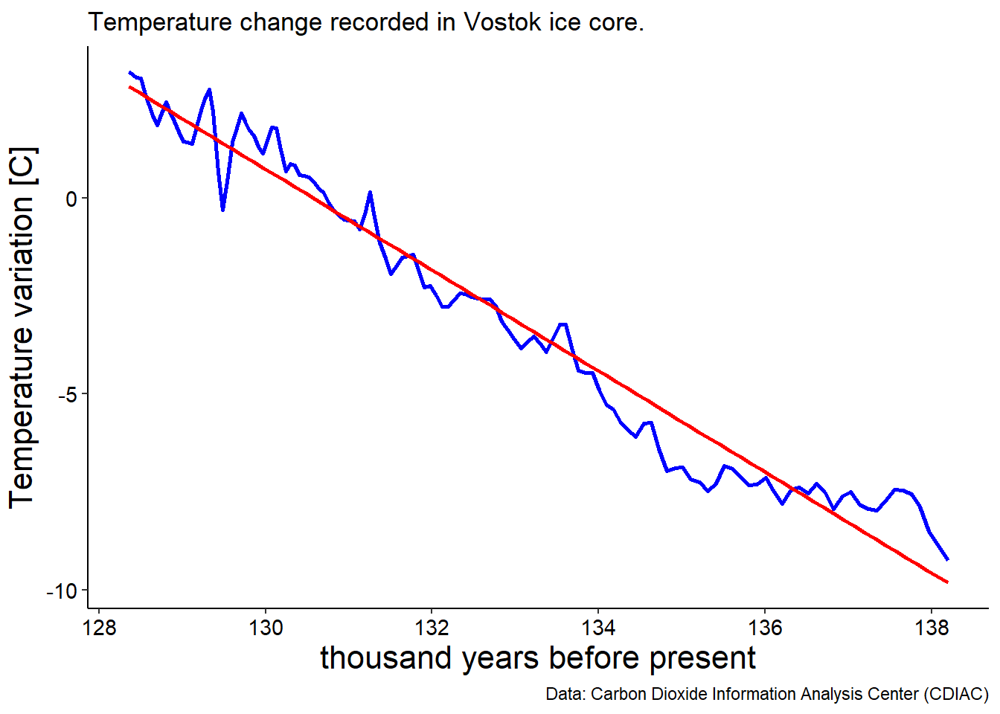</div>

Next, fit a linear model to your subset


```r
# fit linear regression
score_model <- lm(temperature ~ age_ice, data = vostok_temp_subset)

# view summary of results
summary(score_model)
```

```
## 
## Call:
## lm(formula = temperature ~ age_ice, data = vostok_temp_subset)
## 
## Residuals:
##      Min       1Q   Median       3Q      Max 
## -1.71298 -0.45841 -0.02108  0.46142  1.71075 
## 
## Coefficients:
##                 Estimate   Std. Error t value            Pr(>|t|)    
## (Intercept) 168.40882179   2.75915367   61.04 <0.0000000000000002 ***
## age_ice      -0.00128976   0.00002081  -61.97 <0.0000000000000002 ***
## ---
## Signif. codes:  0 '***' 0.001 '**' 0.01 '*' 0.05 '.' 0.1 ' ' 1
## 
## Residual standard error: 0.6815 on 132 degrees of freedom
## Multiple R-squared:  0.9668,	Adjusted R-squared:  0.9665 
## F-statistic:  3840 on 1 and 132 DF,  p-value: < 0.00000000000000022
```


<div class = 'question' id='ques:cch-21'><p class='question-begin'>&#x25BA; Question</p><div class='question-body'><p>Identify two more ranges with increasing temperatures and determine the rate of change during that time period. Pro tip: Identify another time range - then ask the person next to you what time period they ran.</p><p class='question-end'><span class='fa fa-square-o solution-icon'></span></p></div></div>


Now, let's take a look at past patterns of changes in atmospheric CO<sub>2</sub> over time^[I dropped the vostok_ice.txt file in our slack channel, you will need to download it and move it into your data folder. Then you can use the code using read_delim() below to read it in.].


```r
# define url
url <- "http://cdiac.ess-dive.lbl.gov/ftp/trends/CO2/vostok.icecore.CO2"

# download file
download.file(url, "data/vostok_ice.txt")

# load dataset
vostok_ice <- read_delim("data/vostok_ice.txt", delim = "\t",
                     skip = 21,
                     col_names = c("depth", "age_ice", "age_air", "CO2"))
```


<div class = 'question' id='ques:cch-22'><p class='question-begin'>&#x25BA; Question</p><div class='question-body'><p>Select one time period with rapid increase in CO2 concentrations and apply what you have learned identifying past periods of rapid temperature increase to calculating the rate of change.</p><p class='question-end'><span class='fa fa-square-o solution-icon'></span></p></div></div>


## Final Conclusions

Now it's time to put everything together. You might want to refer back to the beginning of this chapter when we looked at some background information about the IPCC report, the atmospheric energy budget, formulated our central questions, thought about what data sets when can use to answer our question, and the limitations of our approach.


<div class = 'question' id='ques:cch-23'><p class='question-begin'>&#x25BA; Question</p><div class='question-body'>


Before we summarize and then interpret our results, let's re-orient ourselves to what we've done with this analysis.

* Write out the central question(s) we are asking.
* List the data sets you used to investigate and what metric you calculated for each.


<p class="question-end"><span class="fa fa-square-o solution-icon"></span></p></div></div>


Well-written papers frequently end their introduction section with a paragraph that summarizes what their study is investigating and how they are investigating that (set of) questions - it forms a "bridge" between the introduction that sets up relevant background information (why is my question important?) and the methods section which is a very detailed account of how data was acquired (experimental design), processed, and analyzed.

If you read several of these paragraphs you will realize that they all contain a statement that follows a general formula along these lines:

> In this study, we investigated [CENTRAL QUESTION OR HYPOTHESIS]. To do this we used [DESCRIPTION OF THE TYPE OF DATA SET GENERATED] to [METRICS THAT WERE CALCULATED].

You should always be able to make a 2-3 sentence statement summarizing what you are investigating and how you did it, it's a good self-check that you know what you're trying to accomplish.


<div class = 'question' id='ques:cch-24'><p class='question-begin'>&#x25BA; Question</p><div class='question-body'><p>Use your results to compare current changes over the last approx. 200 years in atmospheric and CO2 concentrations and global temperature to pre-historic changes.</p><p class='question-end'><span class='fa fa-square-o solution-icon'></span></p></div></div>


*Be strategic in how you structure your answer to put together all the parts of our analysis. For example, start with temperature and compare the rate of change you calculate for recent times to the rate of change you calculated during the more distant past (glacials/interglacials)^[ Remember to include units!]. In include your own rate of change + the answers your classmates posted in the slack channel. Then make a statement about whether or not we are currently observing an "unprecedent" change. Then do the same for CO2 concentrations. At this point you are just summarizing and describing your results, you can make clear statements of whether or not rates are positive/negative (your variables are increasing/decreasing), and whether you see the same/opposite trends but you should not yet interpret what those results mean. This would be equivalent to the results section of a lab report or research paper.*


<div class = 'question' id='ques:cch-25'><p class='question-begin'>&#x25BA; Question</p><div class='question-body'><p>Interpret your results to assess whether recent changes in temperature are due to natural vs anthropogenic factors. For your answer consider both arguments that attribute the change to anthropogenic factors and natural fluctuations.</p><p class='question-end'><span class='fa fa-square-o solution-icon'></span></p></div></div>


*Now you are entering the interpretation/discussion component of your analysis. At this point your now what your key results are and you need to figure out what they mean; essentially you are finally getting around to answering those key questions you asked before designing your experiment/study. You are going to use your results as evidence for/support of your conclusion. This means that you need to demonstrate that your results are consistent with your conclusion. You also want to consider alternative explanations, limitations of your data etc. Of course, ideally you can exclude those based on e.g. evidence from other studies/data sets.*

</br>


</br>


</br>


## Acknowledgments

These activities are based on the EDDIE Climate Change Module^[O'Reilly, C.M., D.C. Richardson, and R.D. Gougis. 15 March 2017. Project EDDIE: Climate Change. Project EDDIE Module 8, Version 1.]


<!--chapter:end:13_ClimateChange.Rmd-->

---
title: "Data Science for the Natural Environment (FA21)"
subtitle: "BI449 Data Science for the Natural Environment"
author: "Shannon J. O'Leary"
date: "2021-09-24"
knit: "bookdown::preview_chapter"
output:
  msmbstyle::msmb_html_book:
    highlight: tango
    toc: TRUE
    toc_depth: 1
    split_by: chapter
    margin_references: FALSE
    css: msmb.css
bibliography: labmanual.bib
link-citations: yes
editor_options: 
  chunk_output_type: console
---


# Visualization


**Learning Objectives**

After completing this tutorial you should be able to

* apply the grammar of graphics implemented in `ggplot` to create plots.
* use core geometries implemented `ggplot` to produce scatter plots (`geom_point()`), line plots (`geom_line()`), bar plots (`geom_bar()`), histograms (`geom_histogram`), and box plots (`geom_boxplot()`).
* customize aesthetics of a plot (including color and axis labels).
* describe what faceting is and apply this to a plot.
* combine multiple plots in a multi-panel plot using `patchwork` and save plots to file.

You should have a `IntroVisualization.Rmd` in your project directory. Use that file to work through this set of activities - you will hand in your rendered ("knitted") Rmarkdown file as your homework assignment. In the `YAML` header, change the author to your name and make your formatting decisions such as theme, including a table of contents etc. Apply your `Rmarkdown` skills to format your "report" that you will hand in. Code chunks should have comments, add answers to questions in plain text (not as code in chunks), use headers intentionally, and of course you have options like bullet points etc. as well.

The majority of this set of activities is exploring how to use `ggplot()` to generate different types of plots. Each plot involves at least two lines of code - as we go through each step record the code presented and include a comment specifying what each line of code does. Comments can be inserted either between lines or at the end of each line.

Let's start by loading the packages we will need for this set of activities.

Before you can load all the libraries we need, you will need to install the `patchwork` package using `install.package("patchwork")`. You only need to do this once, the easiest wat to do this is to simply run that function directly in the console.


```r
# load libraries
library(knitr)
library(tidyverse)
library(patchwork)

# turn of sci notation
options(scipen=999)
```


## A grammar of graphics

Now that we are confident(ish) in our data wrangling the next step is learning how we can visualize our data for exploration and for communication. 

Exploratory analysis is an important component of data science as it not only gives you an overview of what information is contained in a data set, but it can also help you refine the question you are asking. Finally, once you have refined and completed an analysis, visualizations are a key component to communicate your results.

`ggplot2` is the core package of the `tidyverse` used for visualization. Similar to `tidyr` and `dplyr` having been built on the concept of a tidy data set, `ggplot2` was built on a framework which follows a layered approach to describe and/or build any type of visualization in a structure way termed the "grammar of graphics".

The grammar of graphics breaks down the components of any visualization into seven components.

* **Data** - the component of data set to visualize
* **Aesthetics** including axes, plot positions, and encodings such as size, shape, color
* **Scale** e.g normalizing values
* **Geometric objects** including points, lines, bars, ... to represent data
* **Statistics**, including confidence intervals, means, quantiles, ...
* **Facets**, i.e. subplots based on multiple dimensions
* **Coordinate system**, e.g cartesian, polar, ...

Until now you've probably thought of each plot type as it's own distinctive format (a scatter plot, a pie chart, etc) and have not considered that each plot can be broken down into these fundamental components, so at first this way of thinking of plots will likely not seem intuitive. 

But if you commit to thinking about plots in this abstract way you will quickly learn how these components fit together and realize the flexibility that thinking about plots in this way will give you to quickly generate exploratory plots, optimize your visualizations and be able to generate pretty much any plot you can think up^[You will also see that keeping your data `tidy` will allow you to customize your plots using different aesthetics and mappings to group your data.].


## Building plots

Y'all ready for this? 

Then, let's go back to our global mean temperature anomaly data set to figure out how the grammar of graphics can be applied and plot some data!


```r
temperature <- read_delim("data/GLB.Ts+dSST.csv", delim = ",", skip = 1) %>%
  replace(. == "***", NA) %>%
  mutate_if(is.character, as.numeric)
```

Recall how we created a line plot:


```r
ggplot(temperature, aes(x = Year, y = `J-D`)) +
  geom_line()
```

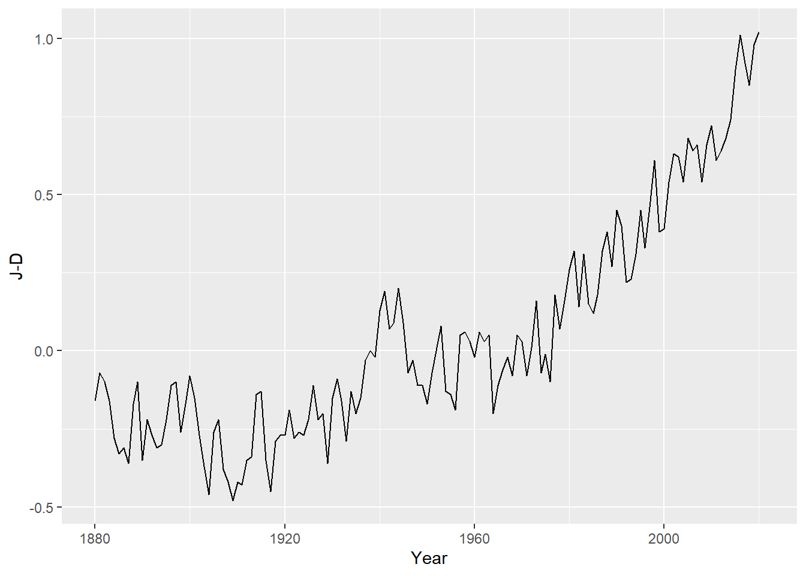

We can generalize this into a basic template that can be used for different kinds of plots, including scatter plots, bar plots, and box plots.

```

ggplot(data = <DATA>, mapping = aes(<MAPPINGS>)) +
  <GEOM_FUNCTION>

```

Essentiall, the minimum components needed to make a plot are 

1. A data set (`<DATA>`), this will be a `data.frame` or a `tibble`^[Remember, when we use `read_delim()` our data is automatically a object of the format `tibble` and `data.frame`; a `tibble` has some additional properties but we can use them interchangeably].
2. Based on the data, we need to define what variables we are going to plot (`<MAPPINGS>`) and how we want them to be represented, i.e. what individual data points should look like and how they are encoded.
3. We need to define the geometries, i.e. what type of plot (`<GEOM_FUNCTION`). 

Let's break down what is happening to get a better understanding of how these minimum components fit together to create individual plots.

First, we use the `ggplot()` function to define the specific `data.frame` to use to build the plot using the `data` argument (`<DATA>`)^[Remember, that when we are using arguments in the specified sequence that they are defined you do not explicitly need to call them.].

In our example that would be


```r
ggplot(data = temperature)
```

<div class="figure">
<p class="caption">(\#fig:unnamed-chunk-184)Empty canvas generated using ggplot() function.</p></div>

Not much happens when you execute that piece of code other than creating a blank canvas in your plot panel^[If you are using and `Rmarkdown` document and have `Chunk Output Inline` enabled it will print beneath your code chunk]. 

That is because we still need to define an aesthetic mapping using the `aes()` function (`<MAPPING>`). 

Here, we are selecting the variables that we want to plot (columns in our `data.frame`). At minimum we need to specify what columns we want to plot on the x and y axis, but we can also define variables (columns) we want to use to encode using color, shapes, size etc.


```r
ggplot(data = temperature, aes(x = Year, y = `J-D`))
```

<div class="figure">
<p class="caption">(\#fig:unnamed-chunk-185)Coordinate system plotted after specifying mapping aesthetics, specifically which variables to plot on each axis.</p>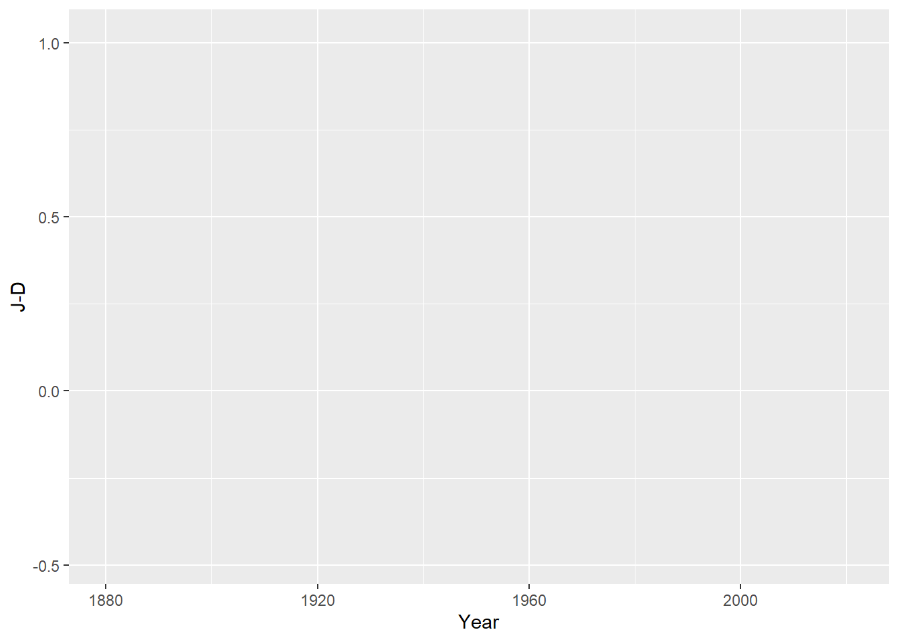</div>

When we execute that code you will now get an empty coordinate system... This still seems like slim pickings but patience, young grasshopper, we have not yet defined the `geom`, i.e. what type of plot ("geometries", `<GEOM_FUNCTION>`) we want to use. For example, here we want generate a line plot (`geom_line()`).

For `ggplot` we add layers using the `+` operator, which is a pipe (similar to `%>%`) which tells `R` "and now add this".


```r
ggplot(data = temperature, aes(x = Year, y = `J-D`)) +
  geom_line()
```

<div class="figure">
<p class="caption">(\#fig:unnamed-chunk-186)Line plot (geom_line()) showing global mean temperature anomalies relative to 1951-1980 average.</p></div>

Now, we're playing!

One of the advantages of the layered framework of `ggplot2` is that we can plot multiple layers in the same plot by adding additional `geoms`. 

For example, we can plot a scatterplot and line plot in the same plot as such:


```r
ggplot(data = temperature, aes(x = Year, y = `J-D`)) +
  geom_line() +
  geom_point()
```

<div class="figure">
<p class="caption">(\#fig:unnamed-chunk-187)Line plot showing global mean temperature anomalies relative to 1951-1980 average. Individual data points added using geom_point().</p>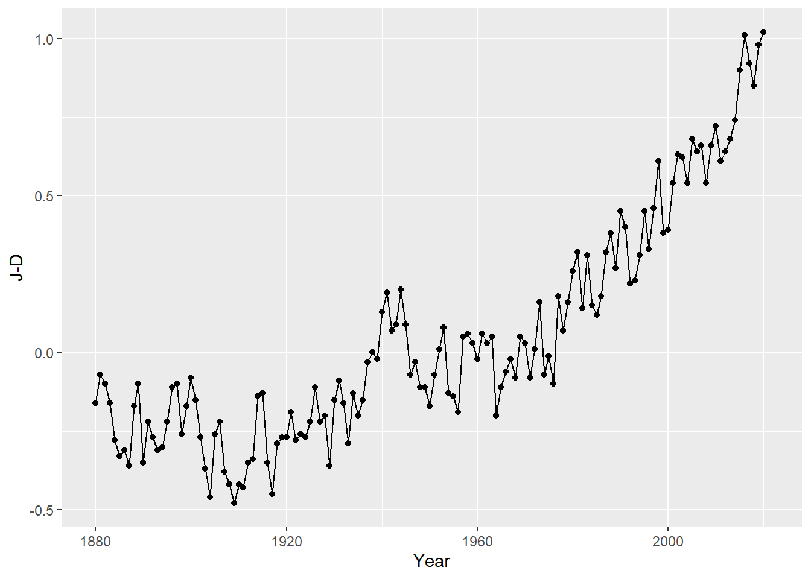</div>

Now that you know how to generate a simple plot, let's think about how we can further modify it to improve your visualization.

For example we can change the color, fill, size, and shape for each `geom` layer^[In this example we will use the arguments for individual geom functions to change how data points are represented using colors and shapes for each layer, we can also use `aes()` to set mapping aesthetics for the entire plots.].


```r
ggplot(data = temperature, aes(x = Year, y = `J-D`)) +
  geom_line(color = "darkblue", size = 1) +
  geom_point(shape = 21, color = "darkblue", fill = "white", size = 3)
```

<div class="figure">
<p class="caption">(\#fig:unnamed-chunk-188)Line plot showing global mean temperature anomalies relative to 1951-1980 average. Individual data points added using geom_point(), color and fill for lines and shapes have been modified.</p>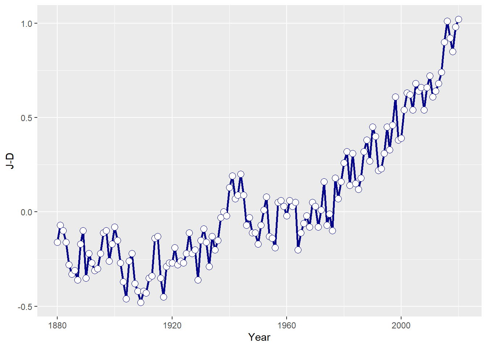</div>

Shapes for points can be specified using numbers; note how some shapes are "solid", i.e. specifying `color` will define the color of the shape. Others, like the one used in our example are filled, i.e. `color` will determine the color of the outline, and `fill` the color of the space inside. For "hollow" shapes (or e.g. X's) `color` will determine the line color.


You can specify colors either using the [color names](http://applied-r.com/r-color-tables/) defined by R or using hex codes. 

<label for="tufte-mn-" class="margin-toggle">&#8853;</label><input type="checkbox" id="tufte-mn-" class="margin-toggle"><span class="marginnote"><span style="display: block;">Some exploring will also lead you to various color pallets, Wes Anderson fan? You can <a href="https://github.com/karthik/wesanderson">style your plots</a> accordingly… dig the aesthetics of the old school National Park posters and images? <a href="https://github.com/katiejolly/nationalparkcolors">R community got you covered.</a>.</span></span>

Previously, we also used `geom_smooth()` to add a layer with a linear regression. If you take a look at the arguments for this function using `?geom_smooth` you will see that this has additional arguments apart from the mapping aesthetics like choosing the type of regression, whether or not the confidence interval is shown etc. Let's say we want to add a red, dashed regression line without the confidence interval.


```r
ggplot(data = temperature, aes(x = Year, y = `J-D`)) +
  geom_line(color = "darkblue", size = 1) +
  geom_point(shape = 21, color = "darkblue", fill = "white", size = 3) +
  geom_smooth(stat = "smooth", se = FALSE, color = "red", linetype = "dashed", size = 2)
```

<div class="figure">
<p class="caption">(\#fig:unnamed-chunk-190)Line plot showing global mean temperature anomalies relative to 1951-1980 average. Individual data points added using geom_point(), color and fill for lines and shapes have been modified. Trend line fitted using geom_smooth().</p>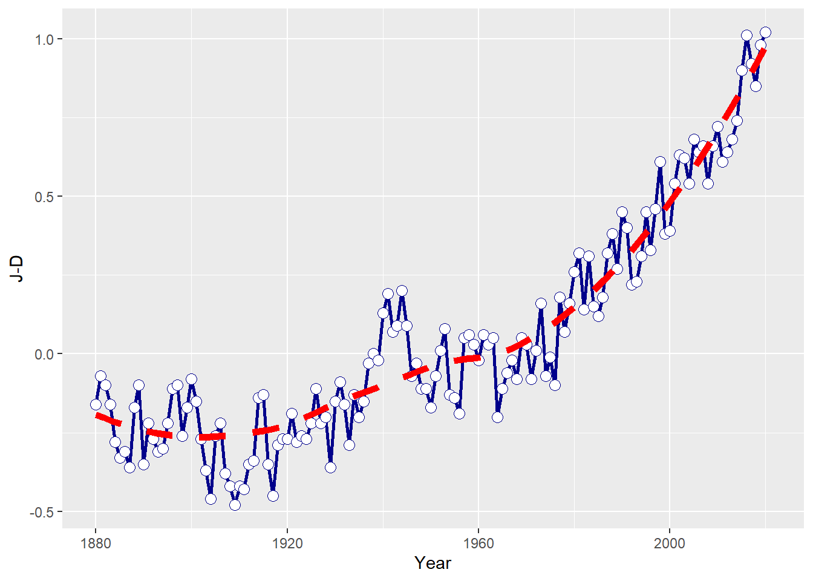</div>

Admittedly, this plot is starting to look a little bit ridiculous. Maybe we should think of alternative options for visualizing this data to explore some additional `ggplot` options.

Another way to visualize this data would be using a bar plot^[Can we appreciate for a second how easy it was to change how the same data is plotted? If you were using excel you would have had to insert a new plot, define what data you wanted to plot, relabel the axis, etc. Here all you had to do was change a single line of code].


```r
ggplot(data = temperature, aes(x = Year, y = `J-D`)) +
  geom_bar(stat = "identity")
```

<div class="figure">
<p class="caption">(\#fig:unnamed-chunk-191)Bar plot showing global mean temperature anomalies relative to 1951-1980 average.</p>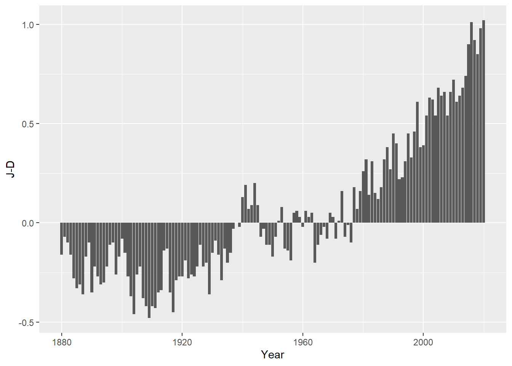</div>

Notice, how this is still the exact same mapping aesthetics (time/year on the x-axis and the temperature anomaly on the y-axis) but it changes the way we see the data completely - the emphasis now is on the change of temperatures below the long-term mean and the change to those temperature differences to being positive.

Let's say we want really lean into demonstrating this drastic change in temperatures not only being above the long-term average but also steadily increasing. One way to do this is to use color. We could modify this bar plot to have all of our bars representing years with global mean temperatures below the 1951-1980 average in one color and those above in another. 

To do this, we need a column that encodes that information... that of course is not an issue for us a basically professional data wranglers! We can use a simple conditional mutate using an `ifelse()` statement to add a column (`year_type`) that indicates whether temperatures are above or below the the long-term average.

We can manipulate our `data.frame` using the `dplyr` functions we are already familiar with - we can then use the `%>%` pipe to pass the data argument to the `ggplot()` function^[When you do this, remember that you need to switch back to using the `+` operator once you are adding your geom layers.]


```r
temperature %>%
  mutate(year_type = ifelse(`J-D` <=0, "colder", "hotter")) %>%
  ggplot(aes(x = Year, y = `J-D`, fill = year_type, color = year_type)) +
  geom_bar(stat = "identity")
```

<div class="figure">
<p class="caption">(\#fig:unnamed-chunk-192)Bar plot showing global mean temperature anomalies relative to 1951-1980 average. Mapping aesthetics have been specified to color code according to variable included in the data set.</p>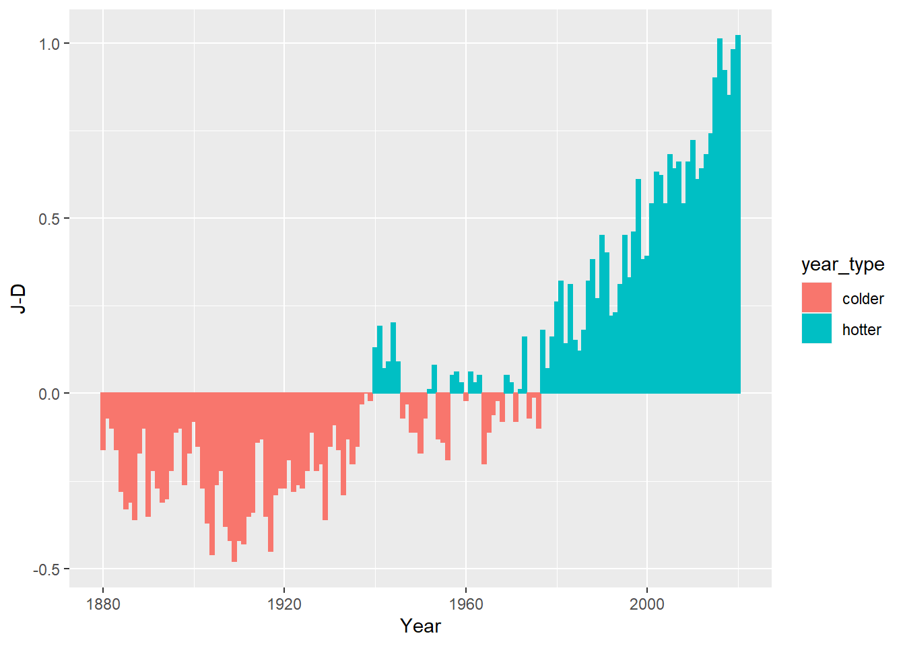</div>

Anything that we add to the `ggplot()` layer as a mapping is a universal plot setting that will apply to all subsequent layers. You can override these global settings is you specify aesthetics like color, shape or size specifically in an separate layer. For example if we do the following, we will override our color coding even though we specified it in our `ggplot()` layer.


```r
temperature %>%
  mutate(year_type = ifelse(`J-D` <=0, "colder", "hotter")) %>%
  ggplot(aes(x = Year, y = `J-D`, fill = year_type, color = year_type)) +
  geom_bar(stat = "identity", color = "blue", fill = "blue")
```

<div class="figure">
<p class="caption">(\#fig:unnamed-chunk-193)Bar plot showing global mean temperature anomalies relative to 1951-1980 average. Mapping aesthetics have been specified to color code according to variable included in the data set. Settings in geom_bar() override the general plot specifications.</p>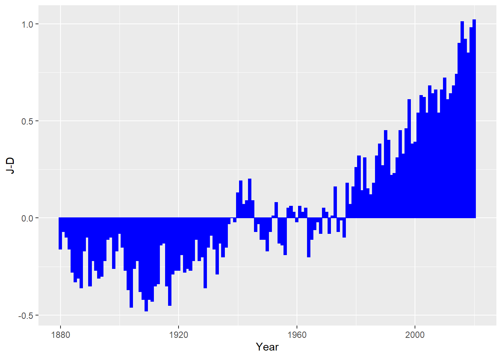</div>

Let's see what else we can visualize using `ggplot`. Recall from when you explored our temperature anomaly data set, that this data set also contains information for seasons and individual months.

Let's take a look at the distribution of mean global winter temperatures (`DJF` = December, January, February) using a histogram, (`geom_histogram()`). Note that we only need to define our x-axis to plot a histogram, this is because `ggplot2` will count how many observations fall into each bin for you ... this geom is a mixture of a geometry (bar plot) and a statistical transformation (binning data points into ranges and the plotting those as bar plots).].


```r
ggplot(temperature, aes(x = DJF)) +
  geom_histogram()
```

<div class="figure">
<p class="caption">(\#fig:unnamed-chunk-194)Histogram displaying distribution of mean global winter temperatures.</p>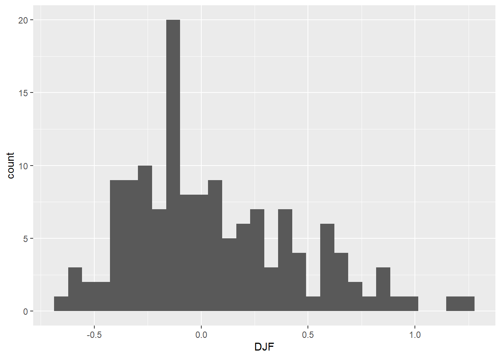</div>

We can refine our plot by choosing our own binwidth and by manipulating fill and color.


```r
ggplot(temperature, aes(x = SON)) +
  geom_histogram(binwidth = 0.05, color = "black", fill = "darkorange")
```

<div class="figure">
<p class="caption">(\#fig:unnamed-chunk-195)Histogram displaying distribution of mean global winter temperatures with customized bin width and coloration.</p>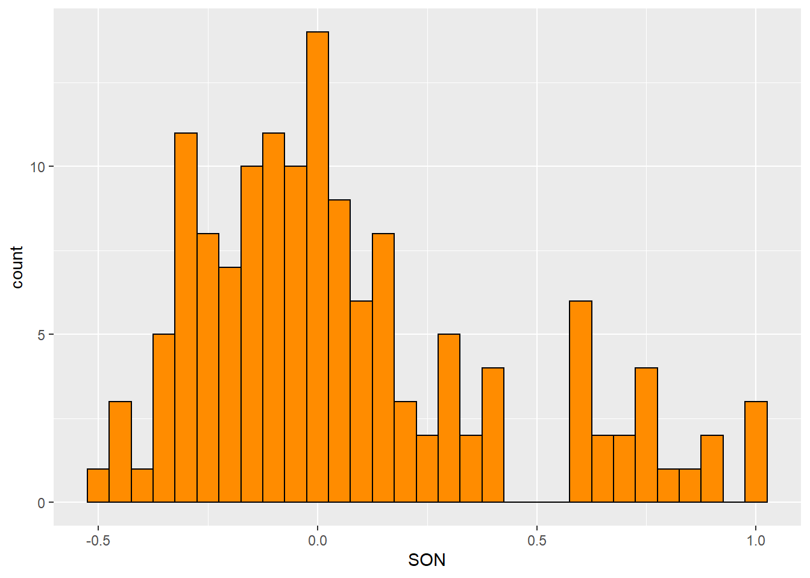</div>

For our example we might also want to add a vertical line (`geom_vline()`) to indicate 0 (i.e. the long-term global temperature mean calculated for 1951 - 1980).


```r
ggplot(temperature, aes(x = SON)) +
  geom_histogram(binwidth = 0.05, color = "black", fill = "darkorange") +
  geom_vline(xintercept = 0, color = "darkred", linetype = "dashed", size = 1)
```

<div class="figure">
<p class="caption">(\#fig:unnamed-chunk-196)Histogram displaying distribution of mean global winter temperatures with customized binwidth and coloration and added vertical line (red).</p>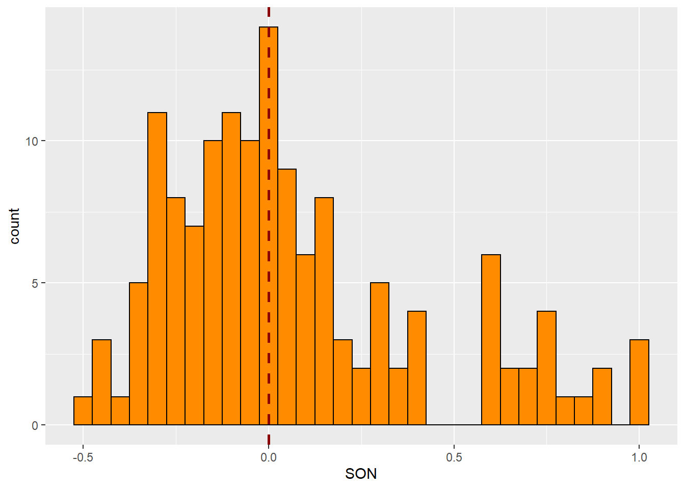</div>

If we want to compare multiple distributions, box plots can be more helpful than histograms. Let's say we wanted to compare the distribution of mean global temperature for each season.

How can we go about this?

Currently, our seasons are in individual columns, so our first step would be to create a tidy data set.


```r
tidy_season <- temperature %>%
  select(Year, DJF, MAM, JJA, SON) %>%
  pivot_longer(names_to = "season", values_to = "temperature", 2:5)
```

Now we can plot our seasons on the x-axis and the distribution of temperatures on the y-axis using `geom_boxplot()`.


```r
ggplot(tidy_season, aes(x = season, y = temperature)) +
  geom_boxplot()
```

<div class="figure">
<p class="caption">(\#fig:unnamed-chunk-198)Box plot comparing global mean temperature anomalies relative to 1951-1980 average for all four seasons.</p>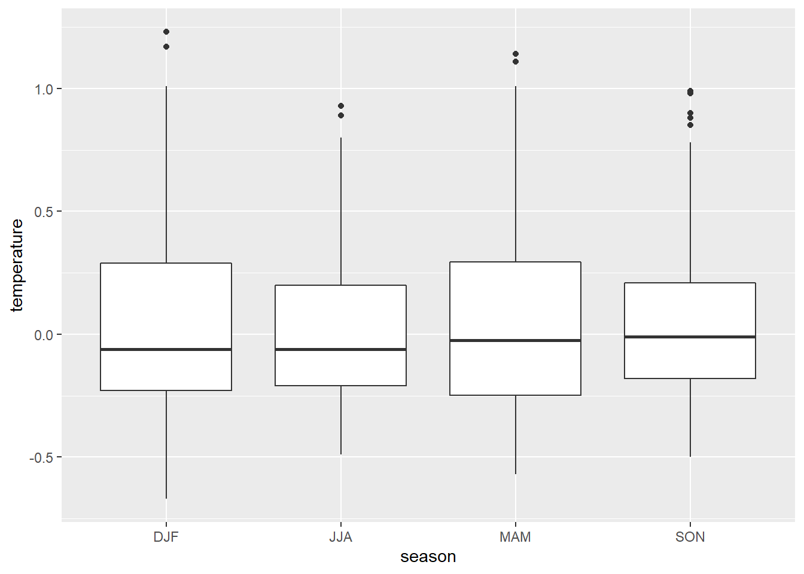</div>

Again, you can add additional information using the mapping aesthetics to e.g. color code the boxes by season.


```r
ggplot(tidy_season, aes(x = season, y = temperature, fill = season)) +
  geom_boxplot()
```

<div class="figure">
<p class="caption">(\#fig:unnamed-chunk-199)Box plot comparing global mean temperature anomalies relative to 1951-1980 average for all four seasons color-coded by season.</p>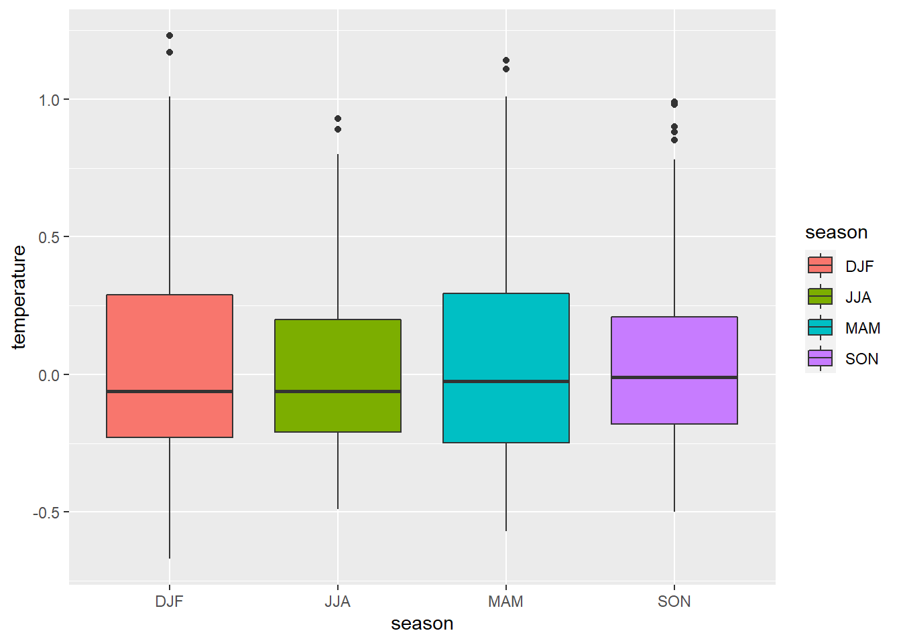</div>


## Faceting plots

One of the advantages of `ggplot2` being based not only on the grammar of graphics but being designed to play extremely well with tidy data sets is being able to create faceted plots. A faceted plot involves splitting a single plot into a matrix of panels, where each panel shows a different subset of the data. This is especially helpful during exploratory analysis where you might first plot all your data points in a single graph but then want to look at whether or not individual subsets within the data set behave the same.

Let's look at an example to better understand what faceting plots looks like. For example, let's say we wanted to create individual plots of our bar plots showing our deviations of global temperatures from the 1951 - 1980 mean for each season.

How could you create individual plots with the methods you are already familiar with?

Here is how you can do it using `facet_grid()`.

Now we can plot our data and using `facet_grid()` we can specify that we want individual panels by month in separate rows.


```r
ggplot(tidy_season, aes(x = Year, y = temperature)) +
  geom_bar(stat = "identity", fill = "darkorange", color = "darkorange") +
  facet_grid(rows = vars(season))
```

<div class="figure">
<p class="caption">(\#fig:unnamed-chunk-200)Change in temperature anomaly relative to long-term avarage per season (rows)</p>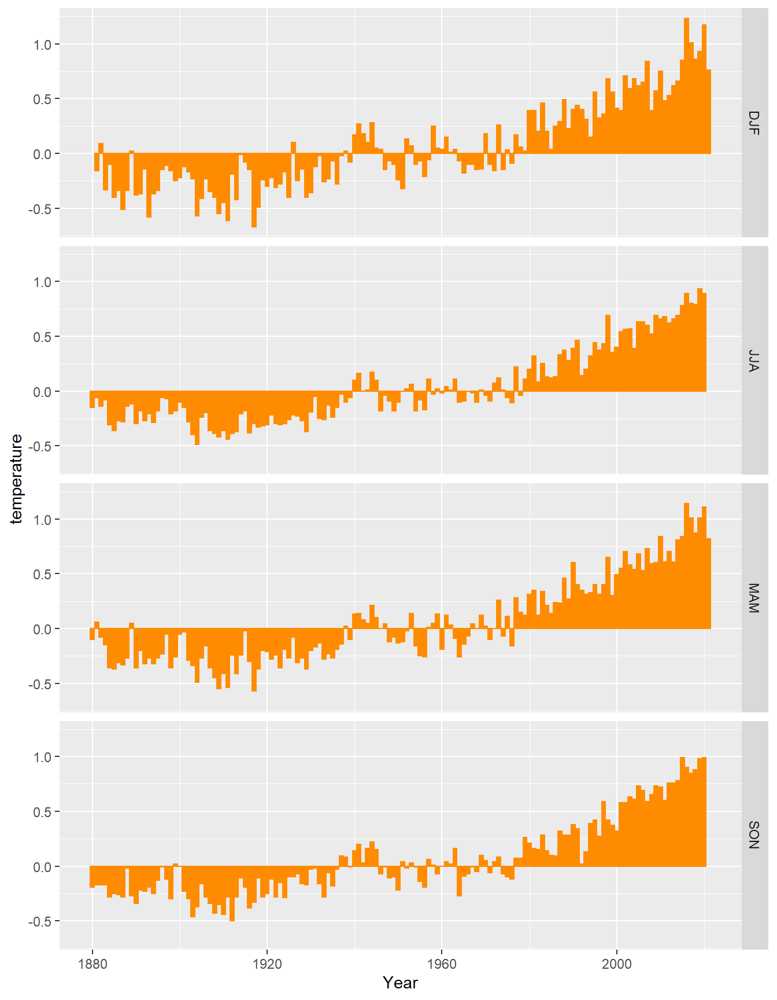</div>

You could also specify that you want the individual plots to be separated into columns.


```r
ggplot(tidy_season, aes(x = Year, y = temperature)) +
  geom_bar(stat = "identity", fill = "darkorange", color = "darkorange") +
  facet_grid(cols = vars(season))
```

<div class="figure">
<p class="caption">(\#fig:unnamed-chunk-201)Change in temperature anomaly relative to long-term avarage per season (columns)</p></div>

You can also create faceted plot where subset your data by two variables and so you end up with one variable defining the rows and one the columns and you can use a simpler syntax `row-variable ~ column-variable`.

You can also use this syntax if you are only faceting by one variable as we are doing in this example by specifying the variable and leaving the other one "blank" using a `.`.

For example, to plot this faceted data set in rows, you would use the following syntax - 


```r
ggplot(tidy_season, aes(x = Year, y = temperature)) +
  geom_bar(stat = "identity", fill = "darkorange", color = "darkorange") +
  facet_grid(season ~ .)
```

<div class="figure">
<p class="caption">(\#fig:unnamed-chunk-202)Change in temperature anomaly relative to long-term avarage per season (rows)</p></div>

And to plot this data set column-wise you would specify it like so -


```r
ggplot(tidy_season, aes(x = Year, y = temperature)) +
  geom_bar(stat = "identity", fill = "darkorange", color = "darkorange") +
  facet_grid(. ~ season)
```

<div class="figure">
<p class="caption">(\#fig:unnamed-chunk-203)Change in temperature anomaly relative to long-term avarage per season (columns)</p>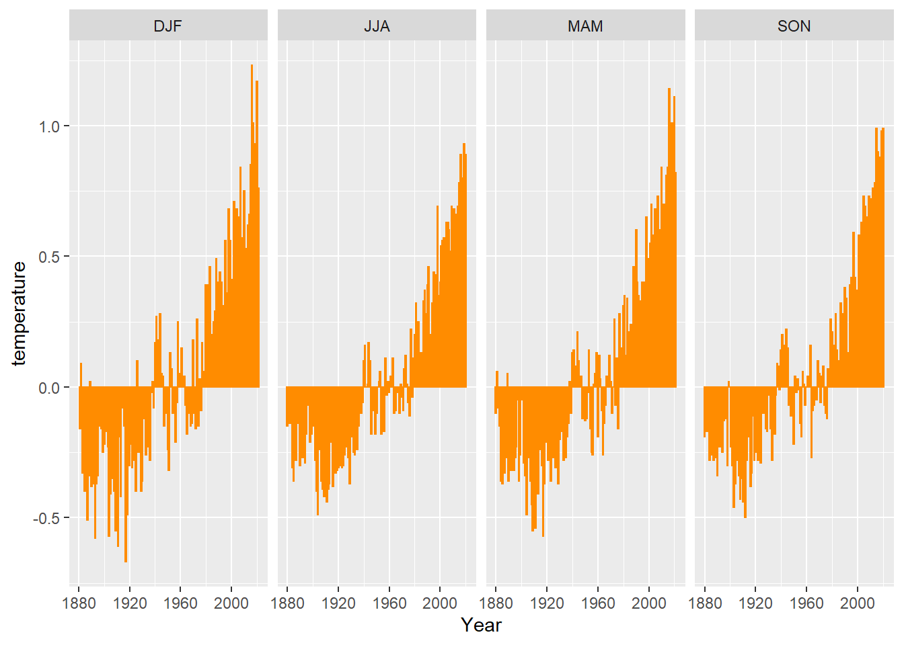</div>


## Customizing plots

We have already played around a little bit with the options that we have in terms of customizing plots using color, fill, shapes, and sizes. But we've barely scratched the surface.

You have probably noticed that there are some default settings like the gray background and white grid lines, font sizes of label axis, what the axis labels are, and even color schemes that are automatically used. Even using the defaults we get pretty clean plots that are visually appealing. This is super helpful during exploratory analysis because even though you playing around with the data you still have nicely formatted and easy to interpret figures.

Once you have identified the central plots that you want to use to communicate the results and conclusions of your data analysis you will want to further customize your visualization to optimize communication, this includes how you encode data using color and shape but also making sure that everything is well labeled and clear to the person who is reading your report or listening to your presentation.

One of the first things we frequently want to changes is the axis labels. `ggplot2` does handily use the column names to automatically label your axes, so you will always have a label which is great during exploratory analysis but generally you will want to customize that for your final figure. The function `labs()` can be used to specify a title, subtitle, axis labels and additional annotations (caption) below the figure.

For example we could customize our faceted figure to look like this:


```r
ggplot(tidy_season, aes(x = Year, y = temperature)) +
  geom_bar(stat = "identity", fill = "darkorange", color = "darkorange") +
  facet_grid(rows = vars(season)) +
  labs(title = "Change in global seasonal temperatures 1880 - 2020",
       subtitle = "Global mean temperatures relative to 1951 - 1980 mean",
       x = "Year", y = "Temperature [C]",
       caption = "Date source: NASA Goddard Institute for Space Studies")
```

<div class="figure">
<p class="caption">(\#fig:unnamed-chunk-204)Change in temperature anomaly relative to long-term avarage per season (rows)</p>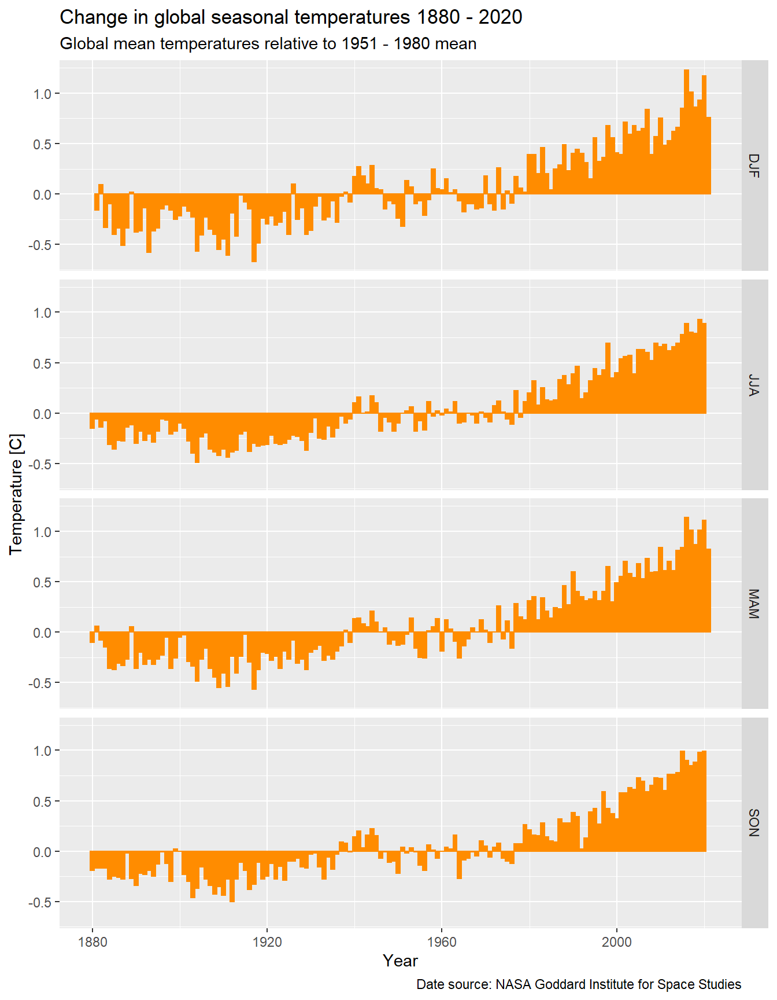</div>

Pretty much every component of a `ggplot` figure can be further customized using `theme()`, this includes things like font size, background and line colors, grids, legend position ... `ggplot2` odes have some pre-defined themes that you can call up that will change the layout. 

The default theme is `theme_grey()`.


```r
ggplot(tidy_season, aes(x = Year, y = temperature)) +
  geom_bar(stat = "identity", fill = "darkorange", color = "darkorange") +
  facet_grid(rows = vars(season)) +
  labs(title = "Change in global seasonal temperatures 1880 - 2020",
       subtitle = "Global mean temperatures relative to 1951 - 1980 mean",
       x = "Year", y = "Temperature [C]",
       caption = "Date source: NASA Goddard Institute for Space Studies") +
  theme_grey()
```

<div class="figure">
<p class="caption">(\#fig:unnamed-chunk-205)Change in temperature anomaly relative to long-term avarage per season (rows)</p></div>

Here, we explicitly specified it using `theme_grey()`; if you do not specify a theme this is the theme that will be used for your plot. There are other themes that are part of the `ggplot` package that include `theme_bw()`, `theme_minimal()`, `theme_classic()` or `theme_light()`.


<div class = 'question' id='ques:Vis-1'><p class='question-begin'>&#x25BA; Question</p><div class='question-body'>


Re-plot the same figure using the four themese specified above.


<p class="question-end"><span class="fa fa-square-o solution-icon"></span></p></div></div>


You will likely find a theme that you like but still want to make additional tweaks in that case `theme()` is your friend. 

Let's go back to our bar plot of the global temperature anomaly to look at an example of likely the three most common things you will want to adjust which is the legend position, changing font size, color, turning x-axis labels by 90 degrees.


```r
temperature %>%
  mutate(year_type = ifelse(`J-D` <=0, "colder", "hotter")) %>%
  ggplot(aes(x = Year, y = `J-D`, fill = year_type, color = year_type)) +
  geom_bar(stat = "identity") +
  labs(title = "Change in global mean temperatures 1880 - 2020",
       subtitle = "Global mean temperatures relative to 1951 - 1980 mean",
       x = "Year", y = "Temperature [C]",
       caption = "Date source: NASA Goddard Institute for Space Studies") +
  theme_classic() +
  theme(legend.position = "bottom",
        axis.text.x = element_text(size = 12, color = "black",
                                   angle = 90, hjust = 0.5, vjust = 0.5),
        axis.text.y = element_text(size = 12, color = "black",),
        axis.title = element_text(size = 14))
```

<div class="figure">
<p class="caption">(\#fig:unnamed-chunk-206)Change in mean global temperature relative to long-term avaerage with customized font sizes and legend positions.</p>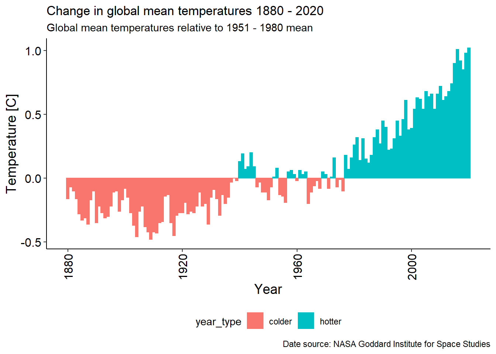</div>

That's starting to look pretty slick.

As you start your visualization adventure the [R Cookbook](https://www.cookbook-r.com/Graphs/Colors_(ggplot2)/) is a good resource. It is written in a helpful style that starts with a concrete plotting problem and then walks you through a solution.


## Arranging plots

We've already seen that we can create multi-panel plots in a very straightforward way when we are essentially plotting the same plot for different subsets of the data.

But what if we want to generate individual plots that might fit together thematically but aren't subsets that we can facet but we still want to be able to present them together? Fear not, this too can be solved; one option is using `patchwork`, a package designed for exactly this purpose. Let's generate a few additional plots so we can try this out.

In our data folder there is a tab-delimited file with monthly mean CO2 concentrations (parts per million) from Maunua Loa. Let's read in that data set and create line plot with a regression line.


```r
carbon <- read_delim("data/CO2_monthly.txt", delim = "\t")

ggplot(carbon, aes(x = date, y = average)) +
  geom_line(color = "blue") +
  geom_smooth(color = "red") +
  labs(title = "Atmospheric CO2",
       subtitle = "monthly mean CO2 Mauna Loa CO2",
       x = "year", y = "CO2 concentration air [ppm]",
       caption = "Data: NOAA/ESRL") +
  theme_classic()
```

<div class="figure">
<p class="caption">(\#fig:unnamed-chunk-207)Mean monthly atmospheric CO2 concentrations measuread at Mauna Loa Observatory from 1958 - 2021.</p>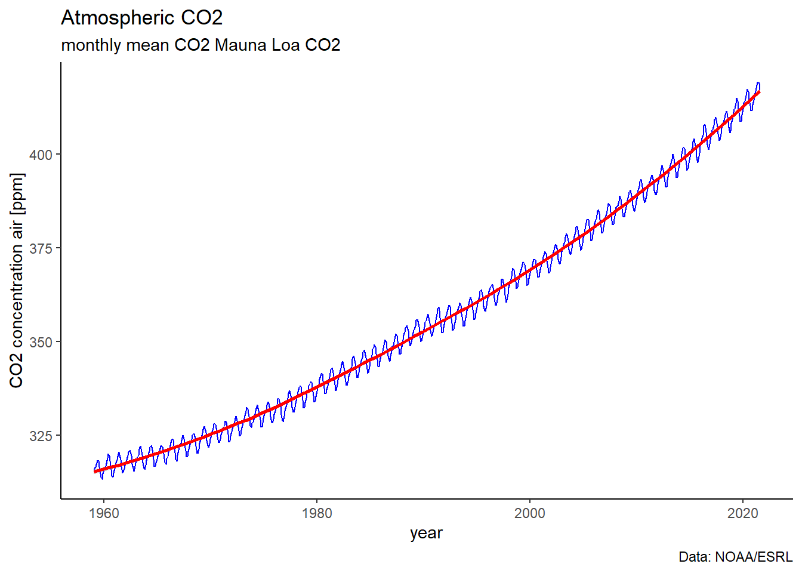</div>

We also have a data set from the Global Carbon Project downloaded from the [Our World in Data repository](https://github.com/owid/co2-data) that contains atmospheric CO2 emissions. We can plot that as a simple line plot with a regression.


```r
emissions <- read_delim("data/emissions.txt", delim = "\t") %>%
  filter(iso_code == "OWID_WRL")

ggplot(emissions, aes(x = year, y = co2)) +
  geom_line(color = "blue", size = 1) +
  geom_smooth(color = "red") +
  labs(title = "CO2 Emissions over time.",
       subtitle = "Global emissions atmospheric emissions by year.",
       x = "year", y = "CO2 [Gt/year]",
       caption = "Data: Global Carbon Project/Our World in Data") +
  theme_classic()
```

<div class="figure">
<p class="caption">(\#fig:unnamed-chunk-208)Global atmospheric CO2 emissions.</p>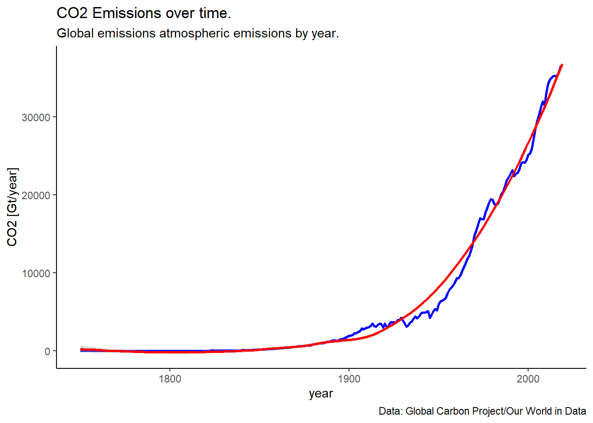</div>

To be able to plot multiple plots in one using `patchwork` we need to assign our figures as objects.


```r
p1 <- ggplot(carbon, aes(x = date, y = average)) +
  geom_line(color = "blue") +
  geom_smooth(color = "red") +
  labs(title = "Atmospheric CO2",
       subtitle = "monthly mean CO2 Mauna Loa CO2",
       x = "year", y = "CO2 concentration air [ppm]",
       caption = "Data: NOAA/ESRL") +
  theme_classic()

p2 <- ggplot(emissions, aes(x = year, y = co2)) +
  geom_line(color = "blue", size = 1) +
  geom_smooth(color = "red") +
  labs(title = "Atmospheric CO2 Emissions",
       subtitle = "global emissions",
       x = "year", y = "CO2 [Gt/year]",
       caption = "Data: Global Carbon Project/Our World in Data") +
  theme_classic()
```

Now we can combine them side by side using a simple syntax.


```r
p1 + p2
```

<div class="figure">
<p class="caption">(\#fig:unnamed-chunk-210)Mean monthly atmospheric CO2 concentrations measuread at Mauna Loa Observatory (left panel) and Global atmospheric CO2 emissions (right panel).</p>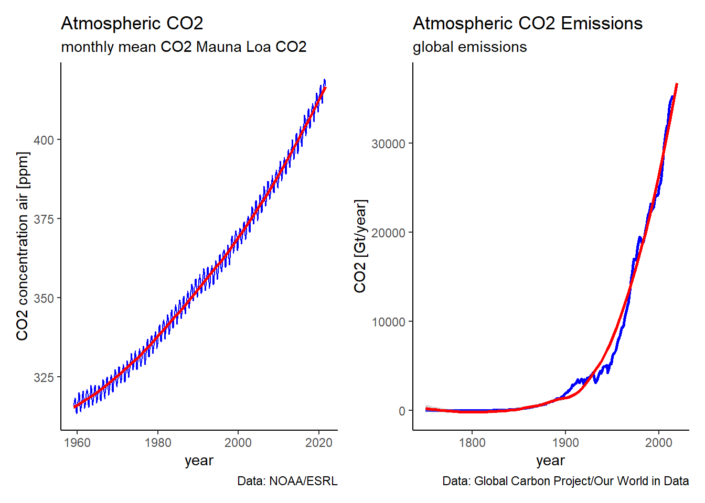</div>

Similarly, we can plot them underneath each other like so -


```r
p1 / p2
```

<div class="figure">
<p class="caption">(\#fig:unnamed-chunk-211)Mean monthly atmospheric CO2 concentrations measuread at Mauna Loa Observatory (top panel) and Global atmospheric CO2 emissions (bottom panel).</p>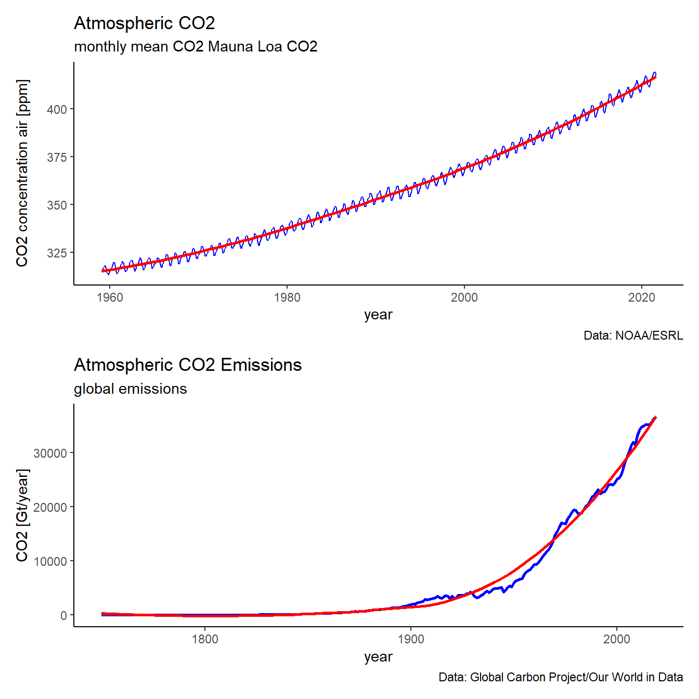</div>

Oh, it gets better. Let's say we wanted to plot our global mean temperatures in the top row and our two emissions plots below.


```r
p3 <- temperature %>%
  mutate(year_type = ifelse(`J-D` <=0, "colder", "hotter")) %>%
  ggplot(aes(x = Year, y = `J-D`, fill = year_type, color = year_type)) +
  geom_bar(stat = "identity") +
  labs(title = "Change in global mean temperatures 1880 - 2020",
       subtitle = "Global mean temperatures relative to 1951 - 1980 mean",
       x = "Year", y = "Temperature [C]",
       caption = "Date source: NASA Goddard Institute for Space Studies") +
  theme_classic() +
  theme(legend.position = "bottom",
        axis.text.x = element_text(size = 12, color = "black",
                                   angle = 90, hjust = 0.5, vjust = 0.5),
        axis.text.y = element_text(size = 12, color = "black",),
        axis.title = element_text(size = 14))

p3 / (p1 | p2)
```

<div class="figure">
<p class="caption">(\#fig:unnamed-chunk-212)Comparison of change in mean global temperature (top panel), atmospheric CO2 concentrations (bottom left), and atmospheric CO2 emissions (bottom right).</p>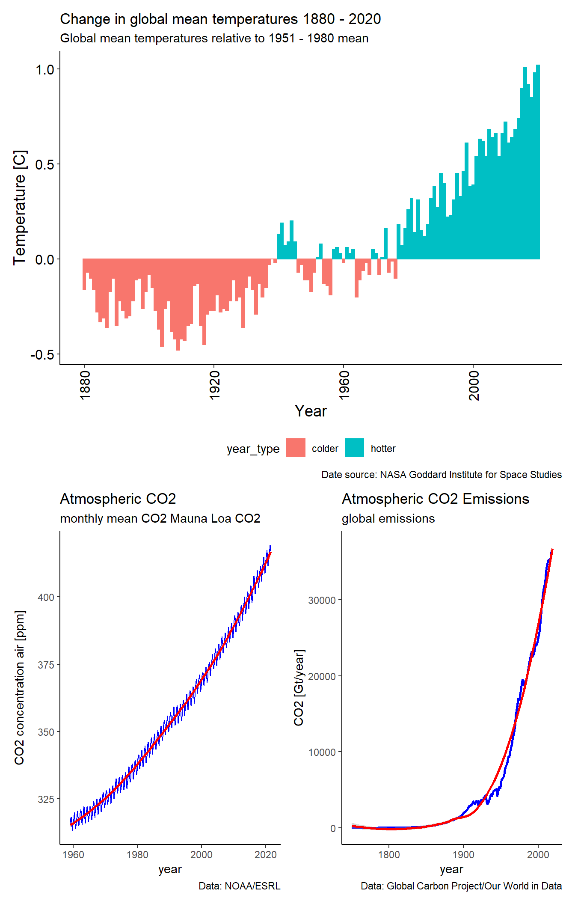</div>

You can create complex compositions in `patchwork` using syntax combining `+`, `|`, and `\`. To see how you can control the layout even further you can check out the [documentation for patchwork](https://patchwork.data-imaginist.com/articles/guides/layout.html).


## Exporting Plots

The last thing we still have to figure out is how to save plots. You have a few options.

The quickest and dirtiest option is to simply right click on the plot pane after plotting a figure and then save the figure using `Save image as`. This works and is easy to do but gives you very little control over the dimensions, resolution, file format etc.

For more control over the format of your figure you can use the Export tab in the Plot pane which will allow you to adjust the dimensions and the the file format.

Finally, the `ggplot2` has a function called `ggsave()` that will allow you to determine the dimensions (`width`, `height`), resolution (`dpi`), and format (`device`).

By default it will save the last plot that was plotted. If you specify the format in the file name (e.g. `*.svg`, `*.jpg`, `*.png`) it will automatically recognize the format^[Remember that we have designed our research compendium to keep raw and processed data, and results separate? Figures are considered results so you should always save them to the `results` folder.].


```r
temperature %>%
  mutate(year_type = ifelse(`J-D` <=0, "colder", "hotter")) %>%
  ggplot(aes(x = Year, y = `J-D`, fill = year_type, color = year_type)) +
  geom_bar(stat = "identity") +
  labs(title = "Change in global mean temperatures 1880 - 2020",
       subtitle = "Global mean temperatures relative to 1951 - 1980 mean",
       x = "Year", y = "Temperature [C]",
       caption = "Date source: NASA Goddard Institute for Space Studies") +
  theme_classic() +
  theme(legend.position = "bottom",
        axis.text.x = element_text(size = 12, color = "black",
                                   angle = 90, hjust = 0.5, vjust = 0.5),
        axis.text.y = element_text(size = 12, color = "black",),
        axis.title = element_text(size = 14))
```

<div class="figure">
<p class="caption">(\#fig:unnamed-chunk-213)Change in mean global temperature realtive to long-term average.</p></div>

```r
ggsave("results/global_temp.png", dpi = 300, width = 15, height = 10)
```

Check your results folder to see if you were successful!

If you assign your plot to an object you can use the `plot` argument of the `ggsave()` function to export it. This also works for figures that consist of multiple panels combined using `patchwork`.

## More Plots!

Ready to take the training wheels off? 

Increasing global temperatures are effecting change across the different components of the climate system. There are several data sets in your `data` folder. Read in each data set as a data frame, use `View()` to take a look at what information is contained in the data set and the use your new found visualization skills to plot the data using `ggplot`.


<div class = 'question' id='ques:Vis-2'><p class='question-begin'>&#x25BA; Question</p><div class='question-body'>


Increasing atmospheric temperatures result in land ice melting and the ocean heat content rising. The latter leads to thermal expansion which together with the increase freshwater inflow results in rising sea levels.

The first data set is from the NOAA Laboratory for Satellite Altimetry and contains records from coastal sea level tide gauges. Start by reading in the data set


```r
sealevel <- read_delim("data/sealevel.txt", delim = "\t")
```

Take a quick look at the data set using `Vew()` and briefly summarize what data is contained in this data set^[Include things like the number of columns, what data is contained in each sample, what time periods are included etc. Practice deducing these types of things from the context of the data set description above and by browsing the content.]

Plot the change in means sea level over time as a line plot and color code the line(s) by method. Chose a theme and position your legend below the figure. Bonus: Figure out how to use `geom_hline()` to add a line at 0.

Comment each line of your ggplot code (you can add comments between the lines or at the end), remember to caption your figure, list your data source and and label your axis in a meaningful way.

Write a short description of your figure summarizing the key results displayed.

Here's an example of what that could look like.

<div class="figure">
<p class="caption">(\#fig:unnamed-chunk-215)Change in mean global coastal sea level using costal sea level tide gauges (blue) and satellite data (red).</p>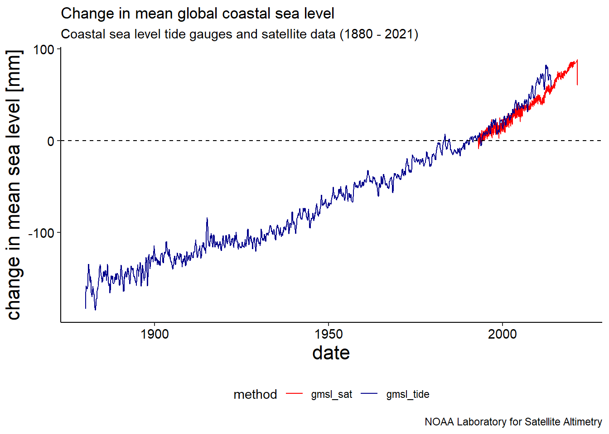</div>


<p class="question-end"><span class="fa fa-square-o solution-icon"></span></p></div></div>


<div class = 'question' id='ques:Vis-3'><p class='question-begin'>&#x25BA; Question</p><div class='question-body'>


Our next data set is from the [National Snow and Ice Data Center](https://nsidc.org/data/seaice_index/archives) and contains the Arcitc (Northern Hemisphere) July sea ice extent.


```r
ice_arctic <- read_delim("data/arctic_ice.txt", delim = "\t")
```

Take a quick look at the data set using `Vew()` and briefly summarize what data is contained in this data set. Be specific.

Plot the change in ice extent over time as a line plot. Chose a theme. Add a linear regression and confidence interval. Bonus: Change the default colors of the regression line and the confidence interval.

Comment each line of your ggplot code (you can add comments between the lines or at the end), remember to caption your figure, list your data source and and label your axis in a meaningful way.

Write a short description of your figure summarizing the key results displayed.


<p class="question-end"><span class="fa fa-square-o solution-icon"></span></p></div></div>


<div class = 'question' id='ques:Vis-4'><p class='question-begin'>&#x25BA; Question</p><div class='question-body'>


Let's take a look at the equivalent data set depicting sea ice extent in the Antarctic (Southern Hemisphere.)


```r
ice_arctic <- read_delim("data/antarctic_ice.txt", delim = "\t")
```

Take a quick look at the data set using `Vew()` and briefly summarize what data is contained in this data set. Be specific.

Plot the change in ice extent over time as a line plot. Chose a theme. Add a linear regression and confidence interval. Bonus: Change the default colors of the regression line and the confidence interval.

Comment each line of your ggplot code (you can add comments between the lines or at the end), remember to caption your figure, list your data source and and label your axis in a meaningful way.

Write a short description of your figure summarizing the key results displayed.


<p class="question-end"><span class="fa fa-square-o solution-icon"></span></p></div></div>


<div class = 'question' id='ques:Vis-5'><p class='question-begin'>&#x25BA; Question</p><div class='question-body'>


One more data set. This one is from the NOAA Hurricane Research Division. While interpreting the observed patterns in sea level and ice extent and modeling future projections is pretty straightforward. For this coding challenge you will need to combine your data wrangling and visualization skills!


```r
hurricane <- read_delim("data/hurricanes.txt", delim = "\t")
```

Take a quick look at the data set using `Vew()` and briefly summarize what data is contained in this data set. Be specific^[Note, several of the columns start with 'Revised' this just has to do with the entire data set having revised (most recent) definitions applied for the metrics included. You can ignore that component.].

When thinking about hurricanes there are two metrics to consider when determining whether or not "hurricanes have gotten worse". First we can look at whether or not hurricanes have become more common by plotting the number of hurricanes for each year. Create a faceted plot with individual line plots showing the number of named storms (this would include not only hurricanes put also tropical storms), the number of hurricanes, the number of major hurricanes, and the number of hurricanes in the United States. Add a linear regression. Chose a custom theme.

You will have to reformat the data set in order to plot it in this fashion. It can be helpful to first think about what your `ggplot` code should look like to create the plot described above and then format your data set to fit those needs^[Recall that ggplot is designed not only around the grammar of graphics but also the principles of tidy data... do we currently have a tidy data set?]. 

Bonus: We've previously used `facet_grid()` to create faceted plots which requires us to specify how panels should be laid out in rows and/or columns. Figure out how to use `facet_wrap()` to just specify which variable to use to create individual panels with out them all needing to be laid out next to each other in columns or underneath each other in rows. 


The other way to evaluate whether or not "hurricanes have gotten worse" is to not look at the number of storms but to determine whether individual storms or storms as a whole have become more intense and/or destructive.

The one column you probably have not yet been able to figure out is the column containing information on the "accumulated cyclone energy"^[Now that you have this information if you have not already add it to your short data set description.].

Create a bar plot showing the ACE for each year. Chose a theme and customize the color of your bars^[You can specify color and fill for bar plots. Try setting the color and fill to the same and to different colors to see what happens when you have a bar plot with this many individual bars.] 

Bonus: Tru to figure out how to use `geom_hline()` to add a horizontal line indicating the mean ACE for the recorded time period.


For all the plots, comment each line of your ggplot code (you can add comments between the lines or at the end), remember to caption your figure, list your data source and and label your axis in a meaningful way.

Write a short description for each figure summarizing the key results displayed and argue whether or not you thing "hurricanes have gotten worse".


<p class="question-end"><span class="fa fa-square-o solution-icon"></span></p></div></div>


<div class = 'question' id='ques:Vis-6'><p class='question-begin'>&#x25BA; Question</p><div class='question-body'>


Choose five of the plots we have generated in this module and combine them into a single plot using `patchwork`; include at least two columns and two rows in your layout. 

Bonus: You can use `fig.height=` and `fig.width=` in the first line starting a new code to specify the dimensions of the output of a figure in the knitted document. When you initially knit your Rmarkdown file you will find that the default dimensions will not format your you multi-panel plot in a way that does not make it super legible. Manipulate these parameters and re-knit your html to display your figure in an appropriate way.


<p class="question-end"><span class="fa fa-square-o solution-icon"></span></p></div></div>


<!--chapter:end:14_IntroVisualization.Rmd-->


# References {-}

<!--chapter:end:99_References.Rmd-->

